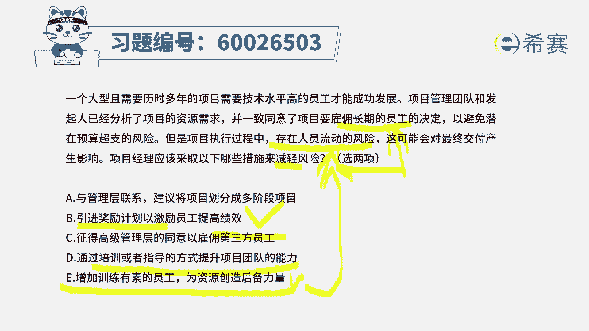
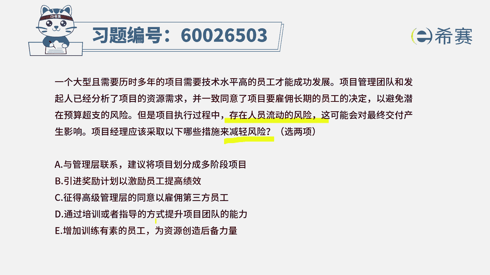
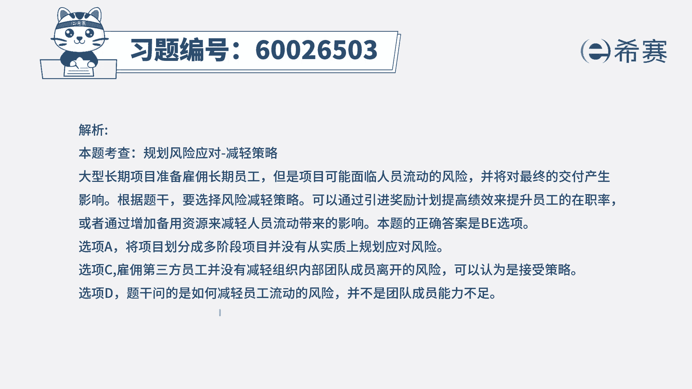

# （24年PMP）pmp项目管理考试零基础刷题视频教程-200道模拟题 - P80：80 - 冬x溪 - BV1S14y1U7Ce

一个大型且需要历时多年的项目，需要技术水平高的员工才能够成功发展，项目团队，项目管理团队和发起人，已经分析了项目的资源需求，并且一致同意了项目要雇佣长期的员工的决定，以避免潜在的预算超支的风险。

但是项目执行过程中存在着人员流动的风险，那这可能会对于最终交付产品来产生影响，项目经理应该采取一下哪一些措施，来减轻这样一个风险，请注意减轻的是什么风险，减轻的是人员流动的风险。

并且这些人员是一个长期雇佣的人员，所以当我们把焦点放在这个风险的上面的时候，我们再来看一下，他说只有两个选项可以选，你这个题目其实比较难啊，也就是有几个选项你发现都可以选。

但是你如果把它聚焦在有这些个情况，然后有这种人员流动的风险，然后我们想要去应对这个风险，去减轻风险的时候，选项a与管理层联系，建议将项目划分成多个阶段，那这个呢就跟题目中本身的这个内容就相对比。

因为题目中已经明确告诉你，就是一个很长周期的经营项目，并且呢需要雇佣长期的员工来去完成，你即便放划分成多段，他可能还是需要长期的，这些员工持续性的来去完成事情，他不能够直接解决题干中所涉及的。

关于人员以及流动风险的这个事情好，第二个选项，引进奖励计划，以激励员工来提高绩效，这个呢是有可能的，就是说员工既然有流失的风险，那我如果说给大家福利更好，因为通常情况下，我们之所以会离开一家单位。

有可能是没有前途，也有可能是没有前途，一个前是前后的，前一个钱是money，金钱的钱对吧，所以如果说有上升的空间，以及给你的待遇比较好，那么你很有可能就会待在这个地方，但还有一种可能是之所以待不下去。

是因为你在这地方工作的话心累，那如果说我们能有一套好的方式，来去让团队成员在这个地方是享受工作的话，他也可能会待的更久，所以呢第二个选项应该是一种有效的方式，能够去稍微减轻会减缓这种风险。

第三个选项真的高级管理层的同意，来雇佣第三方员工，这个题目中的那个题干就是相互背离对吧，然后第四个选项，通过培训或指导的方式来提升团队的能力，这个呢本身它其实这句话肯定是正确的，然后这个措施是正确的。

但是呢他跟这个直接说员工的流动，这个事情上是有差别，没有直接指向关于人工流动的这样一个情形，而最后一个增强训练有素的员工，作为那个后备力量，诶，这个是可行的，就说如果说万一有人员流动的话。

我还有人可以顶得上，所以他只选两项的情况下呢，我们就选b和e这个题目其实是有难度的啊。

你要关注焦点是关于人员流动的这个风险，我们如何去减轻风险，是这样的，这个d选项虽然它是正确的，但是他直接没有直接去面对，题干中所提及的这样一个风险。

好详细的解析呢。

