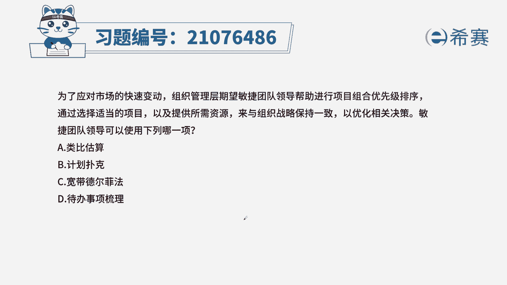
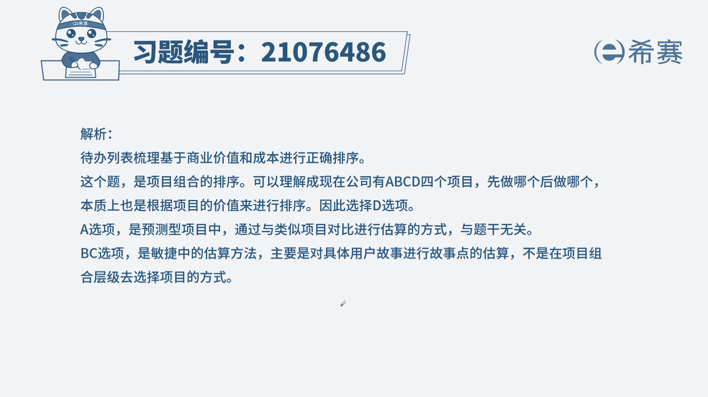
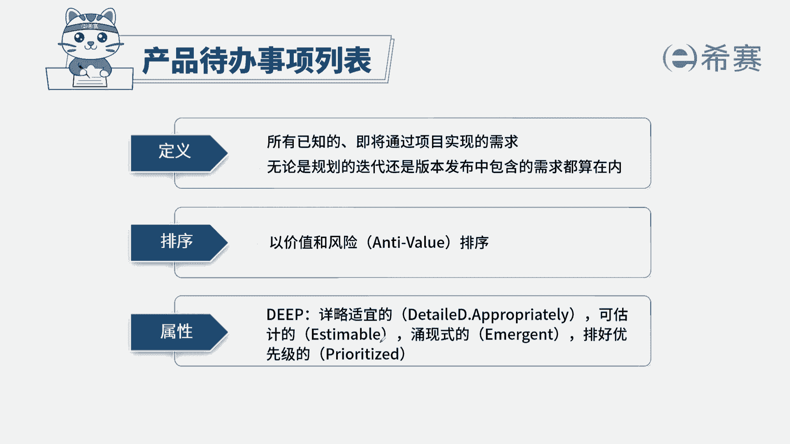

# （24年PMP）pmp项目管理考试零基础刷题视频教程-200道模拟题 - P82：82 - 冬x溪 - BV1S14y1U7Ce

为了应对市场的快速变化，组织管理层希望敏捷团队领导，帮助进行项目组合优先级排序，通过选择适当的项目以及提供所需的资源，来以组织战略保持一致，以优化相关决策，敏捷团队领导可以使用下面哪一项，a类比估算。

b计划扑克，c宽带德尔菲d待办事项梳理，本题的考法是考内容和概念，首先找到题干中的关键信息，项目组合优先级排序，既有优先级排序，就一起来看一下四个选项里面，哪个选项和优先级排序有关，a类比估算。

在预测性项目里面，对一个新的项目进行估算，比如说成本进度，可以找一个之前做过的相似的项目进行对比，从而得出一个大概的估值，这一项和优先级排序是没有关系的，b计划扑克和c宽带德尔菲技术。

这两项是敏捷团队中对于用户故事点数的估算，工具，和优先级排序依然没有关系，d待办事项梳理，在敏捷项目里面，待办事项它的一个非常重要的特质，就是将里面的用户故事进行价值和风险的排序。

从而得到用户故事的优先级，这样一来符合题干的信息，只不过在这里针对于项目组合，可以理解为公司有a b c d4 个项目，将它进行一个梳理，通过价值和风险。

所以我们选择正确选项为d选项，这是本题的解析，大家可以暂停看一下本题的相关知识点。

产品待办事项列表，针对于这个知识点，第一要理解它是按照价值和风险进行排序的。

