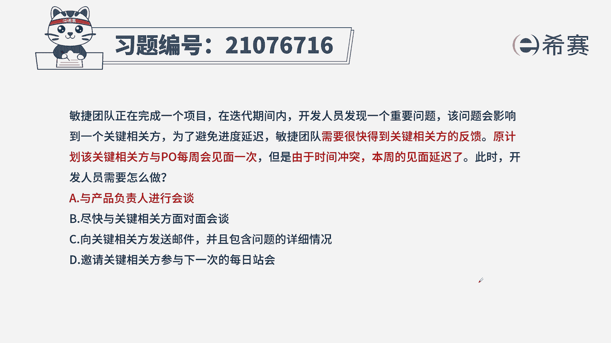
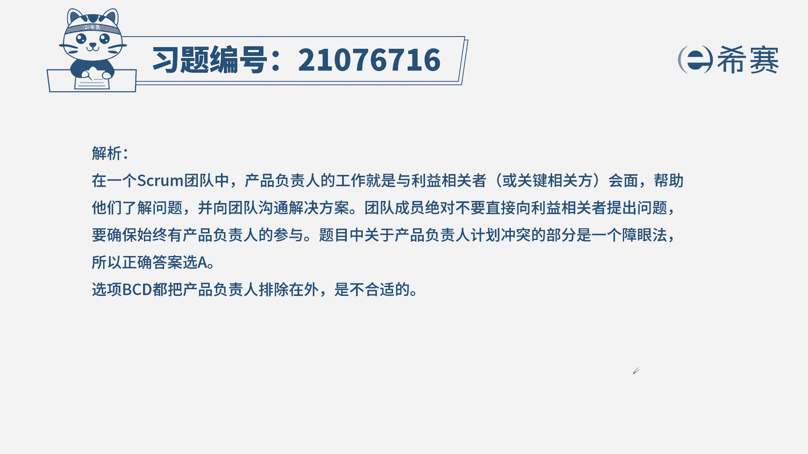
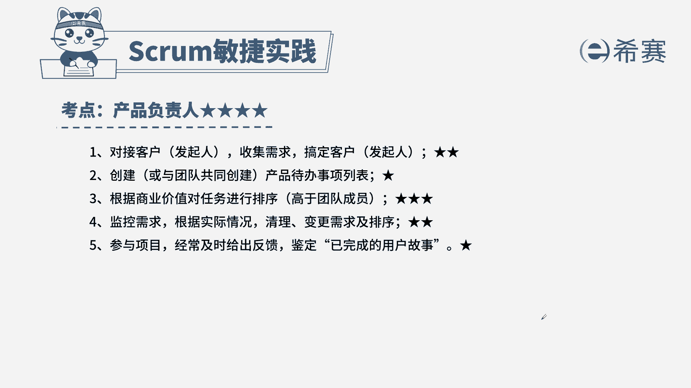

# （24年PMP）pmp项目管理考试零基础刷题视频教程-200道模拟题 - P85：85 - 冬x溪 - BV1S14y1U7Ce

敏捷团队正在完成一个项目，在迭代期内，开发人员发现一个重要问题，该问题会影响到一个关键相关方，为了避免进度延迟，敏捷团队需要很快得到关键相关方的反馈，原计划该关键相关方与po每周会面一次。

但是由于时间冲突，本周的界面延迟了，此时开发人员需要怎么做，a与产品负责人进行会谈，b尽快与关键相关方面对面会谈，c向关键相关方发送邮件，并且包含问题的详细情况，d邀请关键相关方参与。

首先我们要通过题干找到关键词，题干告诉我们，我们需要从关键相关方那里得到反馈，从而推进我们的工作，而出现的问题是没有办法得到反馈，这种时候我们要清楚，产品负责人的岗位职责里面有一条是。

他是我们团队与关键相关方，或者客户之间的桥梁，它从关键相关方那里获得反馈，获得需求，从而来支持我们团队的工作，所以关键人物是产品负责人，那我们来思考一下，没有产品负责人。

我们能不能直接和关键相关方接触呢，答案是不行，所以正确选项是a与产品负责人进行会谈，来看看其他几个选项，b尽快与关键相关方面对面会谈，c向关键相关方发送邮件，这两项呢都是跨过了产品负责人，所以不选d。

不需要相关方来参加，这一页是本题的解析。

大家可以暂停看一下，本题的考点是产品负责人的岗位职责，此类型的题目，一定要把握住产品负责人的边界在哪里，也就是说哪些是产品负责人。

