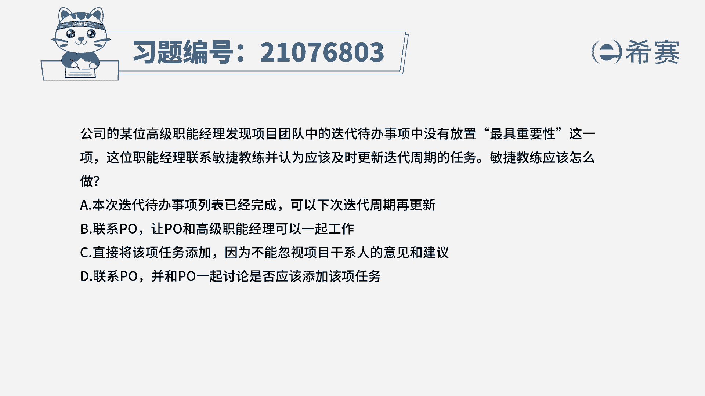
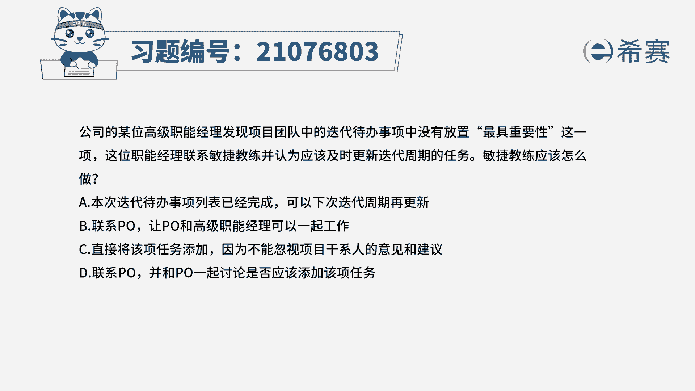
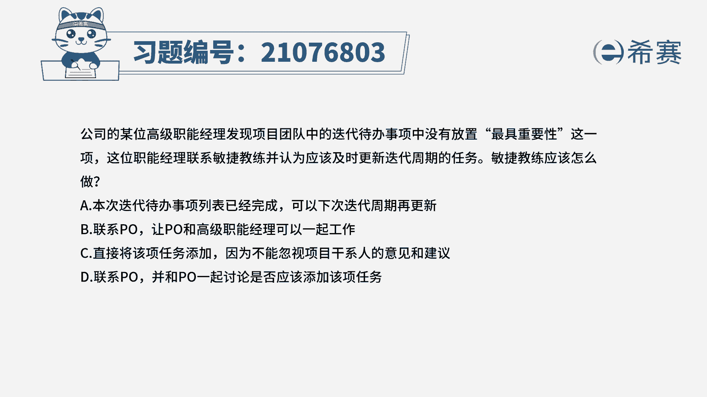
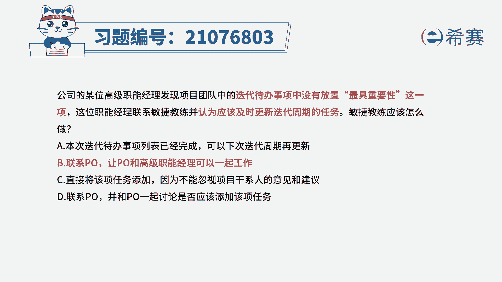
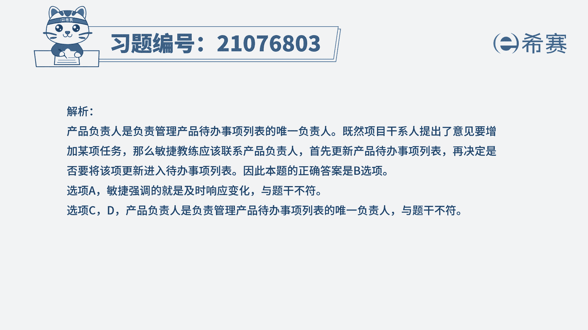
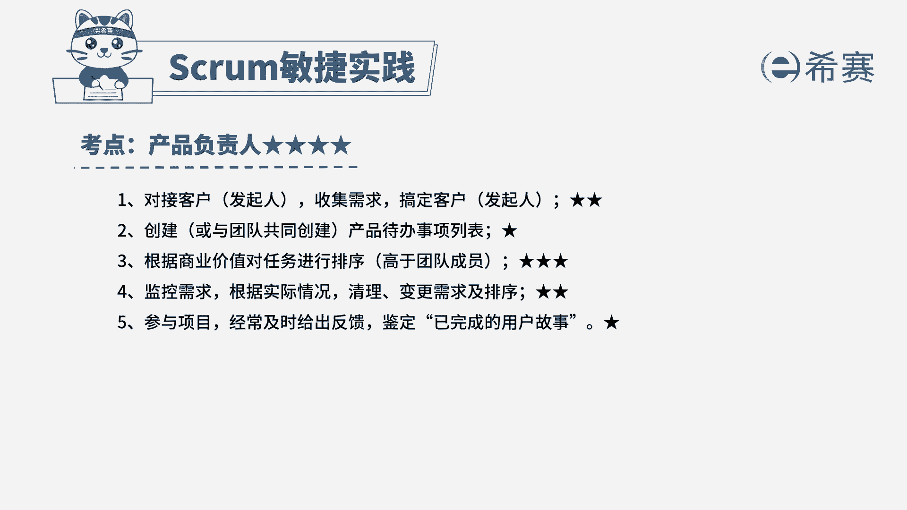

# （24年PMP）pmp项目管理考试零基础刷题视频教程-200道模拟题 - P87：87 - 冬x溪 - BV1S14y1U7Ce

公司的某位高级职能经理，发现项目团队中的迭代代办事项中。

没有放置最具重要性这一项，这位职能经理联系敏捷教练。

并认为应该及时更新迭代周期的任务，敏捷教练应该怎么做。

a本次迭代待办事项列表已经完成，可以下次迭代周期再更新，b联系po让po和高级职能经理一起工作，c直接将该项任务添加，因为不能忽视项目干系人的意见和建议，d联系po并和po一起讨论。

是否应该添加该项任务，解题思路。

首先从题干中抓取关键信息，题干告诉我们，发现在事项列表中没有最具重要性，也就是说没有排序，对信息一定要敏感，只要出现产品待办事项列表还有排序，那我们就一定要想到谁来负责产负责人。

即便本提问的是你是敏捷教练，那我们应该也是要找到产品负责人，所以选择b联系po，让po和高级职能经理一起工作，我们来看其他三个选项，a本次迭代事项列表已经完成，可以下次迭代再更新。

针对于敏捷本身就是拥抱变化，快速响应，不选a c直接将该任务添加，因为不能忽视相关方的意见和建议，对于产品待办事项列表中的用户故事，敏捷教练是没有权利去管的，d并和po一起讨论是否应该添加该项任务。

产品待办事项列表唯一的负责人是产品负责人。

所以也不选，这一页是我们本题的解析，大家可以暂停看一下。

本题的考点是产品负责人的岗位职责，针对这个知识点的这一系列的题目，想快速做对的话，一定是要知道产品负责人的工作边界在哪，哪些归他管。

