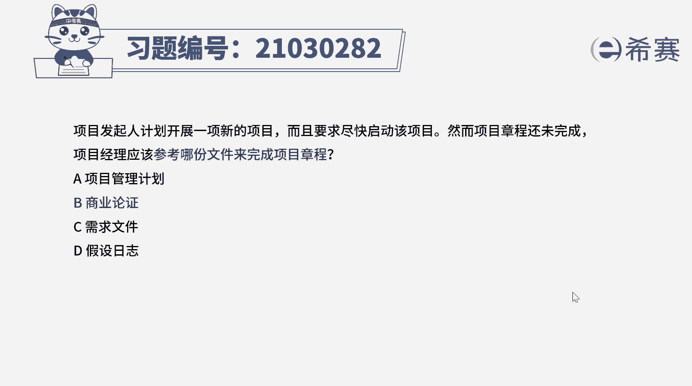
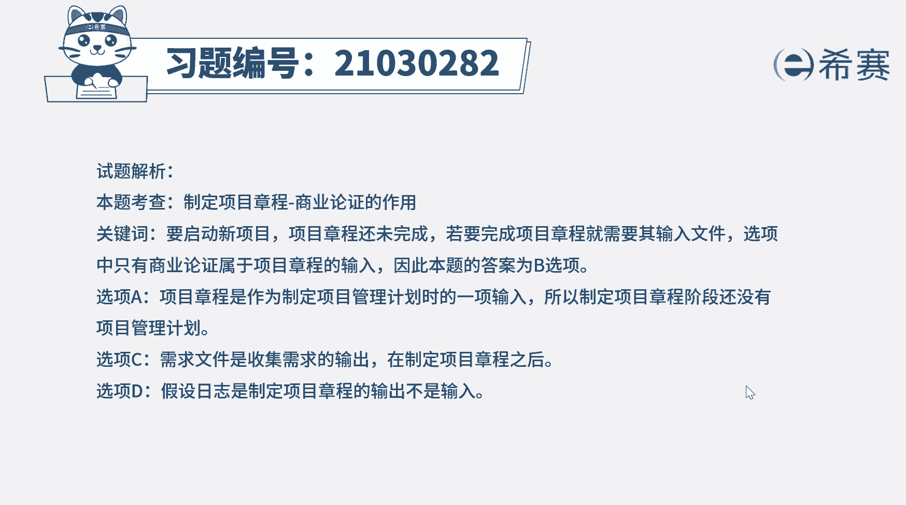
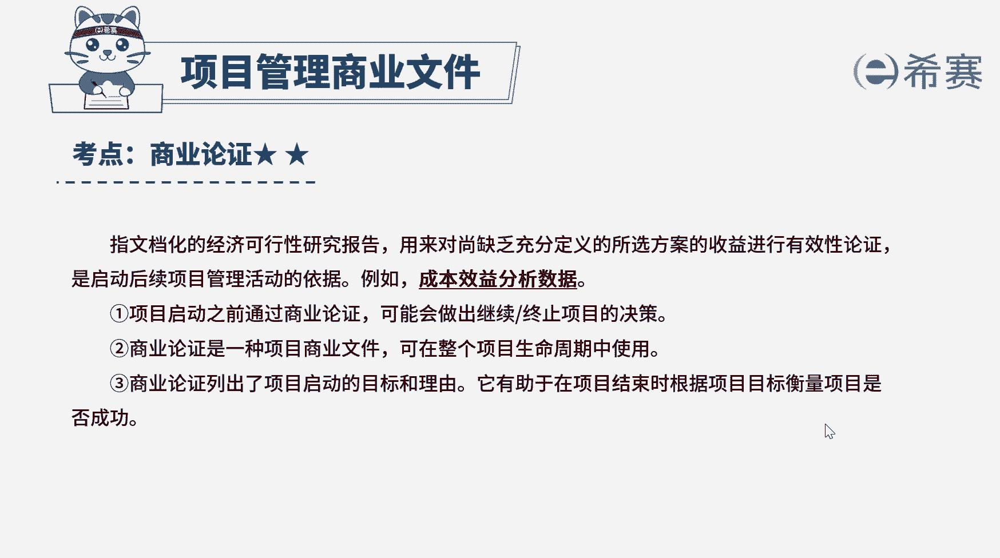

# （24年PMP）pmp项目管理考试零基础刷题视频教程-200道模拟题 - P8：8 - 冬x溪 - BV1S14y1U7Ce

项目发起人计划开展一下新的项目，而且要求尽快启动该项目，然而项目章程还未完成，项目经理应该参考哪份文件来完成项目章程，a项目管理计划b商业论证c需求文件d，假设日志好，这个题目比较短。

我们直接看到具体问的是什么，题目就是在问制定项目章程要参考哪份文件，制定项目章程的输入有商业文件，协议，事业环境因素，组织过程资产，而项目商业文件主要包括项目，商业论证和项目效益管理计划。

因此本题的正确答案是b选项好，我们也来看一下其他选项，选项a，项目管理计划的输入文件中就有项目章程，因此项目章程还没有完成，之前没有项目管理计划，a选项不选选项，c需求文件描述的是各种单一的需求。

将如何满足与项目相关的业务需求，它是收集需求，这个过程的输出文件是在项目规划阶段，它是在制定项目章程之后出现的，所以c选项也错误，好写项，d，假设日志用于记录整个项目生命周期中的。

所有假设条件和制约因素，它是制定项目章程的输出，而不是输入，所以d选项也需要排除好了。

我们此题就先讲解到这里，大家可以自行参考一下相关的文字解析。

整个题目讲解下来，我们可以知道本题的考察知识点就是项目管理。

商业文件。