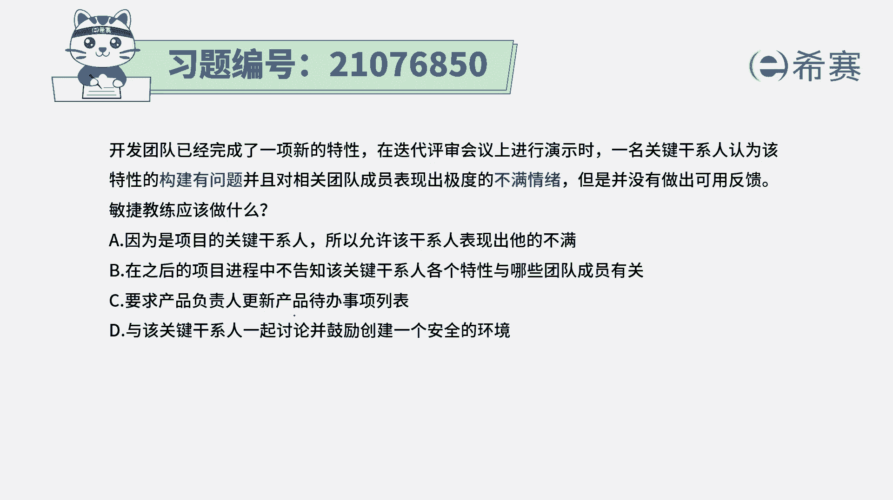
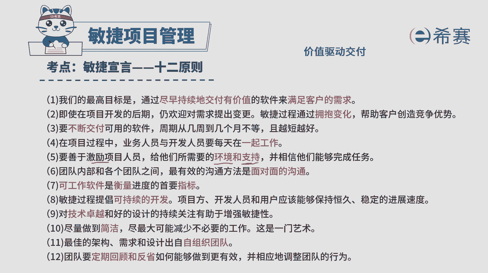
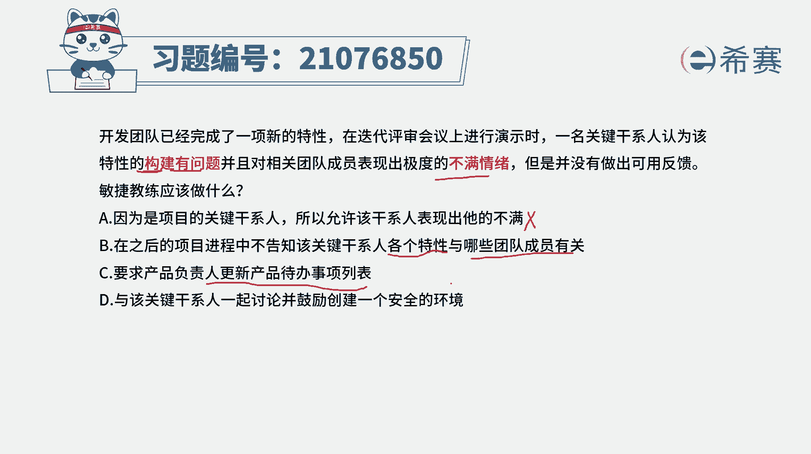
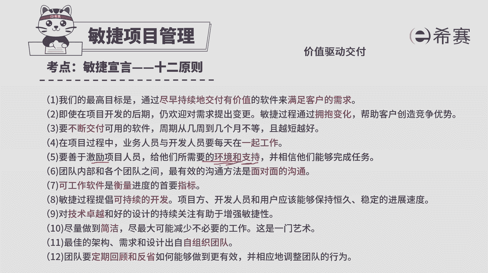
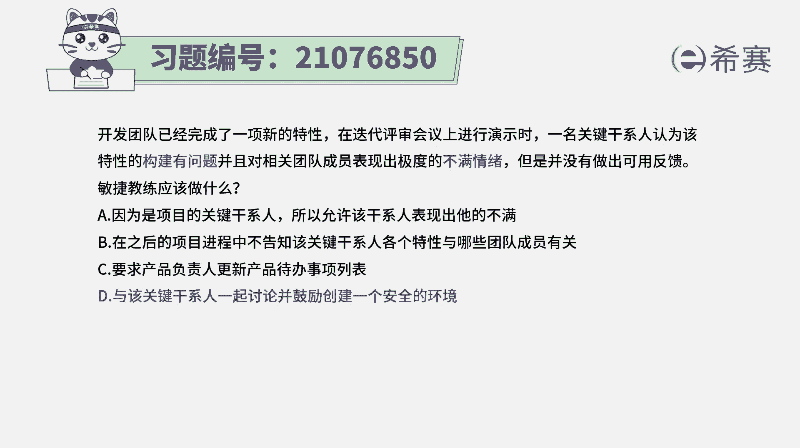
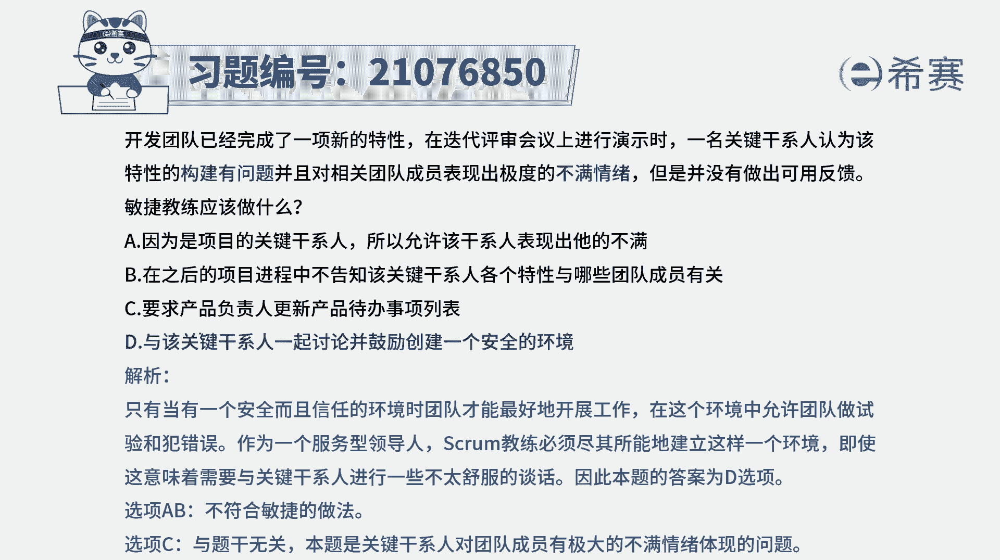

# （24年PMP）pmp项目管理考试零基础刷题视频教程-200道模拟题 - P93：93 - 冬x溪 - BV1S14y1U7Ce

开发团队已经完成了一项新的特性，在迭代评审会议上进行演示时，一名关键干系人认为该特性的构建有问题，并且对相关团队成员表现出极度的不满情绪，但是并没有做出可用的反馈，那敏捷教练应该怎么做呢。

那这里面的话其实是一个非常不好的一个情况，就是你只是在发脾气表达不满。

但是你并没有告诉他应该怎么改，而事实上，我们在敏捷的杀原则中有这样一条原则，我们说要善于去激励团队成员，要给团队成员，他们所需要的这样一些环境和支持，并且呢整个敏捷它会强调是这种信息透明，价值驱动交付。

那你怎么样去做才能够信息透明。

价值驱动交付承诺，怎么样才能够去鼓励团队成员，激励团的成员，那这种啊直接去表达这种部门肯定是不合适的，你可以说是卖哪些东西，可能需要去做一些什么样的调整，改进可能会更好一点，有了建议基本常识以后呢。

我们再来看一下这四个选项，选项a因为是项目的关键干系人，所以允许他表现不满，这种说法是什么，那就是继续让他受气呗，那这种方式其实是让大让团队会受到伤害呀，没有没有很好的去保护团队呀，对不对。

所以这种说法形式肯定是不合适的，没有没有去支持团队，保护团队，选项b在之后的项目进程，不告知该干系人各个特性与累计团队成员有关，这种方式它不是在掩耳盗铃吗，也就是说这一次的话就是就这样算了。

下一次的话我告诉你这是谁做的，那不是谁做的，那不就是领着大家一起去卖，这种方式肯定还是不好啊，选项c要求产品负责人更新产品待办事项列表，那要求产品负责人更新产品待办事项列表，是把本项构建的这样一个特性。

也再一次放进来吗，还是干什么，另外呢关于他对于大家的这种不满的情绪，其实并没有出到一个解决，而只有d选项与该关键干系人一起讨论，并鼓励创建一个安全的环境，这才是刚好是符合这一条。

对不对，符合这一条，我们需要去给大家创建一个所需要的环境和支。

持，我们要去激励团队成员，所以答案就是选最后一个啊，就是这种对团队成员表达出不满的这种方式，是不太合适，不太友好的，而应该是要去给大家创建一个良好的。

安全的环境解析。

