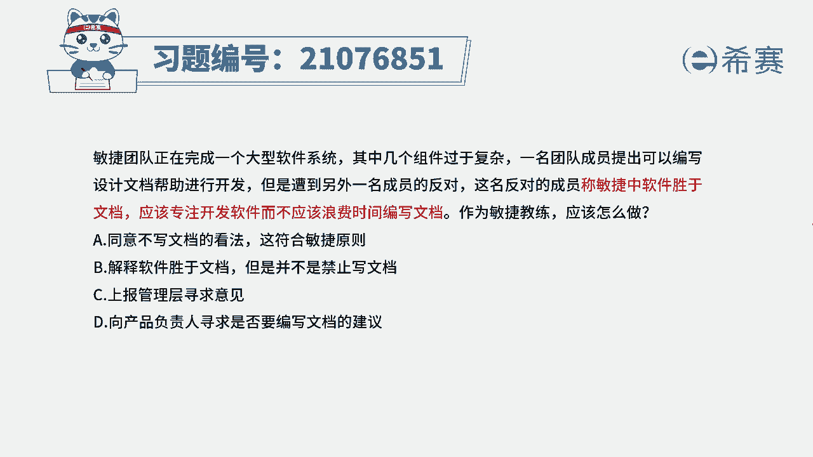
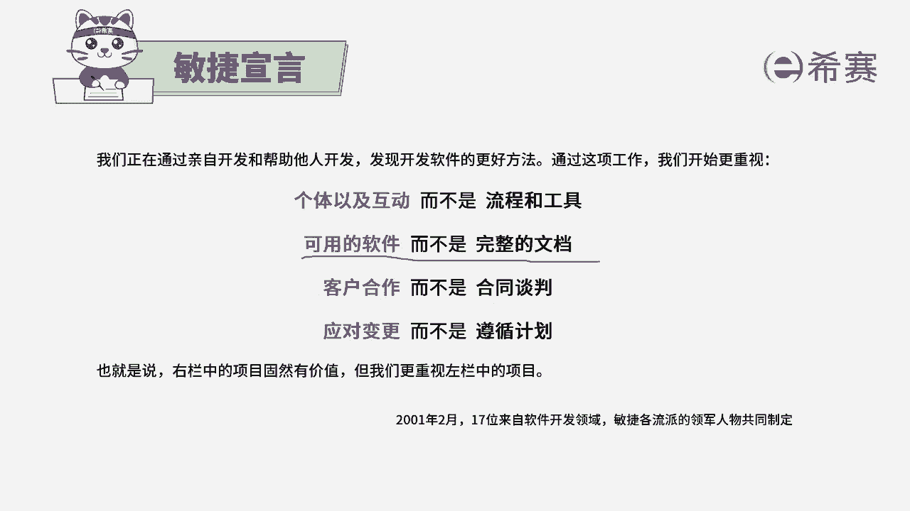
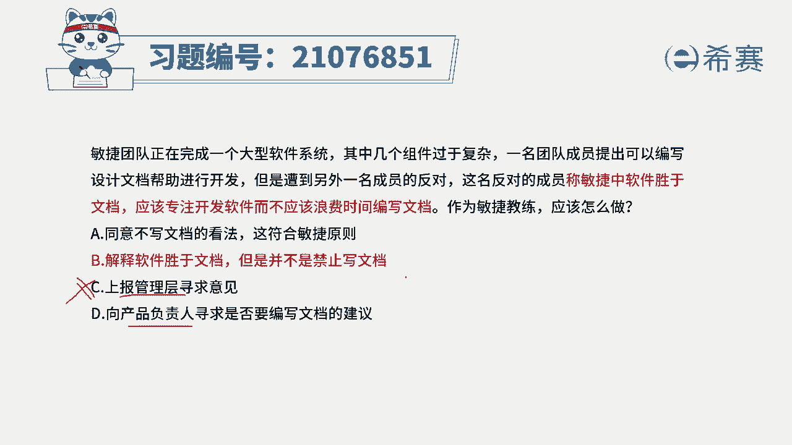
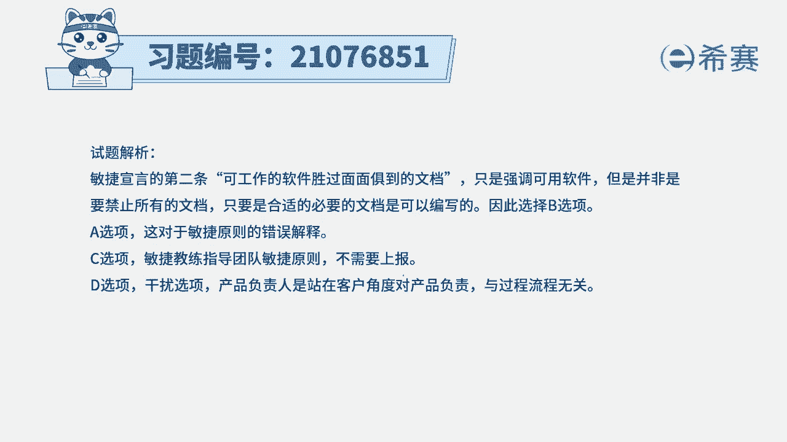
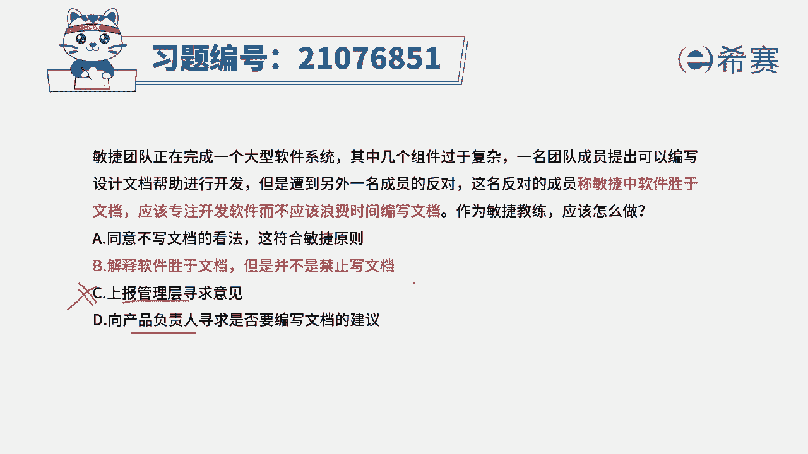

# （24年PMP）pmp项目管理考试零基础刷题视频教程-200道模拟题 - P94：94 - 冬x溪 - BV1S14y1U7Ce

敏捷团队正在完成一个大型软件系统，其中几个组件过于复杂，一名团的成员提出，可以编写设计文档来帮助进行开发，但是遭到另外一名团队成员的反对，这名反对的成员称，敏捷中软件剩余文档应该注重开发软件。

而不是浪费时间来编写文档，那作为敏捷教练应该怎么做，这道题目，我们首先要去知道一下，这句话本身是没有错，就是软件在敏捷中可用的软件胜过完整的文档，但并不是否认文档的价值，文档依然还是需要。

只是说够用就好，不需要做到面面俱到的文档，有了这样一个信息以后呢，我们再来看四个选项，选项a同意不写文档的看法，这很显然不对啊，完全不写文档，开玩笑呢，这肯定是做不成的。

并且敏捷的方式也不是不写文档是够用就好，选项b解释软件圣遗文档，但并不是完全禁止纹的，这句肯定是对的了，这一句呢其实大家可以看到，在这里它其实就是可用的软件。

胜过了完整的文档。

是这一条，所以b选项是正确，答案选项c赛马管理层寻求意见，那这样的事情你还需要去找管理层，需要你干什么，对吧，这个肯定错的啊，选项d向产品负责人来寻求，那这个不管说是上报给管理层。

还是像p o来自于寻求帮助，这都是不合适的啊，本身就是应该要写文档，只是说文档不需要写的那么详细。

不需要写那么繁杂，所以答案是选第二个选项解析。

