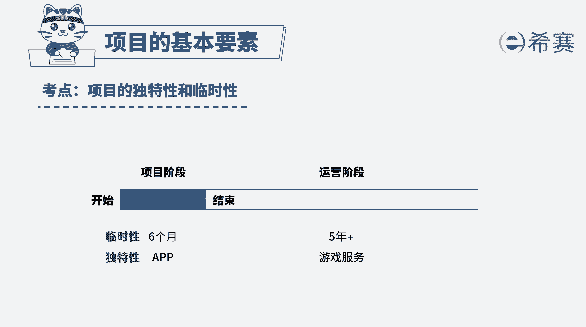

# （24年PMP）pmp项目管理考试零基础刷题视频教程-200道模拟题 - P9：9 - 冬x溪 - BV1S14y1U7Ce

西塞为了帮助学员更好地学习pmp知识，由小智老师负责了一个习题课的录制项目，这个录制项目完成后，视频能够给之后所有的学员使用，在这种情况下，对于项目的临时性这一特点，下列哪一项的描述是正确的。

a录制项目符合项目临时性，因为录制会结束，b录制项目所创造的视频，也符合项目临时性的特点，c录制项目不符合临时性，因为录制的视频可以给之后所有学员使用，d录制项目符合临时性，因为录制周期很短。

好我们读完题目，先来看一下问题，对项目临时性描述正确的是哪项，回到题干，我们可以看到题干的其他信息，其实只是个背景介绍，这道题考察的就是对项目临时性的理解，项目具有临时性。

是因为项目具有明确的开始时间和结束时间，不会无限期地延续下去，因此本题的正确答案是a选项，录制项目符合临时性，因为录制会结束，那再来看一下其他选项，选项b录制项目所创造的视频，也符合项目临时性的特点。

项目的临时性针对的是项目，而不是项目产生的可交付成果，所以逼的说法错误选项c，录制项目不符合临时性，因为录制的视频可以给之后所有的学员使用，注意项目具有临时性的特点。

这与项目创造的可交付成果的使用时间无关，项目产生的成果往往具有可持续的长期生命力，不会因为项目的结束而不复存在，c的说法错误选项d，录制项目符合临时性，因为录制周期很短。

项目的临时性与项目工期的长短没有关系，一个持续时间只有一个星期的项目是临时的，一个持续时间长达10年的项目也是临时的，d的说法也不正确，好了，这道题我们就分析到这里。

大家可以自行看一下相关的文字解析，整个题目讲解下来，我们可以知道本题考察的知识点。

