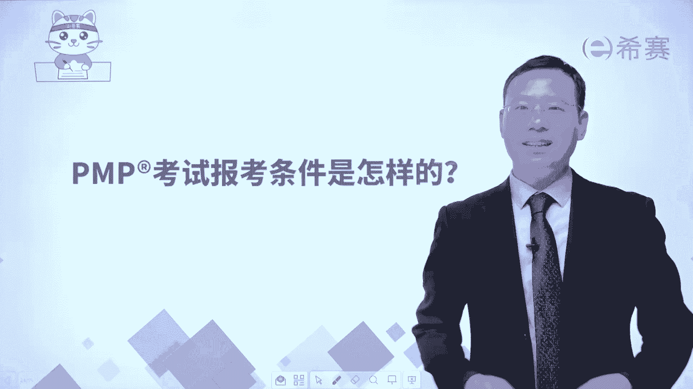
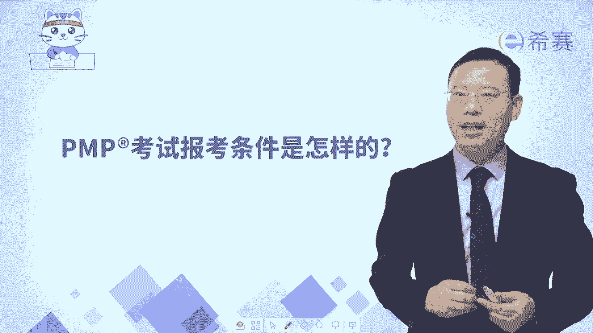
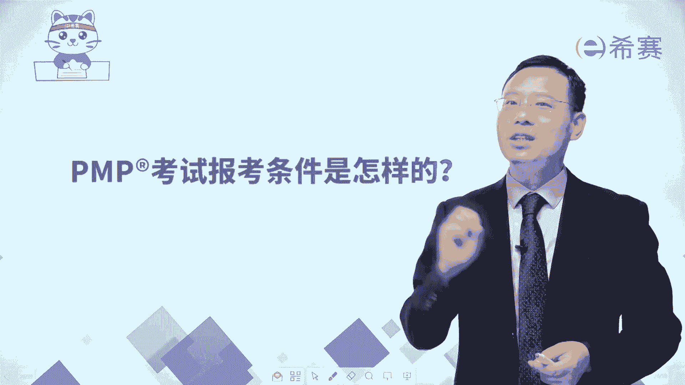

# （24年pmp考试）pmp认证初学者报考指南名师指导+pmp项目管理备考资料分享 - P3：PMP考试报考条件是怎样的？ - 冬x溪 - BV15X4y1v7Yg

大家好，很多人关心pmp考试他是不是很难啊，他的报名条件是什么样的呀。

啊首先第一个呢偏僻考试它其实是有中文的啊，有中文翻译的，它是中英文双语的，它难不难嘛，主要是取决于你有没有好好学习，你只要认真学习。

都可以通过考试，而接下来我想要给大家分享的是，关于他的报考条件，其实很多人想要去知道自己是否符合报考条件，你只要看这一张表就很清晰了，首先第一个你是本科以上的学历的话呢。

你只要工作中有3年以上的项目管理经验，其实也就是说你本科毕业3年以上，你就可以报考偏僻，当然还有一个条件，就是你要去参加那种由基金会。

或者说是由拍卖中国来授权的培训机构，比方说西塞啊这种授权的机构，你要去参加这种授权机构的培训，并且获得了有35学时的这样一个培训证明，但如果说有同学他不是本科以上的学历，他是由专科或专科以下的学历的话。

那么你需要有5年以上的工作经验，并且同样的你也是一样的，需要去参加由基金会或是拍卖中国授权的培，训机构的这样一个培训，获得这35学时的培训证明才能考试，那也有一些小伙伴会表示说。

老师我这个年限的是毕业年限肯定是够了，但是我没有项目管理经验，可不可以都是可以的，因为我们会来去通过培训的方式，大家知道那个理论是来自于实践，同时呢他也可以去指导实践，所以你只要这个年限够，就好好学习。

多花点时间学习，多花点精力去学习，你肯定可以顺利的通过考试。