# （收费视频完整版分享）PMBOK第七版课程PMP考试报名认证培训精讲-零基础项目管理第七版教程最新版直播课回放视频免费课程资源-骐迹教育谢阳主讲 - P11：4-2项目管理原则下 - 老尧说事儿 - BV1ek4y1s71N

和非定性A有点道理啊，有那么点道理啊，因为那有没有还有没有人回答。

因为第一条指的是什么。

因为啊不是不是，验收标准与客户期望可能不一致。

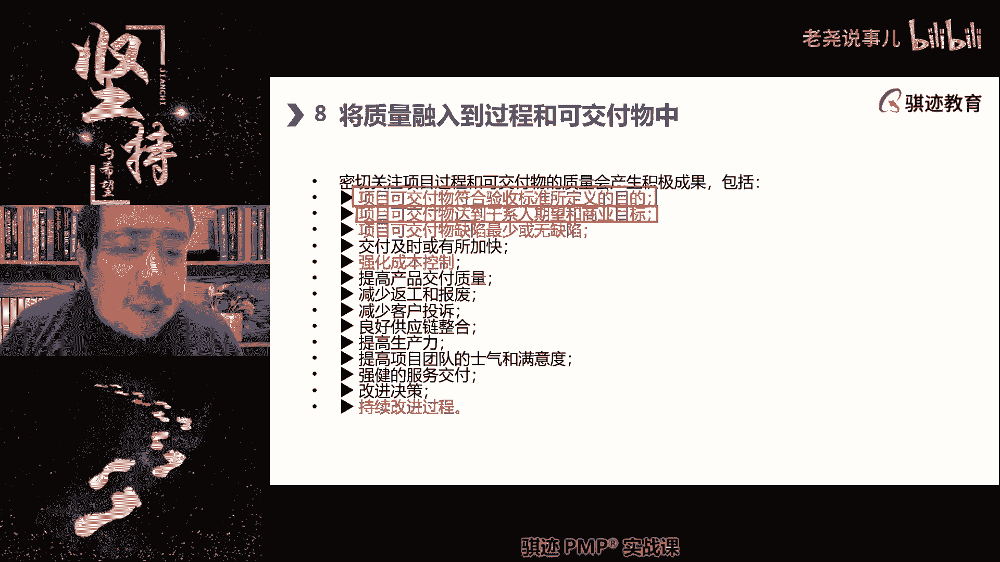

不是因为有这样一种东西啊，你们可能理解清楚，这验收标准并不能完全代表干系人的期望。

注意这里不是客户期望，而是干系人期望。

客户只是干系人的一种啊，一一类人叫做该系列的一类叫做客户。

但不是所有的东西，如果验收标准仅仅是体现客户期望。

那么这个东西也可能不是最成功的啊。

也可能不是最成功的啊，我们经常生活中经常会会会啊。

体验到什么例子啊，比如说啊客户要求你开发一套系统。

结果这个系统呢客户的要求是什么啊，尽可能节约成本。

如果你开发出来了，满足客户要求的功能都都有了啊，功能达到要求，但是十分的难用。

这种用户用的时候，我们前面之前讲过对吧，客户和用户最终用户是不是讲过啊。

用户用的时候用的呀，特别的不爽啊。

这个是不是就是没有满足用户的期望，也不完全满足商业目标。

对不对，验验收仅仅主要体现的是什么。

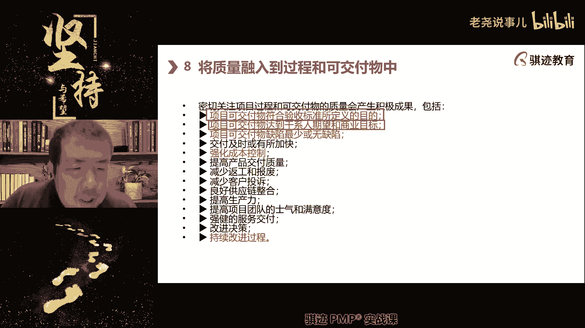

因为客户验收嘛，或者发现它仅仅主要是体现了什么啊。

我们的客户的期望和发钱期望。

那么他可能也其他其他的项目相关干系人，相关方案可能仅仅只能保障一个最低程度啊。

这类生物，所以这两者其实是有区别的啊。

这是一部分区别，还有很多其他的区别啊，明白了吧，所以质量管理层的效果就是要什么，能够让所有人都happy啊。

但是这个很难很难。

好可交付成果的缺陷最少或者无缺陷啊。

就没有缺陷，那么注意我们前面不是讲质量零缺陷吗，为什么这里用最少。

你们知道吗，来来我给你们讲一个东西啊。

这个这个东西肯定是不考的，但是给告诉你们一个概念，那么这个呢叫做互联网时代下的质量概念啊。

那么这个是送给大家啊，这是我也是我总结在互联网时代下。

质量标准被进一步降低了啊。

我们在传统概念当中。

质量应该什么越高越好，那么在现在阶段什么质量应该是够用。

满足客户满意就好，那么在互联网时代下，质量应该是什么成本裁减一啊。

不是成本啊，这个还不是成本。

不一定是成本，只叫缺陷最少，为什么做到缺陷最少不是成本呢。

看看互联网时代有什么特征啊，要求快，所以为了快我们的质量标准被放低到什么。

在客户容忍的底线之上就好。

他换是什么快，因为互联网时代的很多产品都都是迭代特别快。

更新的特别快，所以你没有办法做到一个完整的质量体系。

来保证所有的东西都是什么。

都是成熟的啊，没有问题的，他要通过迭代循环来促改进质量。

而迭代循环之中又会不断的产生新的功能。

新的功能就可以可能带来新的缺陷隐患。

所以这个过程是始终往复，我们只要做到尽可能少的缺陷。

但是做不到互联网时代的产品，往往是做不到没有缺陷。

只能尽可能少的缺陷，那么这个缺陷少少到什么程度啊。

在用户的容忍程度之下啊。

不超过用户的容忍程度即可啊。

一步一步试探底线，所以越来越好，6666有这个道理啊。

明白了吧，所以这是一个时代特征啊。

所以传统管理质量的人，对于现在互联网时代，很多东西都看不懂或者接受不了啊。

这个东西呢不能怪生产方厂商。

有时候也怪用户，你知道吧啊诶我们这段讲完。

我们这个休息啊，跟你们说说啊，这个是我经常喜欢讲的是人是一个双标动。

我知道为什么吗，哎我跟你说。

你们不要不承认大部分人都是双标动物，对于新鲜事物。

先进事物，颠覆性的事物具有极大的质量容忍度。

但是对于成熟事物，传统时代事物有很小的质量容忍度。

这就是我们最喜欢举例的点。

就是汽车，同样是汽车，你对于那些传统燃油车商生产的燃油车。

它有质量缺陷啊，这个嘛那个嘛哎对了。

你看到什么造车新势力啊，什么先进的电动车啊，他们哎呦这个黑屏那个故障啊，那个刹车势力啊啊哎呦。

很正常的嘛，对不对，先进东西啊，好玩就行对吧，我们以后给OTA升级哎。

各种容忍，你会看到什么，这个明显是双标，而且这个双标概念不是一个人。

两个人，而是一种群体双标。

这就是时代特征，所以就是你们每一个人。

当然也有可能有点包括我，但是我比较比较不太接受纵容的那些厂商。

然后用这样一种互联网时代的质量方式，去进行产品交付啊。

哎你们体验一下，是不是，我们仅仅是用电动汽车和燃油车做一个例子。

其实还有很多行业，很多领域都是这样。

好那么啊这是我们讲的可交付的缺陷。

最少的无缺陷，然后还包括什么交付及时和加速强化成本啊。

减少返工啊，呃减少返工，减少客户投诉，提高生产力和持续改进等等等等。

这些都是质量中的过程啊，这个自己稍微看一下。

提高士气，提高满意度等等等，那么这个就不说了啊，这些都是我们的啊。

质量融入过程和交互常用的相关内容，那么这个了解一下，后续我们在质量当中讲的时候呢。

就不再特别强调传统质量观念，现在质量观念以及质量的产生的积极效果。

这就不讲了，好吧。

好那么接下去我们会讲驾驭复杂性。

那么讲驾驭复杂性之前，我们先稍事休息一下，现在是20。57。

我们休息到21。12好吧。

休息到21。12，继续啊，好大家先稍事休息一下啊。

如果对于我们讲课当中没有听懂的同学，大家可以啊发问啊。

课间休息啊，好。

好稍微学习一下，现在几张观点评估和传统的警察有病评估。

可以举个例子，评估其实就是检查他换个词儿。

否则你会confuse，评估和检查都是这样，但是评估更多是对于过程的评估。

检查是对于结果的检查，评估更倾向于过程检查。

更向于倾向于最终产品出来之后的结果。

进行检查，明白了啊。

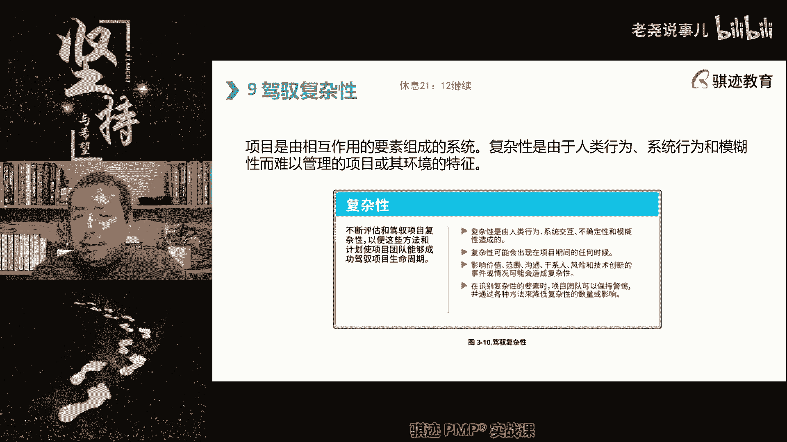

嗯你要你硬要举个例子，就像NBA状元秀不是马上要学NBA状元吗，今年NBA的状元是那个文班亚马对吧，好像大热的维码支队拿到了首选状元签。

状元签对吧，那么在一个状一个NBA选状元。

选出选中状元之前，一定会对这个状元进行品格方面评估。

各种分的非常非常细这评估，但是呃等你签完这个状元之后。

你要对这个整个这个这个状元进行什么，可要对这整个一个状元的话进行什么进行啊。

体检各种各样的体检。

身体检测，这叫检查，但是你已经签完了，你不能退货，明白了吧。

如果能退货的，大家知道啊，NBA历史上最水状元。

哈哈那你就知道了，是吧啊，就不说了啊，这就是评估啊和检查之间的略有区别。

但总体来说都是检查，一个偏向于过程，一个偏向于结果。

继续啊，回来同学都扣个一啊，继续讲，第九点驾驭复杂性。

那么复杂性请记住，同学们啊，复杂性是一个系统中啊。

系统中人系统模糊性等等。

以及这些东西共同构成的，它是一种复。

什么叫做复杂啊，复杂指的是什么，指的是由于过组成的元素过于庞杂。

或者交互的因素过多啊。

我们先讲一些比较理论的，而产生的人不可预测结果的这种特性。

叫做复杂性，那么它的英文是叫做complex。

还就叫complicity，好同学们。

复杂是complex还是complicated。

是哪个是前面那个我的共同力量。

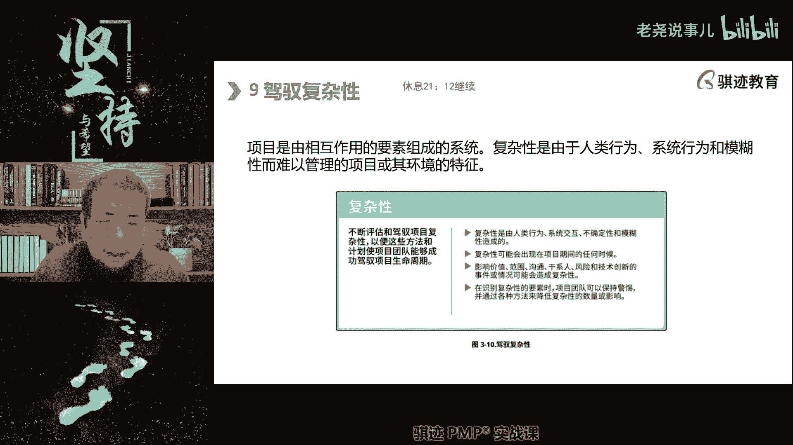

是前面那个是后面那个。

啊是哪个。

对是前面那个后面那个叫做繁杂。

它呢关系简单，组成元素呢关系简单，但是数量较多。

用后面那个，但是如果组成元素有的关系又多呢，是前面那个啊，是前面的complex，请记住啊，我们讲的复杂性格都是讲前面那个complex。

那么我们在一看待复杂性的时候呢。

我们知道复杂性来源于什么，我们的人类行为系统，行为和模糊性啊所带来的特征啊，这使得我们项目难以管理。

所以复杂性是我们增加项目，管理难度的一个方面。

我们要控制驾驭，掌握这种复杂性，那么复杂难就难在什么，我们不可预测其结果。

如果我们能用各种各样的方方法，去克服这个结果啊，能克服这个不可掌握，让它变得能掌握，能预测啊。

能判断可控，那么复杂性就没有了，项目的难度也就降低了啊，所以项目的难度就来自于复杂性，和我们后面会讲的不确定性啊，那么复杂性是由这些方面组成的啊，不确定性，复杂性等等组成的啊。

主要难度就来自于复杂性，后面还有不确定性啊，复杂性可能也是项目。

可以发生在项目的任何时候，注意复杂性不是一种风险，它是一种难度。

它不是一种偶然，而是一种难度啊，为什么这么说，因为我后面会讲到呃，呃不确定性啊，像我就不确定性，那么影响价值范围，沟通干系人，风险和创新的事件都有可能造成什么啊，事件和情况都有可能造成什么复杂性啊。

那么在复杂性识别复杂性项目可以保持警惕，用各种方法来识别复杂性啊。

那么这个东西讲的比较多，那么有一点请注意，这个世界上什么东西最复杂啊，标红字的东西就不大，人的行为技术是最复杂的，因为人是最不可预测，最不可预知感知的人，明白了吧，还在我的微信上还在不断的恨啊。

问我问题啊啊哎你们有些学长嘿嘿学的这个啊，变化无常，人也带不去变化无常，但是人每个人是有主观能动和自我意识的，主观能动和自呃自我意识是很难够，很难能够完全被预判和掌握的，知道吧。

所以你要想真掌握各种各样的东西当中，最难掌握的是什么东西啊，人性啊，这个东西又有哲学对吧，最难掌握的是什么人性啊，这个世界上最复杂的是什么，就是人性，我们一直说嘛。

所以我们认为最大的复杂性来源不是风险来源，而是复杂性来源是人啊啊是人的行为啊，那么接下来呢一种复杂性来自什么，我们的系统行为，即使我们的项目，各个内部要素和外部要素之间，相互依赖的结果啊。

相互依赖的结果啊，相互来结果啊，就比如说啊啊，就比如我们说说这个说一些例子啊，就是你们知道吧，有一些东西看似最简单的东西，其实是最难以预测的，比如说嗯人类社会当中一个很古老的行业，就是最古老。

但是人类诞生的农业，知道吧，人类在狩猎和游牧之后就开始从事农业，但是几千年的农业下来，最难以预测的就是农业结果，知道吗，农业结果是，就现在，以现在的科技和全球化水平和监测水平来看。

农业结果也是很难控制和预测，为什么，因为影响的变量因素，内外影响的变量因素越来越多，这就是一种典型的例子啊，这是什么农业会受哪些影响，人家说种田要看天吃饭，所以天气是第一大影响因素。

还有人力市场需求对吧，然后还有一些在古代还有什么啊，战争等等，这些因素都会影响农业的结果啊，还有各种复杂因素参加，所以人很难识别这个农业的结果，所以大家最近看新闻吧，就是说呃。

中新闻说中国退订了大量的美国大豆啊，你们知道为什么中国推进美国大豆其实很简单，它是个商业因素，不是个政治因素啊，是因为什么巴西大豆更便宜，今年呢巴西丰产了，风调雨顺啊，丰产了，所以呢巴西豆子很便宜。

美国豆子贵，美国的北美洲的气候不如南美洲气候好，然后南美洲今年丰产了，那么我为什么不买更贵的豆子，我买便宜的豆子，谁便宜买谁的对吧，所以导致什么巴西豆子啊被大量采购，美国都在被大量退货啊，这就是个因素。

但是你说那些国际粮商，大买家就不知道去进行产量预测，各种数据分析，人家那个可是专业的，天上有卫星地，地下有监测站，各种各样的监测诶，他照样有什么大规模的退货，退货退定是要付赔偿金的，人家宁可付赔偿金啊。

那么这是为什么，你很难在一个很早的时候，就预测到产量和市场价格波动，有时候丰产了仍然能涨价，有时候欠收了，它还会跌价，诶啊但是这个涨价比较相对而言，相对平均水平对吧。

所以系统性行为就是项目内部和外部的要素，之间的相互之间的影响，这种东西是有些时候是很难判别清楚的，我们以农业人为例，所以老天爷说跟老天爷一直说什么东西啊，啊我们不知道老天爷就老祖宗一直这东西啊。

这个东西是看天吃饭，对吧啊啊大家以前读书的时候学过那篇文章吗，多收了三五斗，记得吧，丰年成灾啊，就是这个道理吧，诶你预测到了，可能说你运气好，遇到了丰丰收的日子，但是没想到什么东西啊。

我靠这个这个这个这个因为你丰收了，可能国外也丰收了，结果国外粮食倾销进国内啊，多收了那么三五斗，大家都学过8年的课程，哎这就是一种啊，我们以农业来举例，这就是一种啊复杂的系统行为，就导致结果增产不增收。

对吧好，那么这是第二种可造成复杂性的啊，我们要理解项目中的各种各样的特性，第三种呢叫做不确定性啊，不确定性就来了，我们后面也会学到，但是这个现在是一个很流行的词儿啊，叫做VUCA，有同学能告诉我吗。

BUCA这四个词各代表了什么意思啊，有没有同学在公屏里告诉我，BUC都割不了什么才，嗯有没有同学能说一下，对啊，VUC里面的两个词就是不确定性和模糊性啊，当然我们还要讲一讲啊，敏捷异变性。

那跟敏捷有什么关系啊，哪里敏捷A又不是敏捷了，A就是模糊性，EAZABILITY啊，非常好啊，有同学学的非常好啊，E就呃V是V就是volatility，对了是异变性，它变得特别快一样事情诶，非常好。

有同学贴的贴出来非常好啊，这个东西来给百度对，这个东西在有些理论当中是着重要考核，理解的啊，但是PP是也是紧跟时代啊，像老师教的，如果是教的item的课程里面，这个东西就是注重要考的东西啊。

如果你们跟着我学，如果以后要拿一个高级别的ITO的证书的，这个是要写小论文的，然后给我批批了以后，如果你们如果是批了，然后给你们打分，通过上传分数，然后才能官方售证啊。

那么V就是指的什么volubility，就是说异变性，它变得特别快，以至于你根本不知道啊，说到版的VP，大家马上男生就会想到什么，女人的心就是我的avi ability啊，那么U呢是insert。

就是说客观上这个东西永远定不下来，不到最后一刻永远定不下来，就是说a certainty对吧，C就complexity啊，我觉得我们讲的复杂性啊，就是我们讲当然这个啊，这个就是PPT里面。

把它这个东西放到这个里面讲啊，我们大框架就是说组成元素特别复杂啊，你理不清楚它的具体的因果关系，这个就是说complexity，最后一个ambiguity就是说模糊性，模糊性指的是什么。

它有最终确定结果，但是你无法识别出他给的条件啊，不足以让你判别出NB67对的，这就是我们常说的VCVC是什么特征啊，就是它在现代社会生活事物当中永远存在，无法消除啊，没办法消除。

这是他的一个很重要的一个特征，知道吧啊所以我们现在有一个口号叫什么啊，拥抱VUCA，接受事物，从传统世界当中的高确定性，变成现在的什么VCA的特性，这是我们现在事物普遍特点啊，拥抱变化，拥抱不确定性。

好那么最后一种呢是什么复杂性，在什么技术创新啊，技术创新在复杂性这个角度上就是什么啊，一个双刃剑啊，它既有可能降低复杂性，也有可能提升复杂性，但是你不接受技术创新，技术创新就会干掉你对吧。

所以今年以来最大的一个技术创新，那那那那那个那个就是什么，就是我们讲的啊啊啊人工智能对吧啊，chat gbt对吧，这就是一种技术创新，这个技术创新会带来很多人的失业，但是也会给少部分人带来新的机遇。

但是一定会带来一个新的社会结构的转变啊，好那么最后一个最后一页啊。

这个复杂性最后一页，那么我们要记住复杂性，这时候给大家复杂性是项目的风险的主要来源。

但是不等同于风险啊，复杂性只是说这个项目的影响因素。

变得我们不可预测，但它不一定会发生风险。

那么有同学说老师风险是什么，我们风险会讲风险是一种潜在的。

可能有概率去影响项目的那些事件。

或者非事件啊，它会对项目产生正面影响和负面影响，复杂性是可以是风险的主要来源。

但它不一定会导致风险啊。

不一定会导致，那么注意有一点是这样的啊。

为什么公司要请出钱请你来当项目经理。

就是要让你用专业的知识，方法论等等去可以及经验去克服复杂性。

项目自身永远是带着复杂性。

没有复杂性就没有项目。

因为没有复杂，所有的东西都可辨识。

可控制过程明确，那就没有必要用项目这种形式对吧，我们走个制定一个流程。

做完它就行，也就没有必要采取项目这种形式。

所以这种呢就这，所以复杂性是项目与生俱来的一种特性啊。

你要去驾驭它，这是你作为项目经理的存在价值啊。

所以作为一个项目经理，如果你要夸啊。

比如说你要你要凡尔赛，你的项目能力你应该怎么。

凡尔赛不是凡尔赛，你能管多少人，不是凡尔赛，你的项目管得多大。

而是凡尔赛什么东西啊，我的项目有多复杂，我的项目有多大啊。

曲折我的项目面临更重要的因素，唉最后我把它做下。

这是你正确的项目管理成功之后的凡尔赛啊。

但是请记住，项目没到最后一个成功项目成功关闭，请不要凡尔赛啊。

半场开香槟这种事情不要做啊啊，因为经常会立flag被打脸啊。

所以当你项目真正成功了，成成成功关闭之后。

请用正确的姿势去凡尔赛，就是你能体现在用你的各种吹嘘罢啊。

不经意间流露也罢。

体现出你能驾驭项目的复杂性啊。

谈笑谈笑之间尽在掌握，要体现出这种能力啊。

这是你项目经理正确的凡尔赛知识知识知识，明白了吧。

项目本身是一个复杂性工程，所以项目经理要运用像势力分框架。

这个我们后面就会讲啊，这个框架在很多其他理论讲，势力分框架讲的是在不同复杂度的环境下。

我们应该用什么样的基本逻辑行为去进行啊。

去进行工作啊，叫十几分框架以及STACY的矩阵啊。

这些东西我们会在工具专业为工具集中，后面介绍啊。

这两个空间一介绍好来进行，来进行科学处理项目对吧。

所以如果一个项目的环境当中很复杂，它的背景很复杂。

课程设定很复杂，那么我们会有科学工具帮助大家，尽可能在复杂当中寻找出一条明确的路啊。

这可是有科学工具，但是具体这个路怎么走得依靠你们每个人。

这个是老师上课所不能够解决的啊。

因为每个项目有它独特性，它的复杂性都来自于它独特的那些方面啊。

如果他不独特，那么它就不是项目好继续。

那么我们讲一讲风险对吧。

我们讲复杂性会导致风险，那么我们在风险当中，有一个有一个很重要的方面啊。

也是项目管理体现能力的方面，我们前面讲项目管理。

看你能不能驾驭驾驭复杂性，另外一个就是当发生风险的时候。

你能不能从容应对，要应对，而且要从容应对。

这个就是体现性项目能力啊，风险是一旦发生，即一旦发生。

即可能对一个和多个项目的目标，产生积极或者消极影响的。

不确定性的事件和条件啊。

所以它可能是由一个突发的事件所导致。

也有可能是一个东西，通过量变到质变的过程产生。

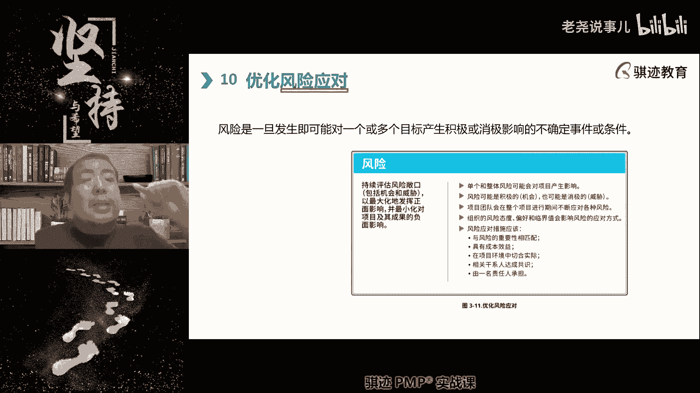

后者我们称之为非事件风险啊，好我们在不确定性绩效学当中会讲啊。

那么风险啊。

非风非事件风险可以举个例子啊，我给大家举个例子。

就是呃呃我举过吧。

可能也讲过，就是你们知道吧，人是一定会得白内障的，你们知道这些事情吧。

跟你们说过，好像没说过，人是一定会得白内障。

人在70岁以后会逐渐逐渐眼睛会白内障，年龄岁数越大。

肯定会越有白内障，但是每个人程度不同，所以人得白内障的概率是100%。

到一定年龄啊，你啊很早就挂掉。

那就没有几个了啊，你年龄只要足够大时，一定会有白内障。

但是程度不一样，所以得白内障是一种风险。

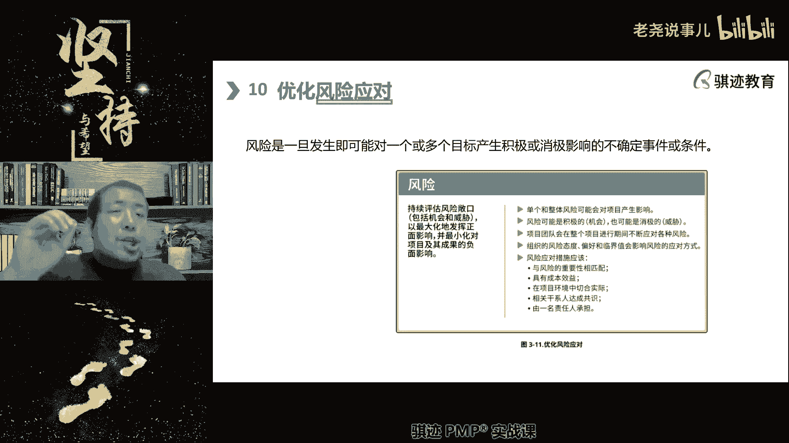

他一定会发生，但是程度不知道啊，但是白内障不会通过某一个事件。

突然之间啊，今天还看得见，明天就彻底看不见眼前一片白。

所以叫白内障，知道吧，呃我来唱句。

眼前的黑不是黑啊。

那那个对吧，你要知道啊，你是我的眼对吧，就这个意思啊。

那么这个是一个渐渐渐渐的过程，所以得白内障是一个非事件风险。

它一定会发生。

但是程度未知啊，所以我们国家有一个福利，老年人。

70岁以上的白内障到一定程度，因为白内障不是我们得了，马上就换，就是进人工晶体的。

它是严重到一定程度就可以去换人工晶体，在中国是免费给老年人更换的啊。

这个政策非常好，是感谢国家的好政策和福利，这个是你们知道吧。

所以等你们70岁以上之后呢，大家就可以如果白内障比较厉害。

就可以去换掉啊，这个不是因为你身体不好怎么样，这是每个人的技能不一样啊。

先等你们活到70啊，再享受福利啊。

好OK明白了啊，所以风险就是一种有一定概率发生的啊。

或者发生是一定，但是影响程度未知的，这样一种不确定事件或者条件和风险啊。

那么风应对风险是每一个项目经理的职责。

也是体现项目经理能力的啊。

优秀经理，项目经理和普通项目经理的区别在哪里。

我一直说你优秀的项目经理能够从容应对啊。

所以诸葛亮是一个优秀的项目经理。

他面对各种风险都能从容应对。

诸葛亮这一辈子最不从容的是哪一次风险，马谡失街亭。

然后空城计等对吧，诸葛亮那个最一辈子最奉献什么时刻啊。

当然这个是跟演义有关，并不是真正的啊，就是那个在城楼上弹琴。

崩断了一根线，诸葛亮当时面不改色，心不慌。

把司马懿下子溜掉了，哈哈倍儿对吧啊。

这就是一种风险啊，那么优秀的项目经理处变不惊，事先有各种各样安排。

诸葛亮在演义当中唱功城计的前提是什么，他知道司马懿是个老乌龟。

跟他一样不敢弄钱，所以他故意卖弄。

因为他没有其他选择了，他什么也没有其他选择，他故意要在城楼把城门打开，在城楼上弹琴来忽悠司马懿对吧。

所以这就是一个什么。

这就是一个风险应对，这这就是优秀项目经理，而一般的普通项目经理呢是没有做好完全应对。

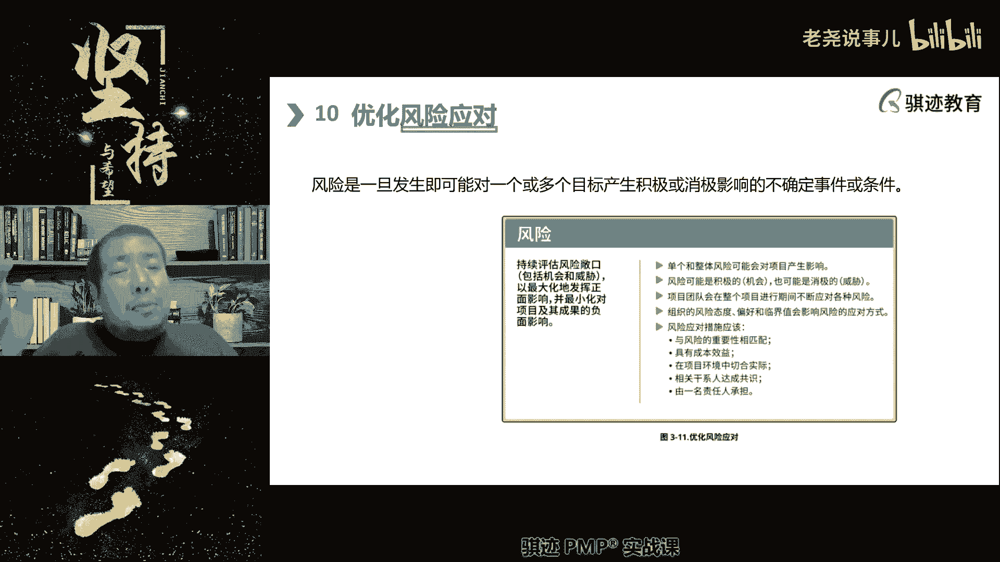

或者无法识别所有可能的风险。

以及他们应对方法，然后呢到处救火，这是普通项目经理，所以当你们一开始开始从事。

如果没有做项目经理，开始刚刚开始从事项目经理的时候。

你们一定会在项目中遇，经过这样的时期就是什么啊，这里各种各样出状况。

然后到处去救火，这是正常的，因为你经验还不够丰富，阅历还不够丰富。

手段还不够丰富啊，所以一开始接触项目啊。

做的结结巴巴是个到处救火，被人到处喷，这个是很正常的事情。

请不要灰心丧气，度过那个阶段，那你就可以从容应对啊，啊像查老师一样从容一点。

甚至像诸葛亮一样啊，还在承诺上弹琴啊。

这个时候你就上境界，知道吧啊，好当然有同学问风险也会有积极影响吗。

有当然风险也会有积极影响。

它会有积极影响，也会有消极影响，它会有积极加消极影响。

嘿嘿嘿嘿，诶，你们想到了吧啊。

你们想到了没有。

哎因为风险是一种不确定性的东西，它会有正面。

负面也会有，也会零影响，零影响就不是了啊，如果没有产生影响。

它就不是风险，一定会产生影响。

概率发生或者发生程度不确定啊。

这个叫做风险，他一定会成影响，要么正面，要么负面，还有可能既有正面也有负。

你们想听一个毁三观的例子吧。

啊我给这么一个毁三观的例子啊。

在欧洲的是文艺复兴时期还是中世纪，还是文艺复兴时期。

一个有社会地位的人一定得得梅毒。

你知道吧，唉梅毒会对人健康产生重大不利。

甚至会要人命，但是如果你是一个社会上流人士。

你没有得梅毒啊，对不起，你不够什么格，对吧哈哈诶。

你们真知道啊，真的是这样的啊，这个社会三观尽碎啊，这个这个是欧洲。

真的是欧洲流行过这样一种观点，知道吧，唉所以很多欧洲的上流。

当年开始对梅毒认知不足的时候，欧洲上流社会很多人以得梅毒为主。

真的啊，这不是我瞎说的，你们不行，去查史料诶。

所以得了梅毒既会有消极影响，也会有积极影响。

但是能不能得不知道，因为你这个古哥哥以前的人。

古人又又没有什么科学技术掌握什么的，你只有出现症状才知道自己得了没。

那时候医生岂不坏，但你们知道当年怎么治梅毒啊。

嘿嘿嘿嘿嘿，这个就更固执啊，我们讲完就结束啊。

估计大爷当年那个医生治梅毒用的是水银。

水银成为支配的酸了，但是你们知道汞这样的东西你们懂的是吧。

所以欧洲人少不是没道理的啊。

对那个时候医生治这个东西，治病是转班了啊。

OK我不多说了吧，我们举个例子啊，是会有记啊。

既有有利的，也有也有不利的，也有可能同时有利和不利的啊。

那么项目风险当中呢。

我们会有整体风险影响，也有个别风险影响啊，风险既可能是好的。

也可能坏的，也可能又好又坏的对吧。

啊那么我们再讲一个，继续讲个毁三观好吧。

就比如说你老婆意外怀孕，但是你呢不孕不育。

但是他你是你们家三代单传的哈哈。

这算正面风险还是负面风险发生了。

不知道，好项目会在项注意。

项目团队会在整个项目周期内，不断面临各种风险。

各种不确定事件的发生和影响，项目风险态度呢会有积极的消极的这种态度啊。

这个在我们在不确定性及交易当中的具体讲，因为这个里面概念相当多啊。

风险应对啊，注意风险的管理是PMBOK第六版到第七版的。

我们我们打游戏叫版本之子。

风险被考的非常的多啊，版本之子拼搏和第六版的新考。

刚开始到第七版，它的版本之子是什么呢。

呃呃大增了一刀的是什么，是干系人沟通风险和资源啊。

被削的呢是质量啊啊成本啊。

这些方面还有进度啊。

啊所以风险应对呢应该经济有效，语音的关系相匹配啊，这些基本上就是PMBOK第六版的风险定义的。

相关的内容，那只是我们的第七版。

直接在这里先概述一下概念啊，大家只要知道，那我这里呢也不准备把这个东西讲的很深。

因为我们准备在不确定机教育当中，给大家好好讲讲什么是风险啊。

那么风险的我们的具体对于风险的这个面。

如何去进行风险的管理，总体原则就是我们古人已经告诉我。

特别喜欢古人的话啊，叫做趋利避害。

哪里有好处，往哪里走，哪里有灾祸。

我不去哪里啊，怎么做有好处，做什么怎么做就没好处，我们不做，什么叫趋利避害。

这是个最基本原则，如果害避不开，那么怎么来两害相权取其轻啊。

这就直接分享给大家了，那这个能明白吧啊我相信这个大家都能明白啊。

PMP考试对于语文还是有一点要求。

哎嘿嘿，你们要等到复习的时候就知道了啊，咬文嚼字还是有点讨厌的啊。

比以前好多了啊，老师当年考试这个咬文嚼字，这是头皮的脑婆，语文不好的慎考。

现在好多了啊，好项目项目团队应该监督整体项目风险。

整体项目风险是不确定性，对整体的影响啊，那么监督风险是项目经理的团队。

不可推卸的责任和上报的责任，注意整体风险不能够上报。

因为这是你的管理职责，管理项目风险就是你管理职责。

风险，管理的好坏就是项目经理能力和绩效的体现。

明白了吧啊，所以一个项目经理怎么才能让你的领导最安心。

就是你的领导问你100次有没有状况，你说everything ok。

这就是最好的，因为什么没有风险，Everything ok，有最好。

是不可推卸的责任啊，和上报的责任应该切实有效的恰当的管理。

去减少，对于可以减少的个体和整体风险的管理啊。

增加增加机会，减少威胁。

趋利避害好，那么风险应该始终如一的确定潜在的应对措施。

并谨记啊，一经济有效，二重要度相匹配。

三我们在环境中要切实可行，第四达成一致啊。

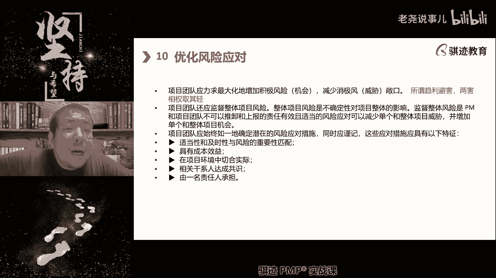

有责任人等等这些啊，这些都是也是啊风险的那个叫什么呀。

那那那那那原来的知识领域里，直接从第六版拷拷过来的啊，字都不带改了啊。

除了更新改成相相关方啊，相关方改更新啊。

好那么这就是所谓的风险，我们的后面会细细讲的，好吧啊。

大家知道有这样一个概念，风险是什么东西就行啊，这个是你们管理当中要去管和要去做的事情。

好第11个方面，拥抱适应性和韧性。

那么这里就解释什么叫适应性，指的是应对不断变化的情况的能力。

韧性指的是两个具有互补性啊。

是指的是什么。

我们呃呃是指什么，两个副本家吸收冲击能力。

和从挫折中失败和快速恢复能力组成的。

这个特性叫做韧性啊，这个排版稍微有点乱啊。

就是元素当中就这么写的啊，那么适应性韧性在任何项目当中展开。

应具备有的时，所以适应性和韧性是人应该具备的品质。

也是产品应该具备的品质，也是项目管理应该具备的品质。

三者都应具备是极佳啊。

而且如果你项目中的人具备适应性和韧性。

你所创造出来的产品也往往具有适应性和韧性。

这句话叫什么定律，知道吧，给你们科普一下啊，这是很多理论里面拷贝过来的啊。

因为我教的课比较多，哈哈这个叫康威定律啊。

康威定律啊，有很多种叫都叫康威定理，其中有一种版本就是什么。

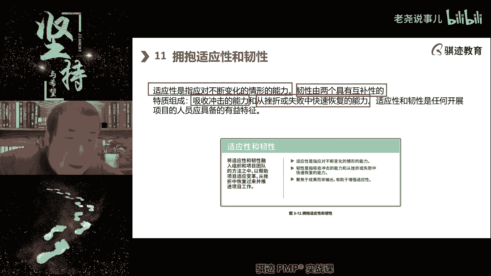

什么样的组织和什么样的人做出来的，什么样的产品就是这个样子啊。

吊儿郎当的人做出来的东西，就是吊儿郎当的产品啊，臃肿不堪的。

效率低下的组织，做出来产品就是臃肿不堪和效率低下的哎，充满韧性。

坚韧不拔，充满适应性的人，做出来的产品也往往是充满适应性。

适应各种环境，并且能够迅速恢复。

诶，嘿你们想一想，我们就说这个很多时候真的很有道理啊。

所以适应性更多指的什么环境变化的能力。

就是说啊无论就是什么叫适应性，我们举个例子啊，无论是客户需要动物园里的星星。

还是需要天上的星星，你都都能帮客户搞定。

这叫适应能力极强啊。

那么什么叫做任性呢，就是客户让你改了20个版本。

然后跟你说还是第一版最有效，然后你能迅速地改。

从未改回成第一版，这个叫做任性。

很多同学听到这里开始骂娘了对吧，然后深有感触，是不是啊。

有感触的同学公平里啊哈哈啊，公屏里打扣个一啊，扣个一对吧。

这就叫做韧性啊。

好那么这是人的任性，我们讲项目的任性和产品类产品的任性。

前面讲过了啊，人和项目任性都是这样啊，那么不出意外的项目才是让人意外的。

这句话我很喜欢啊，不出意外的话要出意外了，对吧，哈哈我们我们我们很多的地方经常有这句话。

不出意外的这个季节就该出意外了对吧，不出意外的项目才是让人意外的。

这句话非常好，项目进行总是伴随各种意外，所以我们讲项目经理为什么能够处变不惊啊。

就是他各种手段方法都准备好了。

适应性很强，而且出了问题他也能解决，就是韧性很好啊。

只有在这种情况下才能出院，不定项目，因为项目总是能意外啊。

你们记住不出意外的项目才让人意外的啊，这句话我太认同了啊。

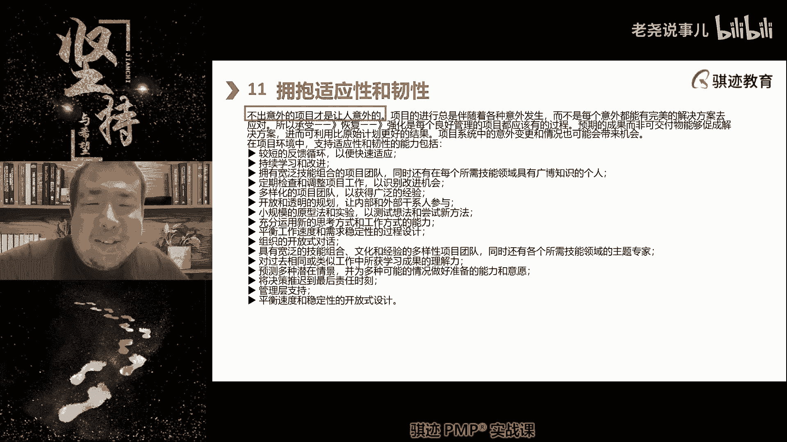

所以不是每个意外都能用，解完美的解决方案去解决的，所以承受恢复和强化是每个良好项目管理。

应该有的过程啊。

这句话不知道你们能不能体会其实什么。

这就跟人生一样，又来我又来讲人生哲理了啊，是不是我们每个人在初入职场。

或者刚刚接触社会的时候。

都是一朵白莲花对吧，都是很单纯的。

但是在社会当中呢，我们会承受各种各样的挫折，各种各样的啊失败。

但是在挫折失败当中，我们学会了如何去承受。

如何去坚强，那还有，但是只有少一点的人学会了。

如何从这种挫折当中去恢复，而只有更少的人学会了什么。

如何利用挫折失败去强化自己。

让自己变得更强大，来应付未来更大的挫折和失败。

人生如果从一个消极的面描述，就是从一个失败走向更大的失败。

然后最终走向别人都不可能有，经历过的失败而走向成功。

这是个消极描述，明白吧啊讲的非常富有哲理。

像鸡汤文一样啊，但是这个就是真的啊啊。

如果觉得我的鸡汤文说的还不错了，请听懂掌声。

听懂掌声，那么预期的成果并非可交付成果。

能够促成的解决方案，进而可以利用比原始更好的计划结果。

系统中意外的变形情况也可能带来机会啊，那么这句话什么意思呢。

就是顺其自啊，不是说顺其自然啊啊随机应变。

适应变化，能将不利变为有利，能将意外变意外的情况变为意外的收获。

这种才是适应啊，所以项目中我们如果要适应。

会运用什么东西啊，短反馈啊，这个在敏捷当中就特别提倡短反馈。

就是说啊沟通要直接啊，有一方沟通之后。

另一方给的反馈一定要快，这个叫短反馈，避免中间转接环境啊。

第二个持续学习要点，不断的提高，不断的改进。

持续学习改进啊，这个在很多的理论当中都一直强调啊，啊偏僻当中呢。

这个当年在PMBOK第五版的时候呢，将持续改进计划放在质量还是过于狭隘。

因为持续改进的概念来自于经济质量呃。

跟质量管理密切相关的经济领域，但是呢过于狭隘的第六版本被砍掉了。

后来觉得就放在了什么，就PDC其实还是隶属于质量。

那么这一版当中呢，我们其实更多的会看到什么啊。

因为更多的引入敏捷的概念，所以我们把持续学习改进放在更高的位置。

它不仅仅是归属于质量管理当中啊，好那么拥有宽泛的技能的项目团队。

就是敏捷当中讲跨职能型团队啊，一专一多能或者是多专多能啊。

然后定期检查调整项目啊。

可以识别改进机会多样化的团队啊，那么开放透明的规划，小规模的原型实验等等等等等等等等这些啊。

这些方法，那么大家自己可以多都可以自己看一下。

那么也比较多的我们就不讲了，因为很多东西后面后面呢我们在敏捷啊。

等等东西都会看到，因为拥抱适应性和韧性本身就是敏捷。

很多东西所提倡的，不是说预测性不低的敏捷更能够体现这一块啊。

所以敏捷是属于适应性项目中营救行情啊。

好那么这是我们讲的啊，拥抱韧性和变化，那么讲到这里。

是不是你们也学体会，是不是人生也是一样，要拥抱适应性和变化。

好12，为了实现预览状态驱动变革而注意。

这里的驱动变革指的是我们项目层面内的变革。

但是项目的成功和推动也能带来组织变革。

所以我在这里当中呢有时候会扩展一点点，我认为为了实现未来状态驱动变革。

这种变革，即使项目内的变革，改变也是组织内的变革改变啊。

所谓变革就是我们打破原有的。

我觉得啊是打破原有的方法啊，来实现一种新途径。

来达到新的利益和目的，称之为变革啊。

但是呢这个在偏僻当中呢体现的考试当中。

主要体现非常少，所以这里大家稍微理解一些考试当中这个变革，可能变革这一块考的会非常的少，非常的少，那么变革会使受影响做好准备。

以采取和维持新的和不同的方法过程。

从而带来什么啊，预期呃呃预期所带来预期周呃。

预期的未来的状态所需要的过程，所以讲的非常的非常学术。

就说说穿了就是美特斯邦威不走寻常路的变革。

所以变革一定是会有什么反对啊。

那么来了，我们之前讲过领导力，领导力类型当中有一种类型是什么变革性啊。

变个性就是什么思辨啊。

他在遇到问题或者遇到项目阻力的时候。

他考虑使用创新的方法和手段去解决问题啊。

这也是一种很好，但是要做到变革并不容易，因为人总是大部分的人。

美投资方会赞助了一人，总是因循。

总体来说总是因循守旧的啊，而且年纪越大越因循守旧啊。

比如像汤老师，这其实我觉得我还行啊，因为我这个这个这个这个讲师的这个身份。

其实我还是能比较能适应变革，因为讲师这个我们稍微客观讲。

讲师这个领域有个特点是什么，就是理论会经常更新。

你要不断的学习，所以你们看到的时候跟你们巴拉巴拉巴拉。

上课吹吹牛啊，侃侃而谈，背后是什么，奖是每个人要付出的隐性成本。

都是要不断的学习，终身学习来提高，有时候做得好的话。

甚至要自己去创造理论啊，接受学术界的啊批驳质疑。

然后如果能站住脚，能够比如说开宗立派啊这种的啊，这就这个是我现在这个这个。

这个这个这个层次啊，想都不敢想啊。

就这意思，但是我也觉得年纪越大越不容易接受变革。

所以变更多的驱动变革的往往是什么思想，能突破自己旧有的方式的这种人。

这种人是人才，但是难得。

而且易者，因为变革型领导者或者变革型的管理者。

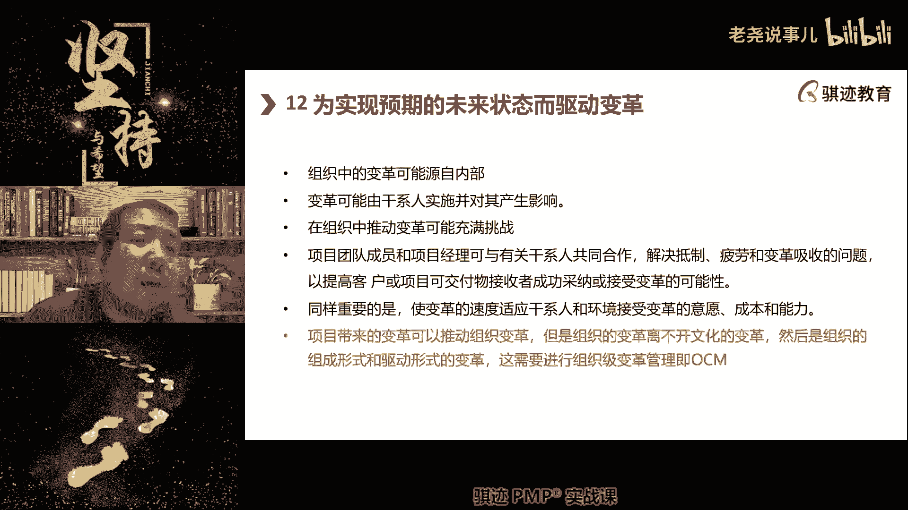

是最容易受到挫折排挤的，因为他触往往会触犯很多人的利益。

既得利益或者冒犯很多人的思维方式。

不容易受到人的接受，这种方这种领导，这种领导方式和驱动方式是最难的。

最难的。

但是你做成功了啊，是最秀的最秀的。

你是全街最靓的仔啊。

好那么组织中的变革可能源自于内部，组织的变革。

也可能源自外部推动啊，但是组织会主动或者被动的去去产生。

变革的需求，那么变革要通过什么项目的推动啊。

这个请记住组织的如果要进行变革，一定要通过项目的推动。

变革可能是有肝先实施的。

对不对其产生影响，组织中推动变革可能充满了挑战啊。

最近这两天大家新闻看了吧，阿里要进行组织架构调整变革。

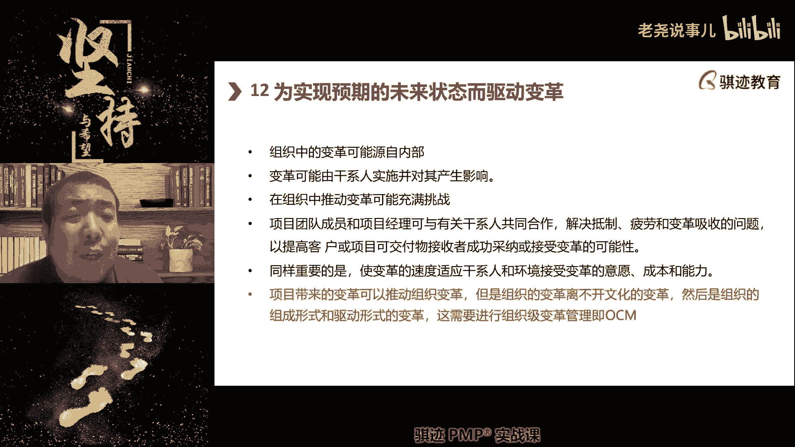

然后要干什么啊，砍人而且砍什么。

砍最核心的团队哎，砍阿里云和砍那个叫天淘宝。

天猫啊，陶天集团啊，哎变革，人家现在从核心开始看起。

这也是一种变革，你能接受吗，阿里最赚钱的两个两大事业部。

砍人集团开始砍人，这是一种变革。

人家一般以前企业裁员多少，都是从不赚钱的感觉起，那从赚钱的感觉看起，这也算变更啊。

但是代价痛苦。

有被裁的人承受好，团队成员和项目之间可能与肝现金共同过的。

有可能会关系，共同合作，解决抵制疲劳和变革吸收的问题。

