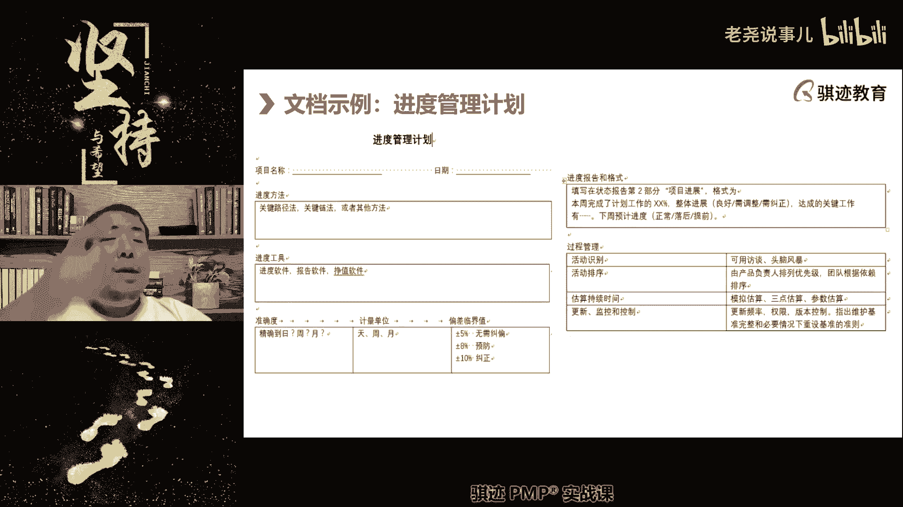

# （收费视频完整版分享）PMBOK第七版课程PMP考试报名认证培训精讲-零基础项目管理第七版教程最新版直播课回放视频免费课程资源-骐迹教育谢阳主讲 - P22：8-1项目进度管理上 - 老尧说事儿 - BV1ek4y1s71N

啊准时开始，那么首先我们要做一些练习题啊，做一些练习题，第一道，项目经理发现计划编制期间，有部分范围没有得到定义，那么他应该怎么做，A继续编制项目管理，就因为工作范围未准备好。

必尽最大可能是工作范围得到定义，C等在工作方面得到定义之后，发布一个变更提向管理层抱怨啊，好应该选哪个，啊稍等A，C d，有同学问啥是计划编制，就是制定计划，做规划，制定计划就是计划编制好。

那么第一题的答案应该是什么，第一题的答案应该是B啊，第一题答案应该是B，为什么第一题答案是B啊，A继续编制项目计划，因为工作范围尚尚未准备好，那么这个呢可以因为我们还在编制项目的计划，所以可以继续编制。

可以，啊那么再看比尽最大可能是工作范围得到定义，那么这个表达也是可以的，但是A和B相比B更加积极啊，这是PNP考试当中有一个呃，有时候呢会有若干个，一不止一个答案是什么是正确的。

那么这个时候呢我们会选择一个最积极的，最有效的答案啊，那么C工作范围得到定义后，发布个变更，那么我们还在进行制定计划当中，所以不需要变更，什么时候需要变更案，我们制定计划制定完了，然后得到批准了。

再去改变它，那么这个时候是需要变更对吧，你说如果我们还在编制当中，我们要改进或者是得到定义之后，直接把它更新上去，就可以不用走边公路啊，D就更不靠谱了对吧，所以第一题答案是B啊，第二题。

阿米特负责软件项目，项目初期客户认同项目方位说明书内容，可是交付了之后呢，验收了之后呢，客户要求增加一些功能，阿密特与客户一起寻找项目规划是有哪些功能，比考虑以后做的更好。

对该项目目前的现状哪个是最佳描述，A镀金比范围蔓延，C他向他向方案分析及适度差异，好回答题目啊，我去稍微开一下空调吧，有点闷热闷热，稍微等会你们做你们的题目啊，好我来了，应该选哪个啊，哎这个就考了。

这个就考到我之前给你们讲的，什么是范围蔓延，什么是镀金，对不对，所以第二道题大部分同学是做的是对的啊，是选B啊，第二道题目选B方位蔓延，那么为什么是因为我们没有主动给客户做，但是客户呢在验收了之后。

反而要求我们更增加这些功能，所以这是一种范围蔓延的表现，我们客户要求我们做原来约定的那些东西，就是范围卖啊，有同学说艾米特与客户一起寻找项目规划，是因为功能并考虑一下，做这个是一种分析。

但是我们没有给客户去做东西，所以这个不是镀金啊，做工作之外的事情不一定是镀金啊，那你们概念不要搞混啊，尾号5431同学啊，这不要搞混，我们讲范围，方圆镀金指的是什么，我们做范围约定之外的东西。

叫做范围蔓延和镀金，那么区别在于，镀金是我们主动要求做的范围，半圆是客户强迫我们做的，那么C和D根本没有这种说法啊，我们上课没有说过的，一般都不存在，好第三题，把范围控制的成果是什么。

我们控制范围会得到哪些成果啊，这个题目就比较的以前老的传统的节目，有时候会按照这么说啊，相当理论化啊，我们稍微想想，其实这个题目是非常简单的，就是纯粹是理论对吧，好，第三题选什么，范围控制的成果。

我们上没上上课讲，没讲过控制范围是干什么的，有没有讲过，控制范围，是将当前项目的范围现状和我们的规划范围，的规划设定和基准相比较，看当前的范围是做大了还是做小了，如果做得大了或者是小了，我们要进行干预。

进行干预就要干什么啊，进行变更请求，所以第三道题目的答案是D啊，你们为什么这么多同学答案都会选择A呢，对不对啊，控制范围的结果就是什么，对范围进行监控，如果他明显有明显的超出范围或者少于范围。

我们要进行变更请求进行纠正，然后提出纠正的变更请求，然后通过了，哎所以C是错在哪里啊，批准的纠正措施，我们提出的是纠正请求，然后通过了变更控制流程，才能成为批准的纠正措施，但是已经是输出到什么去。

执行了指导管理项目工作，题目表述太西化了啊，这位同学说的什么啊，我说七呃，694同学说的很好，你们的考试就是PMI，从英文题库里面拿过来翻译的，所以它本身就是西华，确认范围的成果是什么。

验收的可交付成果是验收后的可交付成果啊，明白了吧啊对，所以尾号3171的同学表示对啊好，那么第四题，你最近被拍了个大项目，这个项目是开发下一代计算机辅助制造cam程序，你将该项目分为需求调研。

设计解码编码测试环境五个过程，并进一步做细分，这种WBS的分解的最小单元称之为什么啊，这个上课认真听的就不用说对吧，这个上课认真听呢，大家都就都知道了对吧，选什么都知道了，这个题目当然应该选A。

为什么WBS的最小分解单元是工作包，最底层的那是工作包对吧，前面这个题目啰嗦了一长串，和最后的问题其实没啥关系啊，这也是PMP考试当中的一种特色啊，他有时候会给你描述个背景。

但是他问问题的那个问题和背景，不一定必然产生联系，所以你要时刻紧扣概念，我们这个概念是什么，WB分析的最小单元是什么，工作包，就很简单对吧，所以绝大部分同学都选择对的啊，第四题选A没有问题，第五题。

项目接近收尾，团队让客户验收，但是客户发量少了一个预期功能，这是以下哪种情况导致的，A客户增加新功能，比团队和客户就范围未达成一致，C缺少变更控制，第一计划没有得到发起人批准，选哪个，对不对。

尾号6623的同学啊，你如果想要说答案选答案，你可以在这个里面选一下啊，在我们的选项里选一下啊，答案大家答案不会打出出，除非我跟你说，你们直接打在公屏上打出来，因为你的答案可能会影响别人思考啊。

好那么当然觉得当然你写的选的是对的啊，绝大部分同学对第五的确是为什么，我们上课讲过客户发现少了功能，那么很有可能是什么，我们认为应该开发99个功能就够了，但是客户认为应该给他开发100个功能。

我们和客户之前就范围和需求没有对齐啊，这里有个时髦词叫对齐，供需双方要就需求，我们要进行对齐，你有一个啥，我有个啥，我们是啊，衔接得上吻合，对得上，大家在同一个频道，同一个认知达成一致的啊。

这样才好干活，所以大家明白吗，在项目管理当中，不要急于什么，不要急于开工干活，开工干活前一定要把需求给对齐，啊学学啊，有的人说这个东西有点无聊，学的方法论就行，按照他的术语来说，并不是啊。

这个东西其实是很多东西，我刚才说的这个其实就是很多实践工作当中，你不要觉得看不起理论，很多实践当中你就是没有做好这个事情哦，我们觉得这个事情不应该做的，客户呢觉得这个事应该做，但是你和客户对核对过吗。

对齐过吧，你跟你跟合作客户确认过这个事情了没有啊，但是稀里糊涂干活干完活，等到叶收回去呀，少干了一个东西，完蛋了，干活干完了饭钱少干什么东西的时候，就要再去弥补这个成本和损失和影响，可能会很大对吧。

这就是来自于实践，看上去很简单，但是来自于实践啊，我们pp考试，现在的考题的特点就是越来越接近时间，很多题目就是来自于实践的总结啊，所以不要觉得呃呃那考试就是考试的那个。

其实很多东西是学习考题里的一道题目，很可能就是来自于时间的某一个结果，好多废话啊啊继续做啊，那么第六题，在项目执行过程当中，高层要求增加范围，团队不知道怎么做，说明项目计划中缺少了什么内容啊。

这个也是比较简单的吧，好第六题，第六题应该我相信大部分同学都选择了啊，啊注意来了，有同学选A，有同学选C对吧，没有其他选项对吧，那么这个思路我们之前讲过了，我们要增加范围，先看范围。

管理计划当中是如何管理范围的改变的，然后再去走变更流程，走变更流程的时候，在遵循变更控制的管理计划，或者叫变更管理计划，其实我们没有叫变更控制计划，其实只有变更管理计划，有的啊，那么就算这是边框内容。

也应该先看范围管理计划，再看变更管理计划好，所以是先A后C，所以这道题目应该选择A啊，这道题选A，明白这个思路啊啊第七题，一个项目经理离开了公司，你的经理要求你完成正在进行项目。

并交给你一份项目管理规程和范围为哪，项目经理作为项目经理，你首要是制定一下哪一项啊，这个题目我等会稍微讲一讲一个思路啊，这一类题题目考的不多，但是很多同学可能如果没有实践经验的话，可能不容易答得上来。

第几，好第七题选什么啊，很多同学选了A和C，答案是A，第七题是A，为什么啊，那么请注意先看这道题的思路，我们先讲这道题的思路啊，我们讲你的经理给你一条文档，接下来你接下来做什么东西啊。

你看的这些这些内容，其实如果你对这个有一定认知学，知道没有A就没有办法做出B，没有B就没有办法做出C，在做出B和C的过程当中需要有D，所以BCD的前提都是A啊，都是A，所以你首先要做出A才能。

接下去顺序做出BCD啊，是这样一个关系，那么这道题的其实的最完整的思路是什么，他题目没有考到这一点啊，项目经理如果半途接手一个项目要注意什么啊，我们在这里讲题目的时候，顺便就讲，请记住。

如果半途接手一个项目，先查看这个项目的，无论是怎么样，先查看这个项目的项目章程，如果是敏捷项目，先查看这个项目的敏捷愿景，然后核实本项目当前的状态，是否符合项目章程和美军，先查看高层次设定。

如果高层次设定有误或者情况已经发生了变化，那么先对章程和愿景进行修订，反映最新的项目现状，然后再仅对项目管理计划，我们的线路图啊，发布发布计划等等等等等等这些吧，这些啊上来总是先看章程。

因为章程上有什么项目经理的名字，那么你至少会更新什么，在章程上，原来项目经理是张三，是李四，那么李四接替张三，那么你要把你的李四名字写到项目上去，明白了吧，实际上思路，但这道题没有考到啊。

这道题如果考的难一点或者刁钻一点，那么应该是什么，他再加一个审查项目章程啊，就应该选十台这样的，但他没有这么选，那么我们就默认啊，在题目中没有提到这一点，我们就默认你已经审查过项目章程。

接下去呢我们就是什么，根据项目范围就要做出WBS工作分解结合，对吧，明白了吗啊明白了在学会了吗，学会了在公屏里打一个学费了啊，好第八题，你是某建筑项目的项目经理，在规划项目的时候。

你将所有工作分解到分工作包，制造WBS，对于每个工作忘记写所有的细节，包括原始估算啊，记账的账目啊，你会将这些信息放在哪里啊，这个就是个很简单的题目，好那么第八题你们直接告诉我答案，你们觉得选什么。

啊对很简单对吧，对于WBS的细节，我们会记录在什么WBS字典里，所以这跟我们上课讲过，所以第八题我们就不那个啊，直接打一下对吧，这就是WVS的定义对吧，非常简单，好那么第九题第九题。

项目经理寿命为一家大型跨国公司争夺信息型，该系统供全部员工使用，项目经理应该使用哪种方法快速收集需求啊，好选一下，看哪个，好非常好啊，这道题不大，绝大部分同学都选对了啊，第九题选D。

大型跨国企业全部员工使用，又要快速收集，符合这个特征的就是问卷调查，所以工具我们讲，每种工具都适合它的场景和的特征，访谈什么一对一用于挖掘深层次的信息，标杆对照呢，用于什么需求数据初期啊。

一跟我们的标杆企业标杆案例进行对照，书籍初级高层次的信息，头脑风暴用于什么，创意性的发散性的信息，好最后一道题目，在与客户正式验收时，客户提出某项记录在需求文件当中的啊。

需求文件当中的功能没有在交付中实现，该需求的前期达成共识，客户与项目经理，与客户加以下哪个文件共同核实，选哪个，好注意啊，我们这里因为是范进程专题，是这个是呃复用以前第六版的。

所以它的题目呢是复用相对早一点的题目啊，那些题目呢相对简单一点啊，我给大家在之前的纪效玉啊，项目项目管理原则啊，啊项目的那个那个那个价值啊，等呃，呃嗯嗯项目价值交付系统啊，等等当中出的题目呢是原创的。

然后是根据接近考题的难度出的啊，所以大家做现在的题目，会不会觉得什么简单一点啊，我还以为我复试复习到位了，现在的题目比较简单，这些题目比较简单，但是考试不会有这么简单啊，或者是很少就很少一部分。

大概10%的题目是像这样这么简单啊，好我们回来第十题，大部分同学选D，但是还有很多同学选了ABC啊，答案是D，那么第十题为什么是D啊，我们讲过所有的需求都会在记录在需求文件上，但是挑入范围肯定要做的呢。

会记录在需求跟踪矩阵上来跟踪它的实现过程，那么我们应该实现了，但是在可交付承包当中却没有体现，这是为什么要去查时间过程，就是查需求跟踪矩阵，明白了没有啊，所以这道题目应该选D，大部分同学选对了。

但是不知道同学选ABC啊，我们上课特地讲过啊，好那么接下来我们就开始讲进度管理啊。

嗯有同学说C怎么不选啊，诶等会啊，诶你问题问的稍微慢了一点啊，我们看一下，看一下来，来C范围基准，注意范围基准不是我们向客户承诺的东西，它只是承诺东西之一啊之一，但是不是承诺的东西。

而且我们讲范围是一种客观描述，就是说这个事情我怎么描述啊，这个同学呃，尾号不是笼统的啊，尾号317同学这个问题问的很好啊，有问题才会我我才能跟你们讲的，知道你们不理解范围是一种客观描述。

需求是一种主观表达对吧，所以很有可能这两个东西，需求和范围并不是一一对应，比如说客户需求，我们还是举这个例子，客户需求时，我需要一些，我需要一份饭，我我需要一份主食来填饱肚子对吧。

但是你的范围说明书当中写的什么，给客户提供饺子对啊，提供饺子来满足客户需求，但实际可能需要客户心里想要的是什么啊，任何能填饱肚子的东西就行，所以能吃饱肚子的东西和饺子，相互之间并没有绝对的对应关系啊。

可能有些人觉得啊这一点饺子可能填不满肚子，明白需求可能会被分解为多个范围去体现啊，但是他不会去实现这些东西啊，不会直接往往不会直接去实现这个东西啊，也就是说我可以提供给你饺子。

但是我并不能保证这碗饺子你一定能吃得饱，你的需求是吃饱，你的需求并不是饺子，而是吃饱，明白吧，啊所以有些同学答题没答对就是什么啊，我们上课没有认真听讲概念，没有学仔细，继续啊好那么接下来我们开始。

今天开始讲进度管理，那么讲到进度管理，首先有个概念，进度管理是项目经理管理项目的一项基本功，因为什么在项目管理当中被相关方，该行该行人问到最多的一个问题是什么，项目当前进度如何，项目准备在什么时候完工。

项目在什么时候能做到什么样的东西，这些问题是不是在一个项目管理中，最频繁被人问到了，因为问成本可能会有些尴尬，而且很敏感，而且成本很多时候并没有办法直接能算出，我可能说你问我说项目现在成本是超支了。

还是节约了，那我得算一算，那么说我们说项目范围范围的问的话，就说问项目的范围有多大有多小，一般别人并不会直接这么去问啊，他最多问你啊，这个东西是在范围内吧，这个东西在范围内，这是有特定需求才会问。

那么项目中项目经理被别人问到最关心，问到最多的一个问题是什么，项目当前进度如何，因为它可以用时间和偏差来表示，比如说项目已经进行了50天啊，我们落后计划进度三天，啊所以进度是向管理。

进度是项目经理一个基本功，但是怎么管理好进度却没有那么简单啊，没有那么简单，那么进度管理当中呢，我们会有什么预测型的进度管理，和敏捷型的进度管理，敏捷性当中又分为什么固定周期，迭代周期的进度管理和。

暗虚进度的看板的非固定周期进度管理啊，那么后两者呢我们会在敏捷专题当中讲，但是有一点概念，敏捷并不是没有进度，敏捷也不是没有进度承诺都是有的，只是它的体现方式不一样啊。

敏捷我们会有一个总体的进度也是有的啊，我们计划通过啊啊我们敏捷课专题课程比较呃，敏捷愿景是我们想要达到一个目标对吧，我们计划通过怎么样的产品线路图，去实现这个目标，那么产品线路图。

它就是一个时间轴的一个表现啊，时间轴的一个表现，那么它实践周之下就会有什么我们的发布计划，什么时候交出什么东西，它其实也相当于进度的一种高层次的安排啊，但是敏捷没有具体的进度安排，今天做什么。

明天做什么，后面就什么没有，他只有近期的详细规划，后面的要取决于市场全球环境啊，而我们的预测型呢则是在项目一开始，就会尽可能规划所有的进度安排，我们会在尽可能规划，我们会在每一天做什么事情。

哪一天到哪一天为止会做完成什么事情啊，这个是我们的啊敏捷啊，预测性当中的一个进度安排的一种思想，所以我们会尽可能详细，尽可能的啊准确再去安排进度啊，那么这是敏捷的进度管理的思思啊。

思想方法和预测性思想法不同，那么两者其实并无优劣，取决于适应环境，注意啊，虽然外面现在什么啊，敏捷管理怎么喊得很响，但是不是所有的场景都适用于敏捷的，有些场景当中反而什么。

因为敏捷还会有一些依赖条件和一些制约因素，它并不能所有东西都要连接的啊，所以在很多的长项目场景当中，我们还是得用预测，两者各有优劣，取决于场景啊，好继续往下讲，那么进度管理当中，那么我们会有6。1到6。

5，我们会有五个规划子过程，和一个监控子过程过程啊，那么这个五个过程又构成一个顺序逻辑，那么这个数据逻辑从总体上思路上，其实PMI在第六版其实已经告诉我们了，进度应该怎么规划，在回答这个问题之前。

我先问大家这个问题啊，我我问你们呃，二呃，一元一次方程能不能有唯一解，一元一次方程有没有能不能理解，那么二元一次方程有没有唯一解，很多同学现在回答问题都很很谨慎，不一定啊，几乎是不会无理解。

因为它有无穷多个解，因为二元一次方程XY多少个X，加多少个Y等于多少，这个方程有无数读多组解可以让它解，对不对，所以要想解二元一次方程，我们必须有二元一次方程组，对不对，这些大家啊对读书这个都读过啊。

就就不用我解释了，对不对，那么怎么在，那么我们在项目进度管理当中，也会有这样一个情况啊，也会这样什么情况，就是我们会遇到一个事情，就是为了在进度管理中会遇到一个事情，怎么排列。

活动顺序和怎么估算活动时时间，这是一个事情的两个变量，因为项目中有一些活动的顺序是必然会什么，有先后的，比如说肯定是先开发再交付，对不对，不可能先交付再开发了，所以开发永远在交付前面对吧。

这个大家认可对吧，但有一些事情呢是可以先做A也可以先做B，但是如果先做A再做B，A和B的持续时间，可能与先做B再做A的持续时间是不一样的，这个不知道大家能不能理解啊，嗯那么来了哈哈哈。

我们要举一个举一个啊充满什么东西的例子啊，假设张三李四，张三李四啊，假设张三李四一起去上厕所大号，但是只有一个厕所单间能上大号，那么要么张三先上，要么李四先上，那么请问张三先上大号和李四先上大号。

这两种情况下，张三李四的上厕所的用时会一样吗，这个问题是不是有一点点哈哈哈，有一点点是一个有味是有味有味道的问题对吧，应该说肯定不一样，应该说肯肯定不一样，为什么如果张三先去上大号。

那么张三整个上厕所的过程时间就会短，而李四就会时间长，如果李四先去张大号呢，这个事情就反过来，所以不同的活动的先后顺序不同，活对于单个活动而言，是张三上大号是个单个活动，李四上大号是个单个活动。

他们各自的单个活动的持续时间，也有可能不一样，对不对啊，这个例子大家能不能理解啊，讲的有点有一点那个什么感觉对吧，但是很很容易理解吧，啊所以活动的先后顺序会影响到什么，整个的单个活动。

它的持续时间为我们的估算带来什么东西啊，带来一定的难度，这是一个第二个事情是什么，活动在时间轴上的不同时间，时间轴上的不同时间去发生，他的活动持续时间也可能不一样啊，那么这个例子就比较容易简单呃。

现在我们已经快进入夏季，或者已经进入夏季了对吧，夏天起床的整个过程时间短，还是冬天起床，这个起床的时间段，假设前后都没有活动，哪一个起床时间更短啊，我们在冬天起床时间更短，还是夏天起床时间更短。

啊很多同学啊，对于绝大部分人来说，毫无疑问是夏天的，为什么夏天穿的衣服少，起床方便，而且夏天不容易赖床，冬天太冷，对不对啊，啊无论是男生女生，夏天总是穿的少，冬天总是穿的多。

所以起床哪怕是不存在赖床这个问题的话，也是应该什么夏天时间段，所以你看到吧，活动在时间轴上，不同的时间点去发生，它的时间，持续时间也可能不一样，所以活动的排列顺序，和活动的相对位置和绝对位置。

会决定活动的持续时间的影响，所以这就产生了一个变量，知道相互之间产生变量，而活动的持续时间又不能单独的去估计，他要考虑这个事情，根据这样的情况，你们现在能理解了吧，我们在安排活动进度的时候。

都是先排列活动顺序，在估算每一个活动的持续时间，然后再把它们汇总起来，形成进度计划，能不能自己在你们自己心里再复述一遍啊，活进度和规划的一个关键就是什么，先要排列活动的先后顺序，先做什么，再做什么。

再做什么，然后再对每一个在时间轴上定了相对位置，或者绝对位置，这些活动对它们的长度进行估算，否则这个会产生二元一次方程的无穷多，解的这种情况，明白了吧，啊所以进度管理啊，在最后再强调一遍。

进度管理是什么，是先排顺序再定时间，先定单个时间再定总时间啊，这样一系的话，是不是进度管理的整个顺序的思路就理清楚了，对吧，当然我们要能够排除活动顺序，一定得什么识别出所有的活动对吧。

这个后面我们会讲啊，好那么接下来就叫，那么首先和规划范围管理一样，我们也会规划进度管理，注意这里就会产生一个词儿啊，产这个词我们先来科普一下啊，叫做进度管理交换，虽然这个现在呢考的少了。

但是万一考到也是有可能啊，还有一个词叫做进度计划，这两个东西是一回事吗，不是一回事，进度管理计划是一个方法论，就和前面讲的范围管理计划，需求管理计划一样，它是一个管理方法论。

用这个管理方法论去一步一步规划进度，最终得到进度计划，而进度计划是什么，我们用某种方式描绘出来，整个项目的一个进度安排的最详细，最全局的进度安排，这个叫做进度计划啊，我们通俗来讲是这个意思，明白吧。

我们是拿着进度管理计划，作为我们的纲领性文件，一步一步规划做，做细下去，最终得到进度计划，进度计划是我们确实可以落地的，一个进度计划啊，一个干活的安排啊，拿这个干部安排，我们接下来就可以安排。

安排很多不同的人去干活了啊，哎对有这种啊，所以进度管理我们制定进度管理计划当中呢，首先要考虑什么啊，注意这里稍微会开点BBD进度管理计划当中，我们首先要考虑什么东西来，要根据我们的。

我们现在篇博客第七版的这个课程，我们在制定进度管理计划当中，首先要考虑什么东西，首先考虑什么东西啊，制定进度管理计划，不是制定进度计划，还没你们想的太远，我们在制定进度管理计划当中。

我们之前学过什么东西啊，我们的开发方法周期对不对，节奏这些东西，开发方法，周期，节奏是不是都影响到我们如何去管理进度啊，哎你们格局小了对吧，我们之前讲过，是不是我们讲开发方法和周期对吧，绩效率对吧。

生命周期绩效率，我们之前讲有没有讲过这些东西啊，那么所以我们在制定进度计划当中哦，在偏颇和第七版的环境下要注意什么，首先要考虑，我们在这个项目的高层次设计当中啊，我们讲前面讲制定章程就开始了。

我们会使用到哪些开发方法，对于不同的开发方法，它的进度管理方法是不是不一样的，如果我们是混合型的开发方法，是不是我们既要管理敏捷的形式的进度，管理形式，又有什么预测的进度管理形式。

那么我们的进度管理计划当中要体现这一，如果我们是要进行定期交付的，那么我们的管理管理计划当中要体现呃，对于定期交付承诺进度当中的，定期交付承诺的管理的相关内容啊。

这些是适应现在这种混合性方法和敏捷居多的，这种管理环境下的啊，我们的进度管理计划的一些体现啊，明白好，这个社会说，那么所以我们就会有备选方案，分析这个备选方案两层含义，第一层含义就是我们前面讲了。

你是不是准备要用预测性的管理方，而预测性的进度管理方法，还是使用敏捷性的进度管理方法啊，如果这两个都要啊，就像雷暴点我都要啊，那么请在进度管理计划当中，将这两种管理方法的需要实现的要点啊，责任啊。

管理模式等等等等划分啊，划分的方法，界定的方法等等等，这些设定先做好，对吧啊，你不能说啊，我们既要用预测的来管，也要用敏捷的方法来管，但是我不知道怎么管，那不行对吧。

你要在进度管理计划当中设定好我是怎么管的，我准备用什么思路去管，这是第一层啊，先把这一层搞定，然后接下来是后面那一层，我们在范围管理当中其实也提到了备选方案，就是不同的技术实现方案，不同的啊。

需求实现方案是不是也关系到进度的安排方案，是不是啊，那我举个很简单的例子啊，继续我们继续讲述了对吧，还是一样，查老师回到家肚子很饿，然后呢我要给你们上课，我来不及烧饭了对吧，我老婆烧的晚饭。

今天晚上确实是我老婆烧的啊，我老婆烧了晚饭，然后呢我老婆就会问我一个问题，你想吃的简单一点的答案，还是吃的丰盛一点啊，啊那如果我在范围当中，我选啊填饱肚子就行，我们的需求是填饱肚子。

那我老婆就可以拿出料理包啊，现在现在料理包也是做的很好啊，当然我们买的相当于是半成品那种啊，速食食品，这种料理包不是拿来一包卤肉饭的卤肉对吧，自己煮个饭，然后把卤肉的那个卤肉。

那个那个那个那个那个像料理包一样啪一下，一扑就可以吃了对吧，这就是一种什么范围的选择，但是这种范围的选择就会影响什么，你的进度选择，你用简单的能吃饱就行的范围设定，我的进度安排肯定会简单对吧。

那么另外一种呢啊，如果说啊我们要不想吃料理包啊，我们想自己做啊，手工做，那么就是什么要洗菜炒菜切菜炒菜啊，什么东西等等等料理准备啊，那么自然在你的进度当中的活动也会多，情况也会复杂，你的管理对于进度。

这个这个做菜以及上菜的过程当中，这个进度的管理的要求也会高，相比于料理包就会考啊，对吧好，那么所以不同的项目范围选择方案的选择，会影响到进度的管理的要求，那么这种要求的体现会体现在进度管理计划上。

明白了吧，这个道理明白了没有啊，我讲了这一圈，不知道大家能明白，能明白的同学啊啊听懂掌声，听懂掌声，所以这就是我们讲的，在制定进度管理计划当中，要考虑到备选方案，其实第二层就是什么范围。

是如何去进行备选方案的分析和选择的，那么进度要跟着范围来好，然后呢其他就没什么好说，接下去我们就制定进度管理计划，比如说进度模，第一个它规定的什么进度模型的选择，是什么意思啊。

这个可能很多学什么叫模型啊，就是我有很多种方法去描绘进度的安排啊，我们很简单，我们后面会学到好几种啊，那么比如说我们可以使用什么进度网络图，使用颈肩关系法绘图，绘制的进度网络图来描述进度模型。

我们可以使用甘特图来描绘精度模型，可以使用里程碑图啊，啊可以使用双时标代号图对吧，可以使用啊，呃看板等等等等，这些都可以用于描绘你的进度安排啊，那么我们会在进度管理计划当中对啊。

我们用什么方法来描绘进度，那么这种方法呢往往是要针对项目签了，需要如果你的工程师水平很高的啊，文化水平很高的，那么你可以用什么较为科学的复杂的，能够体现出更多信息管理，更加容易精确的那种精度模型啊。

如果你的你的手下干活的人都是水平，都是大老粗，只会干活的，不懂管理啊，也没有管理的概念了，那你的进度模型可能描绘着什么，尽可能简单，比如说我们甚至最原始的什么，我们可以就用进度日历啊。

我们安排说今天干什么，明天干什么，后天干什么，再后天干什么啊，也可以也可以，这就是进度模型，明白吗，进度模型描绘出来的，对进度的内容描绘出来之后，经过批准，它就是什么，我们前面讲的进度基准。

被批准的进度模型叫进度基准啊，叫我给你们打一下啊，横道图甘特图对吧啊，这个啊这个我们上课在上我们的预备课的时候，我们在先导课预备课的时候，我们就要对吧啊，现在我我觉得啊现代管理，现代项目管理的那个起点。

就是亨利甘特发明甘特图对吧，就是甘特图就是横道图吧，对吧，我们上课也是我对吧，这个都还记得吧，啊第二如果我们这个进度当中是使用敏捷的，那么我们要并且使用固定迭代长度的，那么我们会设定什么迭代程度对吧。

鱼骨图矢状图，不是的啊，鱼骨图石传图是用于进行什么，用于进行呃，发现风险或者寻找问题的根本原因的啊，这个就不是了啊，啊不是什么东西都要拿出来凑啊，鱼骨都干，兔兔是不能用原灰进度的啊，啊第三个呢是什么啊。

我们的计量单位啊，就是我们进度当中我们是用天来描绘的，还是使用周来描绘的，还是使用月啊，单位越大，代表这个这个项目的时间跨度就越长，人生的进度安排是以按年纪年纪，人生的妈妈，人是按年来计算的啊，哎对啊。

那么还有组织的程序链接啊，这个就不说了，就说我们遵照什么样的组织的那个过程来着啊，然后我们进度模型怎么维护，临界值是什么意思啊，就是说如果我们离进度偏差多少了，我们进行干预，这叫临界值啊，干预的啊。

标准啊，以及我们怎么样汇报进度的格式等等啊，这就是我们进度计管理计划的主要内容啊，这个当中其实大家已经看到了对吧，传统的预测型我们会用模型来表述，但是呢如果我们使用敏捷呃，敏捷型适应型的呢。

我们会用迭代长度和迭代次数来进行表述，我们的精度管理啊，好那么注意进度计划呢，这个东西当中的，我们的计量单位和长度，是取决于我们的管理成本和管理经历的单位，做得越小，进度就管得越细。

但是你的花的精力就会越多，比如说我们这个项目跨度两三年，那你需不需要在这个比如说跨度3年，那么就是1000天，那么你需不需要把这1000天当中的每一天，干什么都精确地描述出来，不需要。

因为1000天的项目经历，中间的变数实在太大了，你在规划这么长的未来，确定性太小，不确定性太小没有什么意义啊，你可以把单位呃，我们的管理单位放大，可以放大到周，甚至可以放大到月都是可以的。

你知道这个月完成什么，或者本周完成什么就够了，每天完成什么，对你的管理来说，颗粒度太细，会导致管理精力和成本急剧上升啊，没有意义，得不偿失，组织程序链接，这个我们讲了，就说我们这个我们这个进度计划。

是遵循公司的哪项文件，哪个流程，哪个方法去制定，这叫组织组织程序列集啊，好，那么这是我们，这是我们讲的进度管理计划的文章，注意进度管理计划里面有具体进度安排吧，没有。

他只是讲我们后续准备用什么方法去管理。

技能啊。