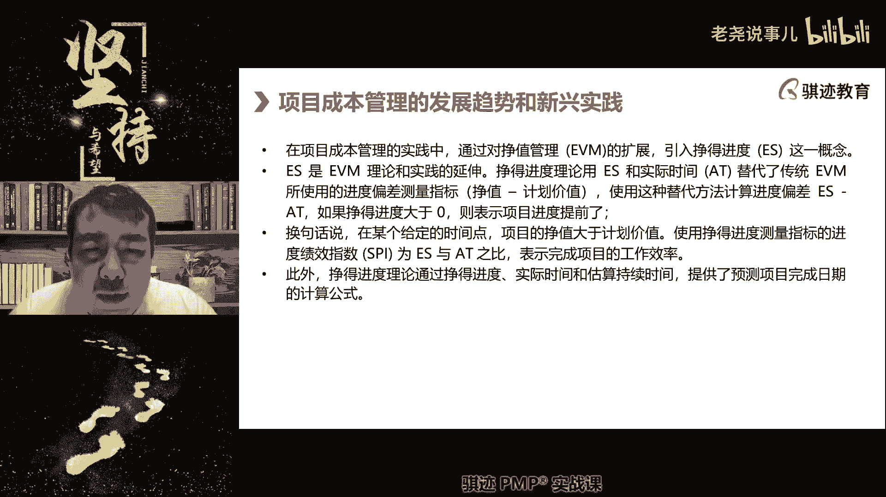
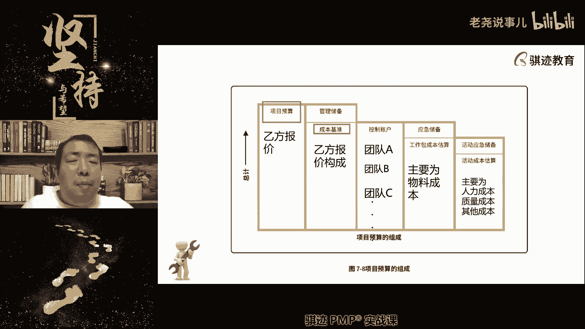
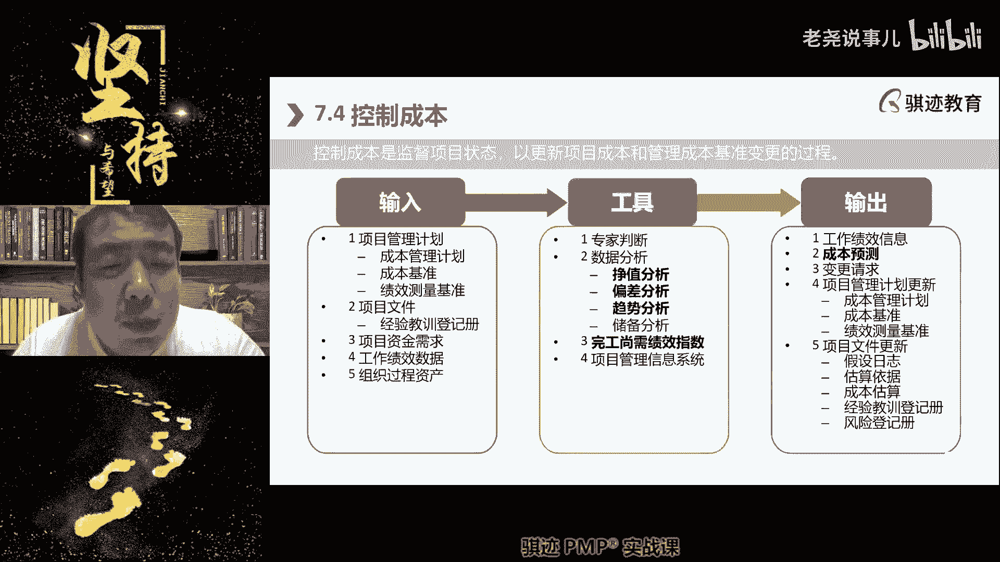
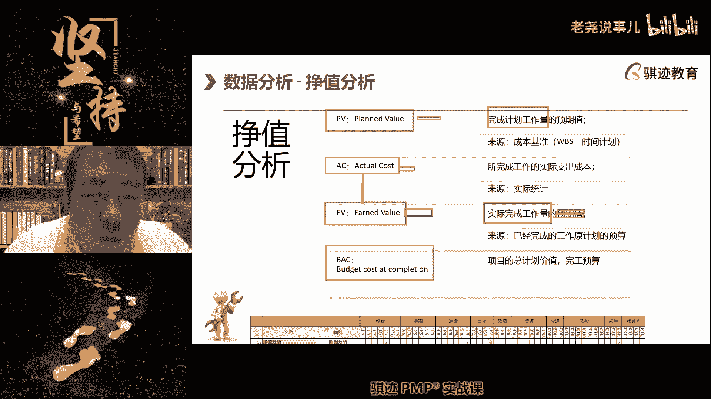
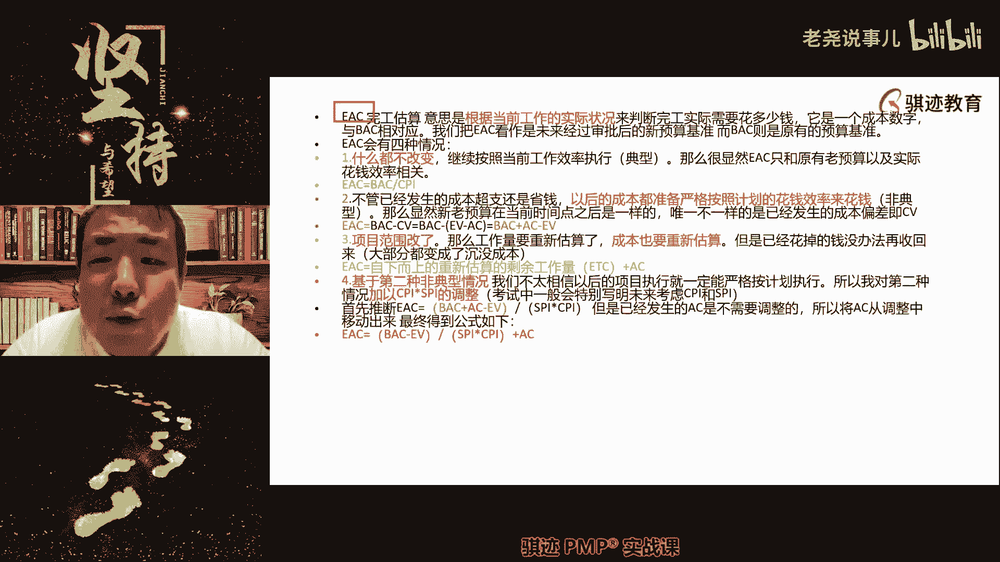
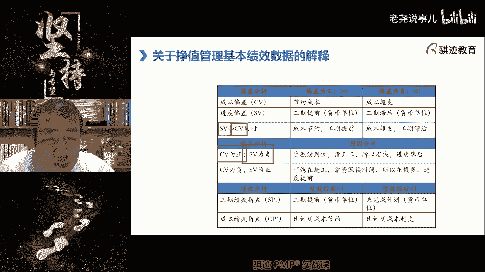

# （收费视频完整版分享）PMBOK第七版课程PMP考试报名认证培训精讲-零基础项目管理第七版教程最新版直播课回放视频免费课程资源-骐迹教育谢阳主讲 - P26：10-1项目成本管理 - 老尧说事儿 - BV1ek4y1s71N

那么成本管理当中，那么原来的我们讲的有EEBM政治管理，然后由原ES那么EBM我们稍微讲一讲吧。

这个已经不考计算了，但是我们讲一讲概念概念还是有用的啊。

什么叫BM呢，就指的是我们对于项目成本管理当中的。

所有各个方方面面的东西，都折算成钱来进行比较。

那么它的基本概念是什么，干一块钱的活。

花一块钱的成本，我完成了一天的活。

我折算成这一天的活值多少钱，用金钱衡量所有东西。

因为钱是比较容易衡量，是直观的，这就叫做EB。

那么在进度较为敏感的项目，当中呢我们可以换一种使用es管理。

就是正德进度管理，那么我们会将所有的东西折算成时间啊。

也就是说在这种情况下，将来我们会把所有的东西看。

视作它直多少天或者多少小时的进度来进行。

来进行分析，那么这是我们讲的成本管理的发展趋势和信心。

实践啊，这个东西大家都知道啊，那么成本管理呢比较简单。

它分为规划成本管理，估算和制定预算和控制成本。

它不像我们的进度管理，需要先确定顺序再估算啊。

但是成本管理它的估算和制定运算过程，却实践当中并不简单，为什么我们先要对项目。

我们讲四个成本来源进行分别核算。

而且项目的特征是什么，渐进明细，所以你的估算是跟着范围开始的，渐进明细而渐进进行成本的成本没有渐进明细。

成本是逐渐精确准确啊，是逐渐进行的，这样啊，当然你如果做讲分类，也可以讲经济维系吧，我们主要讲的是这个准确度会越来越高，然后最终还要通过什么东西啊，我们之前讲的要学什么，要进行裁剪。

因为成本是老板啊啊客户啊，关键干线上最看重的一个数据，因为关系到赚多少钱或者花多少钱，所以有时候呢你要充满了取舍对吧，然后像那个广告词，人生充满取舍对吧，你要有取舍，所以这些取和舍。

最终的矛盾的交汇点都会交汇在什么成本上，你到底把有限的钱花在哪里，啊会会交换在这一点上，所以最终的成本估算它可能是其他的领域啊，像资源啊啊质量啊，风险啊等等。

采购啊等等，他们这些其他的领域在于比如说范围啊。

啊相关方啊对吧等等这些东西呃，这些知识领域啊。

或者是团队管理呀等的资源啊，资源管理啊等等这些领域呃。

进行相互妥协啊，相互协调一致，裁剪之后最终得出的一个平衡的方案。

然后才能估算出最终的成本，那么我们估算出最终我们能接受的，能落地执行的成本方案，我们就称它为。

并且并就批准我们就称它为预算啊，所以成本制定的过程有时候是非常的搞人的啊，非常的甚至有时候非常劳累和痛苦啊。

尤其是大家如果做过乙方的成本估算，就是这个是非常非常累的，因为乙方呢又要满足甲方的要求，又要呢要能挣钱啊，老板最好什么啊，甲方那边价格报的越高越好，自己这边呢我钱开的越少越好。

所以你如果做乙方的项目经理，然后要去估算成本，这个东西就有时候就充满各种各样的事情对吧。

好那么我们先讲第一个规划成本管理啊，这个过程其实没什么，就输出一个也是纯粹的方法论成本管理计划。

他就输出一个成本管理计划。

成本管理计划有什么，我们成本的精确的计量单位。

小项目呢我们成本会精确到原大项目。

大一点的项目呢会精确到百元，那么再大一点的项目呢会精确到万元啊。

呃我没做过精确到一元啊，太大了啊，啊我做过精确到万元以下，万一万块钱以下的啊，都是忽略不计的钱的啊，这个我做过啊，精确到10万或者100万的，已经是非常非常大的项目啊，哎有些同学说呃。

我现在就是乙方项目经理，老板各种控制成本，所以这个时候对项目经理来说就要巧妇难为，不是无米是小米之炊啊，巧妇难为少米之炊，你米很少，你怎么样钱要用在刀刃上对吧，那么我们的计量单位精确程度啊。

我们的控制临界值等等，这些都有啊。

OK那么这个就不多说了，因为这个在实际考试中没啥好说的啊。

那么但是成本估算当中呢，有一种额外的估算啊。

注意这个是在成本当中才有的，这两个要注意啊，叫做粗量级估算和确定性估算。

前者用于开始阶段，后者一般用于最终的预算制定，或者成本基准制定阶段使用啊。

那么什么叫做粗量级估算，就是它的范围比较大，一般在负25%到正75%。

你们有没有发觉，为什么正要挣到75%，为什么不是负25%到正25%，为什么不是，为什么挣到75%。

哎又考项目实践啊，实践知识的有同学能知道吗，对于平时管理预算或者控制预算的同学，可以那个啊。

预算会被砍，嗯哼嘿嘿对了啊。

因为项目当中省钱的情况属于少数，大部分情况都会超支。

而且呢如果我们去报预算，你跟老板说报100万，他会给你砍成个70万，那么你真的需要100万的时候，你怎么办呢，你应该报成175万，让他砍掉75万。

明白了吧啊，这个是PMI，从数值上它不能直接告诉你对吧。

从数值上告诉你作为一个项目经理，要怎么样和控制预算的人斗智斗勇。

明白了吧啊，所以以后大家在成本或者报价上刻，千万不能太老实啊，当然也不能犯的讨得太夸张，要但是要明白，总归要有给人家杀讨价还价的余地，对吧啊，当我见过最夸张的是，比如说报了个110万。

最后批下来10万的，这是这这这不是那个了，这是这不是腰斩的问题了，是诶一刀斩下来只剩一个脚的脚呃，只剩一个脚板了哈哈，那么最终我们成本一开始都是哎，报价是销售的事情，但是我们我们也有同学说报价是销售的。

但是你所谓的报价是指你和发起人的报价，就是说发起人肯定会问你。

你这个项目要用多少钱完成对吧，你是在给因为发起人提供给你项目资金。

虽然你是乙方，也是发起人给你资金对吧。

如果比如发行人给你提供100万资金发行，然后叫商务去给客户销售。

商务销售给客户去报，比如说报200万啊，这是他的事情，但是呢我们是需要啊。

项目上也是需要花钱的对吧，真是需要花钱的，明白了吧。

那么我们从一开始的比较粗略的，这个范围的这种估算。

随着对项目信息的开展，最终在最精确的阶段呢。

我们一般会确定性估算，一般是负5%到10%，那么这种粗略级估算和确定估算。

也是一种成本上会使用到的估算啊。

和我们前面讲的我们的三点估算啊，我们的自下而上估算等等估算等等呢。

嗯不相违背矛盾啊，不相违背矛盾。

那么它只是指的是你的估算范围开始会大，然后慢慢收缩啊，啊，这是一种从宽松到啊，精确的这样一种估算过程啊。

好，那么。

呃呃讲到这个我不禁想起个故事啊，你们看过那个蝙蝠侠。

蝙蝠侠那个看过吧，就是蝙蝠侠里面有一个有一个有一个片段，很有意思。

就是有一个女的向那个蝙蝠侠开价，然后蝙蝠侠要要她一个什么东西，然后开价她一开始报1000yes，5000yes，8000，淹死一半，噎死2万，噎死哦，他已经不知道怎么报价了啊，蝙蝠侠说我太有钱了啊。

可以开玩笑啊，就这就说明什么。

在一开始去做一些估算的时候，可能你的估算是要进行量级估算。

你首先要估算什么，1万能型还是10万能型还是100万能型，你先要估算这个是哪个量级的，然后再慢慢慢慢慢慢把啊，估算的那个这个范围啊给缩小，最终确定了什么，30万到35万之间能够把这个项目做完啊。

就是这个意思，那么接下来我们是估算成本啊。

那估算成本的这些工具方法呢，我们之前都已经讲过了，就不再赘述了啊。

不再赘述了，那么估算成本当中的几个三点，估算那个方一样，那么估算成本也一样，会和估算我们的活动持续营养，会用到什么储备分析，那么这里我们就要细讲一下下啊，储备分析当中的两种储备，一种叫做应急储备。

一种叫做管理储备啊，应急储备指的是我们已知有这种风险，但是我们不知道什么时候发生，我们已经识别到这种风险了，我们留着钱准备好这种风险，这叫做啊应急储备，还有一种呢我们不知道什么时候有什么风险。

但更加就不知道这个风险什么时候发生的，我们留着这一笔钱啊，留着一笔用于应对未知的情况啊，那么储备分析，那么不同的储备它在成本的构成上，位置上和成分上是不一样的，而且只有应急储备。

我们后面看到它会纳入到成本基准，纳入到项目的预算内，而管理储备则不纳入这一点，请记住啊，这在成本当中就要注意了，管理储备不纳入，那我来举个例子问你们啊，你出你这个人呢出门有个习惯。

喜欢在兜里面揣100块钱啊，那么这种习惯是这个100块钱是一种应急储备，还是一种管理储备，一个公司的项目的备用金就是管理储备，备用金是另外一回事情，对是管理储备，为什么你不知道你的出门会在哪里。

产生一些意外要花费，比如说你刚刚出门不小心踩到一坨狗屎，不得不花钱去把你的鞋子给洗干净，这个就是什么一个你未曾预料的，也不知道什么时候会发生的，就叫这种叫做什么，这种叫做啊未知风险，所以使用管理储备。

那么有一些风险他你是知道，只是不知道什么时候发生，对吧啊，那么我们都知道一件事情是什么人都会老，所以我们在生活当中都会留有钱积蓄去干什么，老了以后要存有养老的积蓄，那么人的衰老年龄呢，随着年龄的衰老。

包括老师也现在也在慢慢老，对吧啊，是一种什么已知的肯定会发生的一件事情，那么他的这个风险是我们已知的，人老的时候肯定会病很多，慢老年人最常见的什么病啊，三高对吧，血管病。

心脑血管疾病这种东西是最常见的对吧，那么我们为了应付这些问题，我们肯定会留有这些钱去应对，那么这些钱呢就是什么应急储备啊，好那么应急储备请记住啊，我们后面还会讲到，然后到这里，但你要记住一点。

应急储备是我们的预算之内，因为我们已经识别到有这种风险了，所以我们在项目当中必须留这些钱，来应对这种风险啊，所以他应该在预算之内，而且应急储备是算绩效的，什么意思啊，当我们这个风险真实发生了。

我们要拿钱去应对它，这个努力过程是我们的管理的一种结果，理应算作绩效对吧，理应算作绩效，因为你知道有这个风险，那么为了对付这个风险呢，我们就留了钱，一旦发生风险，我们去对付风险，应付客服，克服这种风险。

那么你应该算我绩效啊，这是我的管理努力啊对吧，而管理储备则不算绩效，不在预算内，所以在项目管理当中，你可以把管理储备看作是什么东西啊，看作是如果他没有花出去，他就是管理层的利润，乙方管理层的利润啊。

素如果你有心脏类疾病，那么速效救机关就是应急储备，对的啊，对的，对于任意风险储备，管理储备可以这么说，你准备好了，但是你不知道会发生什么，这就是一个管理储备啊，也不一定都是钱了啊。

在生活当中都不一定是钱，比如说有些人有什么末日恐惧症，总是担心什么地球上出现末日怎么办，我们在家里囤了好多的米，好多的油，好多的糖啊，要注意糖是战略物资啊，用途很广泛的啊，所以他在家里囤了些米和油糖。

你不知道什么时候用上，那么这些东西是什么管理储备，因为你应对的风险我是不知道什么发生，可能这辈子不会遇到这种事情对吧，这是来自于风险的成本。

那么还有一种是来自于来自于质量成本，那么质量成本呢，又分为一致性成本和非一致性成本，什么叫一致性成本，为了把事情做对，为了让质量合格而需要需要付出的代价。

叫做一致性成本，比如说什么，我们购买新的机器来生产合格的产品，是一正常的，我们做生产前的准备工作，这是一次性成本啊，这这些就都叫一致性成本，做准备成本，预防成本，这些都是最好的成本啊。

事情做对成本总是最低的啊，一般来说都是这样，然后我们做培训也是预防成本啊，那么在质量成本当中呢，我们还会花一个东西去评估成本，当我们生产东西生产到一半，或者完全生产出来之后呢，我们要对它进行检测评估。

这个就是什么质量成本啊，也是质量成本当中的评估成本，有时候为了评估还可能产生一些损失，就比如说如果我要评估一只苹果好吃不好吃，我咬了一口嗯，嗯确实挺好吃很甜，那么这个被咬了一口的苹果还能卖出去吗。

能不能卖出去，他这个损失是什么损失啊，就是评估带来的破坏性测试的损失，那我问你们咬过一口苹，咬过咬过一口的苹果怎么卖出去，嘿嘿嘿嘿嘿哎，各种各种各样的苹果干试吃。

苹果汁做成啥了，你看各种各样的缺德主意来了啊。

可以榨成汁或者做成水果捞，所以同学们以后你请记住啊。

散装的果汁水果捞请当心啊。

当烂苹果卖。

哎对了，给这意思啊，开个玩笑，明白了吧，这些其实就是什么质量成本。

那么质量成本当中还有一种不一致，成本指的是什么，发生了不合格而产生的额外成本。

称之为不一致成本，那么一致成本加不一定成本加起来，就是项目当中在质量上要获得成本，注意现在的质量观念。

认为什么我们后面会讲，如果你在质量上不花一定的成本。

是不会得到好的结果啊，请记住。

请记住啊，然后然后呢，我们会得出成本的估算结果和我们的估算依据。

为什么你说这个东西要1万块钱的成本。

你的一税依据是什么，会得到不同，那么估算依据啊不算依据好。

这是我们的那个成本估算表，估算的成本的那些估算方法以及一些样表。

大家可以看一下啊，好那么我们成本估算完了。

经过一轮一轮又一轮，有一些项目光估算成本，可能估算了十几轮都是有可能的啊。

啊你们知道吧，所以很有很多乙方的项目经理是很苦逼的，为了满足发起人高层，乙方高层的要实现利润的，要求这个预算要算了一遍又一遍，从牙缝里扣钱，要把钱，预算要压到管理层和发起人，期望那个水平之下啊，然后呢。

发起人和高层和关键干系人，才会去批准这个东西，但是它一旦批准了我们的成本估算，那就意味着什么，这些钱发起人，高层和关键干事人，承诺会投入到我们的项目上来，所以什么叫做预算。

就是呃有人保证这个钱是可以让你拿得到的。

叫预算，拿不到的不叫预算，拿得到的才叫预算啊，制定预算就是项目当中我们通过不停的进行，要通过多轮的调整协商和改进，最终使得项目能够拿得到的那个钱来拿钱过程，那我问你们项目中的预算。

是一笔钱一下子投进来的，还是分批投进来的，你们的项目管理的项目当中是一一起投进来的，还是分批投进来，对啊，因为项目在前期准备阶段是不怎么花钱，因为没有开工是不怎么花钱的，项目在结尾阶段是活都干完了。

也不怎么花钱，项目最花钱的是执行阶段，所以项目呢要根据项目的周期不同。

在花钱的阶段去投钱，才能资金利用率最大化对吧。

如果现在我花不了这个钱，我不如把钱存什么，存余额宝对吧哈啊，所以项目上的钱一般都是什么，分批到到款到账了啊，您的支付宝已到账，项目专项款100元，冰冰对吧，好这个注意啊。

那么所以我们在制定预算的时候，不但要制定整个项目。

总共要花多少钱，还要制定项目，在每一个阶段需要投入多少钱，才能继续做下去啊。

请注意这个概念，请注意啊，要要制定出每一个阶段要投多少钱才能做下去。

好。

那么这是我们讲项目A，这个这个是因为排版的关系呀，这排版的关系有点乱了啊。

OK那么呃稍微总结啊。

那么呃只能看这张图啊，看这张图就没问题，那么项目中的成本是怎么构成的，注意啊，有两个词很容易混淆，包括PMI自己写的书上其实也会有混淆，这是第六版截过来的啊，它里面有两个，一个叫做成本基准。

一个叫做项目预算，注意啊，这两个词其实是不一样的，所谓的项目预算在很多的场景当中是什么。

乙方给甲方的报价。

比如说我们这个项目的预算是报给甲方的。

预算是500万，但是我乙方自己内部给项目经理，真正能动用的呢可能只有100万，唉不要夸张啊，不要吃惊啊，有一些项目真的很坑的啊，虽然给甲方报价很高，但是项目经理真正能动用的很少。

这种情况不是特别夸张或者不可能的啊。

明白吧，那么项目经乙方的项目经理，真正能动用的叫做成本基准。

但是在题目当中呢，嗯就是这样。

这是这是PMI的题目引出题目有点小问题，就是题目当中，如果我们没有特别说明己方报价这个预算。

我们默认预算指的就是成本基准啊，这个会有一点点搞，但是考试一般是不会考这个的啊，乙方报价这个事情一般是不会考的啊，所以你就默认我们的预算就是成本基准，成本基准再加上这一块这一块东西。

如果不花的就是什么东西啊，管理层的利润啊，利润加成本就是你的总报价，你报给甲方500万，那么你的利润是400万。

你的真实成本来就是100万，100万加四百五百万啊，如果你半途出了点事情啊，要跟你的发起人说啊，发钱出了点事情啊，要追加50万成本啊，那么就变成什么实际成本是150万。

管理层赚350万，这意思，那么来了之后，接下去呢为什么会有一个控制账户呢，来我们继续继续分解啊。

我们讲项目当中，我们讲比如说我们的项目预算，我们你的项目经理拿到了100万的预算。

也就意味着什么，这个100万是都是有有活干的。

所以你我们前面讲的概念有100万的预算。

就有100万的活，我们将这价值100万的活分配给若干个团队，我们之前讲过控制账户概念。

每一个团队有一个账户，你往这个账户里扔多少活进去。

他的账户里就有多少绩效要完成，比如说团队A有40万的活，他的绩效KPI就是40万，要把40万的活干完，团队B呢30万，团队C呢30万，三个空，假设就只有三个啊，三个控制让我加起来的总活量是100万。

也就是我们的项目的预算，乙方预算是100万，这个概念现在能明白吧，控制控制账户这个概念现在能明白了吧，好然后呢每个团队呢继续往下分解。

我们讲这个活呢可以最终分解到什么东西啊，工作包。

比如说完成这个工作啊，比如完成这个组小模块要花5000块。

晚上那个小组件需要花3000块啊，分解成若干个工作包。

然后我们就会形成一个工作包成本，那么在工作包成本之上，就有一个东西叫做应急储备，是什么意思啊，这是项目经理能控制的，用于应对整个项目范围内的，各种风险的一个储备，比如说我们的工作包。

其实完成这些工作包呢总共需要什么，花80万，但是我们这个项目风险很高。

做这个事情可能会有这个风险，做那个事情会有那个风险，坐在这边没事情也会有风险啊。

比如说前两天上海不是说地震的，你能想到对吧，那可轻了。

就三点几，3。1几有很浅的地震，那有地方晃对吧，那么地震是不是一个需要还原剂储备的，在上海地震就是管理储备啊，在日本，比如说在东京，大阪啊啊大坂神户，以前当年著名的是坂神地震对吧，对日本人来说。

这就是应急储备，因为日本三天两头地震对吧，啊这就是项目经理首先可以控制的，用于应对经济情况的啊，我们后面在风险里面，我们在不确定性，绩效与理解到在风险这个领域当中，项目经理能掌控的应急储备。

他也不是随便花的，他是专款专用，一个已经识别并分配预算的已知风险，对应一块应急储备预算，这个能理解吧，就好比说什么东西啊，本来你准备了20块钱买速效救心丸，用来保护心脏。

结果你把速买速效救用完的钱再去买，那什么去买了两瓶牛栏山拱拱拱拱拱喝掉了，然后你的心脏病发作了，我要我要速效救心丸，救心丸在哪里啊，没有，因为没有花钱是吧，所以应急储备是专款专用的。

但是管理储备不是因为你根本不知道花在哪里，你只知道出现了未预料的事情，我们需要用管理手段去应对就可以了，所以项目来了，项目经理在实际动用管理储备的时候，要向发起人和高层关键干系人，去申请使用管理储备。

那去申请它是无权直接动用，但是应急储备呢发生了特定的风险，就可以直接用啊，不用去申请好，那么接下来我们讲工作包最终分成的工作包，工作包继续分解，就会分解出什么活动，那么干什么活都得花钱嘛。

在干这个活要花钱，干这个活要花钱，活动的各项成本就是活动成本，我们活动当中，我们上一上一个章节讲了什么活动，有时间应急储备对吧，所以活动层面呢我们会有以时间体验储备，但是在成本这块时间就是金钱。

我们最终在核算成本会把它折算成金钱对吧，这个活本来需要什么，三天干完的，我们多留两天，让他五天干完，这个活需要十个工人，那么两天十个工人，每个工人算他300天，300块钱一公对吧，十个工人就是3000。

2000就是6000，所以2000的应急储备，它的值的成资金成本就是6000块啊。

能举个例子明白了吧，最终他还是能折算成成本好，这样一呃。

一个从整体到最终细节活动的这样一个分解。

就形成了我们成本的分解啊。

这就是形成了成本悲剧，OK这张图给大家解释完之后。

大家就明白了成本它的构成了。

如果明白的话，把明白了打在公屏上。

所以这个过程其实就是我们给给大家讲了。

项目中成怎么样去算成本的分解过程啊，项目上怎么样去做成本的一个，概念性的分析工程，因为不同的项目，这个成本分解组成部分还是差异挺大的啊，因为呃没办法。

没办法说说说一个一个给大家分享，我们就只能只能只能拿一个通用的这样一个，例子来给大家讲啊。

那么我们前面讲了，除了要知道一个总资金需求量，还要知道什么，每一个时间阶段我们需要花多少钱，我们以这个图来举举例啊，再解释一下项目初始呢有这样一个资金，那这条线看到吧。

这是项目在一开始的时候就投入的这笔资金，然后呢我们项目有一个这样一个基准，看到吧，就是这个基准是什么，我们随着时间呢花费逐渐增高，增高增高增高增高啊，我们的花费用就比来买花费呢逐渐增高。

往这个方向逐渐去增高，当画到这里的时候，花花到这个点的时候呢，成本呢就是什么，正好花完，然后呢我们再投入一笔资金，让项目的资金呢东升到这里。

然后呢我们又可以花一段时间，然后再投入一笔时间。

一笔一笔资金再再可以花，然后最终最最后一笔投入之后也换完了，之后呢，就达到了项目的这种终点啊，但是实际项目在执行的时候，往往受到多种因素的影响，它并不能够啊，并不能够按预期去花钱。

所以你看这条实际的支柱学一开始的时候，他从是从这个点开始的，一开始的花费是不是低于成本集聚呢，那问啊，同学们来了，问你们为为什么他这个点是从这里开始，能给我一个合理的解释吗。

为什么它成本的起始点不是从这个原点开始的，不是从这个原点开始的，而是从这个我画了一个圈圈，这地方开始，为什么为什么，前期规划不需要成本，就算前期所有的东西都不要成本，只喝比都比较成本，你作为项目经理。

你自己的工资不是成本啊，最合理的解释是什么，不对不是入场，最合理的是项目因为意外因素启动延迟了，他从很这里一段时间之后，这里一段时间之后再开始相应的工作，他启动延迟，一旦项目开始启动，开始进入规划。

你项目经理和项目团队的工资总是千百，人头费总要卖，啊注意啊，人头费也算，有些同学说，老师我们的项目团队来自于自己公司内部啊，不花钱，这个只是不从你项目上走，公司要负担他们的工资吧。

包括你和你的团队的工资，工资要负吧，这也是成本，如果从科学计算上来说，你和你团队的工资也只要项目一旦启动，都是要计算工资的，好吗啊，好那么成本开始画，一开始的时候，因为启动的慢了，所以每一步都晚于这个。

然后呢我们的支出是慢了，然后为什么，请问为什么到这个节点的时候，我们会超过成本基准，为什么在这个节点的时候，我会超过成本计，为什么，想一想我们之前讲过是什么概念，会导致我们的支出会超过成本计。

然后最终以超过成本基准的，这个这个这个这个这个这个呃完成节点来完成。

为什么，工资是管理成本。

管理成本也是成本，也是人力资源成本，来赶工，对不是赶工，其实是赶工，我们投入额外的钱做同样的事情，是不是就会导致成本超值啊对吧，然后最但是最后你会看到什么，最后我们在比实际节点这一块。

这里一块在比时间节点之前小得多的，和这一块相比是不是窄得多了，我们通过赶工缩短了这个延误周期，虽然最终还是延误交付了，但是延误的很少，很少和我们的这个起点相比，延误的很少对啊。

所以你在掌握的pp知识的时候。

看到这个图片，一看就知道可最有可能发生什么事情对吧，这个我的解释是不是很合理啊，很合理对吧啊。

这就是我们讲项目的预算当中的资金限制，平衡啊。

那么注意项目启动的时候是可以初始启动。

资金够用，就可以不用一笔全部投入，而是分批投入，但是投入周期是一个较为重要的里程碑，如果项目不能得到资金及时投入，就有可能暂停或者取消，有同学问BAC是啥，这个就马上后面会讲到BM里的。

BAC就是budget at completion，完工预算就是我们的预算。

完工预算啊。

那么项目中为了获得资金，我们就需要进行融资，看到融资这两个字，在中国很多时候就意味着什么，别，割韭菜啊，明白了吧，融资，那么融资呢我们给大家普及一下金融知识，融资分为直接融资和间接融资。

我问你们，你们向银行贷款是直接融资还是间接融资啊。

不好意思，有个东西叫向银行贷款。

是直接融资还是间接融资。

向银行贷款。

对向银行贷款是间接融资，为什么银行的钱是来自于储户的，银行是一个中介啊，向金融机金融系统去借钱是间接融资，那么直接向叉老师借钱呢是直接融资对吧，那么项目中如果需要融资，就可能会需要出资的实体。

可能会提出一些要求啊，你要从我这里融资消费基金钱可以，你要满足我国一些啊要求对吧，什么要求你们自己想啊对吧，哎呀我们要拍个电影啊，我们需要融资啊。

可以我们可以主动对吧，但是女一号要我指定的对吧，很多的老板投资电影就是为了捧红某些啊，漂亮妹子对吧啊。

对回报率也是哪个啊，好，那么我们在呃我们在对这个预算具体工作当中。

会运用历史信息审核。

根据历史上的类似项目的这些特征，来评估我们可能需要的资金。

这叫历史信息审核，用参数模型来对我们的预算的合理性。

进行评估啊。

好最后我们通过的预算以及预算的时间分配。

就是我们的成本基准，成本基准。

这部分还有问题吗，没有问题，我们进入今天的最后一部分啊，今天这个最后一分。

原来的话如果我们上的话，老考纲我要上整整一节课。

现在的话给你们随便上上就行了，因为不考试啊，不考试了，那么这个东西就是什么正值分析啊。

不考试的，你们只要知道一下概念，同学们记住一下概念，概念也有可能会考的。

但是不会去考计算啊啊所以你们如果计算不好，数学不好的同学有福了，但我觉得是中国人都应该计算还不错啊。

我们讲解一个概念，首先政治分析当中首先有四个值叫做测量值，或者叫做基本测量值，它是PV，什么叫PV啊，到当前节点注意政治分析的应用场景是吧，一定是项目已经正式开始执行了。

干了一段时间活之后才能用政治分析，没干活，能不能用政治分析啊，不行，它是用于分析实际执行情况的，所以请记住啊，一定是进入执行之后才能分析的，才是政治分析，那么PB是什么，到目前或者到一个指定时间。

一般造成目前为止你应该干多少活啊，应该干多少好，凯利指数计算可以用，可以用到政治分析，这个有点专业啊，我们课后再说，课后再说啊啊，叫做PV，叫做pd value，指的是应该干多少活，AC呢是指啊啊。

我们先讲一个EVEV叫N的value，指的什么，我们实际干了多少活，这些东西的单位都是什么，dollar或者INB或者dollar啊，他是都用金钱作为单位，所以叫政治对吧。

那么实际为了干这些活而花出去的钱叫什么，叫做AC AC actual cost啊，实际花多少钱，注意AC只和EV相比较，为什么活干的越多，是不是花的钱肯定越多对吧，活干得多，肯定花的钱越多啊。

你不能说光干活不花钱，那是不可能的，但不符合客观规律对吧，讲到这我就要讲段子了，诶我问你们又要马儿好，又要马儿不吃草，是不是违背自然规律的，那么能不能又让马儿好，又要马儿不吃草。

如果你的老板给你一个强人所难的要求，要你项目活干得好，又要你不花项目上的钱怎么办，不干了，画饼充饥啊，又要马儿好，又要马儿不吃草的关键是什么，是不吃自家的草，吃别人家的草就行了对吧，所以又要往对啊。

慢慢晚点吃啥炒还是要吃的，不能晚点吃，晚点吃，借鸡生蛋啊，白嫖嘿嘿嘿，白嫖哈哈明白了吧，所以这个事情你别说啊，房地产公司就是这样一种房地产公司，可能都没有什么自己的资产。

他就是拿着呃买房人金融系统里面的钱来兜啊，兜啊转啊转啊，最后就赚钱，当然赚不了钱的呢，他就把钱给骗走了对吧，不就这样吗，对吧哦不扯了啊，明白了明白了啊，这是AC和EB的关系，明白了啊。

干的越多肯定会花的越多啊，最后一个BAC就是前面同学问啊，Budget cost at completion，就是完工预算，就是既表达了整个项目要花多少钱，初始状态，整个项目要花多少钱啊。

也表达了我们的总工作量啊，PV和V有啥区别，PV指的是你到今天为止，应该我们以砌墙为例，应该砌100米的墙，1V指的什么，你现在已经砌了80米的墙，砌米墙给五块钱的工钱。

你应该在啊今天已经挣到了500块钱工钱，但实际上你只挣了多少钱啊，400块钱工钱明白了，这个很好理解吧，一个是计划工作量，一个是实际工作量，这个很容易理解吧。

好了有了这些值之后，我们就可以进行比较，比如说用计划值和实际的比较，就看到了我们比计划值快啊，落后啊，这领先我们用ED和AC比较什么，是看我们挣得多还是花的多对吧，都是预测值，谁跟你说预测值的同学啊。

我手机尾号317的同学，我前面刚刚强调了半天，你是不是都没听见。

对不对，要认真听我们前面讲，政治分析用在什么场景啊。

项目进入执行之后才能分析他是执行分析，当前执行了一段时间之后。

实际情况的分析，录播课没更新，你不能看直播吗，录播课没分析，你就不要在我的直播间里下啊，你跟那个我们的微信群里跟教务老师的好吧，不要用来学习，对吧，这个不是预测值，所以EV是一个实际值啊。

PV是一个预测值，AC和EV是一个实际值，是我们实际干了多少活，实际花了多少钱啊，认真听讲啊，同学们。

好，那么我们通过比较PD和ED就可以知道什么，实际工作量有没有领先，有没有落后，EB和AC比较就可以得到什么东西啊，就可以得到我们的成本是超支了还是节约的，比如说我们干了100块钱的活，花了80块钱。

这就是成本节约，我们干了200块钱的活，花了240块钱，这就是成本超支。

啊这个这个你听我讲就行了，这是书上说的所说的。

哎就是哎你就告诉实际完成工作量就行了，他所谓的预期值，是，他把这个工作量，是按照当时的这个工作的值钱状态，折算成钱的意思，跟着我跟着我学就行好吧，它是要折算成钱，我们讲工作量，你完成了砌100米砖。

而100米的墙的，砌100米的墙，这个这个工作量，但它值多少钱呢，你要根据预算是多少，你完成了多少，然后去进行折算的明白。

好，那么接下去记这个东西呢。

其实我们今天讲了啊，OK这就是我们就是老生常谈，就EACEAC有四种算法。

现在都不考了啊，你们就这你就EAC指的是什么，根据当我们红字给你写的，根据当前工作的实际状态来评估，我们按照当前状态或者某种假设。

到完工的时候到底要花多少钱，这个数值是老板干系人关键干系啊。

啊发起特别关心那些。

你干完这个活到底要花多少钱，你告诉我这个时候他问的不是你计划要花的话。

假如是根据当前情况实际要花多少钱，明白了叫EACEACEAC有四种算法，那么就我就这里就不交了，有兴趣的同学可以自己看啊，有点花时间，我就不交了，EAC的四种算法呢，我一直讲个段子。

你们以后出去如果会讲EAC的四种算法呢，你就相当于是知道查老师教的啊，我一直都EC的四种方法，就像孔乙己到咸亨酒家排出九文大钱，喝了黄酒之后拿着茴香豆跟人家炫耀说，你知道茴香豆的茴字怎么写法。

有四种写法，所以EC有四种算法，哈哈你可以去得瑟，你以后，你以后你以后出去问人家懂不懂项目管理，你就问哎同啊，兄弟EAC有哪几种算法啊，应该说有四种算法哦，回乡都有几种写法，四种写法哦。

查老师教的什么啊，同道同道同学同学，好那么这是算出ENC之后呢。

我们就知道完工需要多少花多少钱，然后完工还需要花多少钱就可以算出来叫etc啊。

不是高速公路那个TC啊。

就指的是我们已经总共要花多少钱，减去已经花出去多少钱，你们说还要花多少钱对啊。

然后最后一个值呢，我们在最后再看一下啊。

叫做TCPI叫做two complex completion performance index啊。

什么意思啊，就是如果想要把项目完成。

它的难度系数有多大，那么干一件事情容易是什么意思啊。

钱多事少容易干。

干项目最难干的事情是什么事情，特别说钱还特别少。

就特别难干，所以TCPI指的是什么，剩下没干的活和剩下没花的钱比一比。

这个值越高就代表着难度系数越高啊。

也就意味着钱越少，活越多。

反制难度系数就低，就这个意思啊，好那么这个就是TCBI。

我概念的概念都给你们讲了一下啊，TCBI也用于汇报。

跟你在总结报告啊，你们以后学了PV之后，如果要将项进行项目汇报。

你项目做到一半要进行项目汇报，你说啊我们的TCP是零点无唉。

肯定有问题啊，什么叫TCP，你说你在写完工尚需绩效指数啊。

这么高端的东西到底是什么含义啊，你来解释一下。

那这是偏僻的定义，没学过P吧，这个时候你就占据了什么理论的制高点对吧。

我懂项目管理。

你不懂，所以我说了算，懂了。

好那么这些东西呢大家也可以稍微看一下啊，给这个我也不准备讲了。

或者稍微讲一讲，就是啊SB就是什么进度偏差，CV就是成本偏差，进度偏差为正，就代表进度领先，成本偏差就代表成本节约，这两个都为正，当然是最好的状态，那么如果一个为正，一个为负代表什么。

比如说CB为正，SB为负代表什么，很有可能就代表什么资源没到位。

我们开工开的晚，所以进度落后了，但是因为开工开的晚，所以成本呢节约或者用量用的人少，用的人少，所以我们的就什么省钱了，那反过来说有就有可能什么，我们的资源是到位的，然后呢我们花额外的资源去追赶时间。

所以SB就为正了，但是CB就为负对吧，花额外的钱去干一样的活对吧，赶工了，好这就是我们的政治分析BM啊，原来这个考计算公式要讲半天啊，要给你们很好讲的这个东西。

尤其是讲EBM啊，尤其讲这个要讲好久啊，对了现在你们就自己看吧。

因为考试不考计算了，哎以前我这个讲的也是挺好的啊。

好那么这里就讲完了。

我们政治分析里面的所有东西啊，那么大家有兴趣的话，可以拿着自己的教科书书上呢。

这里有一个啊，或者我们的那个那个文档里面，这里有一个例题，大家可以去算一下啊，就说已知有这样一个东西，大家可以算一下。

那么这些计算题呢，原先在这部分呢都是要考计算机的，现在都说不要考。

那所以这个呢我就不讲了，留给大家好吧好，这就是我们控制进度内容，反正记住控制进度当中PP里边如果要考概念，还是会可有可能会考我们的政治管理的，但是已经不好计算好吧，成本这块的相关的概念大家要记住。

尤其是成本的构成方法里面，几个组成成本有几个来源对吧，这些东西要搞清楚啊，成本的四个来源对吧，采购质量风险资源啊啊好，那么这就是我们今天上课的这些的主要内容，那么看大家还有什么问题吗，没有问题的话。

今天的课就上到这里了啊，因为这块东西里面最搞脑子的一边被砍掉了，哈哈对，这个课就是我们这一个晚上就讲了，否则这个课其实要讲两，要讲至少两个晚上，好这个有问题吗，没有问题的话，我们今天的课就上到这里好吧。

然后我要强调一点啊，要强调一点，所有看直播和看录播的同学要强调一点，下周我们开始讲敏捷专题，敏捷的相关概念和大家的有些日常的思维习惯，有些差异和不同的，所以请所有的同学做好敏捷的预习工作。

大家所有的人都把敏捷专题的相关内容，预习一下，敏捷的相关专题，我们会将会用三个晚上去讲解啊，比较多的啊，而且是一定得掌握，因为现在的BNB考试当中，敏捷的东西的内容越来越多好吧，敏捷是必须要预习的。

那么按照惯例，我们今天的成本相关内容的课后练习呢，就留到敏捷课开始的时候就讲，好吧好，那么我们的今天的课就上到这里，我们下周再见拜拜，某小孩实在是太傻傻傻了，有同学要求啊，老师除了讲通俗例子。

可以讲点互联网例子，其实我不太喜欢讲互联网，因为互联网那些家伙有些东西，太虚，我是个实在人啊，可以稍微讲讲，但是我觉得这个东西太虚啊，好拜拜了好。

那我们开始上课了，同学们现在在直播间里的活着的同学啊。

公屏里扣个一，我看看。

准备开始准备开始上课了啊，来扣个一，我看看。

都学会抢答了是吧，上来就选D对吧，好来啊，我们第一道题目开始做练习卡，你不卡吧，延迟很正常啊，好第一道题目，关键路径的时差为-20天，如果关键路径有两个活动，这意味着什么啊，第一题啊。

我们这个还是相对比较简单的啊。

第一题选什么。

好来来来来来。

很多同学没来啊，抓紧啊，好第一题很简单啊。

第一题选当然应该选D了对吧，滴滴为什么选D啊，我们讲总时差最多为零，那么它是关键路径，不能有任何延迟。

总时差时差为负，意味着我们的活动安排。

比强制结束时间还要长20天，所以要做。

所以我们要压缩至少20天的工期。

才能满足要求，注意啊，如果我们使用顺推法，我们上节课讲的顺推法去安排进度，那么不会出现负的总时差。

那么如果有负的总时差一定是什么，一定是他有一个强制结束时间，然后顺推之后发觉不行。

再要逆推把它压缩进度啊。

所以他可能需要逆境进度压缩，明白了吧，所以第一道题选D，第二道题，何种特性将网络图和甘特图区分开。

不知道啊。

选哪个啊。

抓紧了啊，还有很多同学刚刚进直播间对吧，哎上课迟到啊，这个就算上课迟到了啊，啊抓紧第二题选什么啊。

第二题答案大部分同学还是选对的啊，还是第二道题答案选A。

为什么我们讲进度，网络图当中的网络图里边就有什么。

活动与活动之间的依赖关系和先后顺序关系，但是甘特图默认只有活动在时间轴上的。

开始时间和进度时结束时间，他没有活动之间的依赖关系或者先后关系，如果要有，那么必须是什么有勾稽关系的干特图。

我叫逻辑横道图，逻辑干特图。

那么它才是有依赖关系啊，所以这个是默认甘特图是没有的啊，如果大家有些同学还不记得这个东西的话。

给大家看一下啊，那这个是这张图是有依赖关系的甘特图。

但是这个这长相在线，大家看到了啊，这个线哎呦不好意思。

用错那个啊，这个线大家看到了，但是默认的甘特图是怎么样的。

是这样的，它是没有活动之间的依赖关系对吧。

这里任何地方都没有显示，活动与活动之间有依赖关系。

所以这道题答案是选A，所以答案选A，网络图有哪些讲的，就是用金钱关系绘图法绘制的呢。

进度网络图呀，同学们，那网络图就是这样的呀。

我们上课不是讲过吗，进度网络图对吧，用PDM或者DM画的进度网络图不就是这样的吗。

是不是前天上完课，然后昨天就忘记了对吧，啊你们啊你们这些人啊。

上完就忘好，第三题，为了你一定啊。

但这道题目现在考试计算题不考啊，大家可以大家可以试试看啊，做为了拟定进度计划，我们就必须注册一系列重复活动，这些活动的工期变化很大，一切顺利，十个工作日，如果不顺利，极端不顺利，50个工作日。

同时还知道最有可能的工期是20个工作日，那么我们的期望近似的工作时间是多少啊。

啊这个我们可以做一下，但是这个考试因为现在pp给你们做简单了啊，计算题没有，其实计算机我觉得减少计算题。

反而对于中国人来说是什么，是增加难度，因为计算机对中国人来说很好算啊，好那么这道题目应该选哪个，答案很一致啊，这就不浪费大家时间对吧，10+50=60，60，加上什么20×4就是80。

就是140天，再除以六，140÷6=23天啊，所以近似的时间是23天啊，没问题好，所以第三道题选择的是题对吧，我们默认其实以前考试的话，我们就会说默认我们的算法就是贝塔算法。

就是除以六，而不是除以三啊。

好那么继续进度第四题。

