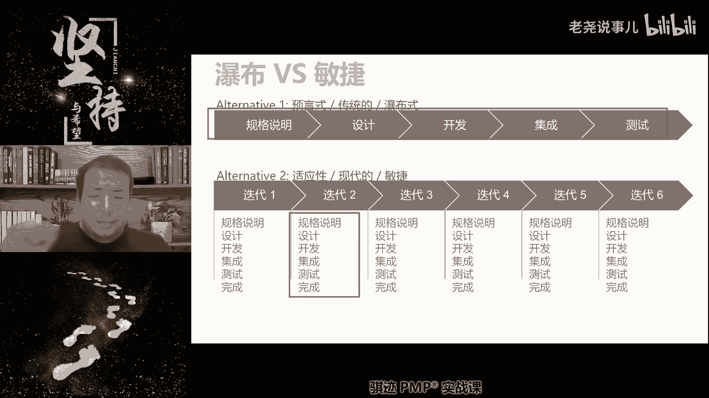
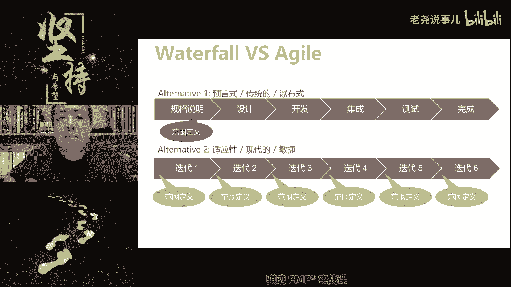
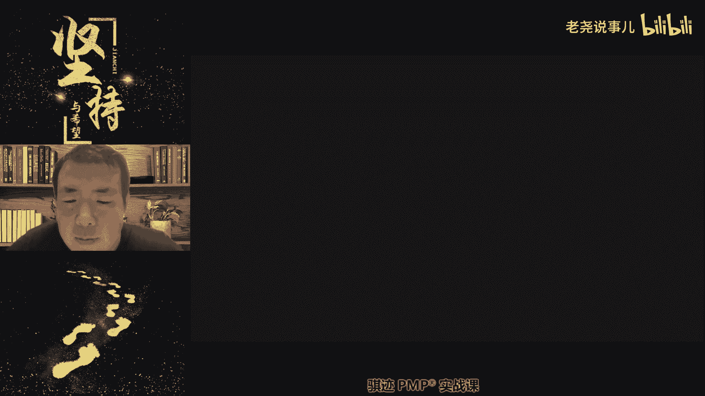
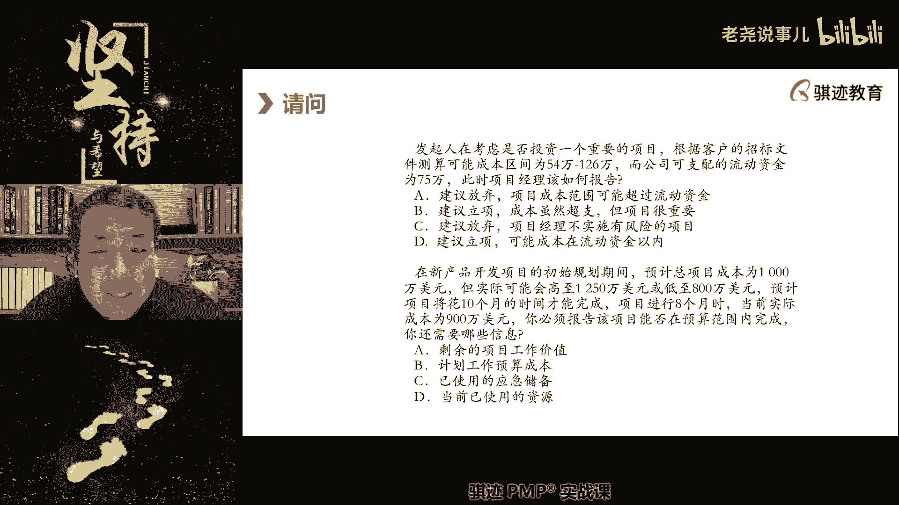

# （收费视频完整版分享）PMBOK第七版课程PMP考试报名认证培训精讲-零基础项目管理第七版教程最新版直播课回放视频免费课程资源-骐迹教育谢阳主讲 - P29：11-2敏捷专题上 - 老尧说事儿 - BV1ek4y1s71N

仆人是看作什么啊，那种电子竞技游戏里面的队长啊，就这个意思，组织后卫，OK明白了这个比喻一说，那就是不是就就就很容易理解了啊，所以仆人式的领导者就跟我们前面做管家相当，管家是领导者。

其实是仪式是一样的啊，啊他不会做决定，决定权，将决定权由，项目经理转移到我们的团队身上啊，但实际上对整个项目起到负责的最终责任呢，仍然是养不起，这点记住啊，我们后面会讲到，比如在团队当中。

团队管理当中决定团队成员的调整，你要调整团队成员啊，你要调整调整团队成员的决定权的呃，权利是在哪里啊，还是在我们的项目经理手里对吧，其实还是在项目经理处理，只不过项目经理将这个呢放权给团队，承认了而已。

好这个能明白就好了啊，那么中间有些特性是什么，敏捷呢是并行的，迭代的，是随时变化的，渐进明细的，然后流程文档是足够的等等，这些东西我们之前都讲过啊，那么流程文档为什么是足够的，而非详尽的呢。

我们后面会讲一下啊，我们会讲到这个概念啊，因为敏捷当中，我们讲要把最多的精力花在直接创造价值上，写文档，注意啊，任何在项目的环境当中，写文档是不会直接创造价值好，那么接下去我们负我们回忆一下这张图。

我们在之前的先导课，其实讲过敏捷和瀑布呃之间的一个一些区别的，这种讲课，敏捷当中，敏捷当中呢，我们是通过每一次的小的迭代循环来什么，实现迭代加增量，而瀑布呢则是一口气只做一个循环。

做完之后直接交付的这种形式啊，这是他们的一个交付和运作的一个本质区别啊，这个大家回忆一下，我们在先导课上讲过，还记得吧。

所以在敏捷当中，我们每次迭代结束都会交付一个可用的软件啊，我们其实这里因为是从ACP里面角度讲，就可用了，就叫可用的可交付成果啊，那么瀑布型只会在最终完成的时候，交付可用的软件成果，那么增量型是什么。

什么时候才能交付，最终可用的是在最后一次迭代完成才会交付，成品，中间是会交付，但是交付的是半成品，那么迭代型呢，他每次迭代出来的东西都是不同的产品，而非同一产品，敏捷和迭代的区别就是。

敏捷始终是针对一个产品来不断的迭代更新，而迭代型呢则是对针对呃，一类产品做不断的改进，然后卖给市场再做改进，再卖给市场，他迭代一次就会卖一次啊，消费者为了这种迭代得重复掏钱啊，就像我们经常说的。

汽车稍微改一个什么啊，什么外观内饰稍微改一改，就算新一款啊，改就算改款了啊，小改款改款了以后就可以拿出来当新车卖了，那么你买了前一年的车跟后一代车呢，基本上没啥区别，但是你要换成后一年的车。

你得重新买车，对吧啊，所以汽车的设计交付等等，这个过程它是迭代而非敏捷，就是这个道理啊，如果汽车是敏捷的，那对不起，你去年买的车，你今年出新款了，我可以免费去换一个，对苹果手机也是一样。

好我们讲敏捷当中我们的范围定义呢会什么，每次迭代完成之后也都有范围定义，这是为什么，来我们前面已经讲过来，想一想，为什么敏捷是每次迭代开始前，或者前一次迭代完成之后都有新的范围定义啊，为什么。

而预测性只会有一次范围定义，这是为什么，有没有同学能告诉我一下，这是为什么，对敏捷当中是使用更多的使用渐进明细，而且它将每次迭代完成之后，扔给市场的产品去获取，从市场当中的反馈，融入到下一次迭代当中。

不断的去适应啊，对大家这个描述都很对啊，相当于新的需要，对的是的，所以我们的产品不是一口气做到，我们认为接近于完美或者完成的这种状态，而是通过市场反馈逐步逐步完善，所以它的范围当然是从小爆炸。

从最小功能产品到最大啊，我们后面会讲一个概念叫做MVP加mm f啊，我们看不，这就是我们的敏捷啊的范围上的不同。

诶等会有点卡了啊，那么敏捷当中呢我们会使交付特征就会是什么，迭代加增量，这我们之前讲过了对吧，那么我们的迭代其实包含什么，每个迭代周期内我们都会有小而精的什么啊，相当于整个完成过程都会有，有同学说啊。

苹果的手机是迭代型的，苹果手机的系统IOS是敏捷型的，对的没问题啊，啊你也可以举例是华为手机对吧啊，那么以下两个东西呢是讲的是什么，是迭代和增量，有的同学这个可以图示告诉大家一下啊。

给大家阐明一下什么是迭代，什么是增量，那这就是迭代，我们的迭代当中呢，我们是由什么，由圆圆形逐步向最终型的这种演变叫做迭代，增量呢，只是从局部慢慢慢慢慢一块一步不就拼起来，拼到全呃，呃全量啊或者完整。

这叫增量，那么这两者结合起来就是什么啊，我们先在局部进行什么啊，从原始或者叫从粗糙到精细，然后再完成另外一个局部，从粗糙到精细，然后一步一步按照拼图，每每拼上去一块，再进行什么惊喜。

这样的过程最终完成蒙娜丽莎的画像啊，这就是迭代加增量，incremental and iterative啊，这两个词大家英文也要知道啊，后面以后你们学过P之后啊，这种关键的英文词都知道啊，敏捷叫阿J。

这个知道啊，你们可以去搜一下，有一家房地产公司也叫阿角，叫雅乐居，嘿嘿嘿，不知道怎么回啊，有同学问迭代交通就是敏捷吗，哎我已经说了很多遍了，之前有没有仔细听，迭代加增量是敏捷的交付表现形式。

但不是它的全部，它只是给外界人感谢，因为你每次都说东西，你看我对于对于用户交付来说，我用户每次拿到东西的这个过程，就是这样一个从局部粗糙到局部精细，然后再加一个局部粗糙，局部精细，再加个局部。

然后直到完整，这样的过程，它的交付过程从外界人看起来，他就是迭代加增量，但它背后的实质而则远不远远不远不止于此，明白了，所以不能简单的认为敏捷就是迭代增加，这是错误的啊，这是错误的啊。

那么敏捷的词就叫other啊，那么敏敏捷当中我们的交互性质呢是incremental，增量，incremental就是增量，iterative就是迭代。

Incremental ended iterative，迭代加增量，增量加迭代是它的表现形式啊，啊阿贾，你们网上搜一下雅乐居也是用这个词，所以我记得有一个地方，有一条路可以叫做敏捷大道。

你们网上去搜一下，好像是太湖还是西湖旁边有条路叫敏捷大道，其实那条路本来应该叫雅乐居大道，我觉得呵呵，你们去看一下，真的有这条路的啊，好敏捷的过程，适应的过程就是说外界给予定义，然后完成这个外界定义。

然后再次接受外界的范围定义，再次完成过程适应外界定义，也就是外界范围定义，就是外界需求的这样过程，适应外界需求的过程就称之为适应性，那么适应其实并不止于敏捷，其实还有一些其他的方法，我就不讲。

所以在偏僻的世界当中，适应型就是敏捷型啊，你们只要记住这一点就行了，适应型就是敏捷型啊，好吧好，那么我们接下来讲完，讲完下一页，然后我们休息一下啊，开始讲我们的敏捷宣言和相应的东西。

那么敏捷开发训练注意这啊，这个四个原则最好是能够背出来，因为这个对于大家做后面做很多的题目，再做一些比较简单的敏捷题目当中，可以直接使用敏捷开发宣言进行判断，那么敏捷的价值观。

注意它描述的是一种敏捷价值观，在敏捷的价值观当中，首先我们的宗旨最高宗旨是什么，你就告诉我在敏捷的价值观当中，我们的最高宗旨是什么，敏捷当中最高宗旨是什么，满足客户需求讲的low了，始终专注于创造价值。

哎不是快速任务，完成任务，这个也讲了，road始终专注于创造价值，我们始终专注于做最创造价值的事情，以不变应万变，谁跟你说的啊，尾号934，我同学给我打出去啊，谁跟你说，不变应万变的敏捷就是要变得快啊。

哈你这个背道而驰啊，属于逆反派来打出去，价值利益最大啊，就是说始终专注关创造额和交付价值啊，所以基于这样的价值，就基于这样的价值观，所以我们有如下这些东西明白吧，所以才会有如下这些一个体的互动。

剩余流程和工具，这个怎么解释啊，就是敏捷当中，我们鼓励能人和人之间直接沟通的，不要走什么弯弯绕绕，不要走什么啊，什么狗屁流程，这些都是浪费时间，浪费价值的行为，能人和人之间直接说明白的。

就不要发电子邮件，不要走OA啊，这个可能很和我们的日常常规管理，可能是很很很相违背的，但是这个就是敏捷价值观啊，虽然我们我们说，虽然我们说呃敏捷不是说不遵循，绝对不遵循任何流程和工具，这也是不对的。

就是我们说如果能够通过人和人之间的直接沟，通来解决的，就不需要再从流程和工具去解决啊，也就说明明两三句话就能解决的事情，就不要再去开个会解决啊，明明我们发个微信就能解决的，就不要再发电子邮件，解决了。

明白了，这就提升了效率，效率就意味着更多的价值，国内有这样的做事风格吗，当然有同学们，你们可能隔行如隔山，你们很多时候没有体会到啊，当然有啊，有些企业甚至很极致的追求这些东西啊。

非常极致的追求这些东西啊，互联网经济的这种这种企业里边很多啊，啊国企和私企啊，国企和外企可能会相对更偏向于右边一点啊，这是第一个，第二个可用的软件，高于详尽的文档，那么什么意思啊，什么叫可用软件。

其实这里也可以，什么是可用的可交付成果，比如说敏捷当中，我认为什么给客户文档写的再好，不如把东西做得更好，我们要写文档要不要要够用就好，突出两个字啊，主打敏捷当中文档主打两个字够用啊，都主打四个子房子。

房子不够啊，够用就好，主打四个字，啊有同学说啊直接聊，那不不那不没有留下痕迹，所以这个就是一个什么东西啊，敏捷当环境当中我们要建立起相互之间的信任，如果大家都是为了防备对方。

这个事情做起来效率是高不了的，所以这就是我说不是所有的环境都适合敏捷，当这个环境充满不了信任的时候，他是敏捷不起来，明白你没发现吗，每天发电子邮件，每天开会所浪费的时间，其实都是一种低效的行为。

每天都我们的工作都依赖于详尽的文档来展开，那么它也是有必要性啊，当然这一条更多的来自于什么，以前传统的软件工程当中，对于这个过程的详细记录和描述啊，所带来的一些工作量的大量浪费啊。

这个可以追溯到很久以前啊，以前他们有句话叫IBM里面一个人写开发，八个人写测试啊，16个人写文档啊，是这么说的，我觉得类似于这个意思啊，小公司最适合敏捷，不并不是很多大公司也用敏捷对吧。

所以敏捷的环境当中，我们会不会讲到，要想建立起敏捷环境，首先要把自己团队内部环境气氛要搞起来，要相互信任，这是后面的事情啊，所以在这种情况下，大家都财运什么，人和人之间沟通，我不需要留痕迹。

你我说的事情不会赖你，你也不会赖我，我们会啊很有彼此默契的去做好这件事情啊，国内我会我曾经与很多非常高能的，很多工程师啊等等也合作过啊，就体现过这种敏捷环境，其实说人在当中是会啊。

不自觉的效能都会高起来的，包括我也是啊，这是环境改变人和督促人啊，那么可用的可交付成果要高于详尽的文档文档，敏捷当中的文档应该什么够用就好，敏捷并不是说不要文档，也不要流程都不说啊，应该他们都是什么。

够用就好，把最多的时间和精力，前两条都是他的目的是什么，都把最多的时间精力投入到什么，投入到可交付成果的创造，如果是软件行业，就是开发嗯，对有些同学说的很好啊，应该是内容大于形式。

成果高于一切繁文礼节啊，对这个表达也很好，就是这个意思非常好啊，我们重要的是实质，好，那么第三个客户变化，合作与客户合作高于合同常伴啊，敏捷当中我们是不抢和预测性不一样，不强调依据合同进行履行。

或者依据合同进行磋商，而是强调什么应该和客户合作，及时响应客户的要求，与客户进行合作，一起想办法解决问题啊，因为这样才能创造最大的客户展示，这个也能理解吧，这个可能很多场景不能理解。

那么但是这要做到这一点是因为什么，敏捷的合同往往是一个什么，往往是我们之前我们正好讲过之前采购合同，敏捷的合同是什么合同，工料合同啊，敏捷的合同或者是约定的一种框架合同。

也就是说敏捷合同当中我们往往谈的是什么啊，现实现迭代次数，或按照一定的人工量去完成这个事情，然后呢我们并不定义范围，我们只定义工作室的人力投入量，或者约定我们的一个工期或者约定的迭代次数。

然后去开展相应的工作，然后去开展相应工作，那么这样的好处是什么，我们就不再纠结，不会纠结于一点，就是预测型，经常会有这个事情应不应该我做，我们讲行客户约定，我跟你叠，我给你迭代20次，在这20年来内。

你要尽可能给我反馈，你反馈的越多，我做出的东西就越符合你的诉求，至于要你要做什么不要紧，只要我来得及做，我都给你做，这个时候，甲乙双方的矛盾就会什么一定程度得到消弭。

呃有的同学问的问题我都不知道怎么回答，因为我可能我不了解什么电缆铺设这东西，就我觉得电缆铺设这种项目，应该是预测性更多一点吧，好，那么最后一个最后一个响应并网高于最新计划，这个大家可能理解对吧。

敏捷当中我们就尽可能不做计划，因为计划在敏捷当中是一个负面词汇，记住啊，考试的时候请注意在敏捷的工作呃，开发环境当中，计划是一种负面词汇，因为计划代表着预测，我们不做过多的，不是说我们不做计划。

而是我们不做过多的计划，我们不做过多的预测，而由交由市场来决定我们接下去做什么，这是第四点意思，所以这就是敏捷开发运营啊，也就敏捷软件开发运营，那么虽然我们说右边是有价值的，但是我们更重视左边啊。

那么这四条东西可以帮助我们，在偏僻考试当中啊，对于那些题目做出选择，你就要牢牢的记住，敏捷的这四个价值观的宣宣言，四条就宣言，那么很多的题目就能选的出来啊，凡是说要制定详细计划的呢都是错的。

凡是说依据合同执行的，基本也都是错的，凡是说文档写的越细越好呢，也是做，凡是说根据流程来的呢啊大部分也是错的啊，不能说绝对了，明白吗，因为左边更有价值，明白了没有好，这是我们的敏捷开发宣言好。

那么我们讲到这里呢，稍事休息一下，休息之后呢，我们做一下第九的，到，我们不利的，就是我们第九节课的这个成本管理的练习题，然后继续讲完我们的今天的后半年内容啊，所以敏捷的里面的概念你们发现吗。

我们这讲到这里的课的，很多的概念都是与以前的不同，或者推翻了以前的设定去做的，为了能够实现原先预测性无法实现的东西，我们会推翻一些设定，这些被推翻的设定，可能会导致有些同学在理解上可能有些不接受。

不适应，或者不理解啊，这些都是很正常的，所以你们有任何不理解，可以在科技需求问我，或者在群里问都可好吧好，我们休息到21：20分继续啊，好我们稍事休息一下，打字母，同学们，我们还有3分钟上课，哈哈的。

女儿又过来了，不是我想打的诶，不要盗我键盘，那你好了，以后可以给我打字吗，给你打字，我们上完课给你打字好吗，好的，啊稍等啊，我们还有2分钟开始上课了，可以可以下去了可以下去了，爸爸这是想死啊，上课啊。

你们快去快走快走快走，我不要走快走我不要，那我在这里，好了好了好了，同学们，我们开始我们开始后半段的课程啊，我们先做一下上节课的课后练习，看到小精灵，我的女儿每一期我的课都会露个脸的啊，她很闲的啊。

啊我们做一下课后练习啊，那么呃我们课后练习当中呢，成本这一章当中呢有较多的是那个计算题，虽然现在计算机不考了，当然大家可以练习一下啊，转一下，看有些题目呢其实也不需要计算就能得出答案，小可爱对吧。

哈哈哈啊好，那么我们先来做第一道，如果成本绩效指数0。875，成本为400元，预算为1600，樱花成本为325，计划价值约为325，那么项目当前的正值是多少，好我们来投票来算一下啊。

好我们的题目会出的较为快啊，我们会做的较为快，因为很多计算题我就不做要求嘛，所以啊好我们来做第一题，哎同学们大家投票啊，怎么投票的人很少啊，是不是都不会算好，这样吧，这个题目反正也是不可考试。

我跟大家说一下啊，这道题目其实很简单，不用你计算成本，绩效指数0。875意味着什么，小于一意味着成本超支对吧，实际成本是400块钱，我们花了400块钱已经超支了，那么我们的实际完成工作量的价值。

应该小于400，所以这道题目里面只有一个值是小于400是吧，是350，所以这个其实什么应该是四，400×0。875即可，成本价指数是CPI，CPI等于是EV除以AC对吧，我们要求1V，所以把AC乘过去。

就是CPI乘以AC等于EV，就是我们要求的正值得出是400×0。8，七五等于350啊，很简单啊，好第二道题目更搞脑子啊，如果你们之前学过都很搞子啊，不学过吗，你们你们去看一下，想一想这道题目。

你们可以用常理去推断一下，其实是可以的，就不学过政治管理都可以啊，提示一下策略，项目已经执行了九个月，基本进度计划是18个月，预算是300万，迄今已经花费了是400万元，项目完成了20%。

规划的计划价值是200万元，你通知管理层，现在项目的最终预算费用是多少啊，这在以前是要考试的啊，现在呢不考，所以我就没讲，所以这个也是没有办法，因为我们要把有限的学识放在考试，更多一步考试啊。

但是你们有兴趣可以在书上去看一下，书上讲算法还是假的啊，好第二道题选什么，第二道题就选不出了是吧，不会嘿嘿嘿，实不相瞒，蒙的哈哈哈哈，回答好，我们就直接讲好吧，这个这个题目用不用算。

那这个题目其实不需要你们有任何的专业知识，就能算是很简单，项目的最终费用就是什么，项目到底要花多少钱完成，有些同学不会不会选蒙B是对的啊，那么你想想看，你现在已经花了啊，你其他的不用看。

已经花了400万，做完了20%，那么最终要完成整个项目，是不是还要花4200万，总共有五个400万，而不是200万，400万啊，花了400万才完成20%，那么全部完成了多少钱。

是不是400万×5就是2000万，EAC对，这是EAC的四种算法里面的，第一种就是不改变效率，那么就相当于EAC除以啊CPI，那么c pi是多少，是1V除以AC那么EV有AC有，其实0。15对吧。

最后就得出，所以第二道答案选B，答案选B，2000万其实很容易简单，你不是学过P，都知道你花了400万才干了20%的活，那么干完所有活要花多少钱，2000万你就出了，对吧，留点余地。

我这位同学还留点余地啊，这个是讲话啊，第三道题要会啊，SPI用到了什么，啊我觉得200分对你的想法完全正确，有一种就是说200万是四呃，两20%是400万，那么全完成就得乘以个五，对这个没错呀。

就是这么算，其实很简单啊，好第三题，SPI用到什么啊，考试是不会有这么简单的题目啊，不会有这么简单的题目，这个我们上课讲过的吧，SPI是什么进度，绩效指数会用到什么东西，我们来过来写一写啊。

这个是要得知道的啊，我们上课讲过，当然我们讲的比较快啊，因为这个不考计算，讲的比较快，好第三道题选什么，好第三道题的答案选的是A啊，第三道答案的答案选A，那么为什么选A啊，SPI就等于什么。

EV除以PD，EV是应该我要1V是实际完成的工作量，PV是计划完工的工作量，两个相除就是你的进度绩效指数，你应该完成500，实际完成了600，那么就是进度超前大于一，你应该完成500。

实际只完成了400，那么就是0。8小于一，进度落后对吧，这第三题啊，第四题，审计将某项目大大超过预算的若干原因，记录在案报告中，以下哪一项最为不可信啊，啊你们选项自己看一下啊，我来给你们啊。

你们各选项自己看一下，然后我来给你们出图片啊，各种选项都有啊，大家积极积极思考，积极回答，回答我们的题目啊，啊我们有这么多次同学签到，只有这些同学回答题目，你们是不是啊都心思不在这上面啊。

这心思等到后天开始过端午节，是不是啊，同学们这个是态度是不对的啊，好我们来开始我们的啊啊解答啊，这道题目答案是D啊，第四道的答案答案是D，那么为什么是第一个看啊，进度计划变更控制不充分啊。

因为变更不充分就导致了什么啊，我们安排不当，然后呢导致了各种各样的我们前面讲的，因为进度改变可能是随意改变或者没有改变，导致工作安排紊乱，然后导致了返工啊，质量问题啊，拖延啊等等导致的成本上升是可能吗。

可能的啊，这是可能的，第二占项目成本20%的，固定单价的资源分包工作，出席了延误啊啊然后出现了延误啊，我们呢一定的工作出现延误，会导致价格有可能上升对吧，然后超值第三模拟估算使用不当，什么意思啊。

我们本来估计100万做完了，但是因为估错了，结果估成了80万做完，所以实际完成可能是110万，所以就导致什么成本超支也是有可能的对吧，最后一个是不可能的，所以为什么是最不可信，这是最不可信的延迟通知。

0。15的成本就要出，0。15的成本就要指数是什么啊，是成本节约还是成本超值，是成本节约，所以0。15121。05不是0。1。05，是成本节约，所以他和大大超支是违背的，是最不可信的，所以咱们选第一。

所以这是一个很简单的基础概念题，好后面一道第五题，发起人在考虑是否投资一个重要的项目，根据客户的招标文件推测，成本可能在54万到126万，而公司的可支配流动资金是75万，项目经理应该如何报告啊，没有。

好所有的同学都选了D对吧啊，D是对的啊，没问题，第五道题答案是D没问题，那么为什么是题啊，因为我们讲项目的资金投入，我们来讲是分阶段的，对不对，只要公司的流动资金，能够满足项目的第一期需求就可以。

所以在这种场景当中，我们自然用建议立项，因为成可能的成本在流动资金以内，而且我们还是分批投入的，所以我们的项目是完全可以做下去对吧，所以答案是题，答案是第，那么第六题看上去又是一个比较眼花的啊。

那么其实这个东西也可以不用计算，这个是不用计算，因为答案里面没有计算啊，这个难度在考试中算偏中下嘛，偏中下吧，偏中下好，第六题，在新产品开发期间呢，预算成本是1000万，实际可能会高到1250万。

最低量800多万，预计将花十个月完成项目的进，行到八个月的时候呢，成本已经花了900万，你必须报告该项目能否在预算范围内完成，你还需要哪些信息啊，你们选哪个，你看答案四个选项是没有计算的。

所以其实只要看概念就行，能不能在预计的预算内完成，哪些不是多选，需要多选吗，只要一个就够了，我妈妈给你开个多线又换一次，只要一个条件就够了啊，我们来看一下嗯，不需要这么多条件啊。

