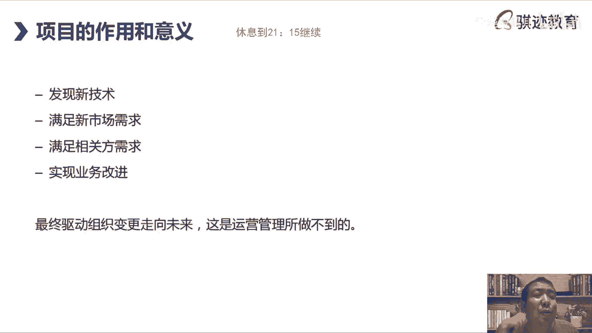
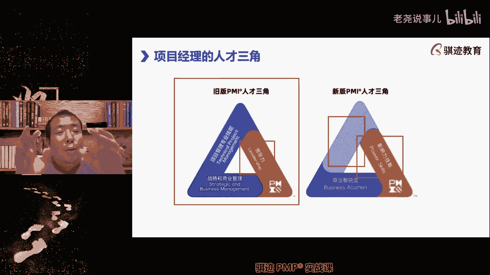

# （收费视频完整版分享）PMBOK第七版课程PMP考试报名认证培训精讲-零基础项目管理第七版教程最新版直播课回放视频免费课程资源-骐迹教育谢阳主讲 - P2：1-2项目管理引论 - 老尧说事儿 - BV1ek4y1s71N

系统它对于整个战略的指导的意义，和它要交付什么样价值的一种指导，所以你在做各种项目的时候，你要按照这样的价值理念啊，价值观念和价值方法去进行做决定，就是，哎好，那么接下去我们讲了一个很重要的。

项目价值的特性是什么，渐进明细性啊，这是贯穿于整个项目管理史中的一个，我们如何去克服，这是我们运用第四点来去克服第二点的，一个非常非常重要的一个方法，叫做渐进明细，尾号317的同学们。

价值交付系统只包括项目项目，项目组的产品和运营吗，那你还想包括什么，这个范围已经圈的非常的大了，一个企业的各种活动总结下来不就是这些吗，一个企业还能有什么活动，它的产品运营项目啊。

项目及项目组合不就是这些东西对吧，你从你从呃呃企业的价值生成的形式来看，就这几种，就这几种形式能够创造价值，那么产品和运营创造什么价值啊，确定性的非独特的，但是是一直持续交付的价值，项目创造的是独特的。

并不一直交付，但是以后可以将这些交付方式移交给产品，运营去交付的一种价值啊，也就是说我先通过项目发明了一个新产品，然后交给运营去持续生产，那么当它持续生产，它可能就不是一个不算一个新产品。

但是它能持续的为公司，为客户去创造价值，好那么我们回过来啊，我们接下来回过来啊，这节课的前半部分我讲会非常非常慢，因为很多同学还没有进入状态啊，这是我上的特征，第一节课正式的精讲课的第一节课。

今天是第一节课，是会讲得非常非常慢，帮助大家渐渐进入状态啊，那么接下来讲渐进明细，什么叫渐进明细啊，就是我们对于未来，就像大家如果玩游戏，大家可能有很多人知道很多同学玩游戏，不是Y系当中。

你在一个地图上给你探索，比如RPG游戏一开始的时候有地图迷雾，你不知道未来会怎么样，那么你在地图上，可能会遇到各种各样的敌人和怪物对吧，那么你的策略是什么，肯定不是闭着眼睛瞎走。

肯定是慢慢慢慢一点点的往前走，然后呃遇山开山，遇水架桥，遇到小怪呢，通过打怪练级，慢慢使自己变得强大，这个过程其实就是鉴定人气，就是我们通过先对眼前的确定性较高的，那些事情进行管理啊，进行项目管理。

然后呢，再去了解离我们稍微远一点的东西是怎么样的，当我们把眼前的做完了，远一点的东西就来到了眼前，然后我们对它进行细化啊，它不是增加，也不是减少，而是让他更加明确，细节更加明确。

然后我们的管理的难度自然也就下来了啊，我们的风险也自然下来，通过这样滚动式的管理来降低不确定性和风险，这样的方法叫做渐进明细啊，项目管理的各个方面方法当中都贯彻了这一点，就是渐进明细性。

所以无论记住一点，无论是预测型还是敏捷型，他们其实都会运用渐进明细的法则，来尽可能地克服项目风险，所以啊我们举个生活中的例子啊，这就是我喜欢举的啊，生活中例子，就比如我们生活当中啊，比如我们生活当中。

你可能会想到明天我们去哪里吃晚饭啊，这是大家都讲过，比如说明天是周末，我们明天周末了，我们去哪里吃个馆子，下个馆子对吧，这个很重大，但是你知道下周吃什么，下个月吃什么，比如说下半年吃什么啊，明年吃什么。

你会取消吧，不会想，为什么等到我们把这一顿晚饭吃完了，我们才会去考虑下一顿晚饭，这个就是生活当中的渐进分析，把当前该做的先做掉，再去考虑后面怎么做啊，有时候我们的人生也是这样的，先把眼前的东西学好。

再去做以后的，就像你可能会学更多，以后会学更多高深的理论，那么学习PMP就是你的人生学习，自我提高的渐进明细过程的一个节点啊，偏偏不是什么高深的理论，但是它是你迈向更高深理论的一个节点啊。

是渐进明细的一个节点，一个台阶啊，然后学习很多的知识，理论都是从浅入声，1。1。1。1点一点一点往上抬高，这个过程也是你学习的渐进明细，否则一上来给你很多很深奥的理论，你会觉得很枯燥乏味，看不懂啊。

就是这样的，明白吗，你们很多时候学习的时候，如果一上来啊，比如有些你们有些经常有时候，你问有些行业里面的大拿对吧，很多行业里面的那个态度，你问他啊，我要学这个东西看什么，他会推荐你一本书。

但是你看像天书一样看不懂东西，好抽象，好枯燥啊，我有点看不进去，头都大了，看两眼，我这样睡觉催眠不足，这就是为什么这个过程你在看懂这本书之前，你希望在这本书之前先铺垫几本书。

或者再铺垫一点你的实践工作实践，然后再去看这几本书，最后再看那本大拿推荐给你的啊，这能够帮你最终的解啊，传道授业解惑的那本书，这个过程也叫做渐进明细，是你人生求知路，求知路上的渐渐明晰啊。

所以对于渐进明细大家有一个概念了吗，好，我们在后面的项目管理当中，会不断地提到这个词啊，我们的项目管理的详细程度会不断提高的，这样一种迭代方法好，那么接下来哎我们今天讲的节奏比较慢啊。

慢那么我们现在要么先稍事休息好吧，我们以后大家记住我们的上课节奏，基本上是上45分钟到一小时左右啊，这么看我们的唱的上课内容，我们会休息15分钟，然后再上45分钟到一小时，有些课程当中呢。

因为知识点比较密集，因为课与课之间很难做非常均衡的切分，有些课程会上满两个小时，还不止，我最晚的时候可能要上到10：35分之后，可能在下课，也有些课程呢可能九点多就下课。

他也因为课程的知识点是不拘泥的啊，但是总的来说，我们会上45分钟到一小时之后呢，就会休息15分钟啊，就跟我们学同学上课一样，因为人的注意力，基本上45分钟就达到极限了啊，集中注意力自动转向的。

那么给大家休息，大家去缓冲一下啊，然后我们再上45分钟好吧，基本上是这样一个学习节奏，所以我们现在先休息15分钟，我在休息的时候呢，大家说一下，我会在公屏上点打啊，我们休息到。

我会我会给大家说休息到21：15分吧，继续啊，我们继续，那么在这个动作当中呢，大家可以去喝个水啊，上洗手间啊，吃点东西啊，大家因为平时上课比较忙，比较辛苦，先休息一下啊，我也会暂时性闭麦和关闭摄像头。

我也会休息调整一下啊，然后呢我们准时啊，但是作为一个项目经理，守时是很重要的好吧，我们准时20点收工了啊，今天我就做一个负面例子，第一节课就不守时对吧，今天这是一个非常非常意外的事情啊。

非常非常意外的事情，好吧好，那么大家先休息一下。

大家都辛苦了，好好，那么我们前面讲了项目管理的各种设定啊，我们继续往前走啊，项目有什么意义，我们做项目是为了什么啊，大家有人问一下这项目是为了什么项目，如果我们从我们的屏幕和第七本书上呢。

其实这部分呢缺乏描述了，但是第六版有做项目是为了什么，或者项目因何而来，其实主要就包含这四个方面，一项目是为了发现一种新的技术方法和途径，这是第一啊，那么很多时候这种项目呢叫做探索型项目，创新型项目。

为了发现前人没有走过的路，实现前人没有做过的方法的这些项目啊，这些事情，那么我们会用项目方式，因为这些事情往往不确定性非常高啊，非常的高，好这是第一种啊，这是我们很容易想到的是吧。

然后实现一个新的市场需求啊，新的实现满足一个新的市场需求对吧，我们在前导课中讲过一个例子，郑国渠是为了实现什么秦国的水利需求，这个事情之前在战国的时，那个呃战国春秋战国时代是没有人实现过的。

这样一个复杂伟大的事情啊，但是福泽子孙的对吧，这样一种需求，原来人民曾经想过，他从来没有实现过，我为了去实现它，可能要付出巨大的努力和代价啊，这个就是满足新的市场需求，满足现在的市场需求啊。

第三个是满足相关方的需求，也就是说它并不来自于某个市场的，商业化的要求，而来自于某个人或者某些人的想法也有啊，有一些项目就是说当你一开始的时候，完全不被人看好，但是呢仅仅是出于某些人的想法理念诶。

他最后做成功了对吧啊这是总成功了对吧，然后你像那个那个那个这个就是我们讲这些，比如说啊呃前一阵大家关心过新闻呢，马斯克发了新建的第一次测试后的失败对吧，马斯克搞新建，纯粹就是说从至少从一开始的时候。

纯粹就是满足他的一个伟大的理想和愿景，想要火星殖民对吧，市场在马斯克没有做这件事情的，这是没有市场的，没有人会去这么亏的事情，但是他做出来，那么至于能不能后面产生市场，那是另外一个事。

但是至少从他的个人云顶来说，他会去做推动这件事情，推动人类往星际啊，种族这个方向努力去走，这是由个人的意愿来推动世界发展的，一个小小的推动，但是也是人类足迹上一个揭示的一步啊。

那么甭管他出于什么样的目的，和真实的什么想法，确实推动了整个人类在往前走，那么中国人也罢，美国人也罢，无论什么也罢，我们都在推动历史往前走啊，我一直是认为，我们人类应该最终要能够走向宇宙啊。

我们否则永远困死在地球上啊，那是不行的啊，这是我们想多了，这就是满足相关方的要求啊，啊那么最终啊，还有一个什么是来自于我们日常的运营啊，这是偏僻的第六篇，博科第六版经常提的，我们在日常的生产运营当中。

企业一直生产某样产品，经营着某种服务，但是这种产品和服务大家知道吧，就是我们社会中的产品服务，正在运营当中的产品服务和结果，一定会存在效用衰竭，谢谢你们知道什么叫效用衰竭吧，就是我举个很简单的例子啊。

如果有一家我们还是讲吃的，如果有一家店做的吃的东西，你很喜欢，你经常或者天天或者是定期会去买单，那么一定会发生一个效用，就是你过了一段时间之后，你觉得这家店做的东西没有那么好吃。

你开始你开始内心有一点想法，说我是不是还要继续学，我是不是尝试一下其他店做的东西，好吃的东西，比如这家点心店都是点心，我一直从小吃到大，但是呢我吃了几年之后呢，哦或者若干年之后呢。

我觉得也没有以前好吃的，是不是店家偷工减料了，为什么，有时候真不是，人是容易喜新厌旧的，社会也是容易喜新厌旧的，如果你一直提供一个层次的服务和产品，是会被人们渐渐渐渐的喜新厌旧给淘汰掉。

所以业务必须通过不断的改进，来赶上人们诉求的不断提高，或者是不断变化对吧，好那么就像奶茶，你知道吧，我们举个例子叫奶茶，你们知道很多这种茶饮这种品牌，比如像喜茶什么什么什么茶五啊，他们这些比如说奈雪啊。

这些茶饮品牌，他们自己内部就有很多研发新品的项目，那么茶饮企业为什么一天到晚研发项目，因为人们像喝奶茶这件事情上，就经常会喜新厌旧，如果你一直就经营几个招牌的那种奶茶啊，召回来这种奶茶。

你会发现没过几年消费者就不再消费，你为什么喜新厌旧，在奶茶这个行业洗钱就特别快，所以业务日常的运营啊，一定是需要什么不断的有新品，通过项目去开发新品，来满足我们的日常的运营的新的输入，新的运营方式要快。

运营要通过项目来进行迭代啊，所以你们看到很多的连锁食品企业，连锁零售企业，他们的研发，你们看到就说这种零售产品的研发，一直是一个企业的生命线啊，你你们可能可能可能很多人会低估这个情。

研发是很多连锁商业啊，消费商业的一个必须要投入的一个很大块东西，因为人们的消费诉求和口味，是会迅速的产生变化和迭代的，你一定要跟上市场的别的变化，才能不说发展，才能保住现有的业务啊。

这是有业务的需改进需求而产生的项目诉求，所以项目就是说我们也是以前一直会说一句话，项目会改变业务，业务也会产生新的项目诉求，这就是项目和日常运营的业务的关系所在，那么再往前面说一点。

一个组织要想不断的适应市场的要求，不断的去走向未来，一定是依靠项目啊，这个就把项目拔高了一点啊，就在PMBOK第六版就描述，项目推动了组织走向未来，如果一个组织永远是墨守成规的去运营，它原来的业务内容。

那么它是没有未来或者是无法发展啊，你咋回来，这一点上在那个黑黑色啊，这一点上在呃呃日本啊，什么这那这这这这个国家特别意思啊，日本不是有很多什么什么煮饭仙人，寿司仙人对吧，他日本人就特别容易干什么。

做一件事情做的非常保守，然后呢不改变，然后慢慢慢慢的就和现实脱节了啊，但是在日本这个社会特别容易，什么有这个环境生存啊，有这个环境生存，那么同样中国社会，现在为什么中国社会会体现非常有活力的一面。

就是中国社会一直这样，你固守成规的去运营，没有项目的推动，没有创新或者没有改良改进，那么你是会被市场淘汰的，这是一个发展中的社会，发展中的社会好那么大，怎么形成这个社会的这个过程我就不谈了啊。

这是连网线就不谈了，所以这就是项目的作用和意义，明白了吗，那么项目经理的角色呢就是由组织指派，委派领导团队实现项目这个角色啊，那么在原来的PMP的偏颇的前三章当中，第三章他会有写项目经理角色的定位。

和项目经理角色的描述，那么在新版的篇幅和第七版当中呢，这一章的独立性被取消掉，它打散的融入到了其他内容当中，所以我们这里呢就留了一页PPT的slide，但是呢实际上呢我们会在后续陆陆续续的。

也跟我们的讲义和课程一样啊，穿插进去描述项目经理是怎么样定位，注意现在的很大的一部分与以前不一样，是项目经理在不同类型的项目当中，他所扮演的角色是不同的，是有差异的，虽然都是领导项目，实现项目目标。

实现项目价值，但是它的作用定位是有差别的啊，我们后面紧接着就会讲比预测性当中怎么样的，混合型当中怎么样呢，敏捷性当中怎么样啊，但是项目经理的实质内涵一直没有在改变。

他的目的就是为了使领导团队实现项目交付，项目驾驶，这个一直没有变化过啊，只不过表述形式和要求变，所以我们就来看看项目经理有哪些好嗯，那么这个是PMI的人才三角，在PMBOK第七版的时候。

pp mi提出的第一版的就是旧版的人才三角啊，人才三角PMI在旧版的这3年，总认为，项目经理应该具有这三方面的核心技能能力啊，包括的项目管理的专业技能能力，项目的领导力和战略，战略管理能力啊，那么来了。

我为什么要讲这个新老对照，因为现在考，如果考试考你，我就问你，他都是问新的PMI的人才三角，但是我怎么讲新的知，我告诉你们是这个演化过程是怎么样的啊，这才是比较有意思，那么新版的人才三角呢。

他改为了工作方式，影响力，技能和商业敏锐度，你看这两边的形状是一样的，三条边也是一样的，三条边表述的内容也是差不多的，但是它们的区别在哪，区别就是项目经理的要求，就说能力要求不是更高了，而是更宽泛啊。

天猫认为项目经理不需要很深，但是要够宽，就是你对于你的管理的宽度啊，所涉猎的范围，所能掌控的程度要更宽敞一点，有同学问战略和商业管理指的是什么，就是项目经理要不要管我，那就先问我们的课程的第一个问题。

项目经理要不要管战略，项目经理要不要管战略来公平理回答我一下，项目经理要不要管战略，对不需要，那么嗯，你要，不用你只是个小小的项目经理，等你做到项目组合经理的公司的决策层，你得考虑这些事情啊。

项目经理是不用管战略，那么什么叫战略和上呢，项目经理要了解战略，在老板的视频中就讲，项目经理不需要去管理战略，只要执行战略管理所下达的战略任务，中的组成部分就可以，但是你对你的项目的战略任务是什么。

要有理解，比如比如说你的项目是开发一个新产品，那么你在整个企业的战略体系当中，也就是我们的价值交付体系中的目的是什么，探索新市场，尝试新玩法，这是你的战略赚钱是不是你的战略目标，不是你的战略目标。

组织不指望你这个新产品能赚多少钱，希望你打开一条新的道路，所以在旧版的我们的呃人才三角当中，战略的目的是什么啊，这个但是这个问题问的非常好啊，战略的目的，了解战略目的是干什么，知道你的任务是什么。

在战略层次，你项目的任务是什么，只有知道这个你才能够管理好项目，对不对，那么我们也一直说项目管理当中，项目要贴近战略，达成组织的战略，项目才有意义，没有考呃，有些卡的同学，你可以把分辨率调低一点啊。

没看见我这里网络挺稳定的，相当稳定相当稳定啊，我有时候我的路由器可能有会有一些，我现在长边拼着啊，我可以给大家看一下，我拍我拍个照片，在群里给大家看一下，我的这个是相当的稳定啊。

啊那么这是我们旧的什么新版战略和商业管理，变成了商业敏锐度，这对项目经理要求就更宽了，因为组织的战略是受到外部商业环境影响，新版的km当中这条紫色边，紫色便是RO大正啊。

大家问到战略指的是未来发展的线路对吧，其未来发展的方向应该说是战略，是如何实现未来的一个大方向的指引啊，你可以这么说，你理解认为吧，那么为什么叫商业领域做，是因为企业的战略受到外部商业环境的影响。

所以项目经理不不不，但要知道自己的企业，在外部商业环境下应该扮演什么样的角色，然后要知道外部商业环境对其的影响，而且透过企业的战略对项目的影响也要了解，而且我们往往是扮演的角色是什么。

我们扮演的角色是乙方项目经理，那么你不可避免的要跟甲方，在商业上有很多接触，这种商业接触如何去处理，如何去同时维护自己的利益和甲方的利益，那么他要有商业敏敏锐度，Business acuum。

项目达成可以理解，我完成了项目战略当中的一个任务啊，OK啊这对对，你可以认为他是站立动作，一块拼图啊，一块拼图啊，这是一条边啊，这是我们俩的一条边，那么第二条边是什么工作方式，什么叫工作方式。

就是项目经理不但要自己会运用不同的项目，管理的方法和模型，更要学会干什么，能够用不同的角度和姿态，用不同的方式带领大家做好项目工作，那么这个之所以这么这么写，就是因为什么。

项目管理的自从PMI全面引入敏捷的这个理念，就是说这个体系管理的体系之后呢，那当然当然这个也是也是也是必然的一个趋势，就是在敏捷的环境中，项目部经理的角色职能发生了变化，工作方式也发生了变化。

从直接安排工作，变为了指导工作如何去有效开展，注意我的描述是不再直接指导工作，而是指导工作有效开展，从间接管理，从直接管理变成了间接管理啊，这就是一种工作方式转变，所以项目经理呃。

偏曼认为应该懂得不同的工作方式，你在预测型的管理当中呢，有预测性的工作方式啊，就是你应该能够直接果断的安排，所有人如谁应该做什么，如何去做，遇到问题应该怎么解决，以你牵头来去解决这所有的事情。

而在敏捷的换项目当中呢，那谁直接管理啊，这个问题问的非常好啊，尾号7616作用，这个问题问的非常好，谁直接管理团队，自己直接管理的自组织啊，这我们在敏捷的专题课上讲到团队自组织啊，这就是敏捷能力。

那么在敏捷当中呢非常好看，就没讲到项目经理就不再直接管理的，而是让团队自我管理，它起到的是维持这个自我管理的秩序，和推动这个自我管理的水平不断提高的过程，那么为什么这么做啊，这个篇幅展开的就很大。

我们在敏捷专题课会讲啊，我们在后面当中也会提到，但是敏捷专题课会细讲为什么要这么做，那么对人的要求是不是提高了，你要在预测性当中直接指挥所有人，你把人当木头人啊，你做这个，你做这个，你做这个。

而在敏捷的环节当中呢啊你们怎么做，你们自己决定，但是呢我会给你们一些意见，然后按照什么原则方法遇到困难，我建议你们应该怎么处理对吧，你看这是不是两种不同的方式，项目经理如果要求高一点啊。

就如果如果你要资深一点，你要会综合运用这两块东西，你要这个就就是讲到，有个有一个中国老祖宗的高呃高级词汇啊，我一直觉得呃呃我们先讲啊，叫收放自如，有时该收就是你直接管控，有时该放，发挥人的主观能动性。

如何做到收放自如，这就是一种工作方式，所以项目管理当中的很多理念和原理，其实中国人的老祖宗早就有啊，中国人祖先的朴朴素智慧的，早就体现出这种东西，但是我们现在用更科学的方法，把它表达出来而已。

那么这是工作方式啊，那么在混合性当中，其实对项目经理的项目经理的呃，呃要求其实反而更高，为什么你既要能够用敏捷的方式去管理，也可能是在敏捷，因为在转型敏捷转型过程当中获得部分回流，敏捷的方式当中。

可能团队不适应或者做不好，你还得切换回预测先去管啊，工作方式的多样化，能力的多样化就更重要啊，所以pm认为新时代的项目经理应该什么技能，管敏捷，也能管预测，还能管敏捷和预测的过度混合型。

是不是对人的要求是很高的，所以你们的考试我们之前讲过1/3，三分之一三分之一啊，敏捷1/3，预测1/3，还有敏捷和预测的混合体1/3啊，就是这么来的，明白了，所以他这么考试也有他的道理啊。

当然对我们同学来说，考试来说你要学的东西更多了啊，只要比偏博客第六版的老考纲，和之前的考试相比，只要学懂的东西更多啊，好那么这个第三条边啊，就是影响力原原先的是什么，是领导力。

影响力和领导力有什么区别啊，影影响力更加强调，影响力更加的强调的是什么，是能是一种软技能，能对别人施加影响啊，我一直跟别人解释老师什么叫影响力啊，影响力就是不运用权力或者没有权利的情况下。

别人也愿意听从你的意见去作出行为，这叫做影响力啊，比如说你是一个技术权威，谈到某个技术问题，团队应该用什么样的技术方式去实现，那么当你发言之后，别人会不自觉地把你作为正确，按照你的意思去做。

这就是一种影响力啊，项目经理的影响力来自于多个多个方面啊，来自多个方面，那么第一方面是什么，我认为的第一方面是什么，激发别人对你的信任，一个有影响力的人，一定是一个被别人信任的，你想想看。

如果别人不信任你，别人会听你的意见吧，肯定不会，啊啊知道吧，所以影响力一定是基于信任了，所以怎么做一个被别人信任的人呢，就是呃要一种言出必行啊，要要有一种什么信守承诺啊。

啊这样这样一个行为才最容易获得别人的信，所以我就想当然，今天就是一个反面例子，我们今天的上课晚了那么一丢丢对吧，晚了一丢丢，那么这就是一种啊影响力这种消耗，但是问题还不好，我们下次一定注意对吧。

影响力的在人与人关系之间，第一次形成很重要的一块是什么东西啊，你能不能守时守约啊，因为这会影响到别人对你的第一印象，OK啊我们今天讲的，我们我以自己亲身举了一个负面例子，那么接下来影响力会体现在哪里啊。

你如何去别人跟别人沟通，跟别人打交道，用自己的魅力，注意魅力不仅仅来自于外表啊，你看我这个人像帅哥吧，不像对吧，但是我自认为我这个人影响力还可以，哈哈我认为他是有预谋，不是阴谋，我真的是今天是那个。

但是我这个人从来不会说我做错了，我硬要说自己对啊，我错了就错了，我们要承认啊，影响力啊，不像不像不像啊，镜头是带美颜的啊，你们要知道啊，我这个是美颜开的最低啊，美颜开的高，你们绝对认不出哈哈。

那影响力来自于什么，来自于一种行为和内在品格的感染力，这是一种影响力啊，我如果是个品德高尚的人，我很容易有影响力，知道吧啊如果我是一个什么啊，很有事就说我很能说很能有说服力的人，我很能运用表情。

我情商很高，这些都会带来影响力，都会戴眼镜，我很会人际交往啊，啊逢人说人话，逢鬼说鬼话，这个这个当然有点贬义啊，这也是一种影响力啊，这些恰恰也是项目经理应该具备的能力啊，就是这种能力，我觉得这样。

那么领导力更多体现在哪里啊，你所推崇的方法，你所推荐的方案，你所要走的线路啊，去实施的呃，方向是能够带领大家做正确的事情，走向成功的，当你能达到这一点，你就有领导力，所以领导力和影响力还不一样。

有些人脾气很臭，态度很恶劣啊，但是呢他每次说都能说得对，都能带带领团队带来成功，给大家带来好处，这个时候呢虽然他在大家心中没有什么影响力，但是他有很高的领导力，但是领导力其实你其实也是影响力的一部分。

大家也愿意听你啊，大家愿意听你，不是因为你的人脾气好，而是因为什么你能把事情做得对，这就叫零道理，Leadership，leadership就是能够leader能够走在前面，带领大家走向成功所走。

做正确的事情啊，所以最好的项目经理是什么，既能大家带领大家做事情做成功，又能够感染大家，让鼓舞大家，或者让大家认可，大家心甘情愿听你的，听你的话，跟着你走，哪怕遇到挫折也不会啊灰心丧气，然后举个例子啊。

这种就是影响力，当两者合一的时候，你就是一个非常优秀的管理人才啊，我们不夸张啊，这样的人其实在现实社会当中也是很吃得开，很吃香的，OK啊那么这就是pi的人才三角的解读啊，那么我们回到前面啊。

商业敏锐度我们前面讲了什么，我们要了解我们这个项目所处的行业，法律法规，市场行情对吧，经济周期这些东西，以前PMI说，项目经理其实什么专心管好项目的事情，就像有点闭门造车。

而现在我们觉得什么这个事情不怎么干，你要了解外面的行情是怎么样的对吧，市场规律是怎么样的对吧，然后我们处在上升周期，整个经济环境处在上升周期还是下降周期，还是平稳周期，震荡周期对吧啊。

我们的跟客户的关系怎么样啊，对吧啊等等等，我们的商业模式怎么样等等，这些都要了解我们的生意是怎么做起来，生意当中面临哪些挑战和问题，这些都是商业敏锐度啊，这对项目经理要求就管的宽了，或者说不一定管。

但是你的认知就宽了，PST分析吧，这个不是属于商务，这性非常好，这个这位叫啊，这位叫大诺诺的同学，这句话说得好，这个本来是商务职责，但是现在越来越多趋势项目经理要了解商务，要了解商业。

这是一个发展趋势的，在很多的乙方角色当中，项目经理就是半个商务，对不对啊，如果你们如果有较多的各种行业的人，在很多的行业领域当中，项目乙方的项目经理就是半个商务啊，好，那么我们讲前面。

我们讲的就是说人在三角中的工作方式，叫或懂得敏捷啊，还有超敏捷啊，敏捷之上的大规模敏捷超敏捷啊，懂得混合啊，也当然自己要懂得预测，预测是每个项目经理预测型的管理方式啊，懂得什么叫做像项目治理对吧。

懂得进行需求跟踪，风险管理，日常的各种各样的管理方法，这些管理和工作方法，都是项目经理的根本和基础，但是呢光懂一些传统的，比如像风险管理，日程管理啊，范围管理啊，政治管理已经不足以满足项目管理的诉求了。

还要懂得混合性的管理方法对吧，要懂得设计思维啊，注意啊，设计思维这四个字放在这里只有四个字啊，如果你们学一些其他理论，这个是我懂的，设计思维有五步，如果你想要深入的学习设计思维，它可以是一门课。

如果要浅浅地学，他可以讲一节课叫做design thinking啊，在这里只是四个字而已啊，但是PMI的课程当中呢，我们这里就不展开了，did i thinking怎么用五步啊。

他每一步里其他细化的很多环节，design thinking的核心理念是什么，换位思考，如何正确的运用换位思考来解决问题，发行商业机会提高等等等等等都可以，PEST还有L1啊。

PEST就是我们后面课程会讲到的啊，我们现在有个叫提示清单，P e s t l e r tel，还有BUCA多了啊，OK啊这些概念现在层出不穷，那么这是项目经理在项目环境中，应该具备的核心能力。

在这个当中有一项能力，注意有一项能力以前是没有环境当中，或者现在只是包含在我们的影响力技能当中的，是一项什么能力，但是是项目经理平时运用最多的一项能力，但是他现在不是单列的，而是包含着影响人的能力。

你们想想，项目经理平时做的最多的一件事情是什么，嗯嗯是什么对沟通，那么沟通为什么不列在这里面啊，这是我以前在讲PMBOK第六版的时候，我就讲人在三角里面经常讲的，为什么沟通没有在例子里面啊。

不是还真不是进度管理，进度管理不是啊，注意啊，那有些同学说进度管理，项目规划，项目经理不会一天到晚的去管理进度，他进度可能一段时间内去检查一下啊。

