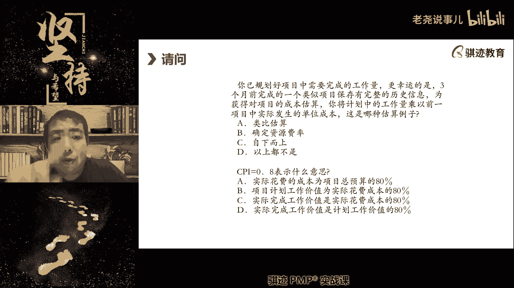
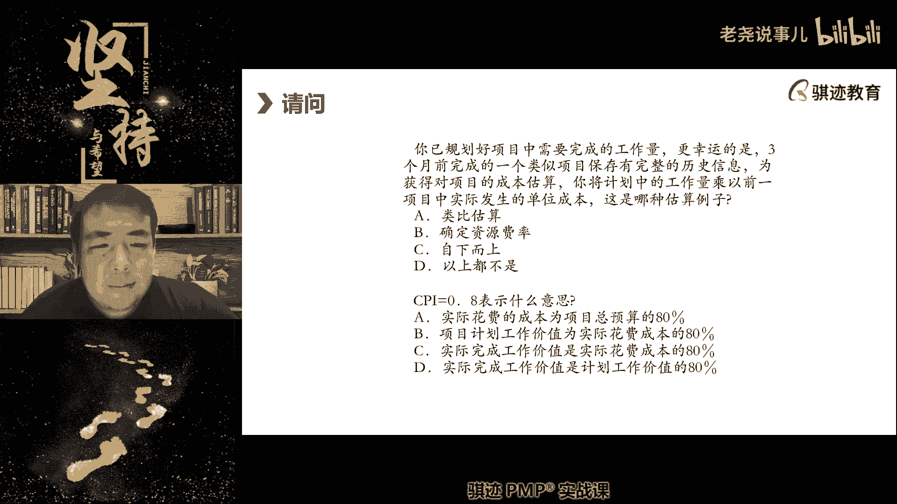
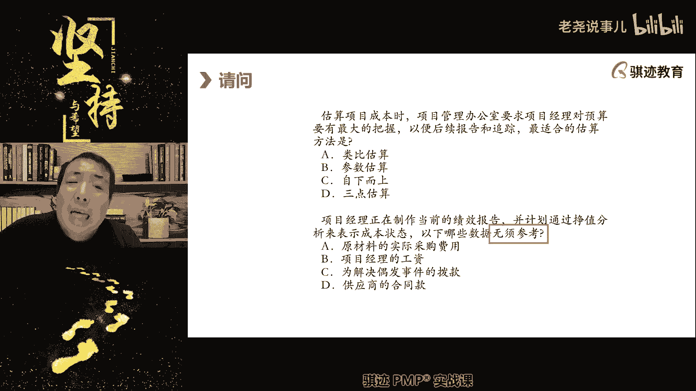
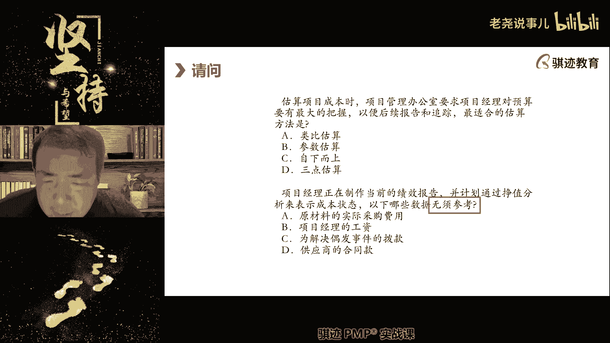
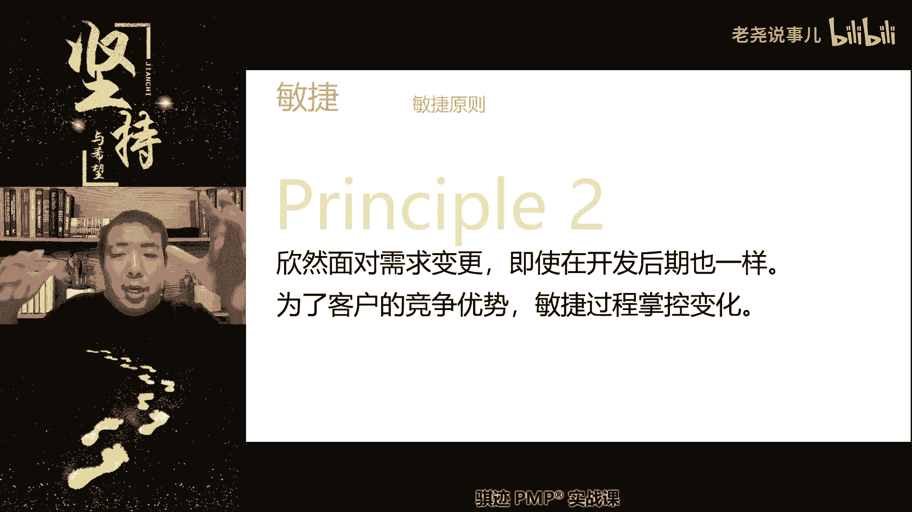
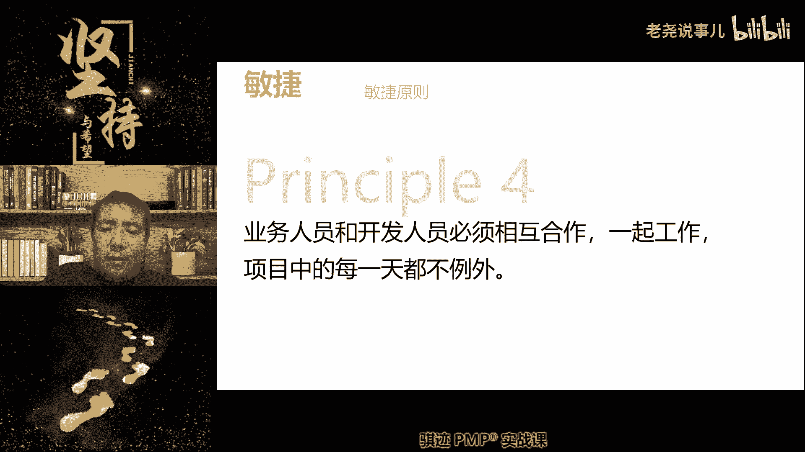
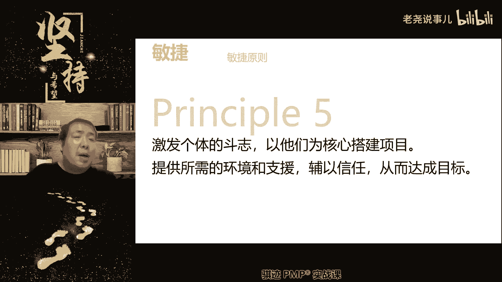

# （收费视频完整版分享）PMBOK第七版课程PMP考试报名认证培训精讲-零基础项目管理第七版教程最新版直播课回放视频免费课程资源-骐迹教育谢阳主讲 - P30：11-3敏捷专题上 - 老尧说事儿 - BV1ek4y1s71N

大家来看一下啊。

我们看一下其实很简单的，你只要知道什么东西啊。

答案是A啊，第六题答案是A，那么你为什么只要知道剩余工作量。

因为啊我们可以看啊，我们已经知道预算多少了。

我们也知道剩下多少啊，我们已经知道花去多少钱了，那么我们只要看什么东西啊，剩下还有多少活要干，还要剩下多少钱，我们剩下多少钱，我们剩下100万。

我们只要知道还要剩下多少活要干，比如我们剩下300万的活，那么明显很明显。

我们是不可能在预算范围内完成的对吧，如果说我们只剩下50万的活。

所以我们很容易就知道什么售价还要多少，那个叫什么啊，预算可以换，如果不是我们上50万的活，那么100万的预算去干50万的活，是比较容易完成的，所以我们能够报告能够在预算内完成，对不对。

所以关键能否执行完预，按预算范围内去执行完项目，关键看还剩下多少活，那么剩下多少活是什么A呀。

剩余的项目工作价值还有多少活没干对吧。

这个是不是很容易推理出来的对吧，这个需要计算吗，不需要，是不是很简单，计划工作成本，计划工作预算成本是PV，对的是拼的啊，计划工作是PV，计划工作量是PV，当然这个不用太过强调，因为这个现在为了啥。

什么叫计划工作量，就是你到今天为止应该干完多少工作量。

这个叫P但是呢我们不用量来计算，我们折算成钱啊。

好第七题，你已经规划好项目中的需要完成工作量。

幸运的是，三个月以前完成了一个类似项目，并报最后完成了历史信息，你未获得对项目的成本，你将计划中的工作量，乘以一个项目中实际发生的单位成本。

这是哪一种估算的例子。

要考估算方法了啊，这是哪种估算方法。

对的类比估算对的。

因为什么拿历史信息乘以一个参数。

这种叫类比估算，这道题目没有出的更难一点更难，如果你拿着历史信息，套入某一个公式或模型计算。

这个就是参数算，直接乘以一个系数或者一个单位，或者一个量或者一个比率。

这个是类比估算，这是类比和参数估算的区别。

前者依赖系数和历史信息进行简单计算，后者依赖数据模型和复杂数据来源进行计算。

这是两者的区别，知道吧啊。

呃我有9345同学没有吃晚饭吗，现在就饿了啊。

辛苦辛苦啊，所以第七题选A好，第八题，CPI等于0。8意味着什么啊，这个不考计算，但是这个是概念也要会做啊，很快。

是不是看到选项有点绕啊，我就不念了啊。

到底选什么不能选啊。

这个四个人看上去就有点绕对吧，但是这是个概念题，不是计算。

好我们来公布答案啊。

第八题的答案应该选择C啊，第八题的答案应该选择C，那么CPID018什么意思啊。

花一块钱的成本只能干八毛钱的活啊，是这个意思，就是干活花钱比是0。8比一。

花一块钱的成本只能干八毛钱工作的活，所以实际完成的工作价值。

是实际成本的80%啊。

那两毛钱去哪里了，两毛钱被浪费掉了呀，比如说你们上班摸鱼，对不对，是不是就不拉杆，带薪拉屎，对不对啊啊。

就这样。

好第九题啊，我开个玩笑啊，那么这是很正常，因为工作当中有时候会什么。

我们投入的成本很高，但是所所做的获得或者所作出的成果有限。

这个很正常，CPM摸鱼属于1。2。

这个错了啊，对于老板来说是0。8，对于你们来说是1。25啊。

说话1。25不是1。2，1。25啊，干更少的活。

拿更多的钱，呵呵好啊，第九题，估算项目成本时。

项目管理办公室要求，项目经理的预算要有最大把握，以便后续跟踪报告。

最最适合的估算方法是什么。

啊这道题也不浪费大家时间了啊，我们还是抓紧上课。

所以最适合进行估算，有最大把握的是自下上枯燥。

我们再复述一遍，最后一遍啊，类比估算估算速度快，只需要历史信息进行参照。

但是呢无法形成基准精度比较低，参数估算来依赖数据准确性和模型成熟度。

它可以在没有更精确的数据情况下成为基准。

三点估算呢是用于估算局部，针对信息不完全规律不明的情况下。

进行一种科学常识的近似的估算啊。

而自向故而算估算是最精确的估算，对数据要求最高，估算过程时间耗时和成本最长。

但是精确程度最高啊，不依赖任何经验啊。

根据分解到最细致来进行估算啊，好第十题。

嗯啊第十题。

所以第九题第九题选C啊，第十题，项目项目项目经理正在制作当前的绩效报告。

并计划通过政治分析来表明成本状态，以下哪项数据无需参考。

你在估算成本的时候。

哪项数据无需参考。

啊有同学说比呀项目经理的工资不是成本啊。

自轻自贱。

自己都把自己当回事，别人会把你当回事吗。

啊对啊。

大部分同学选的是对的，这道题选C，为什么我们这个观念要根据概念来。

我们说正值什么是算正直的。

我们之前刚刚讲过，你在计划当中发生的那些事情。

包括风险，什么是不算政治的，偶发的不可预料的事件。

利用管理储备去解决的。

不可偶发的不可预料的风险是不算政治。

也不在成本基准之内的，无需参考。

所以这道题是C为偶发事件的拨款啊，它是通过管理储备走的。

用的是管理层的利润去解决的，所以他不在成本基准内。

明白了吧，好这是我们上节课偶发事件。

也是偶发事件，什么叫偶发，就是发生很偶然。

你没办法预测的。

一般我们默认为是未知时间。

就像你出门踩到狗屎。

这是一个偶发事件了，肯定是个偶发事件，为什么你又不能说遇到说我我出去呃。

每天出门出门上班，每三个月踩一次狗屎。

或者每三个月必要踩一次狗屎，这就不是偶发欧巴是什么。

我根本不知道这些人出门居然会吵到狗屎，对吧啊。

希望大家都出门踩到狗屎，走走狗屎运。

祝福大家一下好。

好我们继续讲啊，监视角我们会讲敏捷原则啊。

敏捷原则我们回到敏捷课，我们之前讲了敏捷管理的宣言啊。

敏捷啊，敏捷开发的啊，敏捷开发的宣言啊，敏捷开发的宣言，接下来我们会讲敏捷的12个原则，Principle number one。

我们最重要的目标是，通过持续不断的尽早交付有价值的软件。

就是有价值的交通管，让客户满意，那么这个第一个原则它的内在含义是什么。

敏捷当中客户满意是基于什么东西啊。

我们能及时交出去，并且持续的能及时交出去。

在客户期望拿到的时间，拿到他们期望的东西来创造价值。

敏捷环境当中价值的产生既有内在的啊。

本质因素，也有时间因素。

过了这个时间窗口可能它就没有价值。

比如说你晚上肚子饿了，不要讲，有些东西你们看我吃东西。

有些人不要吃，比如说你晚上吃东西，当你在六七点钟肚子饿的时候。

一碗面条对你来说是很有价值。

结果你饿过头了，饿到了现在啊，比如说九点多了，快十点，其实你已经不饿了。

这个时候一碗面条对你的价值就没有那么高，所以只有在你饿的时候。

那碗面条才是最有价值，饿过头了那种。

你也就不需要那碗面条了，明白我意思吧啊所以及早的交付。

尽快的交付，不停持续的交付，能够满足客户满意度的。

那个什么时间效用角度啊。

这是敏捷的原则，number one告诉我们的什么一个很重要的原理。

好像是啊，并不是说我们能把这种东西能够按照完美的。

按照客户的需求做出来，他就是能够是客户满意的。

如果你不能及时的做出来，你要是能让客户不满意。

对啊，就像有些同学就说我想发财。

那么等到你90多岁了，100岁了你再发财。

对于你来说，人生其实就没啥意义，等到你90岁100岁的时候，对你的人生来说，财富也没啥意义。

更多是什么，你有一个幸福的家庭，你有孝顺的子孙儿媳绕堂对吧啊。

这个时候对你来说才是有意义对吧，不同的人生阶段。

可能财富对人生价值是不一样的，就是类似于就有意思。

所以这个叫负重，因为这是来自于这个，因为这个是来，这个表述是来自于最早是来自于软件工程啊。

可交付他就指的就是可交付啊。

你就把它看作可交付就行，这就是principle number one啊。

我们所以我们的最终敏捷不但要求要做，尽可能做出客户想要的东西。

而且要尽快交付啊，Principle number two。

欣然面对需求变更，即使开发后期一样，为了客户竞争优势。

敏捷过程掌控变化，这个就比较难理解了啊，这个我们要稍微细说一下。

敏捷当中，我们对于变更态度，和预测型的变更态度是不一样的。

我们之前也不知道给大家讲过啊，预测型当中我们极力在变更的后期避免啊。

这项目的后期说错啊，在项目的中后期极力的避免大的变更。

为什么为什么要在项目的中后期。

在预测型项目当中，为什么要在项目的中后期极力的避免大的变革。

这是为什么。

嗯打个引战。

风险大对，还有呢成本高对，因为预测性当中我们所有的东西的一切的框架。

一切的内容都是事先预定好。

等我们做的差不多了，你要去更改它的风险很高，代价很高。

所以他不适应在中后期做大的变革，尤其是大变革啊。

小明生可能还行啊，而且影响如期交付，对那么敏捷是怎么做到这一点的。

敏捷你不是说新人面对学位变化，我们在中后基金做得差不多了。

那么你还有新来源，怎么新来面对这话，你这个怎么解释。

敏捷就不存在开发的后期变更。

所带来的巨大风险和成本吗。

哎这个问题就这个问题就是直击你们的内心。

怎么回答我。

请问阁下如何应对，需求之间的关联不大诶这个表述不错啊。

但是讲的更完美一点就好。

敏捷讲究价值，那么敏捷就不考虑成本了。

敏捷也是得考虑成本的，同学们啊，应该是这么说，注意啊，没有价值的东西交付给用户也没有用，哎这个表述也对。

但是应该是从这种角度理解，敏捷的开发过程的本质。

就决定了它虽然从全程来看。

不一定是成本最低的，但是它可以降低后期变更所带来的成本。

那么为什么敏捷的过程是迭代加增量，它无形之中就达成了一个可交付成果。

内部组成的一个什么东西啊，叫做结啊。

这个可能it行业人士比较容易，就是我们可交付成果当中各个需求。

就是我们刚刚同学说的，各个需求实现之间的关联度不大。

这个叫做弱耦合或者叫无耦合，没有耦合，我们叫解耦。

相互之间没有关系，叫做解耦，关系很弱，叫做弱耦合，如果关系很强烈。

改动一个必然要改动另外一个，这叫强耦合，敏捷的可交付成果天然具有个特性。

改变比较容易，我们前面讲对吧。

因为它是无形的对吧，软件重写一遍成本多大，最多程序员加两个班对吧，这个不对的啊。

敏捷不提倡加班啊，啊最多我们多花点时间，这个成本是可控的对吧，或者最多我们把这个产品的定义，比如敏捷，在很多广告领域啊，金融产品应该都会广泛运用。

那么无非就是把产品的定义重新改一改，能有多少成本，所以他从新意上先指了对吧。

跟重盖一个大楼，从造一座桥来说根本不值一提对吧。

所以它的产品改变成本低。

然后它的产品当中的各个组成元素，也就是说呃。

实现和组成的元素相互之间的关联程度也，所以我改变其中的一个或者一些。

对于其他的部分影响也较低。

在这种情况下，敏捷就能欣然面对需求给。

否则你去试试看，如果一个产品，比如说如果敏捷开发的是一个强耦合产品。

那么它在变更后期一样会面临巨大成本。

但是注意敏捷的产品天生就具有弱耦合特性，为什么。

因为如果耦合越强，它就不能像敏捷一样分成多个小的部分。

逐步迭代，价怎么样，它分不开来，你要实现A就必须要BB需要有。

必须要有CC要有你他是捆在一起的，那你怎么样通过频繁交付来进行进行逐步交付。

迭代增长，没办法做到这一点。

所以民间产品必然有它的特性，就是可以把它拆开。

你改这个东西，你改ABCDEF，其实呃你改A可能B6有点影响。

但CDEF几乎没有影响啊，所以我在开发后期不会产生大的成本和影响。

所以我们会欣然面对需求和变更。

需求变革就是这个道理。

明白了吧，你不要听他说明天，因为说的很好啊，我们想着我们净身经很高尚。

他的产品特质天然的适合去做品种。

明白吗，还有一个是什么东西呢，就是敏捷的过程当中。

我们讲不强调流程，不强调规则。

我们强调客户，所以敏捷的是没有变更控制的啊。

说重要的话说三遍，敏捷没有变更控制，只有变简单的变更流程。

我们后面会讲，但我现在这里可以给你们讲啊，就是他只是客户提出需求。

然后产品经理进行整理，整理完之后呢。

交给团队，按照优先基金开发即可，他没有变更控制这样一个强的流程啊。

所以他能够拥抱变化，客户提什么要求。

我们就改咯对吧，他影响又不会很大，不会造成牵一发动全身的。

这种被动局面，所以我们可以根据敏捷过程来掌控变化。

来为客户赢得最高的价值，为客户赢得竞争优势。

明白它的本质含义了啊，所以敏捷的项目的特征和的可交付成果的特征。

决定了它更适应变化啊。

所以为什么造一个桥不用敏捷，你去让他试试看。

敏捷的肯定会出事对吧，就这个，所以也不要看敏捷那个理论写的这么高大上。

他其实本质本质本身就是适应性。

他就是学选用敏捷的项目，它的项目类的产品本身就是适应环境变化的。

可交付成果。

好这是principle number two。

Principal number three，经常性的教辅工作相隔两星期或一个两个月。

倾向采取较短周期，那么敏捷当中我们是这样讲的。

在不打了，就说这个是你们要记住一下啊。

在不打乱团队的开发节奏和开发感觉。

或者配合的前提下，不影响工作，不影响效率的前提下。

周期越短越好，为什么。

因为周期越短，交付频率就越高，客户越能快地拿到我们的开发成果。

越能实现客户价值啊。

前提是不影响效率，如果频率太高。

以至于频繁打乱我们的开发节奏，那么这个可以要审视多少。

审审视一下，所以交付间隔，交互频率是由我们的敏捷项目经理。

敏捷大师，敏捷倡导者，这节奏一类人由他们来做决定。

而不是团队由他们从军去设计啊，其实这个权利还是在敏捷项目经理手里。

但是如果可能的话，尽可能倾向于采取短周期来尽快交付价值啊。

那么我们考试会遇到这样一类题目啊。

这类题目是什么东西呢，就是说呃。

我们如果在一个四周为一。

迭代周期的这个敏捷开发当中，我们觉得什么呢。

我们觉得啊速度不够快，那么我们改成呃改成两周交付一次。

是不是就速度就快了，不是的啊，迭代周期越短。

你在一个周期内能干的活就越少，迭代周期越长，你在一个周期内能干的活就越多。

但是速度是取决于你每天能干多少。

和周期是无关的啊，工作效率和周期是无关的。

除非你这个工周期过短，影响了工作效率，否则一般是无关的啊。

明白了吧，否则它是无关的，所以我们是在与不影响效的情况下。

尽可能周期更短一点，因为周期短会更更有好处对吧。

所以这个周期不仅仅是敏捷项目经理定。

还要和产品经理定。

办产品要根据市场需求，市场要求我们一周交付一次。

那么这是市场需求，这是一种市场上的市场的时间需求。

那么敏捷项目经理要求要考虑跟团队去想办法。

实现一周一交付，所以周期也不是仅仅是团队最佳的工作周期啊。

还要取决于市场的要求。

是这样的，所以倾向，所以它的用的词是倾向于采取交谈周期。

就这个意思啊。

有同学说，敏捷项目经理比预测型项目经理要轻松啊。

呃好像是那么个道理啊，好像是有那么一点点道理，有那么一点点。

Principal number，Four，Number four，业务人员和开发人员必须相互合作一起工作。

项目的每天都不例外啊，那么这什么意思啊，敏这个这句话其实很久很容易经历啊，用老祖宗的话就可以说了，叫做敏捷。

拒绝闭门造车。

敏捷拒绝闭门造车，我们一定得是和市场需求对接的情况下去做。

开发，去做实现。

而不是我们闷头去做，我们每天每时每刻都要与市场保持沟通。

从市场从业务人员。

业务人员代表市场嘛，从市场和业务人员那里获取最新的反馈。

来进行工作，依，据反馈来进行工作，才是敏捷的实质。

而非闭门造车，所以principal number four。

的意思就是拒绝杜绝闭门造车。

杜绝我认为需要是什么啊，敏捷当中很不强调。

很拒绝的一点是什么，我认为需要什么，当然开发人员我们后面会讲到。

开发人员是可以提出什么，我认为啊我猜测不能说。

我认为我猜测这个我们如果加入一个新功能。

可能会更受市场欢迎，但是这个必须在市场，或者在类似市场环境中得到验证。

那么这个我们称之为叫叫spike。

叫次态啊，敏捷当中会叫spike刺探，一起远程办公室，可以啊。

一起相互合作，一起工作，不是指两个人物理上在一起对吧。

尤其是晚上深更半夜对吧，容易出点事是吧，而是什么，我们是紧密无间的直接沟通。

直接表达，直接反馈啊。

所以你们知道为什么开发人员都是大老爷们了，因为很多时候我们都会在夜深人静的时候。

高效的工作对吧，然后有些小姑娘在他们一起的话。

我觉得会会很奇怪啊，当然软件开发行业里也有很多女程序员啊。

但是大部分都是大老爷们，因为工作比较辛苦啊，项目的每一天都不例外，好number five。

激发个体斗志，以他们为核心搭建项目。

提供所需要环境，服役性能，达成目标，就是我们前面讲的仆人是领导啊，我们讲六个原则。

然后休息啊，然后我们接下来节后再讲，仆人是领导的。

就是什么，以团队为核心让渡啊，用注意我的词让渡一部分权利和责任给团队。

从而使得他们有主观能动性，激发他们的斗志啊。

这是敏捷管理和预算金管理当中的一个区域，依靠人而非依靠计划和流程。

依靠群众智慧。

而非依靠领导，项目经理这种领导的个别数啊。

啪啊所以继发构体构成以他们为核心打击航空。

那么呃敏捷当中，我们的大部分具体工作的决定由团队自己给出。

那么敏捷项目经理干什么呢。

制定游戏规则，创建文化那种激励文化。

但有些时候怎么讲呢，就是互联网公司很强调敏捷吧。

然后强调过头了，就是有一种PUA文化，知道吧。

啊有一种PO这个这个这个就是敏捷那种概念，其实延伸玩过头了啊。

过于激发啊，这个就是过于激发啊。

那么激发适当的激发个体斗志，让他们能够有自我驱动，敏捷为什么能够在项目的过程当中持续的改善。

不断地寻找好的方法，就是认为放权给每一个人。

让每一个人自我做主，就是你们可以自己想象一下啊，如果工作当中什么都是领导安排好了。

你们会有个主积极性嘛，肯定不高的。

如果工作到这种领导放权给你干，很信任你，你很容易什么想办法做得更好。

来报答领导的信任对吧，所以我们在项目当中其实也会是这样。

尤其是敏捷项目当中，我们会让渡权利和责任。

一部分权力和职责给团队，让他们被信任。

被关怀，被支持，激发他们的战斗力。

然后发挥他们的主观能动性，来解决一些光由项目经理。

自己一个人拍脑袋所不能解决的事情。

这就是敏捷的原则，第五个明白吧啊敏捷性封一条。

一个人的智慧不是智慧，集体智慧才是大智慧。

还有保护团队不受PUA欺负的POPOPO啊。

Product owner。

保护团队不受poo欺负，对的啊，是的，所以你是一个什么必要的时候。

我说你是一个辅助吗，如果对方啊对方的PO就是对方。

如果对方强势怎么说吧，辅助垫后辅助死了就死了，没关系的吧。

出来只要啊对吧啊，包鸡包眼就行，没有过多要求对吧，但是主力不能死对吧。

主力死很伤心对吧啊，这就是辅助的作用啊。

保护团队不受外界的负面干扰啊。

既要跟外界沟通，那就保护不用负面干扰，保护好团队，对了啊。

这表达很好好，最后一个我们最后一个内容讲完休息啊。

不论团队内外传递效果最高效。

最高效的方法是面对面敏捷，讲究面对面交谈，直接沟通，直接互动式沟通。

这是敏捷强调的一个东西，但是有同学又讲了，后面我会讲的老师会有老师敏捷。

不是也强调什么多元化，diversity对吧。

多元化又强调分布式团队啊，虚拟办公，那么怎么面对面。

注意面对面很多时候不一定需要物理面对面。

我们可以在视频会议上面对面，我们也可以在项目敏捷。

很多时候会在项目初期，大家先聚集到一个地方进行面对面的磨合。

有了一定默契之后，大家再分散到各地区进行分布式团队的协作。

需要面对面的时候。

我们的面对面指的意思吧，我们可以通过网络会微信电话，可以通过视频会议。

腾讯会议对吧，这些都可以面对面，但是面对面的意思另外一层意思是。

不需要中间人，不要什么事情都扯上，请项目经理协调。

请项目经理沟通，请项目经理转达，不需要项目经理成为沟通的中介者。

就是指的是面对面的一个含义。

不需要项目经理做中介啊，我等会给你们群里发一个图片啊，请项目经理什么什么，请项目经理什么什么啊，那个图片就是这种就不是高效沟通什么东西呢。

一行项目经理中转，这就不是一个高能高效的项目啊。

但是有一些项目当中呢，因为团队太大，如果你什么东西都直接沟通了也不好，所以都有限制都有。

所以这是第六点，敏捷当中倡导，虽然我们说也有可能是确实是需要什么。

项目经理进行沟通协调的，也有可能会有一些场景是什么。

大家聚集起来进行沟通了，或者需要邮件沟通也会有，但是可能的话尽可能的都实现的是什么。

面对面直接沟通和互动沟通。

因为这种沟通是最有效的沟通。

信息传递速率最高，误解最少，效率最高啊，讲到这里，当然我们还要讲一个小知识啊。

在我们的下课之前讲敏捷当中沟通讲究什么，讲究效率。

所以敏捷的沟通环境当中，我们不讲客套话，也不讲套路。

直接就向对方传递，我需要什么帮助，或者我需要什么信息。

你能不能给我在一个敏捷的团队当中，大家每个人都会自发的愿意去帮助别人，也会自发的毫无保留哦。

或或者毫无顾忌的去请求别人帮助，这是一个敏捷团队的一个特征。

也就是说，如果我需要帮助的时候，我可以很不用顾忌，不是说不是说就是有一种法律叫恬不知耻的，不用考虑，恬不知耻，这种事情就是说我寻求别人的帮助。

是很理所当然，因为别人也随时随地，可以理所当然地寻求我的帮助，这样的情况下，我去跟别人沟通交流。

如果我需要和别人进行交接转接，那么我也会直截了当的和别人去说，而不用通过一定的流程形式。

或者考虑到啊，人际关系啊等等一些方面产所产生的一种内耗。

所以敏捷地面对面沟通，也是一种内部损耗最低的一种信息传递和沟通。

协作的一种形式。

明白吧，所以这种形式其实我也是很倡导的。

所以在我的团队当中，我也尽可能用这种形式去和我的团队去沟通，但是虽然我是项目经理对吧。

因为A这种方式不仅仅敏捷。

可以用，当你们把项目团队管好了，虽然你的项目可能是预测性。

但是你也可以用敏捷的方式去进行管理，运作方式，开发方式可能不是迭代价增量，但是你的团队精神可以使命向敏捷靠的。

所以我现在的很多的实践。

或者我的一个看法是，你的团队可以是敏捷的，你的开发方式不一定是敏捷的。

但是我们可以用敏捷的团队来提升效能。

去去解决预测性当中的一部分问题。

虽然他还没有到软件工程危机这么严重的程度，但是它可以提升效率。

能够达到更好的项目效果啊，所以这就是为什么很多的企业，现在在各种场合都提倡敏捷敏捷。

它不是说所有的项目管理和日常管理都要敏捷。

而是要贯彻一种敏捷的精神。

明白了，虽然这个很难，因为贯彻敏捷，我们后面也会讲到。

贯彻敏捷的前提是什么，企业文化的转变。

企业要转变成文敏捷文化，那么敏捷文化的转变的实质本的前提是什么。

高层管理层和管理方式要敏捷。

这个很难好。

那么这是我们今天上课的全部内容了，我们讲了六个敏捷原则。

那么我们下节课继续讲六个敏捷原则，并且把敏捷当中的敏捷团队等等。

这些东西和敏捷团队打造等等这些东西讲完，中间有很多的都是考点啊。

我们今天讲的很多东西里面也很多都是考点，所以请大家掌握今天的很多的一些概念啊。

不清楚的东西都可以来群里问，对吧好。

那么我们今天课就上到这里，我们周四因为逢端午节就不上课了。

然后端午节之后的下周二继续上课。

有同学又开始问，不计分你是什么，你们不用考虑不计分你什么。

因为你们不知道什么题目是不计分的。

你们也不知道不积分的规则是什么，从来pm不敢开，你就当它不存在。

就可因为你也查不到，他也不会告诉你啊。

PMI每年其实我们从那个知道，就是它是会有些题目，比如说这些题目出的比较模糊或者有争议。

这些题目所有人不论选什么答案都不算得分。

也不算丢分，就这个意思。

呃2308考试占比改了吗，没有改呀，考纲没有改好吧。

你们这个问题问的太早了啊，你们应该现在是聚焦在怎么样学好知识上，好吧好，那么我们端午节后再见，祝大家节日快乐啊。

