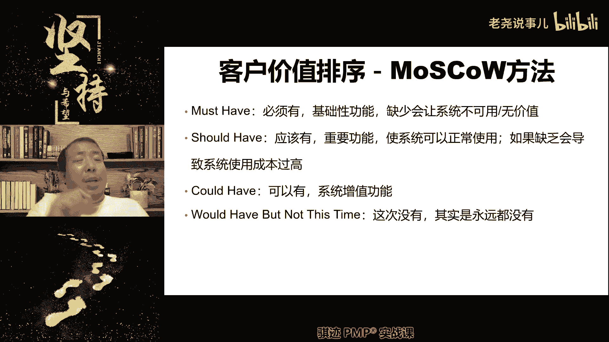
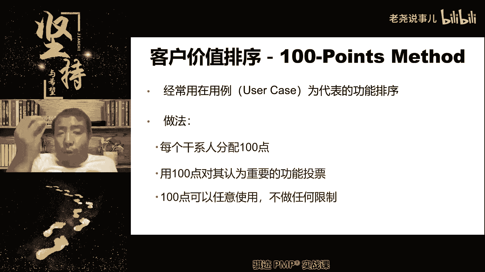
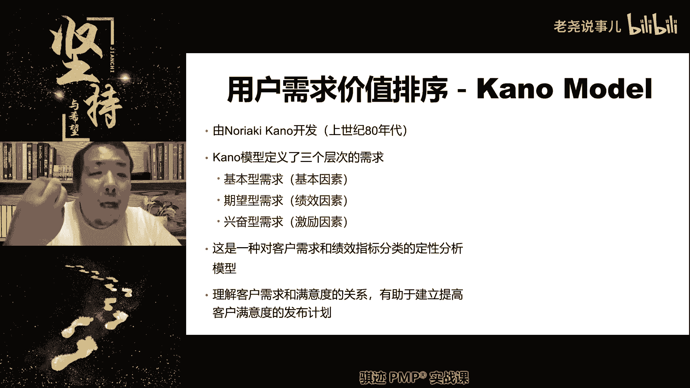
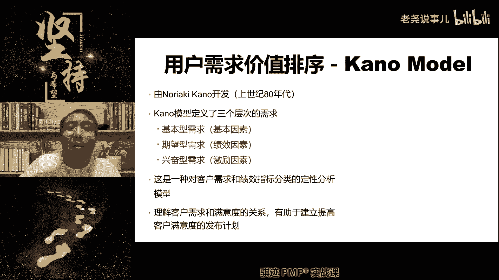
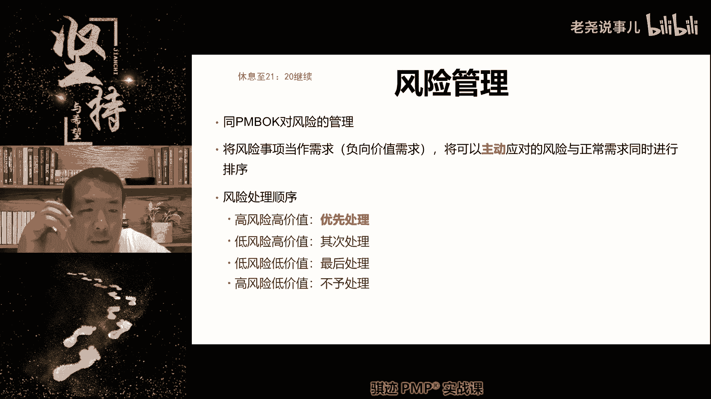
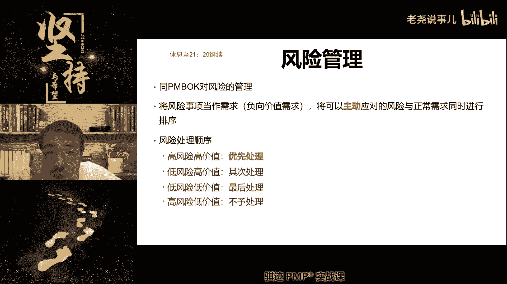
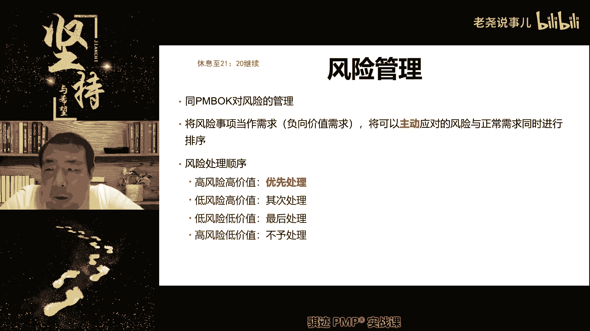
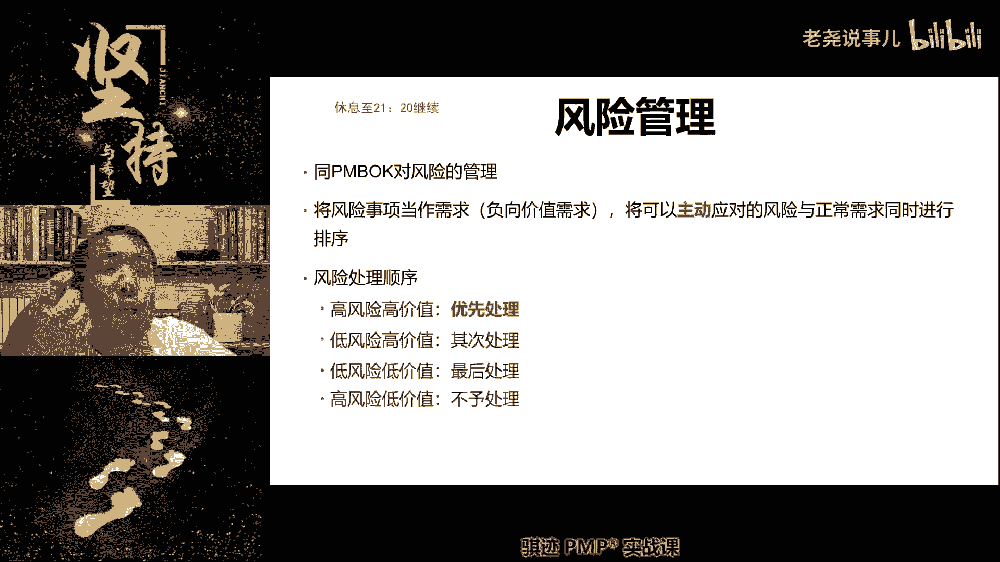
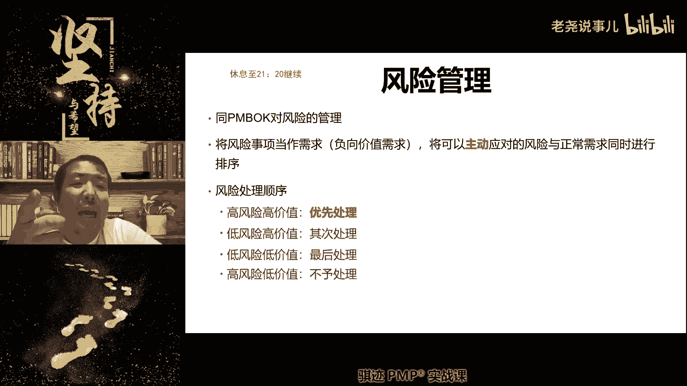
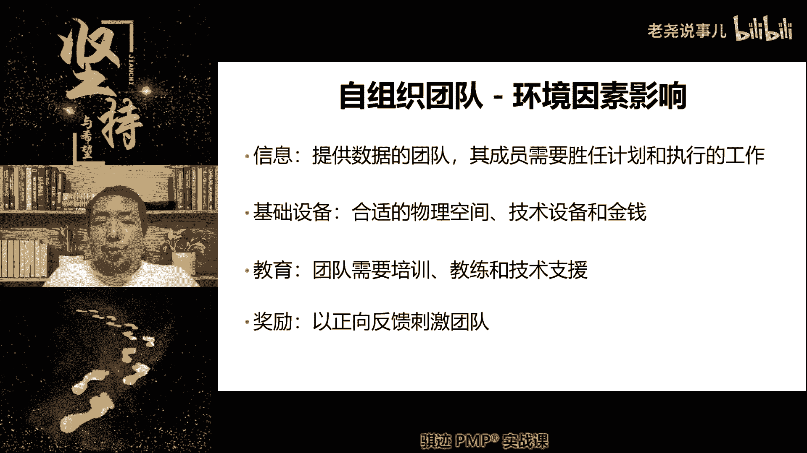

# （收费视频完整版分享）PMBOK第七版课程PMP考试报名认证培训精讲-零基础项目管理第七版教程最新版直播课回放视频免费课程资源-骐迹教育谢阳主讲 - P32：12-2敏捷专题中 - 老尧说事儿 - BV1ek4y1s71N

去评判需求的级别。

那么color model呢是从主观角度去评判。

这个需求的分类，它使用区别，但是两者都都会在适用的场合有效的注意啊。

需求不是说你认为它重要，它就重要，很多时候需求的重要度，也来自于需求提出方的主观诉求和感受，这一点请注意，所以不是所有的东西，作为开发团队和项目经理的，你能够从客观决定它的。

很多时候你的管理还要遵从于主观意愿啊。

这个我们刚刚讲到再说啊，我们先讲莫斯科法则，客观的就是你客观看待用户提出的需求。

你会把它分为四层。

第一层must have，必必须得有没有这些功能系统就没有价值，好我们来举个例子。

微信的各个功能当中什么功能是must have。

请告诉我，微信的功能当中哪些功能是must have。

聊天。

文字沟通和语音沟通支付。

不是有很多人是不用微信支付的啊。

扫码加好友。

微信的must have和它的核心点其实很简单，文字和语音视频，有时候甚至都不是文字和语音沟通。

是微信的master海对信息接收。

信息收发，微信功能当中什么功能是，什么叫吧，应该要有，如果没有这个功能。

微信就会变得可有可无，价值大幅度降低，或者使用微信其实也没有那么好。

那是什么，微信支付朋友圈对吧，现在还有什么微信视频号小程序，这些都是微信的SHADER开发，没有这些功能，微摇一摇。

哪位同学摇一摇的啊。

啊这些功能啊都是什么，都是呃让人们更喜欢使用微信，而不是说他必为了这些功能而使用微信，明白了should have的意思，就是不是你选择这个功能的必然理由，但是是什么，你喜欢他的理由对吧。

哎对对的啊，漂流瓶和摇一摇，现在变成时代的眼泪了，大家玩的越来越少了对吧，因为这个东西就是不可能被取代，所以它是可以被取代。

但是这个东西呢依然是它的重要的功能的卖点，对不对啊。

所以这是学的很啊，所以对老师来说，微信支付很重要，因为微信支付对我来说很方便。

因为我不用支付宝，所以微信支付是一个什么，当然我还会有备用手段，用用用闪云闪付，银联云闪付对吧，那么微信有什么功能是could have可以有。

但是就是可有可无的那种微信上面的购物对吧，大家大家打开哎，拍一拍撤回来。

拍一拍撤回还不至于不至于我觉得最可有可无，我相信大部分东西都觉得是可有，可是微信的第三页发现里面的那个什么，那么微信里面发现第三页里面那个什么购物啊，那个什么什么搜一搜看一看啊。

这些东西是不是啊，我相信大部分人使用的频率，和对他的依赖程度都很低，对不对，小程序都是虚的，还不觉得小程序越来越多都是虚的开，因为小程序确实很方便，但是微信购物你们多少人经常会使用的。

我相信这个比例不高吧，你们多少人会经常使用微信的，搜一搜啊对吧，看一看啊，这些东西也是很少了吧，这就属于真的属于锦上添花的东西，微信借贷啊，微信借贷到不一定是，但是你属于这两者之间啊。

大致明白这意思啊，大致明白明白，这我们用微信举例，大家都能都能理解对吧。

最后一种呢是what have but not this time，就是对微信来说，这个东西是实则没有必要的，可以强行加上去，但是没有必要，你们想想看，微信上面强行加上去什么功能是可以有，但是没有必要。

想一想。

开机动画，哈哈嗯有道理，微信的开机动画其实是有的，开机画面没有动画也是有的啊。

还有呢广告，那就错了。

广告是必须的对吧，腾讯套广告要赚很多钱呢，这倒是必须的，还有哪些，想想看。

行程吧。

66666666666666啊。

对啊。

有同学有一位同学尾号5428的同学说了，已读已读。

已回，这些功能都是什么啊，钉钉啊，那些什么，那么微信为什么可以有，但是它放在企业微信当中，是因为这些东西严重影响了微信的社交属性。

它可以做的就非常简单，但是它会严重威胁微信给人们创造的，自由社交属性，所以你看到微信当中，它会显示对方正在输入对吧。

但是它不会显示对方这条读了还是没有读，就是因为为什么，这会使得人们认为啊沟通被干涉，被监控，从而放弃使用危险，所以它是可以有的，但是其实它不会增加，我微信通过什么在企业微信啊。

在那个叫什么的其他的产品当中实现啊。

腾讯那么阿里来的钉钉当中实现对吧，对呀。

所以他就不会放在微信的，我们没有说企业微信对吧啊，这是一个很典型的例子啊，这个例子就举得非常好啊。

所以通过这样的排序，我们其实就知道了。

我们做一个微信哪些是必要的功能，哪些这个必要功能至上的。

我们重要的功能啊，卖点啊，重要的功能的卖点，那么接下来哪些功能呢是可有可无的啊。

锦上添花的，而哪些东西我们是绝对不会做的对吧。

然后这接下来这个这个100点法则我们介绍啊。

100点法则其实比较简单，100点法则呢则是认为什么呃。

用一个人的判断或者少数人判断啊。

一个需求的级别呢是不科学的，所以100点法则运用的什么是投票决定。

当出现一个需求的时候，所有和这个需求相关的人都是该系。

然后他们可以将这100点点数呢。

分配在一个需求，一堆需求或者若干个需求上进行分配。

也就是说我们这里有一堆需求，然后呢然后呢我们这一堆需求当中呢。

我们会对这对需求当中的若干个需求。

来进行投票，我认为这个需求对我来说价值高，投50分，我们就投50点，那个需求呢对我们价值比较高。

不不怎么高，我们就不投啊，这个需求呢可有可无，我就投个五点，然后呢我们可以既投完，也可以不投完。

也可以把100点都投在一个需求上，也可以把100点分配在若干个需求上。

进行这种投票，然后当所有的干系人把这些投票投完之后。

我们对所有需求的得票进行统计。

选出得票最高的纳入实现这种方式。

是不是像那那那那那我们网上玩投票，然后什么海选。

什么先海选，然后纳入了什么什么线下对吧，这种前几年很多那种那种那种综艺的。

那种那种那种选秀节目对吧，是不是经常有啊对吧啊。

这个就是什么100点法则啊，100点法则好。

所以这个方法其实是比较简单的，那这种方法可以避免个别人。

对于个别需求的偏见，可以使得需求在呃所有人当中形成一种啊。

公平的投票是决定的一种啊。

优先级高地啊，但是这种方法呢也有其缺点。

什么缺点啊，相对来说投票的效率比较低。

然后频繁地组织很多人投票呢，呃这个事情也不太经济啊。

这是他的缺点，这就是所谓的100点法则，100点。

One hundred me，OK这个也能理解吧。

所以莫斯科法则是根据必要性与否。

一个一个来啊，它的缩写是故意错的。

叫莫斯科卡子啊，must should可以问。

100点法则，那么我们把这个讲完吧，最后我们两个卡color model。

卡科诺模型，Color model，它的定义是定义。

将需求从主观角度去定义三层需求。

注意他的角度是主观的啊，不不需要客观的去衡量这个东西的重要性。

因为一件事情，他的主观重要性和客观重要性。

可能是不一样的啊。

比如说我们举个例子啊，当然不带有对任何人带有恶意啊。

某些对于某些爱美的女生来说，吃饭不是一件重要的需求。

但是美颜打扮自己是一个重要的需求对吧。

所以在ko model当中基本需求是什么。

我要变得漂亮是我的基本需求，吃饭呢是一种基本需求，甚至是治很多对女生来，很多女生来说是一种基本需求之外的什么。

这种期望需求能稍微吃一点就可以，我不希望吃多少或者吃多少，我只要能够让我自己变得漂亮了对吧，但是你用莫斯科法则去进行分类的时候。

那就不是了，吃饭是必须的，如果不吃饭，人就会饿死。

死了就什么都没有了，对吧啊，一个漂漂亮亮的呃死人生没有意义对吧。

明白我的意思吧，所以科的模型是从主观角度去区分需求。

它是看需求。

对于客户而言，对客户而言，他的满提高他的满意程度最高的那些需求。

我们称之为基本需求，只有达成了那些需求，客户才会满意对吧，所以对爱美的女孩子来说，她的基本需求是什么。

我一定得漂亮，我不允许在任何的社交场合场景当中出现，不美丽的我，那么对于叉老师来说，基本需求是什么。

我的基本就是我希望你们每个人都考过PP，然后骄傲的出去跟大家说啊，我是超老师教的。

哈哈哈啊啊，这开个玩笑啊。

这就是基本需求啊，那么呃是客户达成满意的必要条件。

达成满意的必要条件。

那么什么是期望需求啊，来了期望需求，如果我们以以查老师举例的话。

我希望你们在考出PNP的基础上能够学会，但如果对于基础不深，或者是经验不是很丰富的同学，能够学会一些。

项目管理的原理，道理能够帮助大家从做技术做事情变为做管理。

那么这个我会觉得什么有一种锦上添花的感觉。

这叫期望需求啊，我我所以我在上课的时候会不仅仅讲理论知识，也不仅仅讲考试会考什么东西，我会讲一些实践当中的道理，希望大家不仅仅通过我的课程。

学到怎么考过片子，也希望大家通过我的课程学到怎么去做管理。

当然是比较基础的管理啊，这是我的期望需求，那我的兴奋需求是什么，100个学生当中。

能有一个学生在学完我的课程之后以后，见到别人就说我是叉老师教出来。

那我就很开心，这是一种我不抱期望，不抱期许，但是如果有会让我很兴奋。

很意外的那种意外之喜的那种东西，叫做性能需求。

你可以认为认知为意外窒息。

意外的收获这种感觉啊，因为虽然你们在现在我看听听我的课很热闹。

但其实啊，我的很多的学生在听完我这个循环之后。

可能若干年之后呢，可能会就会淡淡忘记了，曾经听过这个啊，这个这个糟老头子讲了讲了很多故事，段子啊，是上课的很多很多剧情都淡忘，我们都是彼此人生当中一个匆匆过客对吧，但是100个人里面。

如果有一个人能够记着我哦，甚至是在啊嗯很多场景当中。

能够比如其他的场景当中能够提到，我肯定会一句，如果现在更进一步说。

如果能够让我知道一下，那我会觉得很开心。

好我们以我这个举例子，大家明白了什么是基本需求，期望需求和兴奋需求，所以兴奋需求是一种什么，新闻有同学说有同学在公屏里说的那个黑子啊，有点兴奋的需求是什么，我们认为这个东西是不太可能做得到的。

或者说是不抱期望，但是如果能做到。

会让我们有种惊喜感觉，就是一种新的惊喜感觉，这种叫兴奋需求，那么期望需求和兴奋剂有区别了，期望需求我们认为是能做到的，但是并不太容易做到，但是如果做到会有一种锦上添花的感觉，这种需求。

而基本需求的只是我们认为必须得做到，这个事情，如果不做到，我是不满意，就像你们如果你们没有考出PP，没有拿到P证书，我觉得就没有满足我给你们教上课的，我的基本需，无论我教的在天花乱坠。

没有人能带领大家通过考试。

对我来说，这个也总的来说也是老师教的不够好对吧。

我只能从自身认为说啊，这是我们家，这是没有满足我对于自身的一种期许对吧，这就是计算学明白了吗。

所以这些都是从主观角度去进行判断啊，那么我们学了color model，它主要作用是什么，我们就可以在今后的工作当中。

可以通过这个模型来分析客户角度。

从他的主观角度来分析他的需求，处于哪一类需求。

那么我们肯定会着重于先实现基本需求。

然后努力去实现期望需求。

在有余力的情况下再去实现新的需求，啊也就是考试先要考60分，然后再努力考到考个80分。

然后是不是能不能考到90分以上呢，没把握，但是尽人事听天命。

好好那么这就是我们这讲的一些需求排序。

那么呃呃我们稍事休息啊。

现在是21。05分，我们休息到21。20分，继续啊，休息10分钟好吧。

各位同学现在才来，有点晚了啊，好我们稍事休息一下啊。

我们翻到下一页，稍事休息，打字比较慢啊。

谅解一下。

为什么那么慢呢。

大家看我手。

所以我基本上只能用一个手拿。

受伤了，好。

偏呃呃不不偏偏就是敏捷当中的风险管理和呃。

我们pp原来体系当中的那个风险管理。

其实是没有本质区别的，注意没有本质区别的。

我们也会有风险登记册，也会有风险的预防措施。

风险的应对措施，风险的应对规划等等等等等等这些东西。

但是我们将风险的应对措施列为一种需求。

它的管理是对风险列为需求，而且是一种负向价值需求啊。

所以如果不做会造成损失，就是我们讲的需求。

一般讲的是负面风险啊，负面风险啊。

不是四象限啊，注意，那么我们会将风险视作是一种不做。

会产生损失的一种需求，然后参与排序。

我参与排序，那么在处理风险的时候。

如那么注意，风险有很多时候是不会独立存在的啊。

我们这里讲了一点，其实是风险是不会独立存在的，我们我们经常讲就是什么高风险。

高收益，对不对，风险是伴随着我们做某我们在敏捷的项目中。

往往是伴随着我们做某一件事情而产生的。

所以我们当面对各种各样的事项的时候。

如果这个事情我们我们给你举个例子啊。

如果这个事情不做，会产生高的损失，做了啊就是把这个风险给克服掉了。

就不会有损失，这是第一种，第二种呢是这个这个事情呢不做是没有损失。

做了呢会有高的收益。

那么我们会优先去处理高风险高收益的事项。

而其次才会去吃有驴低风险低收益的事情。

诶有些同学说风浪越大鱼越贵。

有道理有道理啊，那么为什么会有这样的思想方法。

那么来了敏捷当中，为什么我们提倡当收益相同的。

也就是说不做损失和做了收益。

A事件不做会有很多损失，做了就没有损失，B事件呢不做没有损失。

做了会有很多收益，这两个从程度来说。

努力或获得汇报程度来说是一样的，但是我们为什么会优先去做高风险。

高收益的事情，为什么会去做这件事情。

因为风险是一种不确定性。

我们后面会讲到的风险管理，其实是在我们后面的绩效益当中。

它属于不确定性，绩效率，那么敏捷当中我们都是通过什么反馈来获取。

对外界的感知，要注意这一点啊，所以当我们要去处理风险的时候。

越早处理高优先级的风险。

高程度的风险越早化解。

它，对整个项目的价值维护就越有利。

这句话能听得懂吗，因为低风险高收益的事情。

无论是早做还是晚做，迟早都是我们的。

知道吧，所以敏捷做事情呢有点像什么叫吃着碗里的。

看着锅里的，碗里的已经是我们的。

迟早是我们的，但是呢风险高的是还没有装到碗里的。

在锅里的那个是高风险，那么我们先想办法把锅里的先吃掉。

然后再慢慢吃碗里我们能吃到的价值是最多的。

所以敏捷优先在价值相同的情况下。

优先处理风险高的需求。

就是这个道理，因为又越早处理高优先级的风险。

我们可以通过迭代快速反馈来降低风险。

获取收益，从而在整个项目周期内。

能够获得最高价值的回报，明白了。

所以这就是敏捷当中的原则。

优先处理高风险高价值的需求，接下去才去处理低风险低价啊。

低风险高价区，但是当价值是低的时候，只要价值是低的时候，无论你风险高低。

都是往后处理啊，我们还是以价值为优先，那么当价值都是低的时候呢。

对不起啊，高风险低价值这种事情就是最不经济的。

对不起，这个时候反而要最后再处理或者不处理。

我们高兴就不做，不做不错对吧。

有一件事情做成功了，能够赚100块钱，但是一不小心如果做错了。

会损失100万，这种事情你干嘛。

预测型的预测性，就是我们传统的思维叫趋利避害。

在预测性当中，我们默认的思维模式都是什么。

尽可能的不要冒风险或者化解风险。

如果一件事情是风险高的，一件事情是风险低的。

两者事情价值是相同的，我们优先做价值低的事情。

然后就这个风险低的说说啊，所以就好了啊。

优先做风险低，所以这就是敏捷和预测的区别的地方。

在预测性当中，我们优先做高价值，低风险，而在敏捷性当中。

我们优先做高风险，高价值。

明白了吗，明白了扣一不明白的扣二啊。

这个是个考点，我们在啊敏敏捷的。

偏僻的敏捷相关的考试当中啊，相关的考试当中经常会考到这一点啊。

好如果这个大家都明白的话。

不明白还可以继续问，我，没问题啊，那你继续往下讲，那么敏捷当中的合同。

我们简单讲的就是什么，一般是使用工料合同，然后使用定制化的合同。

使用那种啊，我们的约定迭代次数。

但不约定范围，这种合同啊，预测型我们其实不是说优先做高价值低风险。

预测性是优先做高价值低风险。

敏捷是优先做高价值高风险。

因为敏捷通过快速迭代来化解风险，然后更早的获取收益。

就是我就是我前面那个举的例子，先吃锅里的，再吃碗里的。

锅里的风险高，碗里的风险低，碗里的迟早是你，对不对。

好那么敏捷后呢，我们这里稍微提一下就行了，考试考的比较少。

那么接下来讲打造敏捷团队，注意啊，打造敏捷团队当中。

这就有了我们在很多的场景考试场景当中，首先就要讲到考试了啊。

我们往考试贴近一下，就是考试题当中。

你怎么分辨这个题目的场景是敏捷场景。

它是混合型场景还是预测性场景，都占1/3对吧。

那么请记住，如果考试当中出现了自组织团队啊。

出现了自组织团队，出现了分布式的。

你大致可以认为啊，这个虽然不太科学，但是你就为了考试就默认一下啊。

出现了分布式团队啊，然后出现了啊啊教练啊。

敏捷教练或者教练这种啊，出现了团队自我决策，类似于这种字眼的，我们默认它就是敏捷环境。

敏捷项目，这么说敏捷好像有点急功近利。

不是敏捷，他是为了价值最大化，先做高风险的，有利于啊先把不确定的东西先拿到兜里。

然后再做确定性高的，能够实现价值最大化对吧，我不是已经给你们举的例子了吗对吧，先吃锅里的。

再吃碗里的，可以吃的最多呀，你先把碗里的吃完了，可能锅里的就被别人吃掉。

这是我们的打造敏捷团队啊，那么敏捷团队有哪几个特征呢。

自己是自组织团队，那么什么叫自主团队。

顾名思义就建呃，就是建立起一个什么自我管理。

自我驱动。

所以在自组织团队当中，我们的团队是自己给自己制定迭代内的目标。

第一个，第二，我们自己决定在这个迭代内怎么去进行。

迭代完成。

第三我们这个迭代的目标怎么做，我们自己去承诺啊，那么团队内每个人都是团队的一份子。

我们不会单独承诺每个人做什么。

而是大家一起承诺完成什么东西啊。

这叫做自组织，那么在自组织团队当中有哪些。

还有哪些特征呢，项目经理不会分派具体的工作啊。

你们要记住，项目经理不会分派具体的工作。

项目经理不会指导具体的技术问题解决。

这是自组团队中。

当遇到困难的时候，团队能自发地相互帮助解决困难和问题。

这些都是自组织团队啊，当寻找解决方案的时候。

团队以自我为主去寻找解决方案。

但是当遇到障碍的时候，一般由我们的那那那那叫什么啊。

敏捷项目经理向我们敏捷教练来进行帮助啊。

这是自主团队，那么自助团队当中。

我们考试经常考到一个经常考到一个问题啊，就是什么是问题。

什么是障碍，问题是技术性的障碍。

是认知和过程性的。

那么我们举个例子啊，那么自主团队自我解决问题。

那么比如说我们不知道这个功能怎么实现。

那么这是技术上的吧，这是技术上的，那么这个团队依靠自己解决。

敏捷，项目经理是不会为团队去解决这个技术问题。

怎么解决的，但是团队不知道相互怎么配合。

这是工作的一种障碍，这是一种过程性的啊。

问题团队不知道怎么相互配合，团队不知道怎么沟通啊，啊团队不知道怎么样去合理的解决问题。

这些都是过程性的问题。

那么要由敏捷项目经理。

敏捷大师去进行指导。

比如我们没有电脑啊，没有电脑是一个障碍啊，我们想写代码，但是我们没有电脑，这是一个障碍啊。

我们有了电脑，我们有了正版的开发软件和环境，但是我们不知道代码怎么写，这是个问题啊，明白了我们有了电脑。

但是没有电，这也是个障碍啊，啊所以障碍和问题处理方法是不一样的。

问题团队自己解决障碍呢。

由敏捷项目经理，敏捷大师带领团队去解决障碍啊。

所以呃解决障碍问题好比什么授人以渔不惹无。

授人以渔，没有三点水的那个鱼是问题。

你自己去补，但是如果你不知道怎么捕鱼。

这是有三点水的那个鱼，这个有项目经理。

敏捷大师指导团队去实现三点水的那个鱼。

而没有三点水那个鱼呢，团队自己去这个比喻能够理解吧。

我就不打字了，手有点手有点伤啊。

那么建立自主的团队有什么好处呢。

第一我们感觉工作是自己决定的人。

当自己决定工作的时候呢。

容易自我驱动啊。

我有种责任感哦，我自己认认领了一个目标，是我跟大家或者跟大家一起制定一个目标。

那么我们每个人都有责任感，我们要努力实现目标，对吧啊，如果这个目标和这些责任，是项目经理强加给我们的。

让我们觉得哎呀，项目经理又加压榨着我们不好好做，我们就跟他讨价湖。

我们就给他三天摸鱼，两天晒网。

对吧，所以自主的团队有利于激发大家的主观能动性。

有利于让大家认可项目的各个阶段，各个迭代阶段。

包括各项目的各个阶段的目标啊，目标比较明确，每个人的天赋容易被击中吧。

那么这个怎么讲呢，因为团队是自我组织。

自我认领，自我设定目标，所以每个人很自觉的会在这其中扮演自己。

最擅长的角色，你是一个程序员，你擅长写代码，他是一个测试人员。

他擅长写测试用例，他是一个什么啊，是个什么东西啊，他是一个他他是个硬件专家，他擅长什么啊，组建硬件对吧。

每个人能够各司其职发挥专长啊。

那么敏捷团队还有什么特征啊，虽然每个人有专长特长。

但是我们又是跨职能团队啊。

注意这里就又引出了一个关键词敏捷，这个自主团队里面有很多关键词啊。

敏捷团队有很多关键词叫跨职能团队，什么叫跨职能团队啊。

就是我们有一专多能的水平。

什么叫一专多能。

这个一专多能在这里我们有一个特长，但是呢我们对其他的方面呢也有所涉猎。

也可以承担一定的工作啊，所以在这种团队当中呢，相互彼此配合会更容易。

因为比如说我擅长写代码，但是我也懂数据库，我也懂一些硬件。

那么我会和负责数据库的同事，和负责硬件的同事呢能够有共同语言。

能够良好目呃，默契配合，这种团队的效能呢容易提高。

而且万一比如说我是写代码的，我请了几天假，我要回老家，我端午节去度假，那么我们的迭代计划不能被落下来，怎么办呢，我们可以让写啊写数据库的管理据库。

这个同事他也懂代码。

他可以替补我们一下，所以敏捷团队当中呢是跨职能。

一专多能的。

这是所以跨职能团队也是敏捷团队的一个特征。

也是我们考试经常考的，用于时帮助你识别这个团队是不是敏捷团队。

这个项目是敏捷项目的一个特征啊，大家请记住跨职能这三个字。

那么当然了，这在现实实践当中经常被人诟病，敏捷团队要真正实现敏捷团队。

他的人员素质高，人员素质高就意味着什么。

马尼奥鬼。

呃讲到这里我就不得不说啊，有些企业啊这个这个这个这个讲了扩展。

我们扩展一分钟讲，有些企业啊最近不是裁员啊。

各个行业裁员都比较厉害嘛对吧，等会失业率上升很多的企业的裁员。

尤其是大厂裁员，他们为什么会裁员裁掉，然后很多人就就是很多的大厂当中。

他故意不培养出什么跨职能的团队成员。

因为什么这样更容易让你离不开它。

这个体系被他压榨，他给你比较高的工资，但是你的能力仅限于很小的一块。

你只会写代码，但是你离开了大厂那个环境再去写代码，对不起。

没人要你，他很坏对吧。

所以啊这就讲到我们个人，就是，所以当你要需要筑起足够的职场的护城河。

或者能力运动，那么我们每个人其实在职场当中，职业生涯当中也要去有什么。

像敏捷的团队成员一样，最好能够有一专多能啊。

然后才能适应不同环境啊。

什么都要懂一点啊，但是又有专长，最好有不止一个专长，然后就什么都要懂一点才会好。

这个在it行业，尤其是那个啊，所以我们现在看到很多IT行业写代码了，下岗了之后不知道干什么，然后失业工资暴跌啊。

啥家庭房贷还不起，很多时候你会发现这种人呢，这种类型的人员，他们背后有个共同特点，就是什么能力很单一。

他能力可能不错，但是他被大长期被大厂和这个环境啊，畸形的塑造为只会很深很深的这一点，但是他没有面。

一旦这个点不要你的，你将一无是处啊。

所以这也是这一次这两年，尤其是今年以来的这个今年这半年以来。

这个形式也告诉我们什么东西啊，就是我们哪怕公司现在环境不知道怎么做。

就是大家不能局限于当前公司，要求你的各种能力。

最好是什么啊，培养一下自己综合能力，像敏捷团队当中一样有一专多能。

那么你可以适应不同的行业岗位环境啊。

好那么我回来一下好不好，那么扯多了啊，敏捷团队的特征一专多能啊，跨职能，那么敏捷团队还有哪些做法去组建敏捷团队，一我们在敏捷团队当中敏捷。

因为本身就是小团队不超过十个人。

所以我们一般来说是不会在这团队内分级别。

所以这就产生了我们这里的第一条，忘记title接受弱。

就是我们没有级别，抬头上的就是什么高低之分。

我们都是平行的，大家是扁平化的，但是每个人都有自己的定位。

你在团队当中持续定位，你团队中负责打野，你团队中负责当成一号位。

你团队负责当2号位对吧，然后给每个人都给予明确的目标。

有反馈机制，我们每个人都有充足的得到信息和反馈。

信息的渠道和机制。

需要反馈机制，鼓励团队合作啊，团队协作。

然后在工作内容上，我们充分授权团队项目经理在工作做计划，做评估，做估算的时候呢。

充分放权给团队，由团队自己决定这个项目的迭。

这一次的迭代计划，怎么这个计划一般就是迭代计划啊，是怎么做，我们的项目这个迭代用估算是怎么估算的啊，要多少多少完成工作工作量等等，全面放权给团队去做信任团队来激发团队啊，提升团队的主观能动性啊。

这是建立自主团队和他产生的一些特征。

那么自助团队当中呢。

我们有一个词叫做自适应，就是这其实也是体现出敏捷的适应性。

适应性体现出敏捷的适应，敏捷为什么会适应啊。

就是敏捷团队当中的每一个人，也适快速充分的适应啊。

我们多变的环境叫自适应，不断的根据环境的改变而自身改变啊。

人的改变才能带来产品的改变啊。

之前有个跟你们讲过吧，什么样的人做出来的产品就是什么样啊。

啊臃肿的团队。

臃肿的人做出来的产品也是臃肿。

那么自主团队特征什么，面对面沟通，我们前面已经讲过了，对吧啊，我们有反馈还什么叫反馈还啊。

反馈还很有意思，知道吧，反馈还有很多意义上。

其实他这东西很简单，就和我们的那个一样的，就和我们村口的大爷大妈差不多。

一个人知道的，等于一圈人都知道。

唉在敏捷当中，这不是一个坏事，这和好事。

因为什么它可以使得信息最快速的传播开。

所以村口的大爷大妈的交流，某种程度上就是一种反馈。

还情报收集站。

嘿嘿对了，知道了吧，那么因为他可以花最小的代价。

让所有人都知道啊，啊村里的翠花有对象了对吧啊。

村里的张三有出息的对吧，村里的啊什么什么是怎么样怎么样的。

这叫反馈环啊。

那么不用什么啊，你先告诉他，我再告诉他们啊，这个消息传的比人说的还快。

这叫反馈还啊，就明白这个意思就好了。

然后什么叫具有弹性啊，具有弹性就是我们前面讲的，就是当某些团队成员。

如果是有一些事情，比如说他可能请几天假啊。

或者女生同学传言状态不佳的时候呢，其他团队成员可以顶上来啊。

可以替补他可以灵活的组织。

而且具有弹性啊。

那么自组织团队呢我们需要干什么，需要哪些环境。

中医药信息，我们要提供团队所需要的信息。

第二呢要给予合适的物理空间，技术设备和金钱啊。

我们要给团队适当的办公环境啊。