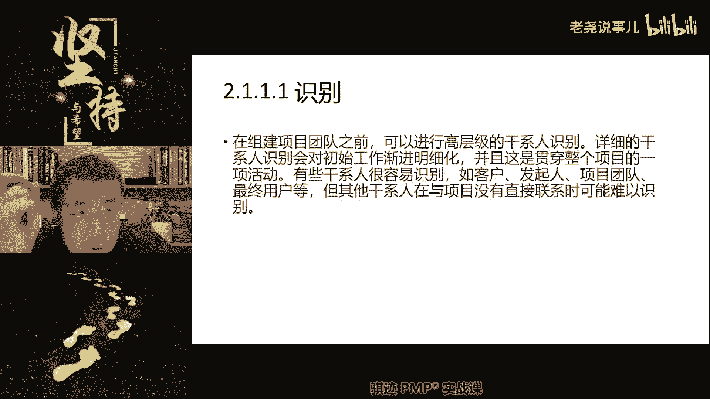
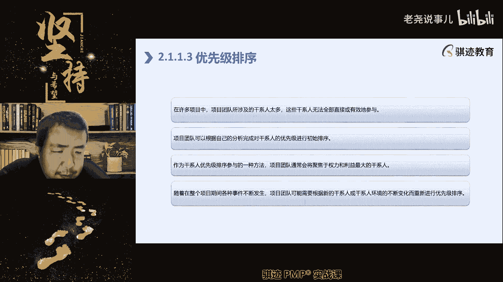
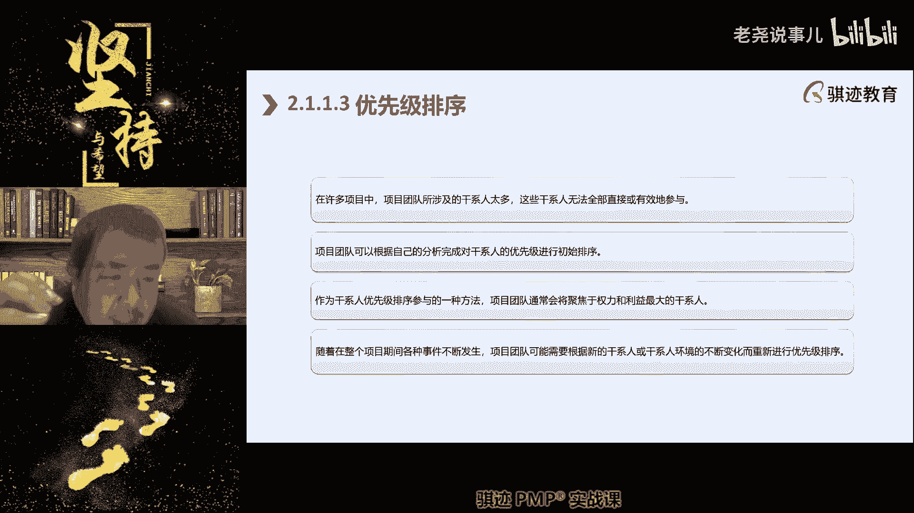
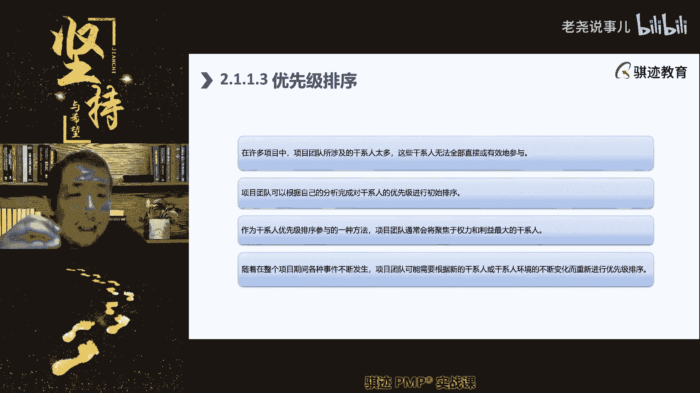
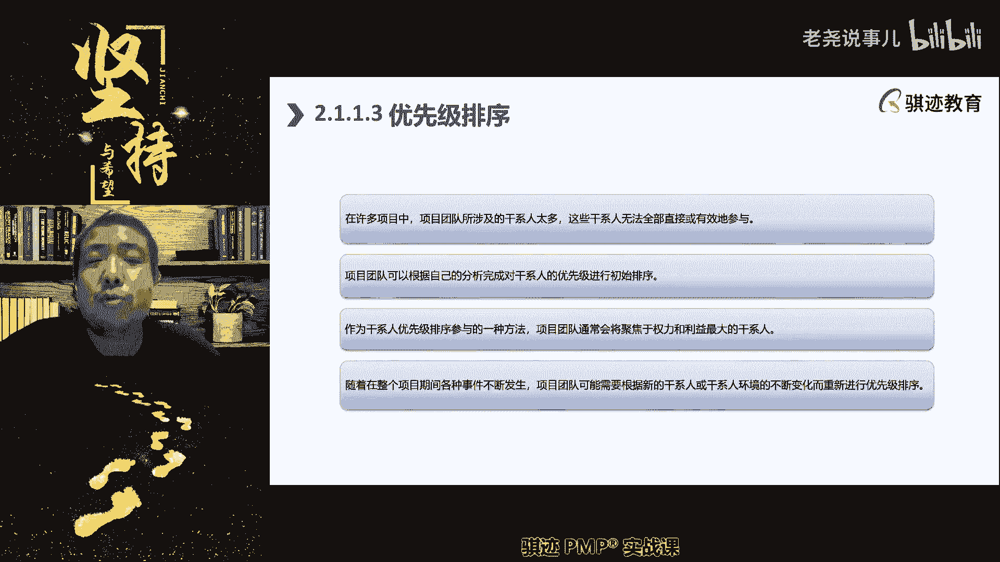
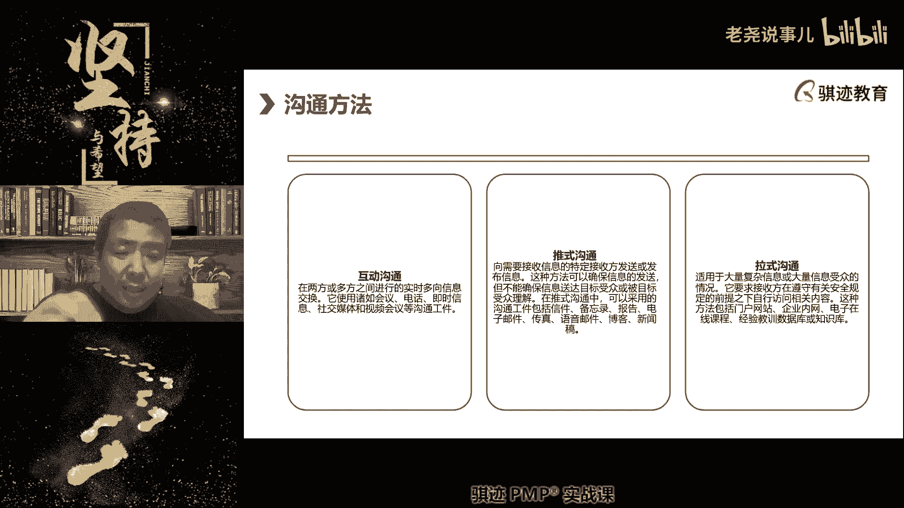
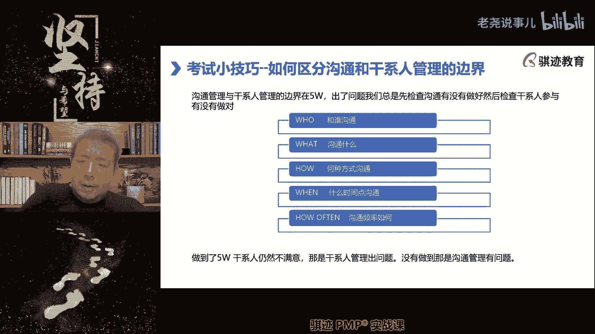
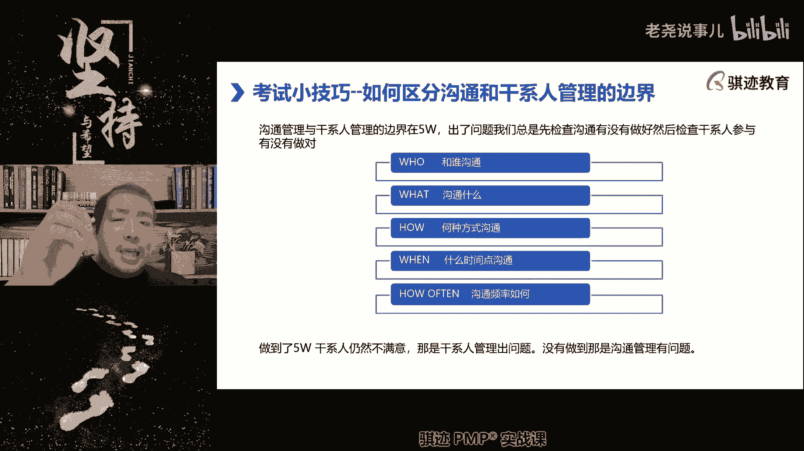
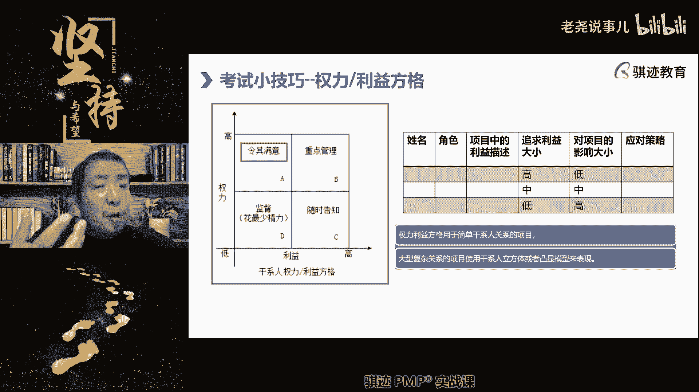
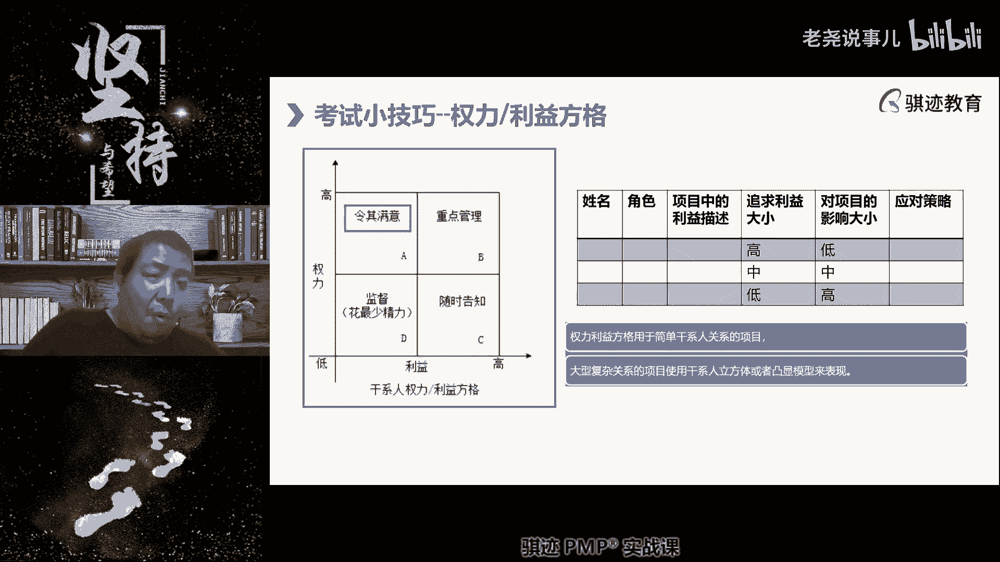

# （收费视频完整版分享）PMBOK第七版课程PMP考试报名认证培训精讲-零基础项目管理第七版教程最新版直播课回放视频免费课程资源-骐迹教育谢阳主讲 - P37：14-2干系人绩效域 - 老尧说事儿 - BV1ek4y1s71N

好你们记住一下啊，这个其实嗯嗯现在，呃不是啊，团队应该是在呃呃对项目规划阶段，尤其是制定完了项目资源管理计划之后，开始组建。

因为组建团队之前先要进行资源规划这块，我们在后面的团队绩效也会讲啊。

这里稍微信点一点，就是团队其实是在项目做具体规划的时候。

才开始组建的，项目一开始是启动完了。

有了章程之后也是没有团队的，要等到项目以项目经理为主的。

去制定项目资源管理计划的时候，再逐步去建立团队啊。

他也可能不是一下子所有人到位，是项目经理先看啊。

先拉几个人过来，先帮我把草台班子搭起来啊，不是在启动阶段啊。

是在项目的规划阶段，在做规划的时候再搭建起来。

但是啊那么这个就不细讲，因为后面我们这这节课讲完之后，后面的明天的课程我们就开始讲团队啊。

里面有很多很多的知识，团队也是版本之子啊，人员过剩环境对吧，版本之子，那么我们要讲的是。

在团队建立起来之前，我们已经开始识别干系人。

这个识别干系是渐进明细贯穿始终的。

那么这个识别主要就是依靠什么，是项目经理。

主要就是依靠项目经理，那么在一个项目当中，我们一般都是优先会识别哪几个。

必然会有的干性发起人啊。

用户我们创造一个项目，他肯定会有最终用户或最终受益人对吧。

不一定会有客户注意啊，一个项目如果他是甲方客户，有可能是没有客户。

有可能是没有客户，但是他一定会有最终受益人，你在通过这个项目创造的产品成果。

服务一定会有人因此而受益，可能是组织受益。

也可能组织当中某一个人或某一群人受益，那么他是最终受益人或者最终用户是我们的。

什么要识别的啊，如果我们是有甲方乙方的。

我们属于乙方角度，那么我们可能还会有什么客户啊。

然后由他们身上可能还产生了一个什么，我们之前讲的从县官到县管的一个什么识别。

先识别谁是县官对吧。

客户实现管，因为什么客户拿着玛尼对吧，客户出钱的客户是大意。

但是大也不一定管事，他可能把这件事交代给了他的手下的。

他的是他的手下啊。

他的管家，他的管家，所以管家就是县管。

县管，我又想起个段子啊。

当年啊大家和声大家都知道对吧，和珅当年权倾朝野的时候啊，外地的官儿要想见和珅，没有一定级别是见不到的，甚至于说要想见和珅的管家都得先交银子。

一个官要见另外一个官的管家得先交银子。

你听得懂吗啊，而且人家一般管家只借什么五品以上。

五品以下的，连管家都见不到，这就是典型的县官不如现官。

OK我给大家举个例子啊，然后大家让大家知道就这么干型的识别当中。

它往往会有什么逐步渐进，明细延伸和最终挖掘出来。

那么你有时候你会发现，就是我们大家在工作实践当中就会发现什么，有时候你会发现，客户环境当中的老板可能不是拍板的人。

老板可能都听信于他。

关于这件事情的某一个助理和秘书，真正能够决定这件事情呢。

是老板一个不起眼的助理和秘书。

能决定这件事情啊，明白啊，就举个例子给大家体谅一下啊。

所以识别关键干系人是非常重要。

你能找准谁是能真正拿主意的人，在一个乙方项目中是非常非常重要啊。

我们相信我很多，我们很多的学员其实对这一点是深有体会啊。

哎呦哎呦。

不好意思，诶嘶诶我好像贴错了，接下来是识别。

识别之后是那个不好意思啊，2。1。1啊。

那么我们先稍事休息一下吧，要么就先收拾小关的PPT贴错了，不好意思。

PPT做了，然后其实识别之后，还有一个还有一个我们讲的。

识别之后有一个理解分析啊，识别时候有一个理解分析，然后再优先级排序。

但是我P啊，前面的PPT有点小问题，我贴都贴错了，那么就大家先休息一下。

我们休息到啊，现在20。50分。

我们休息了，21：05分继续，然后呢我中间把PPT改一下好吧。

好大家大家先休息。

Hello，同学们啊。

OK都回来了吗，我们继续上课啊，啊群里吼一下，继续上课了，回来的同学，大家老规矩啊，懂得对吧。

老规矩扣个一啊。

好那么我们继续我们前面讲了干系人的识别，但我们识别完干系人之后，我们应该初步的就了解了干系人的初步的期望，它的重要性啊，他的重重要性，然后初步的啊，然后干系人对于我们项目的态度，他的具有哪些能力啊。

具有哪些技巧嗯啊能力等等等等，这些东西都是初步的了解。

那么了解之后呢，接下去我们就对它进行理解和分析。

另外该系人他自身的特征，我们项目中遇到的人自身特征是一方面。

但是我们对于干系人的如何去运用，使我们的事情，所以我们理解和分析，是为了更好的能够与干系人合作。

能够把项目做好啊，所以我们会考虑到干系的几个方面，比如说干系人对项目的立场和态度，该案系人他的权利啊，作用啊，态度啊，信念和期望这些东西，以及我们前面讲了，我就前面就反复讲了，那个那个就是与项目的临近。

县官不如现管项目的利益相关性啊等等，对这些东西进行分析啊。

然后呢我们就会得出一系列分析的结果啊。

分析的结果，那么呃这些分析结果，可以便于我们后面对干系人进行什么管理安排。

优化啊。

那么干性能管理安排以后呢，我们后面会放在这里讲啊，就是考试要经典的还是权利利益方格，那么PMBOK的DDDDDDD第七版的呀。

好貌似又不怎么考，我们之前第六版的新课纲里讲的。

那个权力力立方体和那个啊，但是我们后面也会讲一讲。

好那么我们对干系人进行分析。

那么这个分析包括什么，干系人当权与项目利益相关程度如何。

它有哪些能力能够给我们提供哪些帮助。

但是它有可能有哪些局限，可能会对我们项目产生负面影响，这些都要注意啊，注意人是复杂的，该信息管理一个难点就是人是复杂的，他既可能帮助我们，也可能害我啊，就是就只有我又讲了一些老生常谈话题对吧。

母爱是每个人成长过程当中都必须需要的。

但是过度的母爱会导致一些有缺陷的人格，行为和世界观认知，所以在每个人成长过程当中，这个关键干系人母亲它的作用可能既有正面。

也有负面啊。

如果处理的不好，所以有些人呢可能什么过度的。

呃呃呃直播还能暂停，这是直播呀，我们前面中场休息啊，上课不能两个小时打电线啊。

所以啊不要打断我啊，所以我们人生这个项目当中有个关键的干线。

就是母亲，母亲既有可能保护了我们。

但是过度保护我们，也有可能造成妈宝知道吧，所以现在外面有个很嫌弃的词叫做妈宝男哈哈，就是妈宝保护过度，既能让你免受很多的挫折伤害。

但是同样也可能让你长不大。

所以干系人对我们的项目是，有时候情况是复杂的，你要确认清楚他对你的影响。

正面程度，负面甚至同时皆有啊，我是举了这样一个例子能明白吧啊，然后他的信念理念，他的观念等等等等，这些东西都会对项目产生各种各样的影响，也有可能是会潜在的风险因素啊。

好，那么这是我们讲的对于干性的一种分析，但对于肝性分析之后。

基于对肝性的分析，我们进行优先级排序。

好有同学说我们的画面不动了，没关系啊啊大家卡不卡。

我应该是不卡的吧，有可能有各位同学网络可能有点问题是吧，没问题吧。

我们啊我们回来啊。

我们可能被打断一下，那么所以我们对于刚性的管理，因为项目中的干系人总是数量很多的啊。

无论什么项目，干性的数量可是很多的，所以我们要做重点管理。

将最有限的精力投入到最重要的人的干系。

人的管理实践当中去。

所以我们会进行优先级排序，注意啊，优先级排序在管理当中啊。

都是一个非常重要的一个法则啊，我们的后面的啊不确定性教育，就是我们的风险管理当中，也会使用到优先级排序，因为风险也是管的，管不过来的，所以你只能抓重点，所以优先级排序的目的都是为了抓重点，包括需求。

为什么也要优先级排序，也是要抓重点，关键需求啊，所以在干性的识别过程当中，我们自啊这和管理过程，当我们自然也针对于识别的干型，进行优先级排序，注意这个优先级不是不变的。

而是动态调整，因为我们前面讲什么，干系人可能在某些阶段对我们项目影响很大，但是过了某些阶段。

他可能就影响很小，比如说政府部门的某个实权官员。

可能在你拿到政府批准之前，他对你项目是个至关重要，你拿不拿不到这个呃，政府的批文，你的项目就做不下去，但是你一旦拿到了这个批文呢，他对你来说就没什么作用，把太监批准你了。

那么你可以往下干了，他对你的影响就很小，所以你要看项目处在哪些阶段，与你项目当前的关键工作相邻近，相影响的，以此来动态调整你的优先排序。

知道吧。

还有呢要注意点啊，这个这个又回到一讲做人啊，就是说你不是说等到要用到这个人的时候，你才去打磨的啊。

就是又是一句中国人的古话，中国人古人当中与人打交道的其实朴素思想的，有一句话，我小一直小时候我妈就跟我说，叫做人不能有时有人啊无啊有事有人无事无人，就说当你求到别的人的时候呢，你就眼里有这个人。

当你不求到这个人的时候，眼里就没有人，这是不行的对吧。

所以我们对于干性人的管理，在理回到理论上都是这样，我们对于该系统管理当中，当我们可能已经开始需要运个运用到这个，在项目中要运用，要使用或者是要涉及到这个干线之前，我们应该已经及时的提前。

对这个干系人进行管理参与啊，我们我们讲后面讲叫管理参与，就是跟他进行接触啊，对他进行影响。

然后让它正确的定位，在我们的项目当中已经开始这么做了。

不要等到啊，一定要要运用到这个人。

或者涉及到这个人的时候，你才去跟别人打交道，这时候呢有时候就就很多场景当中。

就会显得对人的不尊重或是对人的不重视啊。

啊这个也是为人之道啊，其实中国外国都是这样的。

就是当你要求到别人的时候呢，你才去出现在别人面前。

当你不求别人的时候呢，你就像消失不存在一样。

你这个人的做人其实是不够好的，明白这一点吧，所以干线管理的一个点就是什么，你首先预判到你在后续的工作当中，会涉及到哪些干系，预先于给他们啊，接触宇轩与他们接触，然后设定恰当的项目参与程度是非常重要啊。

后面我们讲到参与会讲什么是参与程度啊。

然后根据这些我们排优先级顺序，越是对接下来的工作有较大影响的。

它的优先级就越是高，注意吧啊因为接下来马上就要用到这些人了。

所以他优先级会更高一点啊，那么不当前直接用到呢。

可能看呃呃优先级可能稍微会低一些，但是有一些人他的优先级始终是很高的，说客户发起人，像这样组织的高，与组织与项目相关的高层，这些干系人都是优先级很高的，因为他们是权力高，地位重的人，我们后面会讲到。

他们始终是应该重点管理的人。

在干事业管理当中。

好接下去说了。

那么接下去我们就会开始什么干系人参与，干系人参与是什么。

是你与干系人接触，并通过你或者项目管理团队。

你通过项目管理团队来使得干系人能够，正确的项目当中啊，发挥它正确的价值。

这个过程你有很有可能是没有办法。

指挥和限定别人怎么样，但是你要引导他。

诱导他怎么样。

啊比如说我们举个例子啊，叫甘心参与。

我们举个例子啊，比如说你的某项工作一定要客户的业都签字。

你的某项工作一定要客户的验收签字，但是呢客户什么时候配合你验收签字呢。

不知道，那么他也你也没有权，但是你也没有权利决定客户什么时候批准你。

认签字，签字签字，但是如果某一阶段的工作不批准验收签字，可能就影响到下一阶段的工作，那么这个时候你就要对客户具有验收。

签字权利的那些干县呢进行重点的参与管理，比如说什么，你在即将达到，即将达到本阶段要签验收签字状态之前，就可以提前与那些有签字权利的那干县金，沟通了啊，我们项目马上要做出成果了，到时候为了你看看。

到时候为了能够及时的签字啊，麻烦您，那到时候我们看一下你在什么。

您在什么时候有空，最近这段这段时间，什么时候有空来参与一下我们项目。

对我们项目进行验收，莅临指导，你可以讲讲的话所讲的客气点啊。

有求人办事嘛，是这方面客气啊，然后能够能够签字对吧，然后预先安排好时间结果。

但是我们讲客户在我们的之前学的里面呢。

客户能决定是否通过客户验收，但是客户并不能直接去指定项目范围，他只能指定去需求，所以如果客户在验收之前，他提出了他认为很专业的。

他很认为很专业的一些意见。

那么你应该适度的进行什么控制啊，告诉就是暗示明示或者暗示对方啊，你的意见我们会重视，但是你与我当前我们当前的工作提的部分要求，与当前的工作呢可能并不具有必然的联系对吧，控制肝癌系人的参与。

因为有些人会过度参与项目当中。

什么东西都要掺一脚啊，你们工作中肯定会有些人对吧，什么事情都要掺一脚，明明跟他不相关的，还要发表点意见啊，搞得大家很烦，这个时候你要体现出项目经理的管理能力啊。

要使得他的行为可以在你的受控范围内。

去发挥它的作用，而不要去施工。

有同学说老师讲讲怎么请吃饭，哎这个和上课就没什么关系了啊。

这个是属于人际关系啊，有空给你们讲好吧，我们先把课程讲完啊，所以我们可以通过与干系人的沟通来，控制引导干系人的采购。

比如说你你担心某个你比如说你识别出某根弦。

它能比如说跟按承接上面那个例子啊，他可以审批你的项目经验收你的想。

但是你通过之前对预先，对于该系人的了解和识别。

知道这个人很就很喜欢出点馊主意啊，他自觉的水平很高啊，什么东西都往广一点搜一点，那么怎么办呢，怎么控制这种干型的参与呢。

那么就是说如果我们如果我们不能够。

因为他是客户代表。

你能管得到，客户代表肯定管不到对吧，你作为乙方，对甲方爸爸我们是谦卑的啊。

混口饭吃的，乙方啊，甲方爸爸提意见，我们可当然当面拒绝，肯定是不好对吧，那么我们可以采取什么方法，很多同学就有实践了，我们可以就是说像像古人一样的啊。

我们可以故意卖两个小破绽。

在让他参与项目的验收过程当中，可以故意卖两个很低级的小破站。

让他故意发现，然后他说哦，你这个东西要改一改，这样的改一改。

那就会有很好的，怎么就是是是其实我们是故意漏出破绽，它前面提好改进意见。

我们后面就可以把这东西改掉，故意漏给他，然后就可以避让他得虚荣心。

或者让他的啊专业感觉得到充分满足好。

那么接下来就好办了对吧，人家生命满足了之后就好办，然后呢你可以找恰当的时机。

比如再把这个话题岔开，哎哎呀辛苦了，幸亏专家指点了吧对吧，给人家点烟。

进点酒，请人家吃顿饭，然后这事情就过去了，很多专业的项目经理在在这这种场景当中。

知道怎么样适当的卖破绽啊。

来防止肝弦过度干预项目当中的东西。

万一他你什么破绽不能拿，他硬要挑你刺，可能把有些事情因为他是客户，你又管不到，反而可能把你做得好好的项目或者成果，造成造成很大的干扰对吧，你不如故意卖个破绽给他，这也是一种技巧啊，当然这种东西有很多的。

不建议我们讲的前面这种场景啊，还有一些呢是比如说什么，还有还有些时候呢是什么，该行人可能他很懒。

或者觉得项目对你他你他对你的项目很重要。

但是你的项目对他呢没有那么重要，他可能你跟他说十句。

他可能什么只会回你一句，那么这种人这或者这样一类角色，你就要更多的提前和他沟通，尽可能在有限的沟通频率下。

将信息的丰富量提升，就比如说你可以比如说你知道对方是这种人，打了一次交道，知道对方是这种人啊，你就把要跟对方沟通做这东西列的非常的清楚，一条两条，三条四条，五条，六条七条，然后希望对方拿到对方的反馈。

而且你要呃如果再写的细节，对方怎么反馈，反馈形式吗，yes或NO，什么多少数值等等，类似于小或者以什么形式等等。

都给对方写的清清楚楚，一次性扔给对方，然后让对方一次性的尽可能反馈给你。

足够的信息啊，以便于展开下面的项目活动，这也是一种参与沟通的方法。

明白了啊，这些都是我们实践当中如何去管理干系人。

参与当中会使用到的一些实践方法，那么该行业的参与其实也有涉及到一个东西。

叫做期望啊，我们这里有一个词叫做期望。

今天的这节课，其实实际理论和实践结合很多的啊，其实你们如果实践做的多的话，其实我讲了很多东西，其实你们很会理解，但与之同学可能不是从事这方面工作，可能就难一点啊，那没有关系。

那么我们有句话叫什么叫期望越大，失望越大，但是我们用另外就是没有期望，就没有动力，所以管理干系人参与要调动起他的期望，但是要让他的期望保持在合理水平。

比如说你想要某个干协啊。

组织内的啊，我们公司内的不是你项目内的干协。

支持你的项目的某些工作，那么你要给他一个期望是什么，我们项目如果做成功了啊，可以满足你的什么某些诉求，或者说可以达到某些呃有益的结果啊。

对你是有帮助的，那么你对我们项目就有期望。

当有期望这事就好办了对吧，人嘛都是利益驱动的。

当你对我们项目有期望，那就好办了对吧，那么但是如果你给他画的饼很大哦。

我们这个项目做完了，对方当然如果你饼给他塞下去。

让他吃下去固然很好，但是对方如果接触下来发觉什么。

你并不是像你画饼画成这样，他就会期望越大，失望越大，所以要合理控制对方的期望，才能够最有效的什么，能够让他参与到项目当中啊，就像啊哈哈举个例子啊，我瞬间想起，就像我们小时候啊，我小时候很少用这种手段啊。

但是也会有时候有考试考完了，知道自己考试成绩考的不怎么理想，比如说我以前经常的时候，我在小学到初中的时候，经常跟我混混说，哎呀这次考试考的没有那么好啊，让他们首先要有一个合理计划。

用这个成绩没有那么好啊，年级前十你是不要想了，可能年级前20前30还能混一下啊，啊我不要怀疑我以前就是这个水平啊，我有时候当年小学到初中的时候，有时候男的都能考一次年级前一，年级第一第二这种。

当你觉得发挥不好的时候，你就开始管理相关方的期望，管理相关方期望让他对你觉得说哎呀啊，虽然你这样很失望，但是你绝对觉得哎呀算了啊，我对你的本次考试定位啊，父母本次考试啊，你们你就是搞个班级前五啊。

就差不多啊，那么最后考试成绩下来了，比如说你考了班级前二啊，那他反而他虽然对你期望不高，但反而超出了期望，反而去父母来说的好啊，回去省得吃板子了，对吧啊，我以前父母小时候父母对我要求比较严格啊。

有时候没有考到一，考试考到100分啊，或者年级拿个前几啊，都会回去吃丸子的。

也不是人情世故，这是一种很简单，就是用一种很简单的东西帮你们理解啊，所以期望是很重要的东西，所以我们在管理跟前参与的时候。

要给他们合理的期望，我们的项目应该能够做到什么样的程度。

可以带给你带来什么好处，或者能解决什么问题，你可以把这个最终实际很大程度呢说的低一点，那么最终能达到结果的时候，可以略微超过肝性期望，会达到最好的肝性的心理效果，那么他也会给你项目经理带来好处。

下一次你再去寻找干先生支持的时候。

他就非常愿意支持，比如说我心里希望你能给我带来，比如说40分的好处，结果你给我带来了50分的好处对吧，如果你上来跟我说，我上来就把别人为何吊起来，我能给你带来100分的好处。

结果你只给对方带来50分好处，下次别人就不愿意相信对吧，这也是不能做一锤子买卖对吧。

所以管理期望也是管理参与管理啊，合理期望，所以我一直说有一句话你们也可以记一下啊。

叫做合理期望，积极参与参与项目支持呢要积极，态度要积极，但是对项目的期望呢要合理啊，要肝先保持这种状态是最好的啊，那么要想让钢琴宝这种状态叫一个沟通，就像我们前面讲的举例的沟通啊，你可以用正式的沟通。

非正式的沟通啊。

项目经理注意，我们很多时候真正对别人的产生影响的。

能够呃管理到干系人，参与的往往是非正式沟通更多啊。

好我们继续讲好，那么沟通当中呢我们要讲啊，我们因为把那个参与和沟通合起来的啊。

那么沟通当中呢会有一个考点啊，注意会有一个考点。

明晚还有哥们，明天有礼拜四，还有啊还是有课的啊，今天的课是补昨天的课。

因为昨天我去做手术了，做完手术之后回来之后，学校担心我。

那就改到今天好，那么沟通当中。

我们因为沟通和干系的合在一起的，那么沟通当中就有一种，就就有一系列的沟通方法。

这个我们就在这里就在这里讲了啊，沟通当中会有三种主要的沟通形式。

第一种形式叫做互动式沟通，什么叫互动式沟通啊。

就是沟通的双方实时的交换信息。

这叫互动式沟通，我我和对方实时的交换信息就叫互动式沟通啊。

那么我们要开视频会议，把打电话啊啊面对面交流，这些都是互动式沟通。

那么他有什么好处啊，请记住啊，沟通不能依靠单一形式项目。

就是沟通应该多种形式结合的互动。

是推迟大型互动结合啊，我们后面会讲互动式沟通有什么好处啊。

信息传递快，交换效率高，而且不容易被误解。

比如说我们俩面对面沟通啊，我说一句，你说一句，这种误解是很难的，对吧啊，面对面对吧，我们之前讲过对吧，人和人之间沟通误解什么。

隔一个人，隔一个人，隔一个人沟通对吧，叫靠背不走样，大家以前都玩过这个游戏对吧。

这个就是典型的什么沟通隔环节多，造成什么。

造成了沟通的隔阂和误解，那么在互动式过程当中就不存在，因为大家实时面对面。

或者直接的进行信息沟通啊，这是互动式沟通的好处。

那么互动式沟通的缺点是什么。

互动是沟通的缺点是什么。

有没有同学能说一下，信息泄露。

沟通成本高，沟通是双向输出，容易偏离目标时间的互动。

是沟通有这样的缺点啊，所以也不是说都要一互动式沟通。

会占用所有参与互动式沟通的人的时间，所以当库是沟通的参与方越多，那么总消耗沟通时间就越长。

这就是为什么在敏捷的沟通当中，我们都讲究快速精干对吧。

又为什么只能说三的啊，我们干了什么。

准备干什么，有什么问题，B为什么要这么精炼，就是尽可能的节省所有人世间。

因为互动是沟通啊，如果比如说像开个大会。

如果时间一长，所有人都不能不要干活了啊。

我呃信息不好保留，就没有这个缺点啊，那我我见过一个很糟糕的服务沟通啊。

有经常有一些企业，那么他管理者呢也不能说不上心。

就是说他管理者会定期开整个部门的会议，一个部门可能上百人。

开整个部门的会议，然后每个人呢都会参与到所列的话题当中。

结果呢每周开个周会，每次开个周会都要有个大半天，是一整天的时间，你可以想象一下，一个部门上百人开一天的会。

就等于这个部门，实际上所有人的供有效工作时间只有四天。

这是不是一种巨大的资源浪费。

所以互动式沟通如果频繁和时间长，会导致大量的人力资源的开销。

因为开会是不会创造任何价值，请记住，开会是不会创造任何价值啊，它只是信息的一种啊沟通方式而已啊，所以开会啊，以开始是会面对面会议为主的互动式沟通，他会消耗大量的参与相关方的时间啊。

因为你要实时参与进来，会消耗大量的时间。

所以这个度应该严格控制和把握啊，所以在一些管理机制不太好的公司。

经常会有这种现象啊，如果等到你们做到一定。

就是领导都什么整天都在开会，要了下药，到下班之后，财控去处理走向的工作。

领导也自己工作做对吧，领导的白天主要工作是开会，所以有一些企业当中，为什么领导总是喜欢在下班的时候开会。

可能不是因为呃，呃有可能也不是因为领导他故意要让你们加班。

而是因为领导在白天那时候没有空，拉着你们开会，但是领导被人家拉了一天会之后，他要在当天去总结一些东西。

要把很多东西交代给你们，这个时候临下班了。

他就拉你们开会，这是一个体制机制不良造成的。

向下传递所带来的负面结果，就是互动式沟通。

占用过多的工作时间，别洗了查老师。

我没有洗，我就是告诉你明白啊。

也有很多傻缺领导，他是故意就让你们加班，然后在那，但是也有些领导他真的是无奈。

他整天的是实实在在的排满，只有到了下班他才有空。

他的才能跟团队去关照一些事情，他没办法，所以才给下了班，给你们开会啊，对很多的领导就是喜欢晚上干活，就是这个道理。

在一些大型组织当中。

他往往都是晚上发邮件，晚上就是因为白天都在开会。

被人家互动占用是吧，这这不是你们明白，这是一个客观存在的事实，但是这种管理模式肯定是存在问题。

好那我给你们说一下，这就是互动式沟通的缺点。

那么第二种是推式沟通，退市沟通的典型代表着什么。

电子邮件发邮件大家都知道对吧，退市沟通是什么沟通呢。

受众他的沟通是单向的，有受众就是信息的接收人是指定的。

由发送方指定的啊。

我发给哪些人啊，是指定的，然后呢一次性发给指定的受众相关的信息。

明白吗，所以这种方式呢叫推迟沟通，推迟沟通有什么好处啊。

受众确定，所以我想给别人看见，我就写在里边，如果我想给别人看见，但这东西对这个人不太重要，我就抄送他。

如果我只想给他一个人看见，但是不想让别人知道，我就密超对吧啊。

BCC逆超大对吧，发送抄送和密超。

但是有区别，大家知道知道知道对吧啊，这就是推迟沟通。

推迟沟通好处是什么，受众确定啊，然后呢不会实时的占用时间。

你可以在任何有空的时候呢去收看邮件啊。

那么大家可以让受众沟通的受众方和大众方，能够呃有呃自由的时间去调配啊。

什么时候看邮件啊，比如什么时候看邮件，什么时候收收报告，但是呢它也有它的缺点是吗。

邮件这种杂技一沟通效率差，改名。

因为邮件一来一回，大家工作都知道是吧，用邮件一来一回特别浪费时间啊。

所以敏捷当中我们讲啊，非必要，我一般不用邮件沟通，就是这个道理，实时沟通我们讲究效率，第二邮件像类似于邮件这种推迟沟通。

他很难一次性沟通复媒体信息。

什么叫复媒体啊。

我邮件推送一般很难推送一个视频吧，一段语音很难吧。

或者我要推送一段互动的内容的视频很难吧，这些东西都是邮件做不到。

或者你一个邮件群发出去，里面附件是几百兆的，上一个T的啊。

一个G的，这个时候你可能没办法通过邮件系统，因为会被什么拦截掉对吧。

诸如此类，举个例子啊，诸如此类，所以这种推送呢往往是什么。

往往是简单信息是受媒体，就是以文字为主的载体。

所以他的表达能力有限，反馈速度慢啊。

但是受众确定受众确定。

对的啊，所以这种形式也是可以使用。

但是要知道缺点，那么与此相对应的，我们用第三种叫拉式沟通，什么叫拉式沟通啊，就是我将指定的信息。

复杂信息放在指定的地方，然后任由潜在的受众自己去拿。

比如说我们今天上完课。

我们会将查老师的课放在小额通的网站上，大家有些同学今天晚上可能有活。

没办法干活啊，所以没办法干活，所以没办法呃，呃干活没办法来看直播，我们可以事后看录播，看录播就是一种拉式沟通。

对我们将知识文档放在我们的内部网站上，我们的内部公告栏上，或者我们的经验教训知识或数据库里。

然后让有需要的人自己去取这种沟通方式。

就叫拉屎沟通拉伸，共同讨论的话，可以描述一个复杂的事情。

或者用一用用丰富的信息来沟通我们的内容。

但它的缺点是什么啊，受众是不确定的，你并不知道对方看了还是没看。

所以我给你们上课，在线上课有一个缺点。

就是我不知道你们认真没有听啊，如果我们是如果听我看我看呃。

呃上我的线下课的话，我线下课的话，怕现场有100个人。

100多个人啊，一个教师上百人，我也能关注几乎所有同学的学习状态。

如果有些同学明显不在神走神了。

我会提醒一下啊，或者让他起来回个问题，回答个问题，我可以实时的知道对方的信息反馈。

有没有认真的听我的课，但是在线我就没办法看到你们。

所以我有时候会为什么上课会问问你们，问题是希望把你们吸引到上课当中来啊。

所以在线的直播教育。

本质上是一种什么，推式沟通和拉式沟通的结合啊。

这是我们在干性管理当中会选择的沟通方式。

注意不同的沟通方式适用于不同的场景，它没有绝对的优劣。

适合不同的沟通场景需求啊，我们只有运用正确的沟通方式。

就是所谓的号，那个HOW的号，才能达到该系统所期望的沟通结果。

直播并不是纯粹的互动式波动。

因为直播当中我给你们的信息占绝大多数。

你们反馈给我的只占很少数。

好这就给你们总结了啊。

如何区分干性的边界，就是我在P站给你们总结的啊。

这个前面我们已经说过了对吧，Who what how when public。

那么我们前面讲过，总是先检查沟通这个五个W有没有做好。

做好了之后再去看该行人的啊，对他的定位，对他的规划有没有做到，那么就说这个叫做什么，对于肝咸的参与的规划啊，按照PMBOK第六版的说法，叫做该系人参与计划，你们可以记一下啊，万一他考的是用老老的知识点。

这干性呢叫做干系人参与计划，那么沟通呢是什么，我们的沟通规划和沟通过干系的沟通管理计划。

这两个是不同的方面啊，之前讲过了的赘婿啊，好。

那么接下来我们就讲一个干系人，如何去重点管理，我们会有一个权利利益方格啊。

那么第七版的教材呢，又回归到了最传统的干性的权力地位方格啊。

而嗯很少提那个权力力立方体和和凸显模型啊，但是我们会在后续我们讲的那个工具专题当中，会提到一些啊，这个这里先不提，那么我们会把该写分为呃，根据他的权利相关性和利益相关性。

分为这四个象限来进行管理。

那么当这个干系人对我们的项目权力很大，权利就是英文叫power，他有时候呢这个字你英文这个词多义词。

power既代表能力，能量也代表权利，所以原书当中这个power这个解释比较模糊啊。

我们更多的理解是理解为权利啊，那个抛瓦啊，当他权力很大，利益相，这里的利指的是利益相关性很高的时候呢，我们应该对他重点管理好，我们这边刚刚讲过哪些人默认都是重点管理的，来把那个工程师。

我刚跟大家薛之前讲过，哪些人在项目管理中肯定是重点管理的，发起人高层客户主任是什么东西啊，注意用户不一定是哎你的表达就那个了啊，用户不一定是客户，是因为用户只是使用的人，他不一定有发言权。

你不一定有单权利，客户是买单的人，买单的人一般来说权力都很大啊，高层发起人啊，还包括如果有客户的，还包括客户啊，默认那么其他的就根据不同的项目来取决，所以权力又大，利益相关性又大，我们自然要重点管理啊。

那么如果这个人呢是权力很大，但是跟我们的项目的利益相关性很低呢，我们是使用的是令其满意。

那么这个这种人往往是什么人啊，那么这个很明确，就是我们公司当中和我们项目不太有关系的，公司高层或者客户的角度当中，和我们项目没有直接关系，但是有一点点间接关系的客户呃，先播放，感谢这些人呢就是令其满意。

他们可能也很有很有话语权，但是因为与我们项目不太相关，利益相关度不高，他们往往是不会运用权力，对我们的项目的关心和期望程度都很低的，都很低啊，有些同学说啊，对智利委员会，这也是啊，客户总攻，嘿嘿。

客户总工也不一定，是不一定是那个利益相关度低啊，有可能也是很高的，所以这个时候呢我们就使用令其满意啊，什么叫令其满意，通俗的话解决他怎么爽怎么来，很厉害，就说他只要觉得爽了就可以了啊。

不需要他深度的参与项目，因为他利益相关度不高嘛，他深度参与项目，他们没有动，只要让只要让他感到满意开心就好，比如说某个公司的高层。

它呢跟我们项目的不太相关，但是呢偶尔也跟我们项目的有一些基础，那么他这个人呢怕麻烦，好亲近，那么你对他最佳的管理方式是什么。

只在最关键的重要节点给他发发报告，平时的时候如果他不过问，你就不给他发报告，因为他嫌烦，你知道吧，这时候他就满意啊，你没有忘记我，但是你也不会再骚扰我。

这个感觉你明白了吧。

啊，呃好这我就不多展开了啊，这就好比什么东西啊。

女神对他的舔狗就是这种期望，你不会忘记，但是不会再骚扰，因为我虽然在我的心中是你的女神，但是啊我对你是不屑的对吧，开玩笑啊好那么第三种人是什么，他与项目的利益相关度很高啊。

利益和他的相关都很高，但是他没有决定权。