# （收费视频完整版分享）PMBOK第七版课程PMP考试报名认证培训精讲-零基础项目管理第七版教程最新版直播课回放视频免费课程资源-骐迹教育谢阳主讲 - P38：14-3干系人绩效域 - 老尧说事儿 - BV1ek4y1s71N

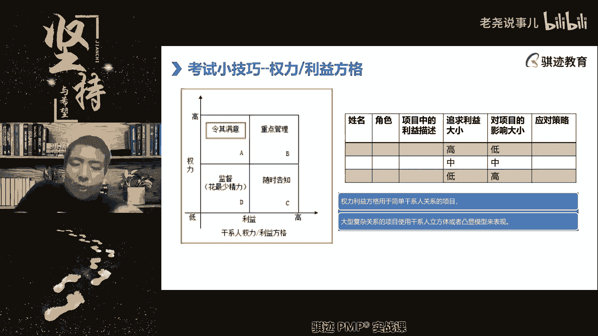

就随时告知这种这种人典型是什么，是用户啊，尤其是最终用户，比如说我经常喜欢举个例子，我们每个人都要用手机对吧，我们成年人每个人生活当中都离不开手机，离不开手机号码，所以我们都是三大运营商的什么用户吧。

甚至是客户吧，但是我们对三大运营商有没有影响力啊，有没有权利啊，没有，所以运营商是怎么对待我们的，丁进来的短信，您的手机已欠费停机，请及时充值，这个就叫随时告知，明白了吧，也就是说当相关方。

干系人对于项目没有什么影响力，但是呢项目对他的利益相关度又较高的时候呢，当影响到他的利益的时候，会及时告诉相关方，但是他没有权利该写，但是他没有权利决定项目的东西，这就是这个时候就使用随时告知对吧。

那么最后一种呢就是叫做监督，就是说权利利益又低又低，就说不太相关的，沾点皮毛的，又没有权利，又没有利益的啊，你沾点皮毛就要监督一下啊，这种人呢啊我经常喜欢举的例子，就是什么。

我们项目是一个工地建设项目啊，我们工地请了一位看门的老大爷张大爷，那么我先问你们，张大爷属于项目当中的是什么，是什么一类的吧，工地看门的张大爷，所以项目当中属于什么类。

第一不是你张大爷还是有一定的权利的，但是我们项目和张大爷是向我们的项目的成败，和张大爷是息息相关的啊，张大爷更多的应该是偏向于C就是随时告知哎，张大爷注意了啊，最近最近这两天啊，我们工地上小偷挺多的啊。

给我留着留着眼睛盯着啊，就告诉他一下就行了对吧，看门老大爷吧，也就看个门的权利对吧，你指望他，得有人问老师，这个利益是客户利益，是我们的利益，这个利益指的是相关方干系人，我们的项目对于相关方干写的。

就是我们对他的这个领域，就比如说我们项目干得好，比如说门卫张大爷，如果我们项目干得好啊，项目干得好，那么我们项目上每个人都能发奖金对吧，自然的张大爷也能拿到一份奖金对吧，门卫也是人对吧。

所以我们给他利益相关度很高，但是呢张大爷呢没啥权利，只能看个门对吧，那么如果是张大爷，相对我们项目当中就没什么利益了，所以这个利益是我们的项目相对这个干系，它的力度有多大，没有没有没有。

张大爷相对我们项目当中就利益就很低了，因为我们找个开门他不容易吧，国举的不是张大爷，什么人，是用监督啊，张大爷的侄子啊，小张他侄子不一定姓张对吧，张大爷的侄子小王，小王呢有时候会来工地看望他的张大爷啊。

这个时候呢与你项目呢也没啥关系对吧，那么你就最花最少的精力盯着一只眼，那么你某一天发现什么东西啊，原来我们工地频繁失窃钢筋，就是张大爷的侄子小王敢偷我们的钢筋，然后一把把他抓起来啊，这就叫做监督啊。

平时如果没有什么事情，就说一只眼睛瞄了一下啊，知道一下就可以了，但是如果有问题了呢，啊我们要对他进行监督啊管理，所以如果小王不从我们的项目偷钢筋，他和我们的项目是几乎没有什么关系对吧。

他是属于权利率又低，利率又低对吧，我们项目又不给他小王发奖金对吧啊，我们项项目又不给给小王带来任何好处，所以他小王也不能决定我们项目上任何东西，所以他的权利和利益都很低啊，但是如果他来我们项目偷钢筋了。

那么它是一个有害的感谢，我们要对它进行什么监督和支持啊，然后呢把张大爷给炒掉，因为张大爷放纵自己的小侄子小王，到工地偷钢筋对吧，OK我举举这个例子告诉你们啊，什么是监督，就是这个意思啊，举个例子啊。

不用不用太过于纠结啊，考试也没有考那么细啊，说实话考试没考过，对张大爷的侄子小王啊，如果他来工地上看望他的张大爷了，那么他也是项目的干系，他是一个非常边缘的干系，哪怕他不来偷钢筋，他来看望唐大爷。

因为也来到我们项目上，万一他在项目，我们项目上不小心被我们项目上什么东西啊啊，石头砸了一下，说是什么什么，被我们项目上的什么什么东西给搞了一下，就受了伤对吧，我们得赔钱，和我们项目有潜在的影响关系。

是的啊，跟我们项目占了那么一丁点边的，也算感谢，不要怀疑啊，OK这个呢稍微理解就行了啊，稍微理解一下就行了。

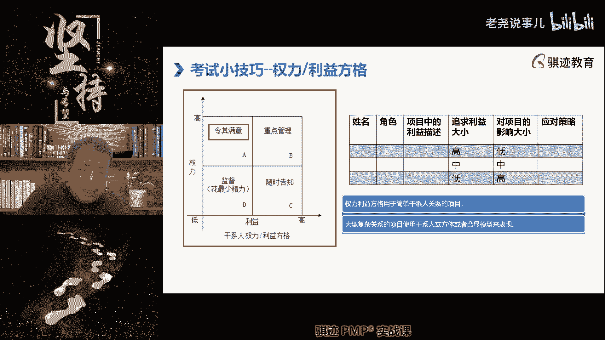

因为它潜在我们前面讲的，它潜在可能受到项目的影响。

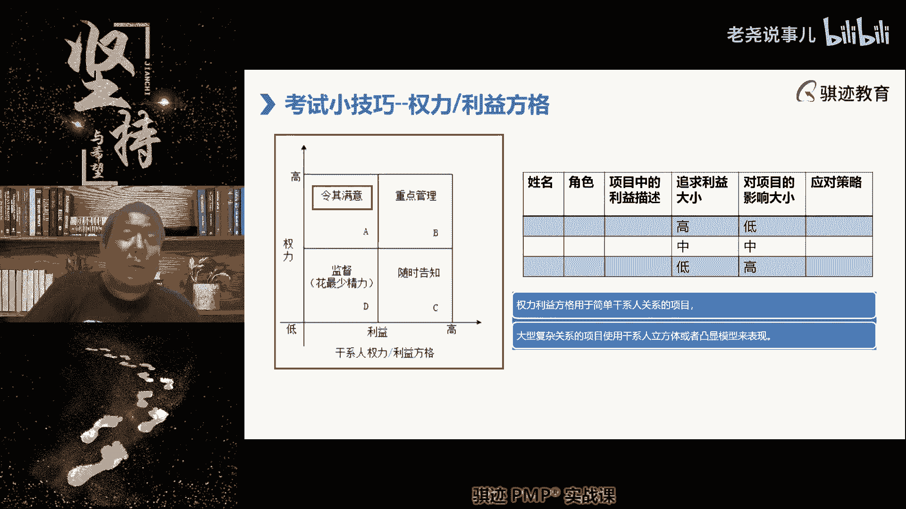

对OK好，那么接下来我们讲一个工具，这个工具我觉得很傻，但是呢可以强啊，得讲，这叫做相关方参与度评估举证，这个东西挺傻缺的，虽然这个概念我们经常会相对用到，但是哦老外这个地方还是偏理论的啊。

那么这个矩阵是什么意思啊，就是我们对所有项目中的相关方案，其实就是该写啊，当然这个是因为从第六版考过来的，第七版这个东西也会考，但是这个改成干系人啊，大家知道就行了，我就不改字字眼了啊。

干系人对于我们项目有各种各样的态度，他的态度我们一般会分为四类，不知晓抵制中立和支持啊，有额外的一类叫做领导啊，领导你可以认为什么是积极投身于项目当中，那么我们会对所有的啊，所以至少是主要的。

或者是有一定优先级的干系人进行什么，这个评估，他对于当前项目的态度和期望是怎么样的，和我们希望它达到什么程度进行分析，会列出这样的很傻缺的表格啊，那么这个表格当中，C代表当前干系对于项目的态度。

第代表我们期望他做到的程度啊，这个表就到相关方参与做评估矩阵，那么这在考试当中经常会考到，虽然这个东西很少经常考到，那么它是什么作用吗，想要知道为什么干系人没有如我们期望的那样，对项目进行支持。

或者干系人为什么会表现出对项目的抵制，那么我们应该查什么工具啊，就查这个相关方参与度评估举证啊，我不知道PMI为什么特别喜欢这个东西啊，所以你们就记住，当我们要知道当前的相关方的期望和和态。

度状态的时候，我们就会去查相关方参与度评估举证啊，那么如果考的深入一点的呢，如果如何提高相关方的支持程度，那么我们先会去查这个举证，然后根据相关方的态度和期望，来采取针对性措施啊。

注意这我会给你们讲一讲啊，如果相关方对项目不知晓的当前的态度，那么应该怎么办，应该给主动接洽相关方，高干线，告知项目的内容背景，然后让他能够了解项目，如果相关方抵制项目怎么办，相关方如果抵制项目。

应该和相关方进行沟通啊，啊告诉相关方，那么别人如果抵制你，那么十有八九肯定是什么，你与他的你的项目与他的理念或者利益相冲突，那么这个时候呢与相关方沟通，然后呢我们求同存异，然后我们啊晓之以理。

动之以情啊，然后呢化解他对项目的抵制啊，抵制如果相关的对项目既不支持也不反对啊，那么我们应该怎么办，应该更深入的啊与相关方进行沟通啊，这些东西啊我们之前其实也讲过，你们最好是记一下。

如果相关方是中立态度的，那么我们应该更深入的给相关方干系人啊，进行沟通，提供更详细的信息来干什么，表达项目的成败进展，和利益与相关方之间的关联关系，把他把项目和相关方之间通过利益关系拉近啊。

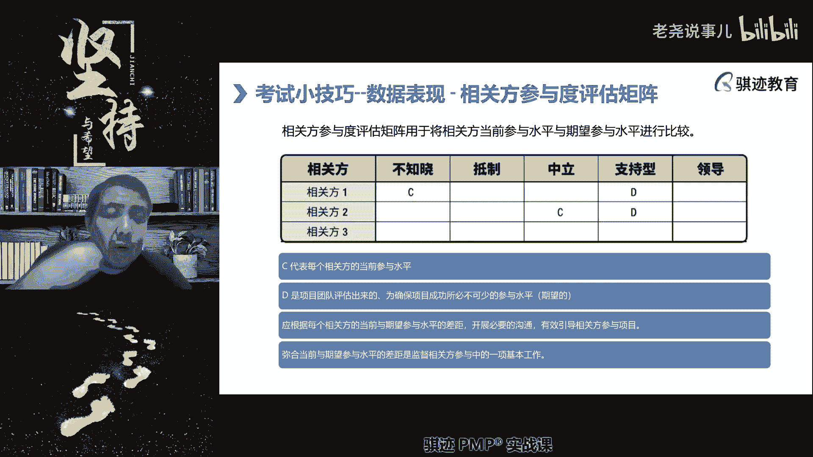

从而获取相关方干事业的支持，能够使它变为支持性。

那么我们默认啊这个东西啥，就在于，我们默认相关方都应该最终状态是支持项目，哪种类型，对实践工作当中演示啊，注意画饼都是不好的啊，甚至有时候你都画不出名，所以要想别人支持自己，最好的办法是什么。

给出实实在在的利益，哪怕是很小的，但是实在可以的做到的这种利益给相关方，那么这个才是一个什么好的办法，那么领导是什么，积极投身于项目，带领大家啊啊对项目突出贡献，这个时候态度就非常的积极了。

他不需要特别的设定，那么一般来说只有内部干系人，我们会期望他达到领导项目的程度啊，怪不干系，因为我们讲内外有别，以及讲我们讲干型参与项目的规划和设计当中，我们一般不希望过多参与，主要是适当参与。

一般不会使用领导这个层次，好明白了吧，这是相关方参与度评估矩阵的作用和意义，如果你们这个东西定义不是很清楚，你们其实只要知道呃，如果考试考题问到为什么相关方呃，实际的表现与我们的期望有差距。

凡是考题当中相关方有差距的，有差异的，很容易就选到什么相关方参与度评估矩阵啊，就干系人参与度评估矩阵啊，用这个工具来分析差异，找出原因，总的来说无论多离谱，先沟通对万事先沟通，这句话说的不错。

万事先沟通，先沟通总是不错啊，所以很多的选项当中，如果你不知道怎么选的话，你可以优先考虑沟通一下项目管理的啊，一大艺术就不就是沟通吗。

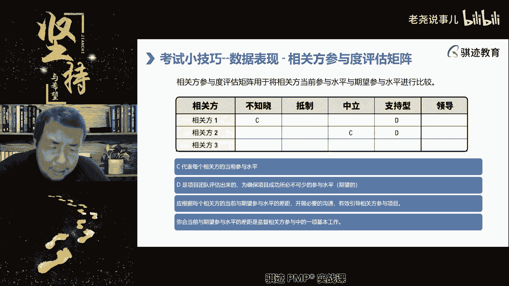

好那么考试一个小家，那么该行人，最终呢我们会形成一个什么干系人的参与计划，在干系人参与计划当中，我们会设定买啊。

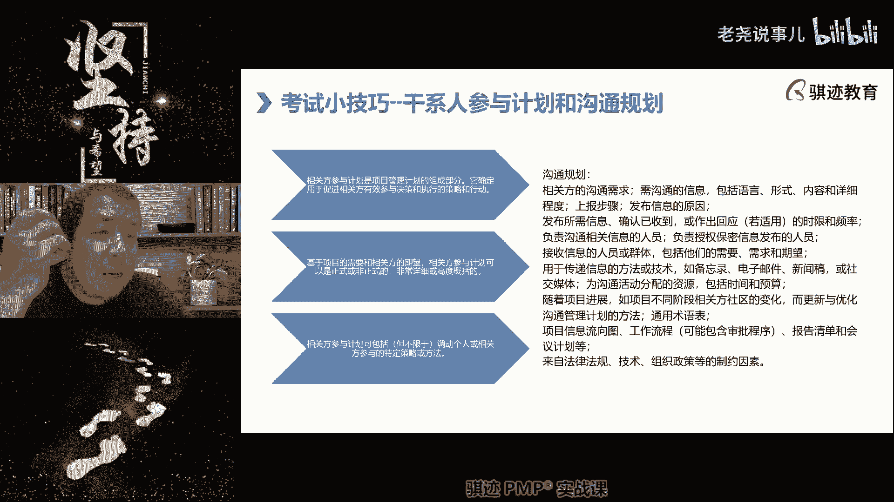

不一定是每一个人啊，主要的要优先管理那些干闲参与到项目的程度，他应该了解到项目的信息的程度，以及他应该期望给项目做出了贡献程度，这些都是事先我们设计好，做好计划。

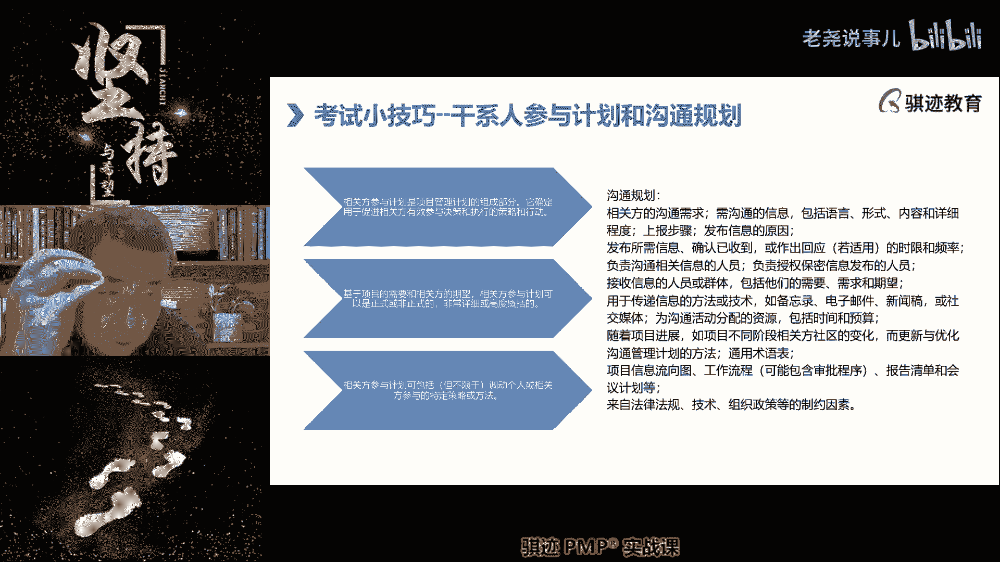

这个计划就叫做干系人参与计划啊，当干系人没有按照我们的期望，达到该行人参与计划的时候，我们就会使用相关方参与度评估矩阵及评估，为什么没有达到它，它的差距在哪里啊。

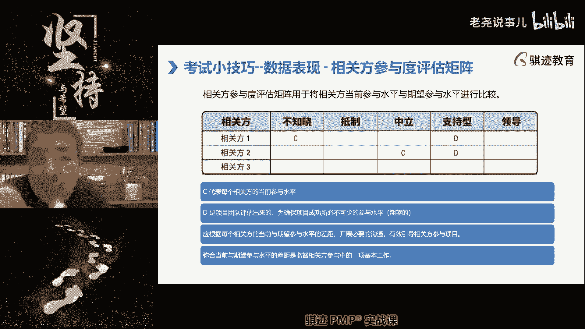

那么针对不同的干系人参与项目，我们要设定不同的沟通规划啊，设定不同的话，如果他深度参与项目，那么我们就跟大的沟通要更频繁。

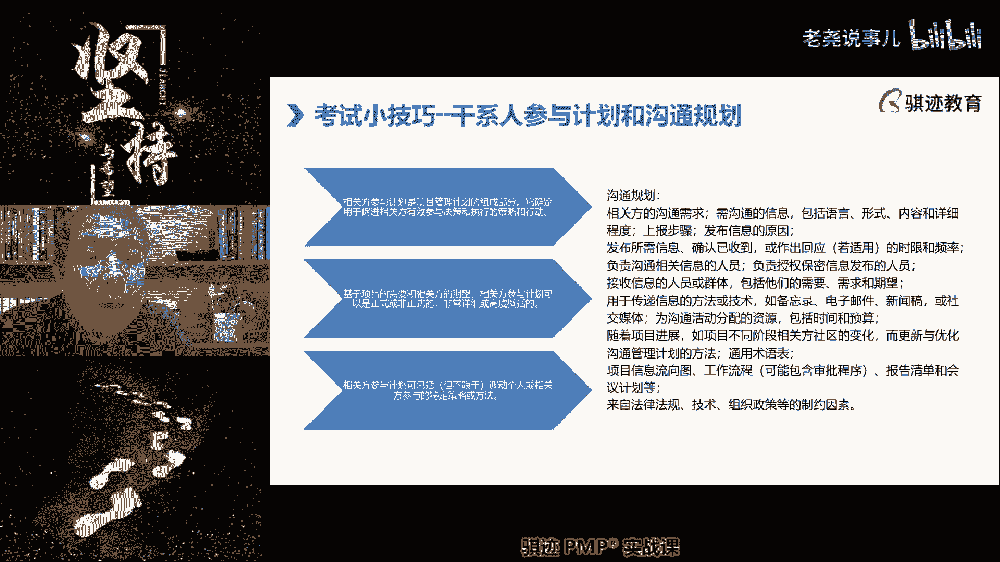

更直接，信息量更大，如果他参与项目程度浅，那么我们的沟通可能可能更多的是什么，是以项目绩效报告，定期报告为主对吧，不同的人啊用不同的沟通方式，所以针对不同的人，我们会使用不同的沟通规划。

这个也是非常重要的啊，那么这个就就就就就就就就什么用我们的古话，连就是见人说人话，见鬼说鬼话，但是你要正面理解这个意思。

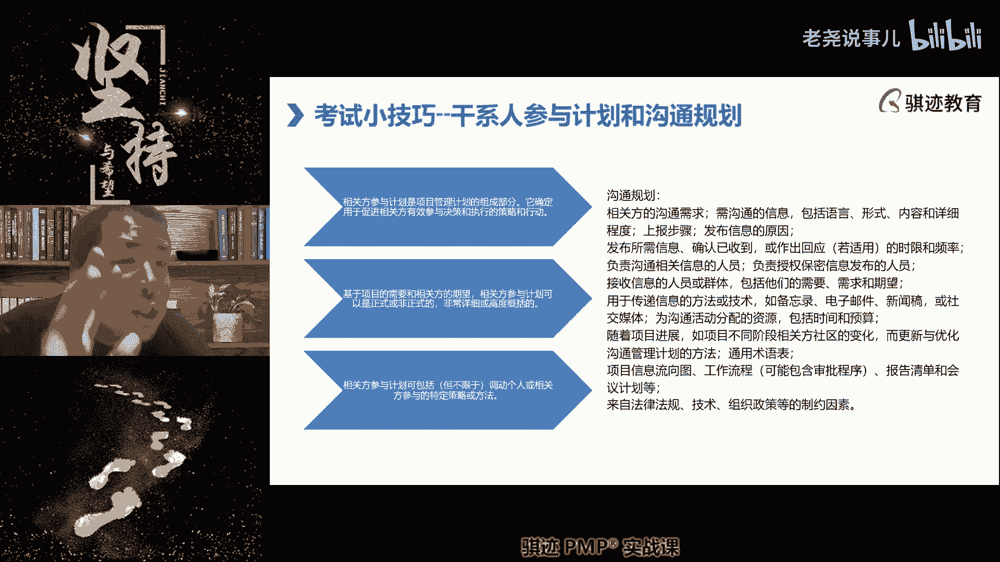

其实说的是没错，要用别人听得懂的方式沟通他，然后引导他找到自己，你期望他在项目中的一个定位。

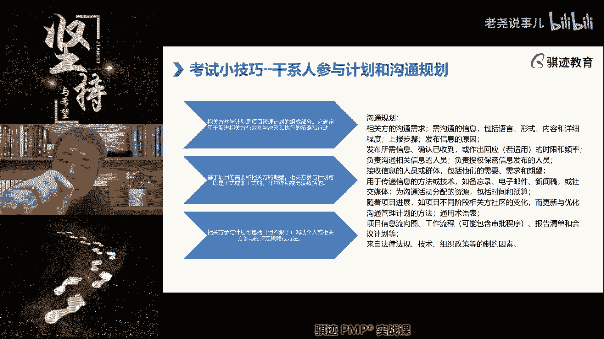

好吧好，那么顺便说一句，在沟通规划当中，我们最重要的那个what是什么，项目绩效报告对于预测性来说，最重要的沟通是项目绩效报告，对于敏捷来说最重要的沟通是什么，信息辐射源，你们请记住啊。

你这当中最主要的沟通对象什么。

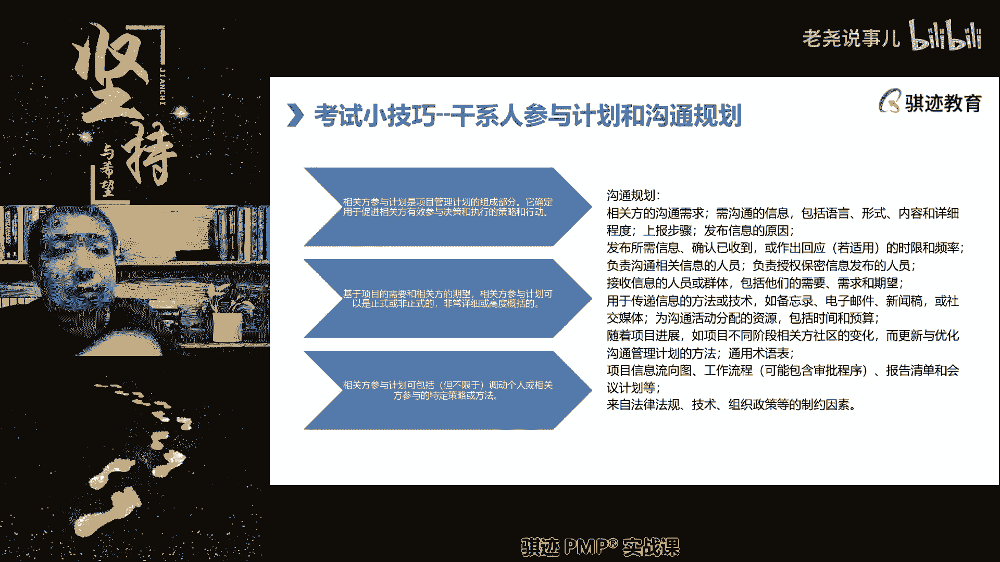

信息辐射源，因为在信息服务员上，它可能是一个看板，也可能是一个电子屏。

也可能是一个白板，然后呢，我们会将最新的状态在上面，用自动化或者人工的方式去更新在上面，以便相关方能够实时了解信息内容，这是敏捷的方式，那么预测型呢更多的是使用了什么，我们的工作绩效报告。

定期的工作绩效的报告这些东西。

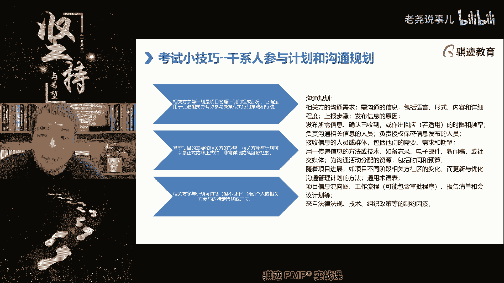

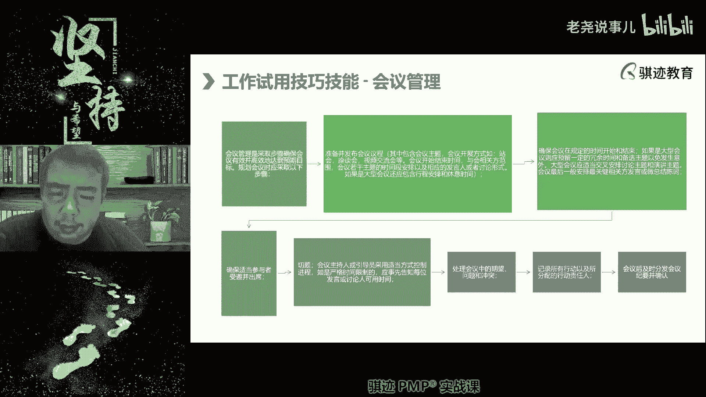

好哦，今天的时间有有一点点那个啊，有一点点那个啊九啊。

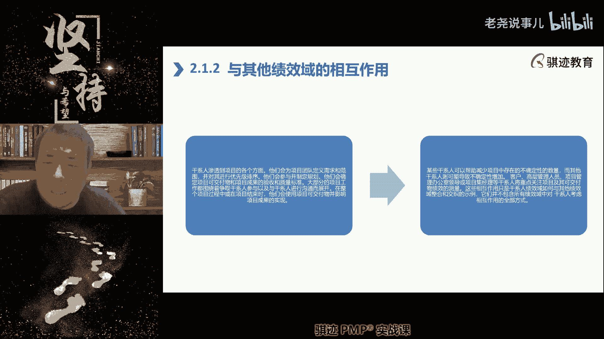

因为最后我们还会因为沟通的效率没有了，没有沟通的效率啊，No no no no，只有只有相关方的啊，干性的纪晓雨，所以我们最后要讲一个工作呃。

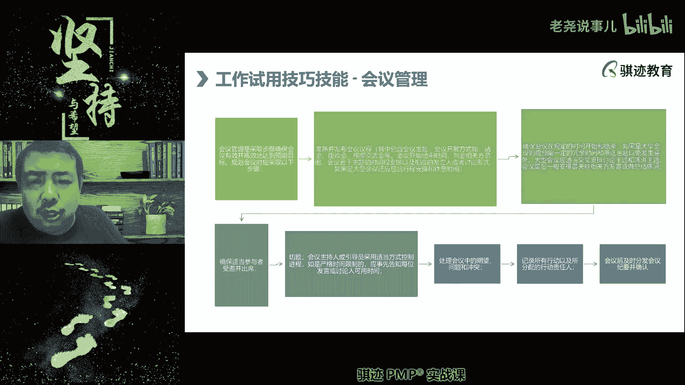

是实用自己做实用小技巧，开会啊，开会那么开会有这样几个步骤，我们要给大家介绍一下会怎么看，是最为啊是最为合理有效的啊，我给大家介绍一下，有些同学可能不擅长开会，或者根本不知道怎么开会。

才是正常正确的开会方法啊。

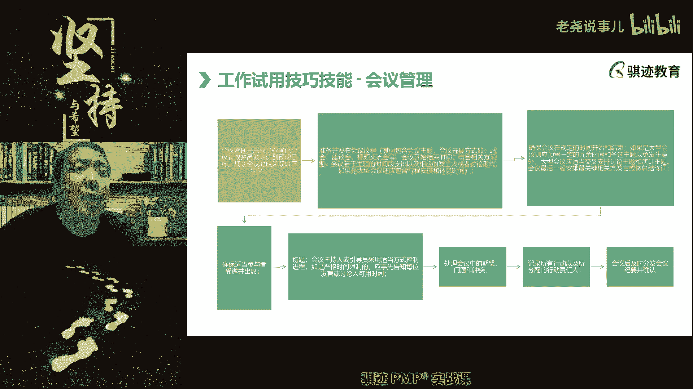

那么第一如果你要开会，首先要什么，你设定这个开会会开会的目的是什么啊，我们日常工作中经常会有什么东西，有些人觉得什么一有什么问题呢，又有什么东西就开个会啊，但是开个会呢又没有明确的目的和主题。

导致工作效率低下，有没有这种情况，有的听懂掌声啊，听懂掌声，在公屏里听懂掌声，所以开会第一要务就是什么，搞清楚这个会议的目的和主题是什么，先把目的和主题定下来，接下来根据目的和主题展开会议的议程。

就是会议我们会讨论哪几个小议程啊，topic啊，我们会讨论哪些点，每个点或什么，或者讨论哪几方面的内容，对吧啊，这个也是很重要的，那么这两个是要项目经理预先准备好的，因为没有准备议题和议程。

开会就会漫无目的，像无头苍蝇啊，一群人那边开了几个小时，结果不知道什么东西就很糟糕，其实是一群就是一群人往往往往无效的会，什么是一群人浪费时间，陪着个别的几个嗡嗡的苍蝇在那边浪费时间啊。

听懂了还可以再涨声，很多时候的无效会议都是这样啊，要有明确的议题和议程，有了议题和议程之后呢，我们会使用什么设定，恰当的形式是面对面的开会还是站会，还是座谈会，如果使用站会，我们告诉所有人，这次是站会。

所以应该使用展会的规则，就是什么有屁就放，没屁憋住，尽可能快的沟通证券信息，有严格的沟通规则，如果不是这样来告诉大家沟通的形式，开会的形式，好那么接下来这些东西定好了之后呢。

接下来很重要的事情先不要急着安排，会，先从最重要的就是我们讲，以大比较大型和重要的会议为例啊，先从最重要的会议参与人开始去约时间，这个重要是指的是如果缺了这个人，我们的一切讨论都是没有意义的。

从这个角度进行排序，而不是谁的权利地位最高啊，而是这个话题缺了谁是最没有意义的，从这个角度从高到低排序，然后去续约这个排序。

降序排序的前几位的那些人有没有空来参加。

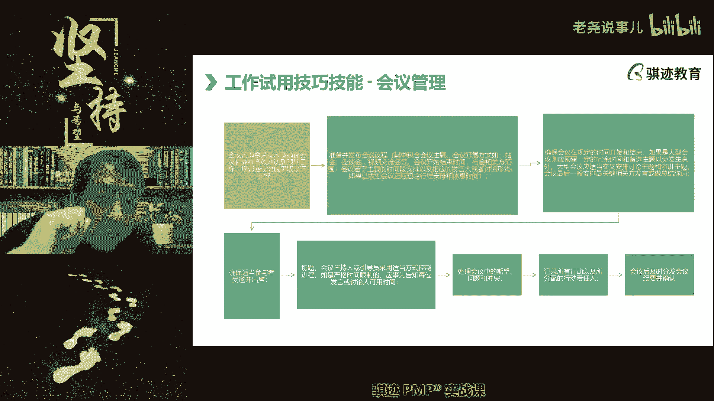

如果你至少能够约到啊，因为一般遵循八二定律嘛，这个降序排列当中，前几个人他们有一个共同的时间点的。

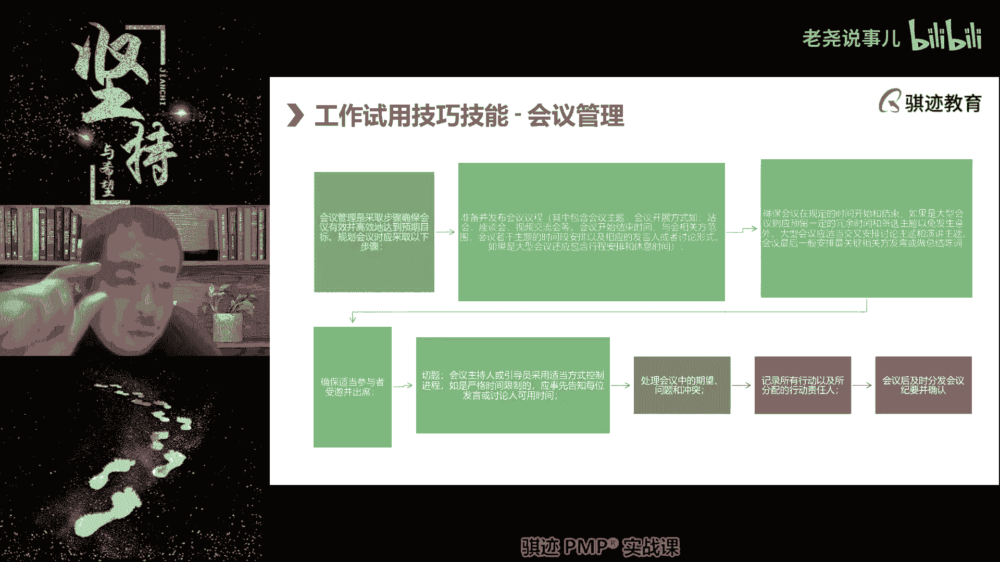

以他们共同能够参会的时间点来安排。

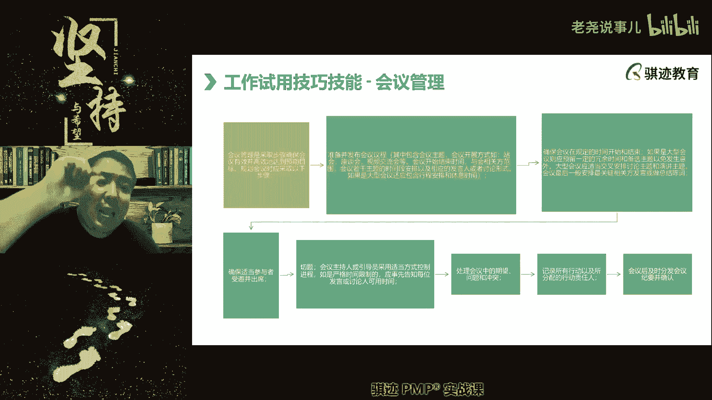

接下来的会议时间，这样的话你才能达到一次性把会开清楚，并且不会浪费大家时间，否则要么这个重要的参与人不在。

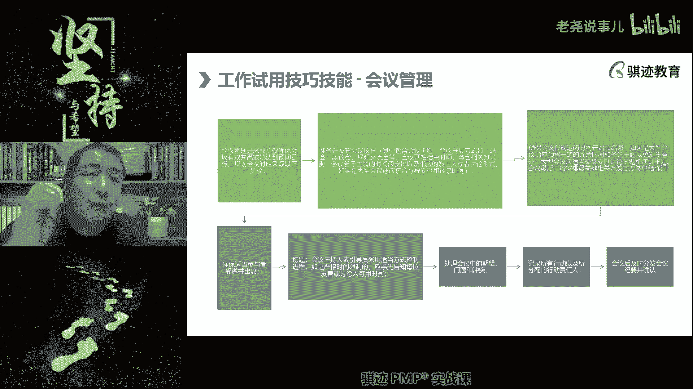

要么那个从小参与者啊，对不起，这个会，然后跟这个开完了再跟那个开，然后两个会还并在，结果还并在一起，就是合不起来，然后再开一个会，无效会议的第二种形式，就是这样，总有人缺席啊，明白了啊。

听懂了可以继续涨，正如果你们有共鸣的都可以长生啊，好这个好了之后呢，你就开始安排会议的时间，那么接下去那些不太重要的与会人呢，你也是强调尽可能参会，但是他们已经不太重要，但是你不要表现出他们不太重要啊。

我们要尊重每一个人，但是我们每安排会议的时间，恰好都是那些最关键的人，有空的时间，你只要明白自己心里明白这个原则就可以，然后去发出会议邀请，这个会议邀请时间，就是我们刚才定的那些时间啊。

然后告诉大家我们的会议的安排和议程，如果这个会议比较大，你还要安排什么，每一个议程它的持续时间，比如这个话题我们准备讨论30分钟，这个话题准备讨论20分钟，合理的安排有限时间呢。

因为那些大佬们往往是很忙的，他们可能不一定能全程，不一定能全程参与会议，那么这个时候你告诉别人，每个议程发生在哪个时间段，然后告诉然后甚至可以做的更细一点，每一个议程最关键的参与人是哪几个。

然后别人可能没办法全程参与会议，但是他可以在需要他的时候切入战场，不是打游戏啊，切入话题，然后参与讨论也能起到最好的开会效果，明白了，但是能够实现的前提是，你对这个议程的管理很明确啊，如果是大型会议。

比如说现场会议呢，还要安排什么行程，比如说我们要现场找个酒店开会，要安排好啊，就几点到会场，几点签到，还有什么酒店可能要入住对吧，然后还有什么，还有中间还有什么茶歇，五品还安排休息时间。

比如你要开一整天的，会不可能一整天大家都在那边讨论，不要累死的，对应该开两个小时或一两个小时，喂我们休息一下再继续吧，中间还安排吃饭。

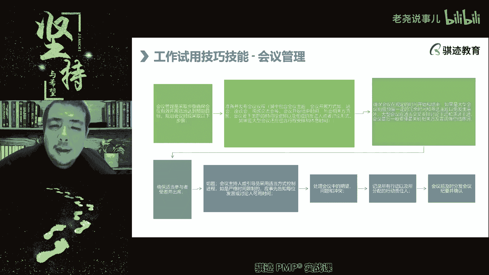

好这些都是会议的组织安排，然后你会议的邀请发出去之后呢，要尽可能的收集每一个人的会议的反馈，然后呢知道当会议开始的时候。

有哪些人会来参加，哪些人不会来参加，以便于你及时地对会议进行微调啊，尽可能的让呃，尽可能多的人来有效地一次性开会解决问题，这是开会的一个总体原则啊，那么到了开会的这个时间呢，我们应该什么，作为项目经理。

一般都是会议的主持人啊。

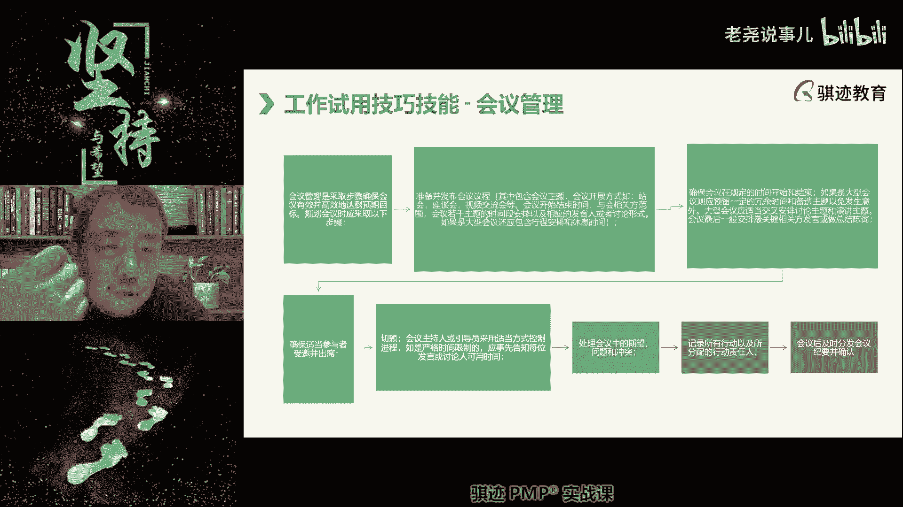

你应该把控整个会议节奏，但是呢如果是大型会议的，因为经常会出现一些啊讨论过于热烈，或者某个话题。

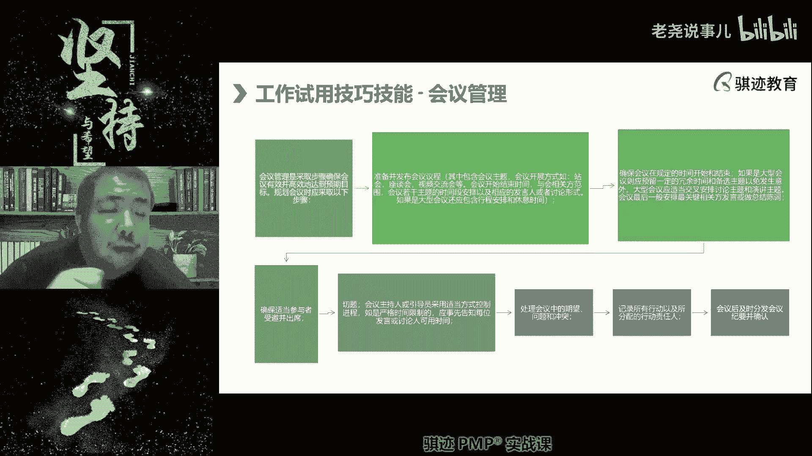

那可能是什么啊，不受控制延长，所以你可能应该留有一定的冗余时间，如果有些话题讨论的特别快一些的冷场了呢，你应该会有备选主题，这个剧叫什么东西啊，大家知道吧，主要电视台比如新闻联播，就是这样的新闻联播。

大家看就是央视的新闻联播，他噔噔噔噔噔噔，那个音乐放起来就开始播，有时候播的时候会在新闻联播的最后一段呢，他会播一点新闻，播到时间它会突然之间就卡掉了，被突然之间卡掉的那些新闻其实都是啥，都是备选新闻。

因为主新闻的时间不够长，所以最后那些是凑时间的，凑够时间咔嚓就加油啊，我们开会其实也是一样，如果主议程讨论的时候速度意外的快，那么总不见得冷场了，那么就是什么，你可以准备一个或者若干个备选主题。

以免以免冷场啊，明白吗，这个也是大型会议的一个什么啊，一个一个技巧啊，然后呢，如果你主持，你作为项目经理，你主持的是大型会议，那么你可能来不及记会议纪要，那么你一定要什么安排。

一个人专门给你在做会议主持的时候，旁边做会议纪要啊会降，然后事后呢要进行什么会教的发布，那么在安排做会计较的同时呢，你作为主持人呢还要安排好会议节奏，让所以这个时候要什么权力地位最高的人。

在会议的最后进行总结性发言，然后尽可能要诱导这个总结性发言的这个人，或或者你提前给他准备好总结性发言词，这个词呢是你事先要准备好的，就开这个会的一个最主要的目的啊，或者是目的之一，然后让他最终总结发言。

用最有最有权力地位的人进行总结之后呢，然后能够把会议的最终结果能够敲定一下啊，所以会的总结发言其实起到的是这个作用啊，你要记住啊，会不能白开，最后能够一锤定音的人，要能够有总结发言。

然后马上其实你就可以根据这个总结陈词，再加上你的会议纪要，让每个人去进行确认这个会议的内容，接下去就可以按照这个会议的精神去执行，明白吧，好然后呢，我们会确保适当的受邀人能够出席。

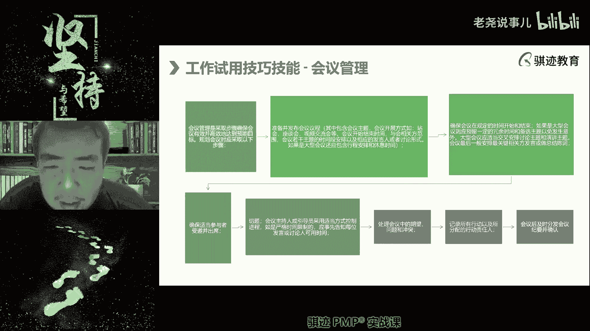

我们在开会的时候呢，我们会事先如果可以的话，可以事先制定会议规则。

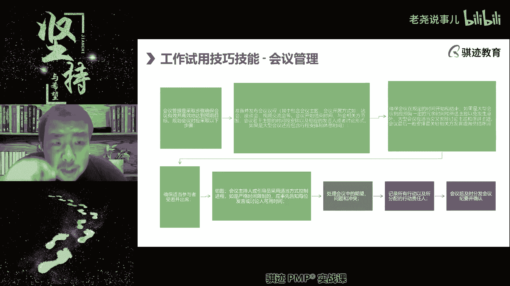

比如说每个人严格限制，比如说我们这个议程是一小时，那么如果一生一小时，我们可能规定每一个在这个议程中发言的人，发言时间不得超过5分钟，那么可以确保至少有什么，5分钟和一小时是什么关系啊。

我们至少可以确保20个人左右，中间还有一些转接的时间对吧，这个确保十个人左右是能够表达自己的意见，对吧啊，这个这些东西都是你事先在开会的之前，要设计好的啊，大型会议的一些动作其实都是事先设计好。

但是你要准备好预案，万一在设计之外有行为发生，你要能够来得及处理，那么作为一个高水平的会议的主持人，你要能够处变不惊啊，当然这个对人的要求就高了，能够在会议过程中能够及时的化解冲突矛盾。

比如说会议的某两个人在谈谈谈谈谈谈什么，火药味越来越重了，你能插科打诨，或者是制造各种小小的意外，将这些火药味给压下来，对吧好，教你们一个非常无聊的小技巧，比如说在会会议的过程当中。

两个人因为某个某个议题，大家意见不合，突然之间你就知道就是晦气，开始就知道这火药味开始浓起来，那么如果是现场会议主持人会怎么办，这么一个小技巧，你可以现场就是说啊，每个人有一些都放一些饮料。

矿泉水和杯子，主持人也可以用，然后呢你可以故意把自己的杯子摔在地上，打散的，咚一下的时候啊，这是一个很无聊的，咚一下，摔的时候马上就这种时候，马上所有的人兔吸引力的杯子啊，你马上主持人就可以拿着话筒啊。

不好意思，大家我们会议讨论特别热烈，我听得懂，我听着都走神了，然后不小心把杯子拿回来，他说对不起。

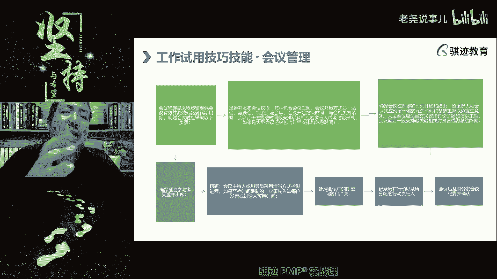

然后你就可顺势的把这个话题给岔开，这是一种技巧，还有很多种技巧啊。

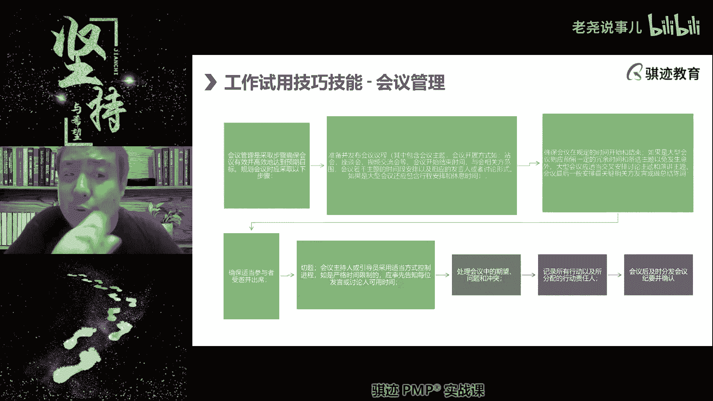

然后尽可能控制会议，在和谐友爱和和睦的气氛当中去进行下去。

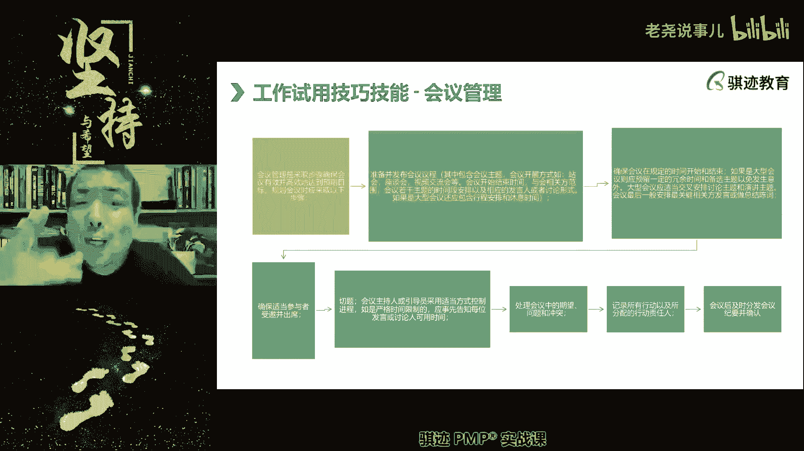

如果有人在开会发言的时候呢，讨论时间超时，你可以用各种方法来去提醒他，比如说那话说的他就上头了，啊啊啊啊，说不可以，暗示一下啊，OK啊这个东西就是有很多都是小技巧，那么就不在啊，不特别强调了啊。

你们可以自己在工作中去寻找自己，最有效的一些小技巧的啊，还有一些比较损的啊，比如说有些人，比如开会，老师说话刹不住车，一说就花了好久，那么可以怎么安排某个人某个小朋友啊，无足轻重的小朋友。

这个人说话上头的时候呢，哎给他手机打个电话，然后他手机铃声只要一响起来，他会去看一下手机，马上就给换成哦，哦我们的某某某某某某同事啊，某啊某某啊，这嘉宾啊八音符中精彩。

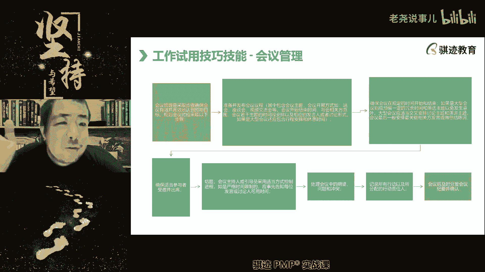

但好像有些人事物的感情，那么这样吧，我们继续把我们继续，我将话题往前走，我们继续讨论一下，这这这怎么就可以把话题给抢过来，旁边去歇会。

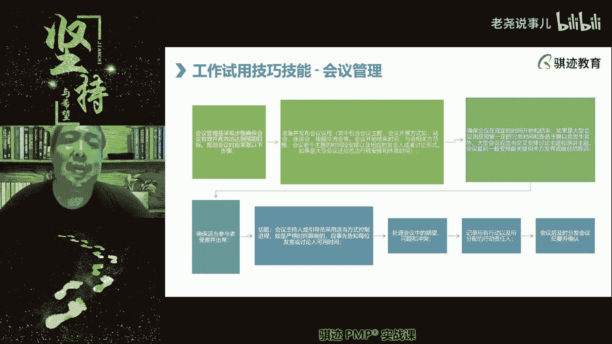

你讲的时间太长也是个小技巧，打电话好，这回这个是可以有呃有效的控制会议节奏啊，然后呢及时处理会议中期望和冲突，然后呢，会议的记录者应该及时记录会议当中的重要的，不用所有的牛啊，重要的内容。

行动决议等等等等，如果需要落实到人呢，要及时落实到人。

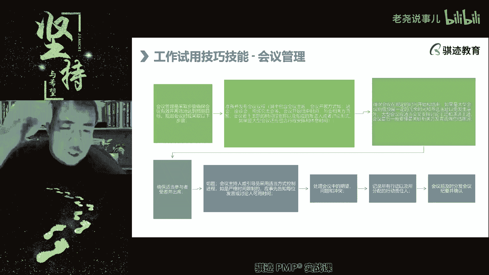

哎因为打断别人的发言呢，在不同的组织和场景当中都是不一样的，有些场景中比较含蓄。

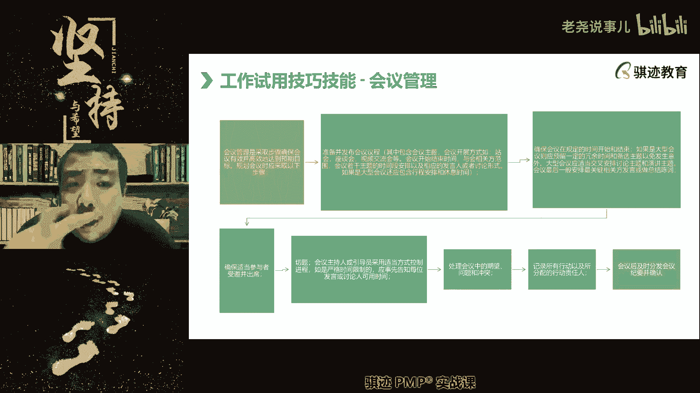

直接打断别人写的不礼貌，所以你用各种方法，有些公司和有些组织企业文化，它就比较直接low，contact对吧，你就可以直接打断他，但是人嘛总是希望有尊重你，直接打断了，确实有点难堪对吧。

哎这取决于场景啊，那么最后一点就是会议开完了，一定要有会议纪要，重要的有结论性的会议，一定要有会议纪要之后要有确认，发给所有会议的参与方，让如果是有后续跟进行动的，要会议的参与方进行确认啊。

如果他不确认我们的会议的主持人，比如说项目经理要和他们进行单独沟通啊，这个会议交给你们看看有什么问题吗，没有问题，帮我确认一下啊，确保会议不是白开的，很多的会为什么白开啊，是开会的时候淘的很好了。

没有企业会议纪要，会议纪要没有确认过段时间之后说啊，我说过这个什么啊，我答应过吗，我不知道啊，你有证据吗，明白了。

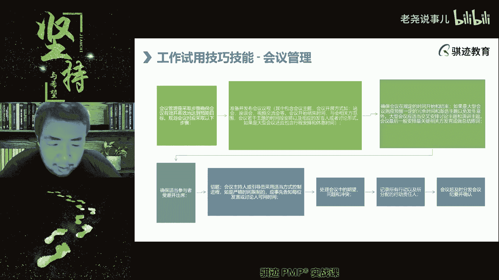

这就是开会啊，好那么最后呢我们在相关方的啊。

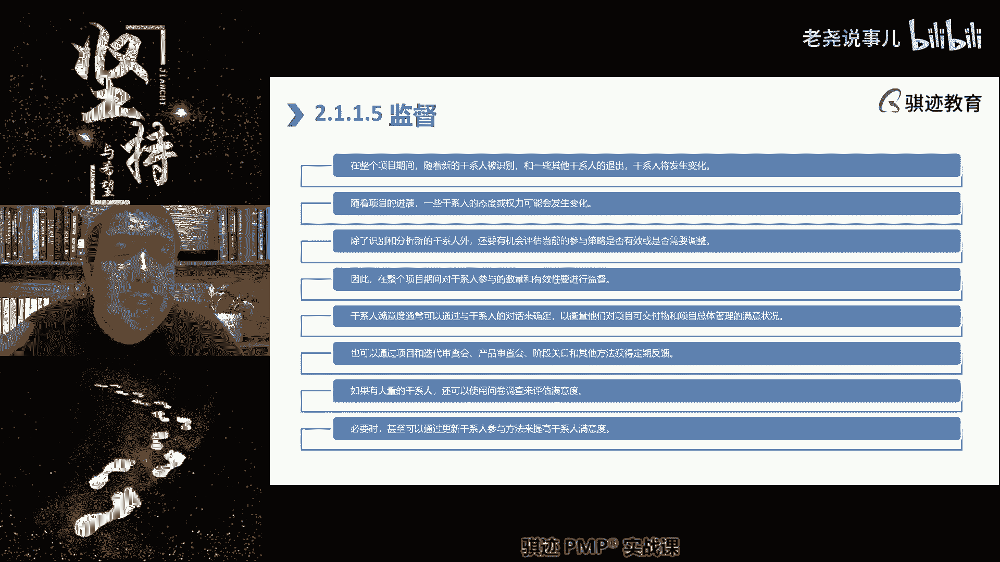

该起人的这个这个管理过程当中呢，我们还需要对该系来进行什么监督。

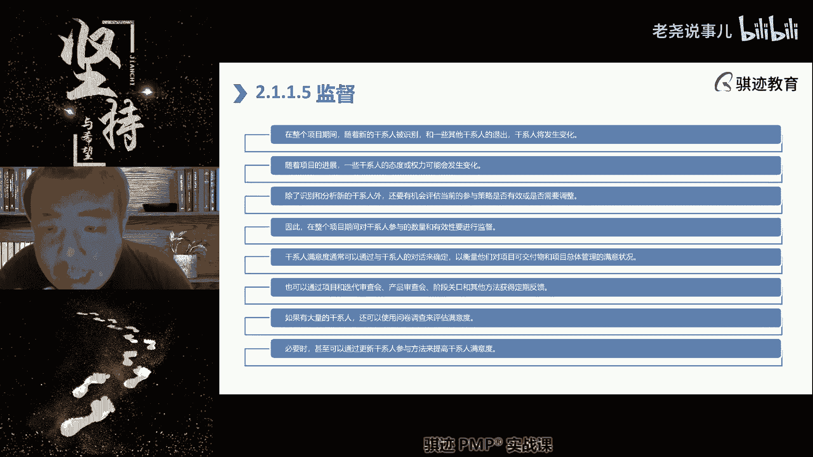

所以监督呢就是经常跟踪肝性的状态。

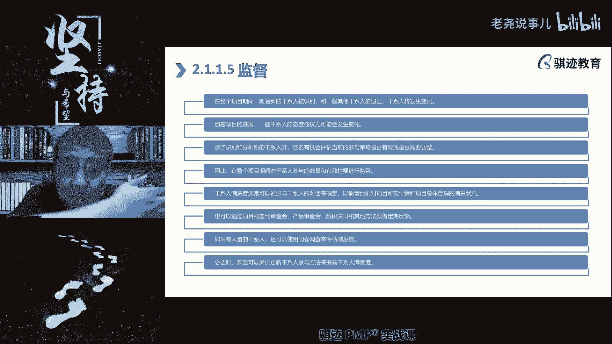

识别到哪些干系人退出项目了，跟我们项目相关的，有哪些干系的，新加入项目，哪些干系人呢对我们项目态度发生了变化啊。

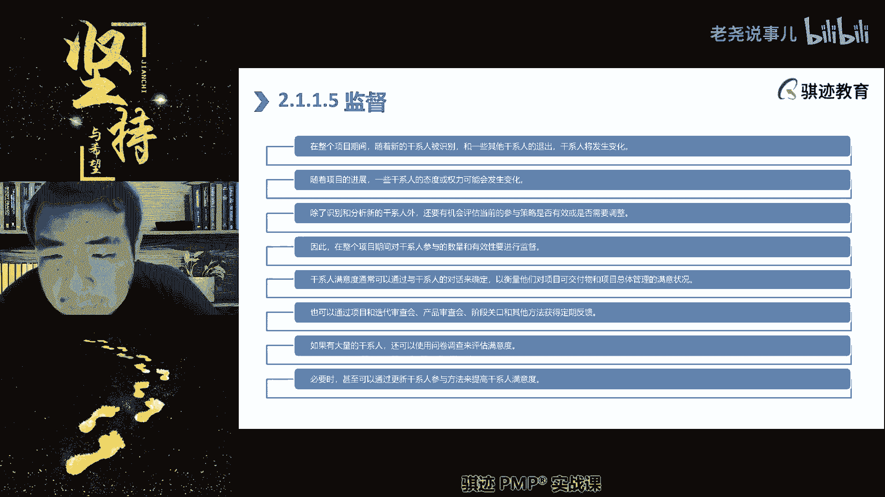

那些干性对于项目的满意程度是不是提高了，要经常性的去跟踪评估考量，那么这个呢是要通过监督来完成啊，我们也可以用问问卷调查来进行嗯，好那么这个呢不多说了啊，这个是取决于各个项目的不同需求的，复杂的项目呢。

可能监干性的监督会更重要，那么简单的项目呢。

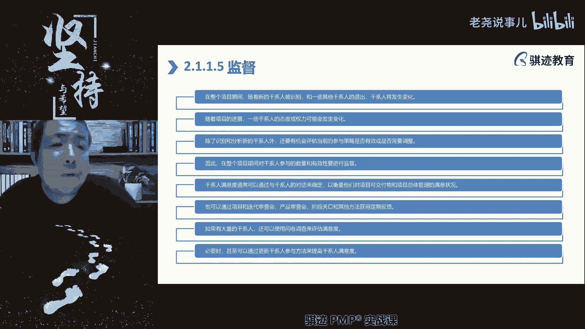

干性监督呢其实就没有那么多好，那么最后呢我们讲讲肝性干性的管理。

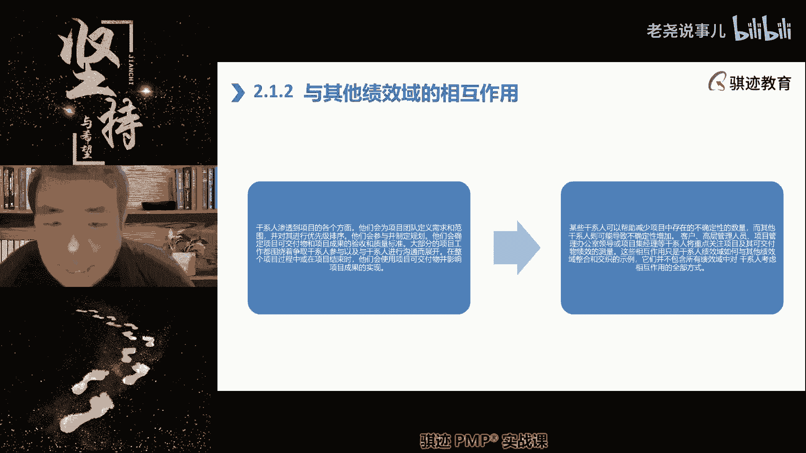

会影响到项目各个方方面面，注意啊。

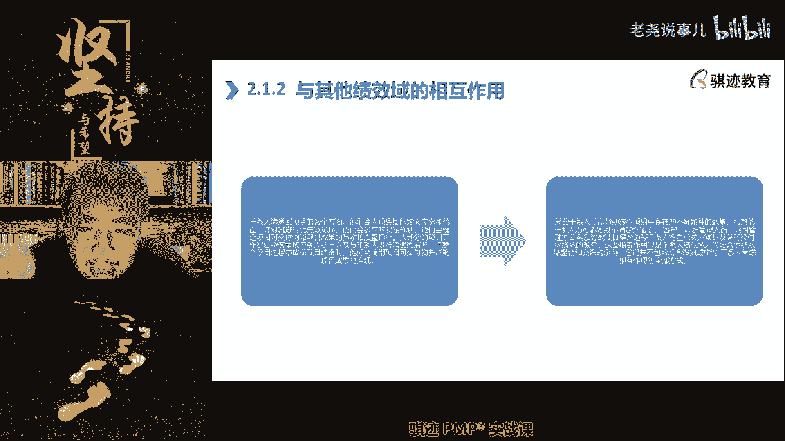

尤其是内部干系的管理，其实就涉及到团队啊。

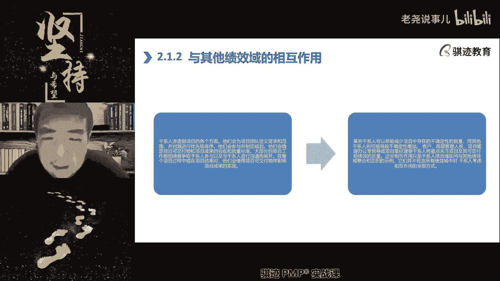

那但是所有该行的啊，该嫌人的啊，绩效率会影响到其他所有的绩效率，所以应该是项目经理日常工作中，不可或缺的一部分，我们最终还是回到点题，回到我们这个课程之前最初讲的项目管理，本质上管的是人。

虽然你不一定有权利去管，但是你和你打交道，主要打交道的是不是事情，而是人，你要把人搞定啊，这就是干性好吧好，那么这就是我们今天上课的所有内容好吧，然后我们明天开始讲，我们的团队绩效与团队绩效率。

可能会分两个课时去讲啊，因为团队非常重要啊，考试也是版本之子，该系人呢在新考纲出来之后呢，也是啊，题目增加了也，所以大家对干性和沟通里面的相关概念，尤其是我们前面讲的一些重点概念，一定要牢牢掌握好吧。

然后今天的课后练习呢，以及明天呢明天没有客户联系啊，那么等后面两天我手稍微好一点，因为大家谅解一下啊，伤着啊，你打字不方便好吧，等我后面方便的时候，我会把课后练习补上啊。

我会做出我出的题目都是原创的题目啊，给大家进行练习啊，当然我也会抽一些以前的题目混在一起，给大家练习，好吧好，那么我们今天的课就上到这里，那么我们明天晚上再见啊，今天是补昨天的课，昨天我去做手术对吧。

那么明天我们是正常上课啊，希望大家也是尽可能参与直播啊，我们的考试也临近了，那么最后讲一分钟再讲一个事情。

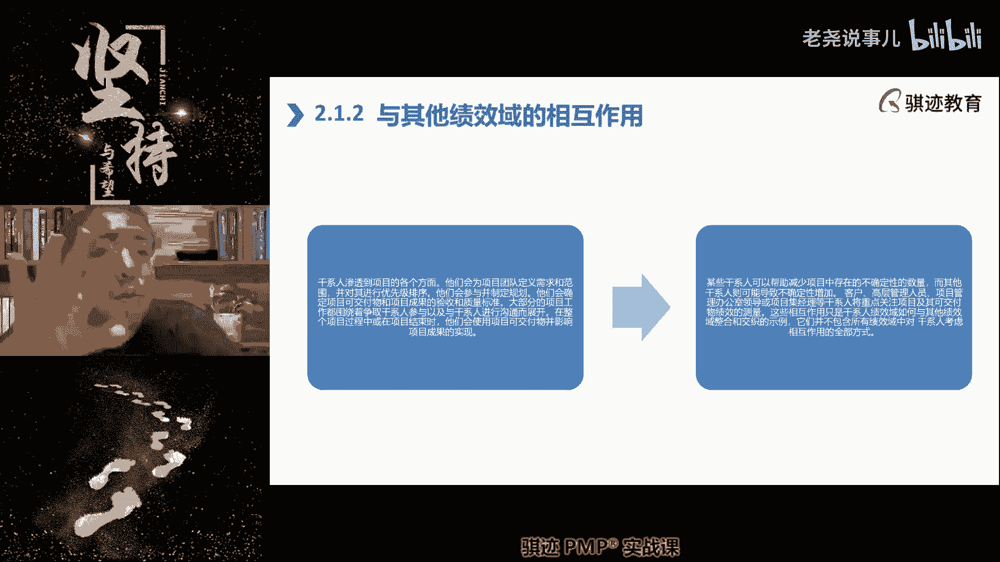

就是我们有很多的模拟题，我拼不过哪一页哪一页的，具体我回头翻一下书啊，书上肯定是有有一些是第六版的内容啊，那么你们最主要是跟着我的视频来，我们的模拟题是管够的，我们的练习题也是管够的，所以不要急。

我们后面会有大量练习，我们先把基础夯实，概念理解清楚，事倍而功半，不要急，后面让你们做到吐，有的是好吧好，那么我们今天课就上到这里，拜拜喽，历年真题理论上是没有的。

因为偏僻的考试的题目从来就不会公开吧拜拜，但是我们的模拟题当中，确实会有很多历年的题目啊。

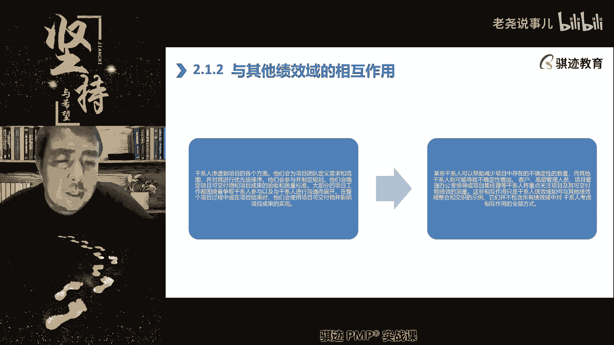

