# （收费视频完整版分享）PMBOK第七版课程PMP考试报名认证培训精讲-零基础项目管理第七版教程最新版直播课回放视频免费课程资源-骐迹教育谢阳主讲 - P49：18-2测量绩效域 - 老尧说事儿 - BV1ek4y1s71N

对吧，我们可以针对不同的市场设计不同的产品，来满足不同的诉求。

这种就是DNFX，这是要在管理质量当中实现的，因为功能可能大家都是相同的，但功能背后所能实现的质量，则是各家各不相同啊，这个质量所付出的代价呢也是各家不一样的，所以这就是DNFX叫我们叫DFX啊。

那么这里呢我就给大家举了两个例子啊，但是时间关系因为这个课我不单独讲了，所以时间关系大家看一下啊，一个是cs当中的AK和M4AKM，这次大家可能玩游戏玩过对吧，cs当中的AK是什么特点。

是什么设单发精度高，枪便宜，缺点是什么，连发精度差啊，连发精度差，M4呢枪连发精度高，但是呢单发精度不如M4啊，不如AK，而且枪比较贵啊，但是可以加装消音器对吧，所以呢各有千秋，他们各自突出了一些方面。

那牺牲了另外一些方面啊，这个就是什么DFX啊，啊那么现实当中的AK和M4，你们知道什么特性吗，好就直接说了，就不卖关子，这个我每次上课都都会收，啊我我每次上课上课都会说啊。

现实中的AK叫是设计者叫阿卡拉什尼科夫啊，前苏联功勋设计师，阿卡拉什尼科夫设计的AK47啊，他在47年定型的啊，正好没赶上啊，纳粹德国投降啊，那么这个枪的特点是什么，射击精度高，制造成本并不一定便宜。

原版苏联的AK47成本并不便宜，尤其是当年在冲压工艺还不好说，AK4级的制造制造成本并不低的，后来那个中东阿富汗，巴基坦那些地方啊，中亚那些那些小地方小作坊做出来的AK，它很便宜，但它精度差。

它就失去了AK的灵魂啊，那么AK的灵魂是什么，因为它是使用了什么高精度加工的，什么冲压部件啊，然后然后他呢呃原呃原话是这么说，就是原始的AK当年就说上上面就是什么，沾上水泥里面什么呃呃呃呃呃被火烧过了。

被水浇过了，照样能射击，这样的设计，但是它的缺点是什么，他的子弹是不通用的啊，和以前的苏联的步枪子弹是不通用的，通用性不佳，然后呢呃其实对加工很吃加工精度要求，而且非专业人士，AK是没办法维护。

它里面核心的栓动部件是没法维护啊，是定量维护，而美国和北约使用的M4系列步枪啊，M4是著名的春田兵工厂SPRINGFIELD生产的啊，著名的有M16系列，开创了个羌族里面最有名的一款M4。

他这个强者是什么特点，他给咱说什么，虽然精度没有AK高，还容易卡壳，还容易坏，还需要保养啊，大家以前那个那个那兔那里面看过吧，是什么垃圾货，居然还要包养对吧，但是它是什么特点，一子弹通用M4。

能用北约标准弹，第2M4是模块化，哪里坏了可以迅速的拆化，坏哪里，虽然我很容易坏，但是我很容易修，所以大概大家阿甘正传看过吧，阿甘正传里美国大兵入伍的第一件，训练的第一件事情就是没事情。

拆墙撞墙撞墙拆墙啊。

这样很大程度上能保证这个枪始终能够用。

哪怕坏了，自己一拆装就好，所以不同的枪械就代表了不同的设计思。

路和理念，没意思吧，你们现实中我们了解一下啊，还有一个例子我就不说了，时间关系不要讲山西醋和镇江醋，对吧啊啊华东地区啊，像镇江这种华东地区的这个醋，大家喝喝吧，带有甜味很淡雅，而山西的醋呢不带有甜味。

很浓郁，酸味很浓郁，它其实也是针对两地不同的饮食的，那个习惯来啊，你们可以去了解一下，这个就是点赞FX，因为什么你要适应当地的饮食文化和环境，才能才能够把你的做的醋给卖出去。

好那么这是我们讲的面向问题解决啊，那么最后我们中间课间休息的时候呢。

讲一个啊问题解决啊。

这个非常重要，但是这个呢我会在后面的不确定建议再讲一遍，因为考试的时候，经常我们会遇到一个问题啊，你们注意啊，这个是这个是重点内容，所以你们先听一遍，就是问题解决与风险应对到底是什么关系，怎么处理啊。

首先我问你个问题，什么是风险啊，我们就不收未知风险，什么是已知风险，我们之前讲过概念，什么叫已知风险，设计缺陷，什么叫已知风险，给我一个理论定义啊，不是举例子，已知丰田指的是已经发生。

但是啊已经发现，但是没有发生的潜在可能影响项目的那些问题。

是不是，所以这里就讲了个定义。

什么是风险，什么是问题，注意啊，风险指的是未发生的可能会发生的那些问题，那么什么是问题啊，已经发生，注意这个问题的定义跟风险没关系啊，风险的定义跟问题是有关，一什么是问题，Problem。

problem是什么，已经发生并且造成实际影响的世界啊，你们有同学可以在公屏里谈一谈啊，我手不方便，有同学方便了，就是已经发生并且造成实际影响的事件，叫做问题，为什么要讲这个。

是因为我们判断这个是不是问题的时候，有两个判断条件，注意其实有两个，一它有没有发生，第二产不产生影响，如果一个事情发生了，但是它没有产生影响，那么它还不是一个问题，明白了吧，我们举个例子说说啊。

我们来让我想想举个例子，什么事情是已经发生了，但是还没有产生影响，好好我们举个例子啊，想到一个例子，就是你在啊，你去银行，比如说你去银行取钱，然后发现什么东西呢，你的银行卡上莫名其妙的多了几千万。

这个时候是不是发生了一个事件，发生了，但是影响了没有，为什么，如果你不把银行里的这个几千万挪出来用的话，是没有任何影响，但是如果你挪出来用，对不起，你会被银行告，这个就产生了影响，明白吗。

发生但是没有影响，那么当它发生又影响了，那么它就产生产生了一个事件啊，所以注意请注意啊，银行就是这么不讲道理对吧，当你银行多给你钱的时候，你不退还，那么你是什么啊啊什么对吧，反正反正被银行告。

但是呢如果你银行少给你钱，离柜概不认账对吧，好那么那么为什么要讲我们费这半天要讲什么，因为考试的会让你区分什么，我们是用问题解决的这套流程，还是用风险应对这套流程，请注意，接下来是一个很重要的概念啊。

先理解理清楚，当我们考试遇到要解决产生影响的事件的时候，要去解决产生影响的这个事件，比如什么我们的设备坏掉了，比如说什么我们的资金没到位，比如说什么呃，呃来来来来来来来上课啊，啊。

比如说我们的供货被延误了等等，这些这些事件的时候，我们首先先看有没有在题目描述中，有没有把风险识别并应对风险，有没有规划这个风险，有没有识别的顾问，有没有风险应对方案，如果有好，我们走风险应对流程。

如果这个题目里面没有提及，风险是否被识别到的，是否有应对方案，那么我们默认走什么走问题解决。

那么问题解决和风险应对有什么区别呢，你看问题解决当中，因为我们事先没有识别动作，也有可能这个这就是个未知风险对吧。

有可能这是未知风险，所以我们会先识别这个问题，就是定义问题，识别这个问题的根本原因，先做识别，然后寻找解决方案，选择最佳解决方案，然后去执行，用这样一个流程去应答，如果我们有风险应对机制和方案呢。

那么我们就跳过这些所有的步骤，直接执行风险应对方案并验证有效性啊，只有当风险应对了，有些个别出了很刁的题目，会有这种题目啊，我有风险应对方案，我应对了，但是应对效果不佳怎么办。

那么会绕回到问题解决再去识别，为什么不加，是不是没有真正识别这个问题的根本原因，然后找寻找最有可能的解决方案，明白了吧啊，所以这个是我们考试当中的，经常会遇到老师，什么时候我们用问题解决，老师。

什么时候是用风险应对啊，就是这样的，啊丰海同学这个说的很好，没有预案走风险，问题解决，有预案走风险应对对吧。

应该是这么说，应该在需要长一点，先看风险登记册上有没有该风险。

如果题目都没有提到这一块，那么我们默认都是走问题也解决，如果风险登记册上有这个风险，再看这个风险有没有应对方案，如果没有应对方案，还是得走回到问题解决，最后当然都是登记经验教训啊，这个大家都知道对吧。

明白了，这是这两块东西的啊差异啊，考试的时候经常老师啊，老师我们什么时候用问题解决这个思路，就是这些答题啊，他又有些角落会考的比较细一点，边边角角考虑系列，什么时候该用风险应对去解决啊，对吧，再见好吧。

那么这个就是我们考试会考的，那么我们等他讲到不确定性绩效益，就是讲风险那一块的时候呢，我会再讲一遍啊，讲到风险的时候会再讲一遍，但是这个考试的时候一定要区分清楚，运用不同的啊理论流程来去解决。

才能拿到分数，好吧好。

开始上课啊，那么管理质量当中呢，我们还会用到一个工具啊，这个工具是我们改进方法改进的一个常用工具，就是PDCA啊，带名推广休哈特发明，代名推广和改进的叫做pd ca，也叫做戴明环啊。

其实是休哈特发明的啊，那么PDC是什么意思啊，其实就是说改进PDC就揭示一种改进的，日常常见的一种基本思路，就是改进很难一步到位，那么我们的改进应该是滚动的，每一次基于计划进行分析和改进。

然后呢下一次根据甲状腺结果再做新的计划。

滚动不停的在上一次改进基础上再改动。

通过滚动式的改动来进行什么质量的不断提高，直到达到甚至超过我们的，就超过我们的质量设定的目标，这种质量改进的方法称之为PDC啊，叫plan do check act，计划执行检查检讨和整改啊。

那么当然了，这样的按惯例我们总会讲一些段子对吧，然后你们以后继续啊，就差老师讲这段例，那么他也可以一种说法，就是plan做计划delay啊，延迟了啊，kc是cancel取消了。

然后是a apologize，道歉哈哈计划延迟取消道歉哈哈，PDJ哈笑话笑话啊，反正大家以后听到这个笑话，就知道有这个人肯定是听过查老师上课的对吧，这是一个我们圈子里很有名的段子，PC好。

那么这是我们质量管理的一个工具方法。

那么接下来我们就讲到质量控制，质量控制和质量管理有什么区别呢，质量管理更注重过程正确。

质量控制呢更注重节结果正确啊。

你只要记住只跟注重结果正确。

那么为了保证结果正确，我们会使用什么检查表，核查表啊。

checklist check sheet啊，那么我们还会用到一种工具。

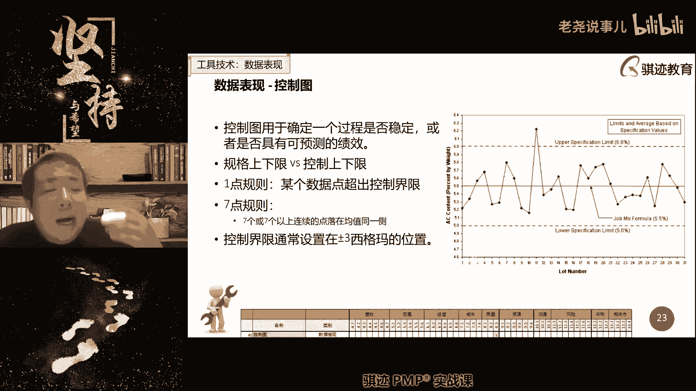

这种工具呢现在考的少了，但是啊还是有可能考到的叫做控制图啊，Control map，控制图是什么意思呢。

它将质量容忍的上限和质量容的下限，以及他们的中位数。

就是我们前面那个讲的，大家记得把那个叫做我们的期望值。

作为中间的中位数啊来设定，那么在这种情况下，我们能容忍的上下界就是上下两个边界，一旦超过上届或者低于下界。

就意味着什么质量，单个产品的质量直接超标。

单个产品就不合格了，那么理论上来说，一个产品的某项质量参数。

应该是围绕着中线上下波动的，是不是这个才是正常的。

这样翻译它可能会有一些啊随机波动，但总的总体来说都是围绕着中线平均线，上下波动啊。

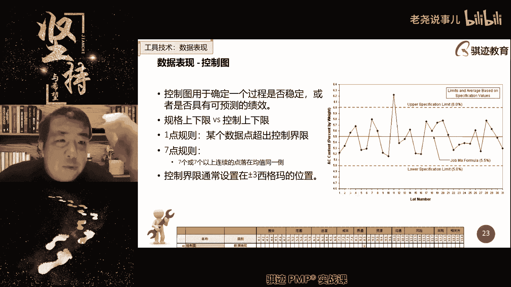

那么如果我们测量啊，一个产品的质量指标连续七次都是偏高。

但是没有超过上限，或者都是连续七次偏低，都没有低于下界，那说明什么东西啊。

产品的质量仍然可能是合格的，但是生产过程存在一些异常或者失控因素，为什么，好我们就不卖关子了啊，我们抓紧时间就不卖关子了，为什么，因为你想高于中心线的概率和。

低于中间线的概率是各5%，期望值的本质是各50%，所以连续七次D或者连续七次高，就是二的七次方分之一就是1/128，小于一，应该是1%不到，所以只有1%不到的可能性都在一边，所以你觉得这个正常吗。

肯定是不正常。

它是一种小概率的事件，小概率事件，所以它一定我们叫小概率的事情，一定是有原因导致的，而绝大部分可能性都是什么。

无原因导致的是极小概率影响，肯定是有原因导致的，这是一个基本科学推论对吧，所以我们应该及时发生这种七点在一侧的，称之为过程异常或者失控，应该及时检查生产过程啊，明白吧，这个就是控制头的作用。

一两个都一检查单个产品是否合格。

二检查生产过程是否存在异常，存在异常和施工，这个就是控制图啊。

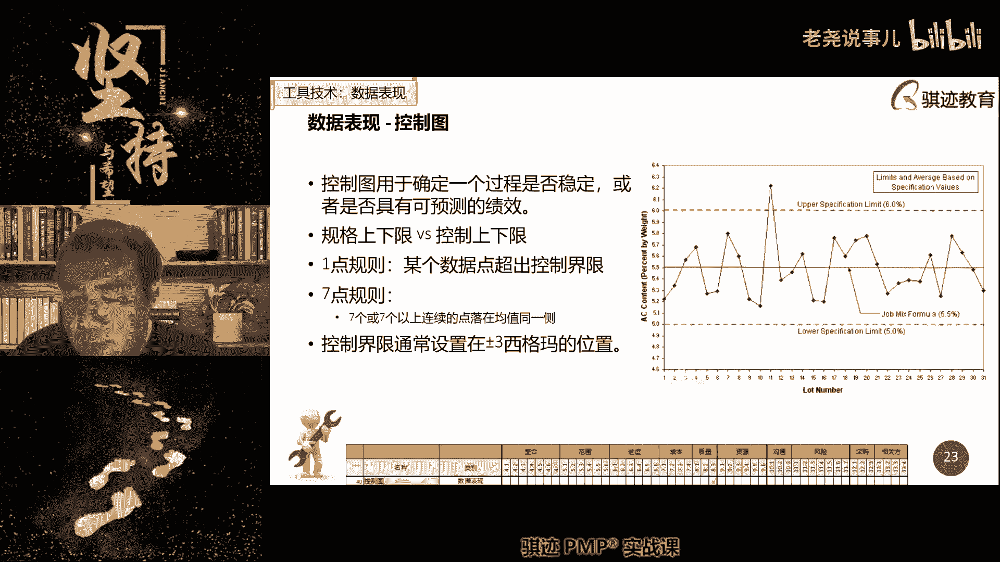

好那么现实生活当中我给你讲个故事啊。

现实生活当中存不存在这种事情存在啊，我们讲个例子啊，我在知乎上看到一个故事啊，有没有存在赌博稳定赚钱的啊，有个人讲了一个例子，澳门以前曾经有一个团队，这个团队是一个纪律非常严明的团队。

他们专门到澳门去玩百家乐。

但是他们平时不压住的。

他们是怎么玩的，监控他们都分不到各个路上，监控所有赌桌当中的啊，大百家乐就是开大开小。

开大和开小监控所有的开大和开奖，然后当有一个赌桌连续十把以上，连续十把以上开大或者开小。

他们就进场反压，每次再开一把。

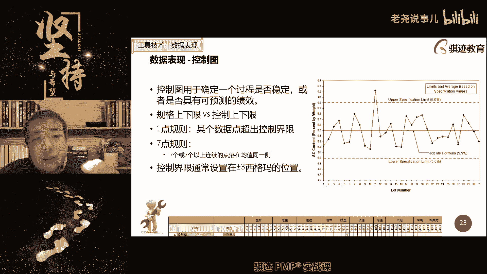

连续的大或者连续小就再多压一倍，因为什么连续十次开大。

它的概率是1/3024。

就是0。1%。

再多一倍0。05%，拿了这么折半折半折半。

所以这个概率会无限趋向于无限可能小，它最终总有一把会什么会变得啊。

另外一个方向对不对。

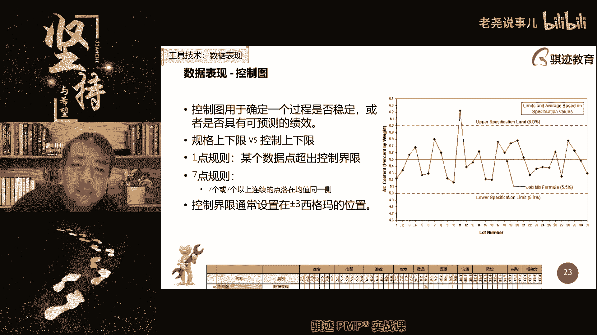

所以这个这个团队呢就不能说是犯罪团伙，人家是很科学对吧，人家没有违反赌场规矩。

就靠着这个这个原则呢一直赚了很多钱，直到他们说，当年或者这个这个团队后来为什么负面，直到后门，有一次澳门有一次他们说有一家百家乐的赌桌。

开出了连续32个大。

好像是，然后他们就倾家荡产，哈哈哈哈啊，也就是说任何概率在自然界中都是有可能出现，只不过这个概率是极低极低的。

但是这种东西就分，为什么你遇上了也没你没遇上啊。

给大家讲个故事，明白了啊，所以我们一般是遵循这个自然规律，但是它总会会有些东西是不可自然规律，是不可理喻的，就像我们说的是吧，呃出呃呃呃出来混久了，什么事情都会发生对吧。

然后控制质量最终会得出的质量控制测量结果。

这个测量结果就是遵循我们前面规划。

质量所进行的质量测量，得出测量结果，这个其实也是测量，我们后面会简单的讲测量绩效率的一个绩效，结果好。

那么我们把质量的相关内容给大家的前半截，给大家讲了一下，那后半年我们就开始讲计测量计效率。

那么首先讲一下测量绩效与在pm bok的第六版。

是没有这个东西，没有这块东西的，但是呢他没有这个知识领域。

但是它有一块东西，就是我们前面讲的监控过程组，所有的测量都是用目的。

都是用于监控和了解项目状态，或者知道汇报项目绩效所产生的作用。

所以测量对于当今的项目管理来说。

也变得越来越重要，因为呃为什么重要，因为传统的项目当中。

测量它不会带来直接的或者迅速的反馈。

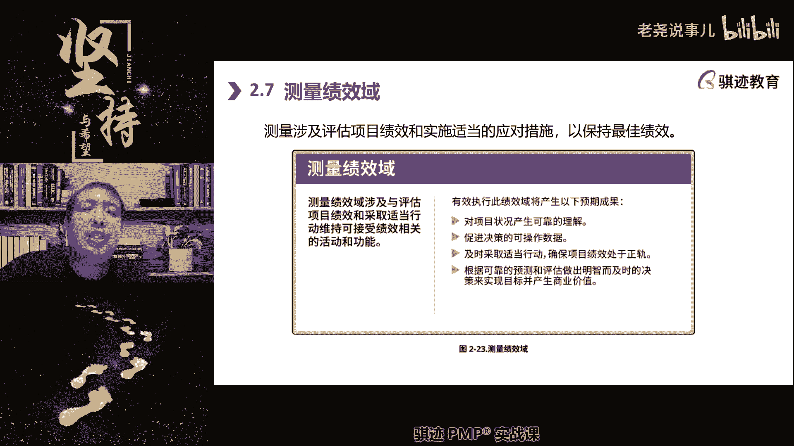

因为预测型当中我们讲什么计划，都是一开始都是排好的。

然后按照规则顺序去做，然后我们只要在定期当中去收集一下数据。

来证明我们的项目处于正常状态就可以了。

对不对，所以测量对于反馈和对于改进没有那么大意义，没有那么大意义，但是随着啊适应性和混合型的项目越来越多。

之后，测量绩效就变得越来越重要，为什么我们在适应性混合性当中，最大的特征改行为特征改变什么。

我们不知道接下去做什么，直到获取外界反馈。

我们才能知道这是什么，但是要获取反馈。

你首先要告诉别人，我们当前是怎么样的。

别人才给你反馈，对不对啊，是不是啊。

就好比说什么，你哪一些小说啊，以前小说你不知道你爸妈应该打你，还是应该奖励你对吧。

那么你想要既想要获得奖励，又想什么东西啊，又想避免挨打，所以你首先要测量一下你的考试成绩。

来做相应的预案。

比如说你这次期末考试啊，当你小时候期末考试考下去的，哎呀这一下考砸了呀，肯定成绩不佳。

你已经对自己在自己的啊绩效测量的时候，已经测了一把。

肯定不会好的，那么你马上干什么，在要公布成绩的家长开家长会。

拿到成绩的时候呢，离你爸爸妈妈远一点啊，然后呢外面避开一点对吧。

然后少挨几个板子对吧，如果你考试考起来又感觉不错，这次考试稳了，那么没事情，在你爸妈爸妈眼前的多现眼点对吧。

然后考试成绩出来之后呢，希望他们多奖励对吧。

根据不同的根据不同的测量结果。

你才能去制定不同的行动计划，然后根据外界给你的反馈。

结局不怎么做对吧，所以测量是帮助我们接下去，也是帮助我们接下去指导我们该怎么做的。

一个重要的一个绩效率的啊，一个重要的绩效率，所以天国第七版将他从监控过程组转为啊。

它的一部分职能转为了什么。

测量计算预测量技巧就是这个道理，知道吧，pm和第六版是没有的。

没有找不到对应的东西啊，所以我们测量测量什么东西啊。

产品的属性，我们的这是基于结果啊。

测量其实就分为什么，我们前面讲过，就像管理质量和控制质量一样。

基于过程的测量和基于结果的测量，基于过程测量是什么，你做的快还是做的慢，你做的啊，这叫什么，成本高还是成本低对吧。

你做得好还是做得坏，基于结果的测量，测量什么材料合格还是不合理啊，这大致这个意思啊，然后测量绩效率还包含一个什么方面，所以过程其实都是用使用什么啊，我们在预测性当中，就是我们前面讲的都是用基准基准。

就告诉你在某一个时间节点应该做到什么程度。

然后你拿实际的测量值与基准相比较，就知道你高于基准还是低于基准，明白了吧，所以现在你们要明白更加明白一点，什么叫基准了吧，基准就是在某个时刻你应该做到的样子，你跟他比较一下，如果你比他做得好。

那你就是好超过了，如果你没有做到，说明什么，你是令人失望，就这个意思啊，那么测量技巧与第三个东西是也是我们的，就是如何表现测量结果，这也是原来pm和里边的比较少谈到的一个事情，怎么表现测量结果。

它是使用的什么，更多的使用图形化，在预测型项目当中，在预测性项目当中，我们更多的是使用什么报告report。

当然report当中也有一系列图表。

但是我们报告当中所使用的图表。

是静态的还是动态的，是静态的还是动态，对所以为什么敏捷的项目更强调信息辐射源，仪表盘这种东西。

因为它是动态的，根据项目的情况实时或者准实时发生变化对吧。

就像你手上有一个血压仪对吧，然后你说话一激动嗯，血压就上去对吧，然后你冷静一下，冷静冷静冷静下来。

这个仪表就是事实，如果你仅仅贴一张图表。

它是静态的，它不能反映实时的或者准实时的状态，这个就是啊，我们传统的绩效测量和现代绩效测量的区别，更强调时效性，实施性啊，所以如何去进行表现，其实也是现在很多的，我们讲了一个一个啊。

现代项目管理的一个一个一个新兴的趋势变化，就是从静态的告诉别人过去发生的事情，到更方便地告诉别人，你想要知道发生什么事情，看我们的仪表盘。

这是一个管理思路的转变啊，那么在绩效测量运动中。

我们会我们测量什么东西啊，成本啊，支出啊，进度啊。

资源啊，我们会给干系人提供信息，我们会在看啊。

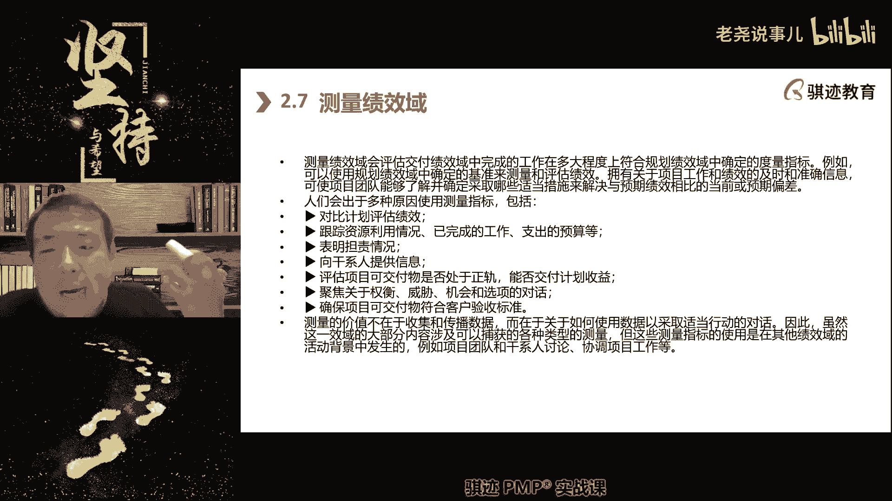

告诉我们的相应官方干系人，项目是不是属于正轨。

能不能按时交付对吧，然后呢，我们看看能不能符合验收标准等等等等等等。

这些东西都是包含在我们要测量的，工序之内的啊。

其中的其中有些东西要注意，干系人的满意度。

也是测量绩效预料非常重要的东西啊，我们之前可能讲过。

你们可能有些东西可能有点淡忘了，就是该分析人的满意度。

是在我们结束项目的时候，要去进行测这绩效测量。

收集的项目的一项重要测量指标。

这个指标关系也是在很多项目中，关系到项目的成功与否的一个指标。

就是客户满意度啊，所以我们不仅仅测量的对象。

是生产的过程和结果，干系人的满意度也是一个要测量的东西。

这个请不要忘记。

所以我们在测量计算当中要做一个什么事情。

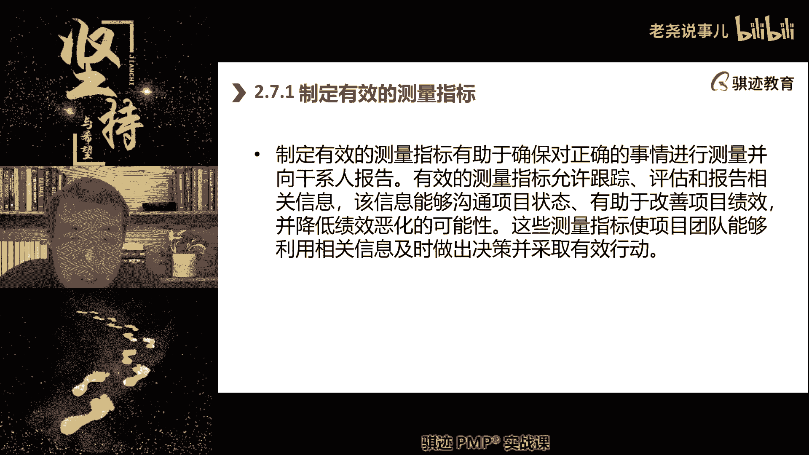

首先我们要制定测量指标，质量当中，我们是不是设定了与质量相关的测量指标啊。

那么干系人当中，是不是我们要测量干系的测量指标啊。

对不对，然后我们接下来我们啊范围管理当中。

我们是不是也确定了测量指标，我们范围管理当中。

哪哪一个东西是我们的测量指标。

范围管理当中我们什么东西是我们的测量指标。

是怎而且是怎么测量呢，还记得吧，正好复习一下，对范围基准说的非常好啊，范围范围基准就是拿着一个基准去对比。

看看当前的范围是变大了还是变小了。

对不对啊，那么测量呢有指标呢，有总体指标，还有细节指标对吧。

还有阶段指标等等啊，指标的设定可以是全局性的。

也可以是什么啊，是局部性的或者细节性应该是什么设定，要全面注意啊，我们项目范围说明书，WBSWBS的字典都是范围基准。

都是要用于进行对比啊，那么在指标的设定上，接下去会有两个概念啊，考试也会考的就是KPI啊，KPI关键绩效指标，那么KPI指标一般都KPI大家都知道吧，就是我们认为成功应该满足了哪几大方面。

每一方面分别应该达到什么数值，将它们集合起来就称之为key performance index k p i，知道KPI是什么意思了吧，啊等会我会讲一下KR的啊，那么KPI呢主要分为两大类指标。

一个叫做提前量，一个叫leading index呃，呃不是叫leading index啊，啊对叫西叫leading，叫叫叫indicate，一个叫做leading indicate。

一个叫做legacy，Legacy indicate，一个叫做呃领先指标，一个叫做滞后指标啊，这两个概念要注意，考试的时候可能会让你区分的啊，那么什么叫做领先指标好，我们举个例子。

比如说老师今天早上去做体检了，如果我体检啊，体检下来尿酸偏高，那么它就是什么的提前指标，如果尿酸偏得很高，它就有可能是什么的提前的指标，生病明显明显痛风，怎么是高血糖呢啊。

那么请记住你们以后体检注意尿酸高，人是没有感觉的啊，但是注意只要痛风必定尿酸高，但是尿酸高不一定痛风，痛风在发生前一定会发生一段时间的尿酸高，所以如果你体检发生了，体检发现了有尿酸高。

它可能是你未来发生痛风的体检指标，就告诉你未来有可能要痛风哦，所以你一定要当心什么，要改善尿酸，那么改善尿酸干什么，多喝水啊，然后吃一些少吃一些啊，尿酸高的食物，然后帮助内脏降低负担，然后来排解。

现在有些同学对我，我认识有些小朋友年纪比我小很多，已经开始痛风了啊，我前两天我去年体检的时候，尿酸超了一点点啊，超了一点，但是我是没有疼痛的啊，吃药不是解决办法，最主要是什么，多喝水多出汗。

痛风最主要两个原因，一水喝得少，二不运动不出汗，所以现代人为什么很多痛风越来越多啊，干活干的少，你知道吗啊就不说了，今天时间呢不扯，我又要扯故事，你们以前看过一个故事是吧，痛风在古代欧洲。

痛风和蜘蛛是亲戚，知道吧，什么意思啊，城里人痛风，乡下人房子里都是蜘蛛，因为什么城里人爱干净，房间里面容不下蜘蛛，所以蜘蛛在城里待不下去，乡下啊，乡下的农妇呢天天要干农活，经常运动要出汗。

他没办法生痛风，所以蜘蛛在城里面待不了，他搬到乡下去了，痛风呢向家里，乡下待不下去了，他搬到城里去了，所以他们又都有各自美好的前程，就这个意思，你去看一下这个故事很有意思啊，所以这是提前指标。

还有一些指标呢是滞后指标，它是事后提供信息的啊，啊比如说什么我们的交付数量啊，我们交付的数量，我们获得的荣誉，这些都是滞后指标，荣誉都是什么事后再交给你啊，那么你前几年呢，网上有些阴阳怪气的。

总是说哎你中国人科技不行，你看看你看看人家日本人拿了多少诺贝尔奖，你日本人拿了多少个技术，你们中国人才拿了多少，你懂的那种人啊，拿国际大奖，某种程度上就是一种滞后指标，为什么拿奖都是什么。

科学家在他最年富力强，最有创造力的时候发掘的，然后诺贝尔奖这种大奖，他发展很谨慎，他为了防止发错啊，当年用过的悲剧啊，就不说了，有啥六六粉是吧，6666666的就是化学成分。

成分是三个符号是66666粉，然后它会致癌的，就会当成一个高效杀虫剂，能哪个都没讲对吧，诺贝尔历史黑历史，所以诺贝尔奖后来设定原则就是，发给诺贝尔奖的受奖人一定是他的方案。

他们他的科学发现经过了时间考验，是对人类起到重大贡献的，才能拿诺贝尔奖，所以往往是什么年少的时候发现了重大的东西，到了年老才什么拿了诺贝尔奖，所以诺贝尔奖就是个滞后指标。

代表着你的国家几十年前的科学状态啊，所以我相信中国再过几十年，会拿很多国际大奖对，所以获得奖励和荣誉就是一个滞后指标，肯定你过去的发生的东西，当然了，滞后指标虽然它是滞后。

但是你可以通过滞后指标来反映出，什么一种趋势啊，滞后指标它的作用是连续的，滞后指标是一种趋势啊，比如说你啊考，虽然你每次考试成绩都不如隔壁的小王考不好，但是你每次考试成绩呢。

都比上次考试成绩考的高一点点，考试成解释之后，代表着你过去一段时间的学习状态，就这意味着什么，你正在状态上逐步在改善，所以考试成绩也是个滞后指标，所以很多同学啊，这就讲到很多同学经常会在考前问老师。

我做模拟题，为什么成功短的成功率不高，那么我跟你说，不同的同学，起点和得分和学习能力和起点都是不一样，人和人是不一样的，你要不要和别人比，你要和自己比，你看一下你在通过认真努力学习之后。

这段时间成绩有没有很缓慢的提高，我们考p mp，你们到时候考前做模拟题的时候，200分的模拟题你们去看很多人容易卡档，卡在什么地方，100分到120分这个区间，这个就是你的什么，就是相当于什么渡劫区啊。

哈哈渡劫区很多人会在这个泥泽里卡当很久啊，做梦一天到晚做模拟，做做数目及怎么老是就就就就会分数，有时候提高不了信息素的半天成绩下降，这个时候你在渡劫，你为什么会渡劫，你有很多的缺失和知识认知的盲点。

缺点或者认知不清或者思路不清，导致了你分数无法提高，当你在这段期间，把所有的盲点大部分都补上了之后，到某一个节点你就渡劫成功了，拼一下成绩就上去，很多同学做到最后往往都是在正式考试的时候。

突破那个界限啊，所以很多同学PNP考试前啊，总是很纠结，老师我怎么模拟题，成功率老师这么低，怎么老是错那么多，我交流考试考不过，要么是进还考，算要有自信，你为什么需要渡劫。

而有些同学可能不需要杜绝或者很轻松的渡劫，是因为人家基础可能比你好，或者人家理解能力比你强，或者是人家学习比你认真，但是这些都是滞后指标，只要你努力，滞后指标只代表过去，不会预测未来会怎么样。

预测未来怎么样，是提前指标啊，那么考试通过PMP的提前指标是什么，我跟你说啊，这个东西没法量化，但是会有一种感觉，大部分同学都会有一种感觉啊，上课先告诉你们一下啊，这是什么。

当你在啊备考PMP做题做到某一个阶段，你会发现什么，老师一我突然发觉有一种感觉，做任何的题目我都不再会没有思路，虽然也有可能会思考错误，但是我突然发觉，我看到每道题目都知道应该怎么思考的。

并且掌握了这种思考的感觉，他有一种feeling，恭喜你，你这个就快渡劫或者已经渡劫成功，这是提前指标，他并感觉考做题感觉并不代表任何东西，但是如果你当你做题是有感觉的时候，那你就意味着往往就意味着。

未来很容易成绩提高，然后还可以达到合格区，这就是提前指标，但是这个东西没法量化啊，好扯的有点多啊，所以我们讲的是测量当中的两大类指标KPI，那么我们前面又提到了，还有一类指标叫KR啊。

OK啊那和KPI不一样，OK那它不是用量化数值进行分割，设定，你必须做到哪些指标，每个指标做到多少，只，而是设定一个OK的玩法，是设定一个目标，这个目标呢是你整个团队和一个公司。

或一个团队和项目团队或者一个小团队共同，所有这个目标呢一定要你们什么，我们评测认为什么是可做到的，但是一定要让你花大力气才能做到啧，我们将数值转化为具体可以实现利益的目标，这样一种方式去设定啊。

这就成为了另一种考核题，叫K啊，现在KR是不是都很流行啊，啊要公平公平的给你们打一打，OK啊，OK啊本质就不是一种指责，而是一种承诺啊，而是一种承诺，好那我们接下来讲啊，接下来就讲一个非常熟悉的。

我们可以应用在很多领域，我们之前已经讲过了，在需求管理当中，其实我们已经讲过叫smart原则，记得吧，这里还是用smart原则，意思是一样的啊，再再复习一下啊，再复习一下啊。

那么因为考虑到测量这个是新出来的，我们也不知道测量这个里面到底有没出，是继续按照原来出还是新的，又会有题目出题的方法，内容肯定是不会啊，就是项目管理的主题是不会变，他可能出题方法会有改变啊。

那么所以还是这个复习一下smart s什么specific，具体的内容应该是详细的，具体的有数值的啊，M是measurable可测量的，就是能够测得到的，能够测量出来能够感知的A呢。

ATTENDABLE能可获得的，可实现的啊，可以做得到的，那是relevant啊，相关的和我们的项目相关，和项目的价值是相关的啊，最后T是time b是有时间界限，要有约定的时间内完成，smart原则。

smart原则，我们曾经在项目的范围管理的需求管理当中，需求管理的收集需求当中，其实讲过的对吧，smart原则，所以我们这里就不细讲，但是你其实也要知道我们的测量指标的标准，也应该符合smart原则。

那么我们测量内容会有很多对吧。

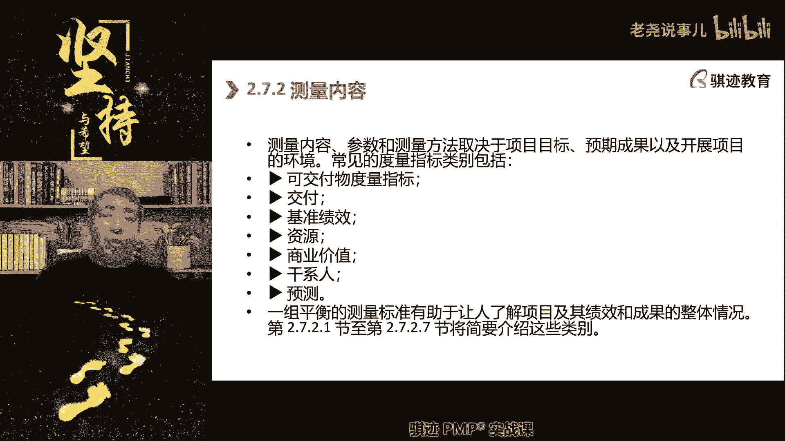

交付物的测量，交付过程的测量，基准的测量。

资源使用的测量，商业价值的测量，干写满意度。

测量和预测啊，那么预测那是测量的衍生，就是预测就涉及到什么，你根据当前的测量结果来预测未来会什么。

就相当于啊啊，大神啊装大神，好继续往下讲，那么可交物质的测量指标呢，会有什么与质量相关的测量指标，与配置相关的质量指标和技术，实现相关的测量指标，那么质量的大家都知道了吧，最关心的是质量测量多中。

大家最关心什么缺陷数量，包括什么，已经识别的，已经解决的和未解决的缺陷数对吧，那么配置相关的其实就是什么属性，测量配置在偏僻的范畴里，定义的比较简单，就是属性啊，对于属性测量，那么有时候我们注意的吧。

属性不同，可交付成果的属性的偏差，不一定会导致质量问题，但是会导致什么啊，用户的满意度问题啊，用户的满意度问题，就比如说什么啊，就比如说啊你去超市买西瓜，现在很多超市大家知道买西瓜，就是不按照斤来算。

按照支来算，他超市沉默，你一只西瓜不低于八斤，那比如说一只西瓜卖你50块钱，不低于八斤重啊，两只西瓜蛋鸡蛋呃，这只西瓜卖出来，有些人拿到的西瓜呢，比如说超市给你配送过来了，有些人拿着西瓜呢是十斤重。

有些人西瓜呢当正好是八斤重的，那么它们的质量都是合格的，但是他们的配置呢有差异，这种时候呢拿到十斤的人呢就容易笑嘻嘻，拿到八斤的人呢就会心态不平衡对吧，就是正所谓人不患多寡而患不均对吧。

啊所以这就是配置啊，我们要注意配置，它是有可能会影响到，也有可能会影响到我们质量，但也有可能会影响到满意度啊，交付时候的满意度，所以我们尽可能在配置管理当中呢，就尽可能让可交付成果的配置的一致性。

保持差异性，保持越接近啊，越少越好啊，然后最后一个呢是什么技术，实现相关的技术测量指标啊，OK这个就不做解释啊，因为不同项目的技术绩效测量指标，这个东西就是跟本领域的专业的东西有关了，对吧。

那么它包括什么，比如说不IT领域，比如说你要交付一台交换机，那么它的技术测量代表什么，你这台交换机能最大承受多少的访问容量对吧，如果你在建筑领域啊，你这个建筑最大能抗多少震极，这些都是技术测量的值啊。

它呢和质量没有直接的关系对吧，我们买了，我们买一幢楼，造一幢楼，买来住，不是为了看它能多少抗震，但是抗震是一个什么技术测量，技术的质量的保证对吧，所以这个这个不同的项目的领域就相关了啊。

这是可交付的的度量的指标，那么接下来交付也和测量相关，交付测量指标与在这边常使用，在适应性方法之中啊，那么这个交付指的是什么，是在交付过程中你表现出的效能效率啊，效能效率什么，我们能以多快的速度交付。

这个预测性就不太用得到，因为什么预测性一般什么分批指定节点，只交付指定东西，它没有所谓的快慢，很强烈的快慢要求对吧，或者一批子一下子爆炸，交互不就没有很快的交付这种需求，但是在适应性或者混合型项目当中。

它会存在一个什么东西啊，就是我能够以多快多高的频率交付，会决定这个项目的成败啊，决定项目这个成本，那么讲到这个东西我就想起一个东西啊，啊今天的新闻看了吧啊，商飞交付了第二架国产大飞机，919大飞机。

第二架，这个就让我就是有一点点啊为国家国之重器，有一点点小小的担忧啊，交付的有点慢啊，因为关键是什么，你要迅速通过量产国产大飞机来什么满足市场，如果你的生产量上不去的话，就是说是市场对于你的接受程度。

就可能获得最终的容量，能接受的可能就会就会小啊，这我想那为什么这么关心呢，因为我我带过的有些同学就是在商会里做啊，啊我也对国产的大飞机很很抱有期待，抱有期待啊，所以交付在适应型的项目。

或者那些需要有一定的交付量，项目才会有价值的那些项目当中，交付的频率和交付的速度，也成为了一个需要测量的东西啊，在预测型当中，这个可能大部分的预测性可能没有这个要求啊，那么这里就会有一个有一些公式啊。

给大家分享一下，考试有可能会跟这个预测跟相关啊，第一个是一个公式，我们常用的公式叫做cycle time加waiting time，the leading time啊，这个只是一个表达。

那么这是什么意思啊，cycle time指的是什么，是呃周期时间啊，周期时间，we are waiting time呢是等待时间，Leading，他们呢是什么导入或者前导时间，那么这三个表达。

你们只要知道leading time是呃前导时间，它等于是我们真实生产过程，加上我们的等待时间，就是所有的导入时间，你要知道这个概念问题，那么为什么要讲这个概念呢，因为我们在工作中。

接下来啊就有个著名的台词来，请注意我要开始撞对吧，我要开始装什么了对吧，那个那个有演员的台词，注意我要开始装逼了对吧啊，Leading time，Leading time。

在很多的外企环境和我们的工作上，或者在前导时间经常使用的这个词，指的是我需要多长的时间来完成这个工作，它包含了，所以你实际知道意思，它包含了我实际工作时间和转接，等待交付转移的时间加在一起的总和时间。

称之为离灵堂前导时间啊，这个时间就是一个总时间，反正你记住，但是呢我们在项目管理和日常管理工作，尤其在外企环境啊等等这环境中，我们不会说总时间这么啊这么low low的词。

我们会说一个词叫做leading time，明白了吧，这就是一个专业词汇啊，以后看懂了就知道了啊，啊，那么我们讲交付的这个这个这个值，或者交付的这个效率，用什么方法可能来判别呢，有一个公式会说明。

我们之前讲过叫利特而法则啊，我们之前讲过吧，雷托洛之前讲过吧，记得吧，交付的时间等于存货数量乘以时间节拍啊。

这个这个这个是精益的表达方法啊，那么什么叫生产节拍。

就是你的生产节奏，生产节奏，但是这个表达比较难理解，那我们可以改写为这个生产效率。

等于在制品时间除以生产周期啊。

那么就是什么生产效率越高，那么它就等于什么。

我们有更短的总的生产过程。

那么这个总的过程，我们的生产周期就是cycling time。

就是那个c cc t那个值是相对比较难以压缩的。

所以要想生产效率提高。

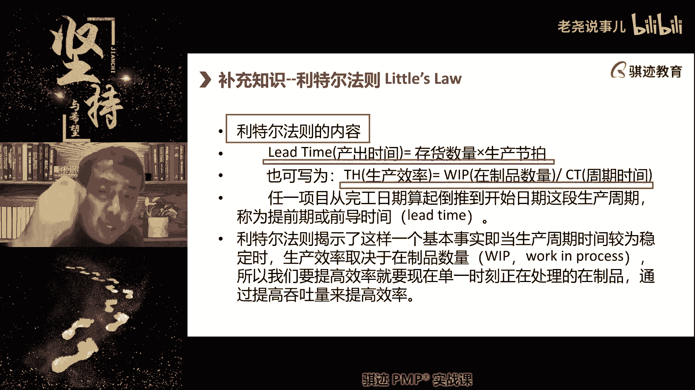

我们更多是采用什么方法，就是我们前面讲的减少同一时间的在制品数量。

也就是说在适应型啊。

我讲的现在比较慢，在适应型或者混合型的项目当中。

我们通常追求的什么，同一时间只做尽可能少了。

最好是只做一件事情，但是用最大的效能。

在最短的时间将这个事情做完。

从而达到最好的生产效率和交付速度。

那么我们举个具体例子。

很多同学可能还不理解啊，举个具，但是记住呃，立体而法则。

你们在考试的时候记住立法法则的，它的表达方法有好几种，它包括什么吞吐量除以再制品数量啊等等等等。

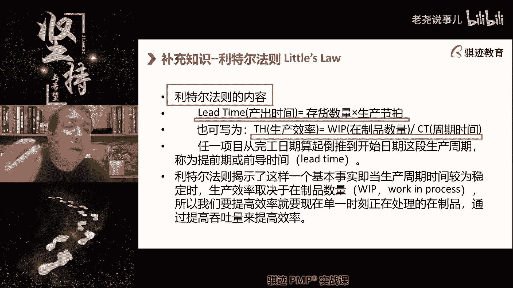

都可以，那么这套法则的啊。

那么我们举个例子，如果你同时加工实践产品。

那么每件产品加工10分钟。

那么你需要花100分钟把这十件产品加工完。

然后交付给你的客户，你的总耗实施100分钟。

客户要等待100分钟才能拿到你的产品，所以一下子拿到时间。

那他等待100分钟，那么如果你每次只加工一件产品。

花费也是10分钟，但是你每次只加工一件。

然后客户每10分钟就能拿到一次产品。

客户的等待时间只会有最多10分钟。

