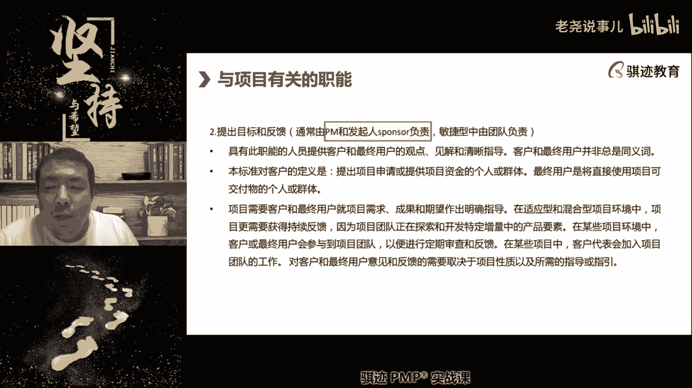
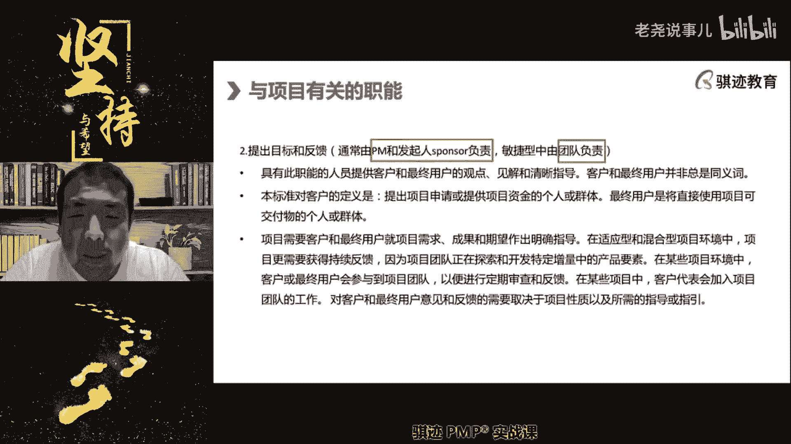
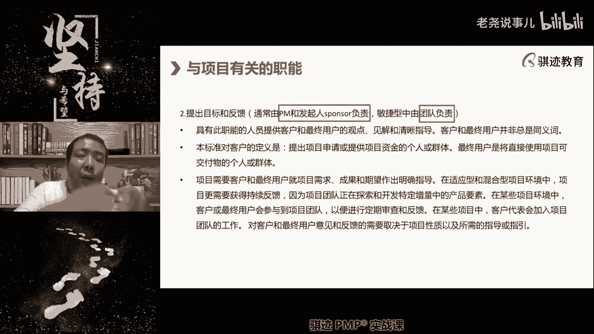
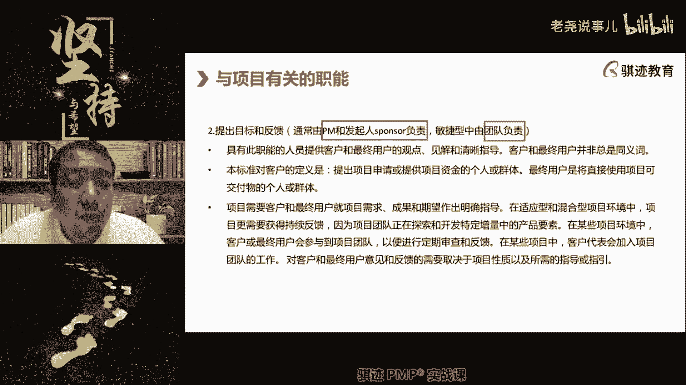
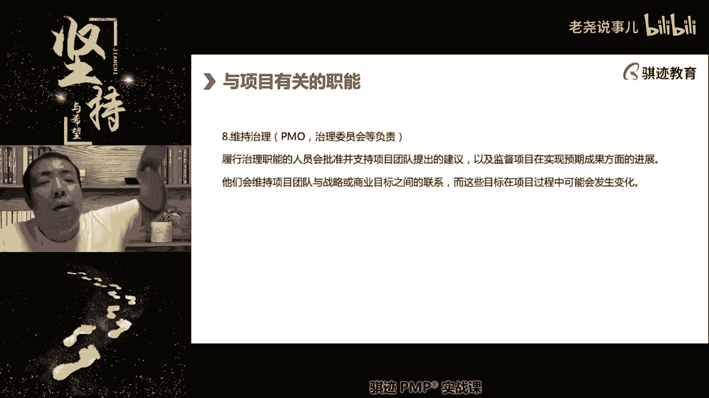
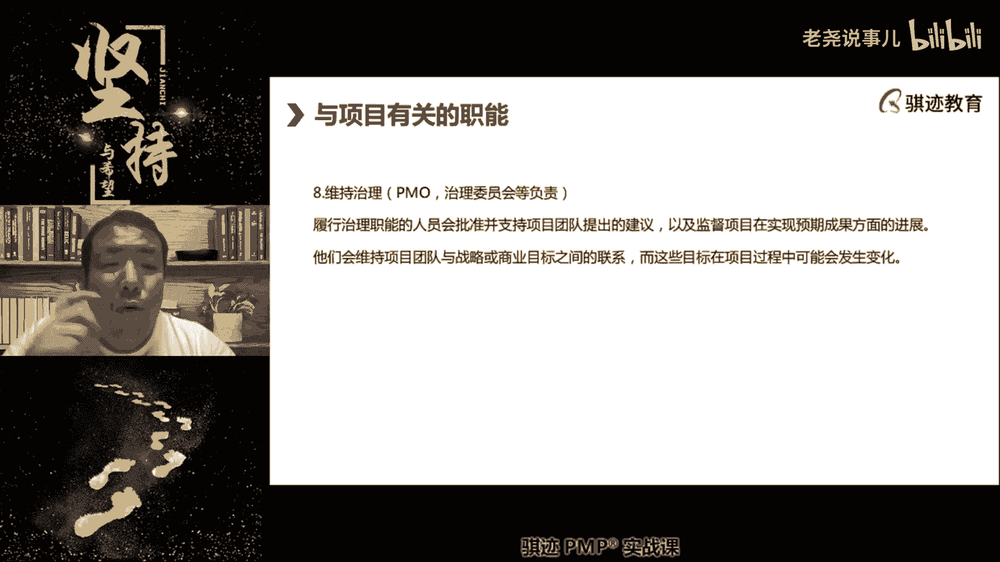
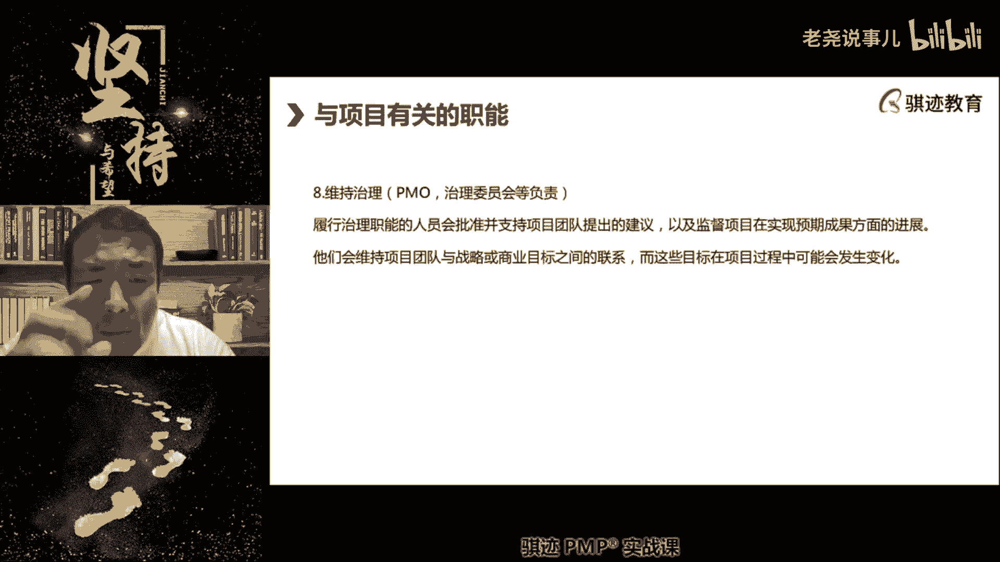

# （收费视频完整版分享）PMBOK第七版课程PMP考试报名认证培训精讲-零基础项目管理第七版教程最新版直播课回放视频免费课程资源-骐迹教育谢阳主讲 - P6：2-3价值交付体系 - 老尧说事儿 - BV1ek4y1s71N

绘制的一个高层次的蓝图。

在具体的做的过程中，也是正常的啊，你要及时反馈给高层，我们本来想打入，我们本来想打入电子商务市场，结果进去发现什么里边都是妖魔鬼怪啊，惹不起惹不起，走了走了走了走了对吧啊，你们知道吗，这两年就是前两年。

很多好几年前就开始，中国的很多制造商就走出去做跨境电商对吧，前两年很热，这两年还是挺热的，跨境电商，很多做跨境电商的为什么要去做跨境电商，知道吧，他们的战略本来是做国内电商，很多跨境电商这种。

结果发现国内卷的实在太厉害，都是什么神仙妖魔鬼怪，这种价格你也能做得下来啊，惹不起惹不起惹不起，我们去赚老外的钱，然后去改成做跨境电商，因为国外的竞争市场竞争没有卷的这么厉害。

我们可以有比较充分的啊利润保证，利润边际保证对吧，但是风险在于我们对外部市场不熟悉，有法律监管的这种风险，我们会面临很多的外部项目的外部因素的影响。

但是我们觉得与其在国内被别人卷死，不如到外面接受这种外部环境的，可能产生的负面风险。

然后去到外面去啊啊所以中国的很多的产品，为什么老外看着怕，就是怕你们国内都成卷王了，你们卷到后面都已经卷得面目全非了。

然后再来出来跟国外那些那些新手村，刚刚出来的那些企业打，不是把人家按在地上摩擦啊，中国市场就是一个内卷炼狱啊，大家觉竞争也不，这不能叫内卷，就是大家竞争来竞争，去竞争到极致之后再走出去。

发现外面一个能打的都没有，所以老外看到中国这做某个行业，他很惊恐，你们这个国内一是市场大，二是竞争这么激烈，做出来的产品，怎么就是说比我们这个简直是两个世纪的产物，然后来跟我们竞争呃。

求中国爸爸赏口饭吃，很多时候就会有这种老外为什么看到中国人怕，就是这个道理，知道吧，OK啊呃有同学就问了，你这个是敏捷当中的史诗和史诗EPIC，这个史诗EPIC，这个这是敏捷当中一个需求层次啊。

这个跟战略没关系，这只是敏捷当中一个需求的层次啊，这没有没有直接关系啊，一个敏捷项目可能都不一定够得上战略，他可能离战略是有点稳，他只能跟自己本项目的愿景有点关系，所以你这问题问的不恰当好吧。

我们讲到相应的内容再再解释好吧好，好继续往下讲啊，那么这组织的治理系统啊，组织治理系统是与价值的协同工作了。

就是说价值交付系统是用什么项目运营啊。

去创造价值，但是我们也要讲到一个东西叫做治理。

治理是保证一个正常有序，或者我们认为最有效的一个运行环境，的一个过程叫做治理啊。

叫做治理，它提供了一个框架，所以治理它的本质上是一个框架，你所有的组织内行为，无论是项目还是非项目的，都要遵循这个框架去行事啊，遵循这个框架型，包括指导每个活动的职能和流程。

那么这个框架可以包括什么监督评估，价值控制各组件整个等内容啊，好那么这段话题是什么啊，其实很理论啊，其实说穿了就是告诉你这里是个框架，那么我们用一个这里你可以自己看一下，我们用更通俗的话讲啊。

智力是个什么东西啊，注重过，这是我给大家，这也是我给大家分享啊，原书上没有的，治理是一个注重过程的一个事情，他不追求结果，但是追求过程有序可控，合规完善，有序可控，合规完善啊，他追求这样的东西。

在这样一个环境治理恰当，治理有效的前提下，项目才能去追求他所想要的结果和成果，所以项目是一个management啊，它和治理的英文governance的区别就在这里，他追求的是一个结果。

但是没有好的治理，就没有好的结果啊，所以这就像中国老祖宗说的一句话一样，就说国泰民安，国泰民安，为什么只有国泰才会民安啊啊，为什么只有国泰，因为只有国，什么叫国泰啊，就是国家治理有方井然有序的情况下。

每个人才能追求自己的小幸福，就是这个意思，明白吧，所以中国人都是什么啊，在国家安康的时候，就注重每个人自身的啊幸福的导向，但是当国家已经不能呃安泰的时候，那么我们每个人都会自发地组织起来。

去支持这个国家重新进入安泰这个过程，所以中国人为什么一直支持说国家统一啊，有很强烈的国家民族，那个就是统一的思想，和和和和和和集体主义思想，就是因为中国人在几千年历史上都是这样过程，中国人听不明白。

国家如果不太平，每个人都不太平啊，所以你可以把这个引申到智力，就是为了什么组织内太平啊，一个组织治理的好，他的它的体现就是什么上下同心，行为一致，然后井然有序去做事情啊，然后我们在追求每一件事情的结果。

这就是项目管理，明白了，那么组织治理到项目管理这个过程，我们会运用什么啊，我们通过项目组合，项目集和项目治理各个层次的这个框架，提供项目决策框架，管理流程，管理模板这种东西来限制你的项目。

不要做的野路子，不要做的啊。

没边儿了，没控制啊，这种事情，这就是组织的治理治理架构当中的一个含义啊。

那么光看我们这个定义呢，有点有点有一点点抽象啊。

我给大家举了个例子，不知道大家明白了治理和管理的关系。

明白了吗啊，学费的同学可以可以在公屏里打一个学费了啊，啊那么项目在一个呃，那么项目可以在一个项目集和项目组合中运动。

也可以独立运作啊，那么这是项目的治理环境。

它可以受到项目及项目组合的治理啊，由他们来监督管理控制，然后得到最好的效果，也可以自己独立运作啊，自己一个人玩也可以啊。

受组织管理就行啊，在一些组织中，项目管理办公室可以作为治理结构啊，所以在一些项目中，项目管理办公室是什么，POPO可以作为智力的主体啊，我们很多时候PO就会自立主体，它掌控这个框架。

这个框架呢我们现在这个不提了，这个框架在在一些理论中，项目管理的组织及管理框架叫OP m，它是第三版叫OP m three o p m c o p m4，它提供一个框架，CCBCCB是变更。

它是组织的治理的一部分，也可以是项目层面啊，你这个跳的有点远啊，不错啊，有些同学是学的还是不错，预先学习学习还是不错，但是这个呢要看他的所谓的定位。

那么项目中还有个什么项目指导委员会。

这个呢是全对项目来说是全局性的，指导项目的一个委员会。

工作委员会。

OP的全称叫organization process management的组织及啊，Organization project management，组织级项目管理。

的缩写，它其实就是一个提供。

这样我们前面讲的这个框架，OPNC就是一个框架。

你们有兴趣可以看一下pm和第六版，提到的第七版没怎么提，但是这个框架呢外面很通用。

有没有去看一下，有点枯燥啊，但是呃提供了一个，相当于可以进行自己调节的一个公版。

然后你可以继续公版，来个开发。

你们自己组织内部治理体系的一个框架，O p m o p m4。

好这是组织的治理系统，组织治理系统啊，继续。

那么组织制定当中，会有各种各样的角色的扮演啊，我们前面已经提过，第一个PO，项目管理办公室负责为组织跟踪项目，实现治理过程的，这是第一个PO的职责啊。

值得我们在PMC第六版里面有啊，第七版呢没怎么提到，但是你们其实应该知道它分为支持型，控制型和指定性，对项目的接，这就是对项目的控制程度和干涉程度依次加深，在指令型它是完全可以指挥项目去做事情啊。

知识型只是提供支持，但是所有的PO都提供支持的啊，所以如果你在项目管理中，不知道这个模板是什么，找PO对吧，不知道这个文档怎么写啊，找偏猫对吧，不知道从哪里去找资源。

不是给你直接告诉你哪里有告诉你哪里有资源，不是给你争取资源，找天猫称之为资源索引和资源目录啊，这些都可以找PO啊，好好这是项目治理当中扮演的第一类角色，第二类角色叫做审计师，审计事是什么呢。

为组织内部外部事务等等实施审计的啊，进行审计的，负责对项目的各整体和个体进行审计，那么项目管理当中注意有三大审计，以及整个项目的整体审计叫项目审计，项目内部的特定领域审计有三大，审计是采购审计。

风险审计和质量审计，采购审计干什么，看看你有没有合规采购，有没有捞回，扣对吧，词汇扣对吧，那诸如此类啊，风险审计，看你的项目，有没有良好的对项目的风险进行管理，项目风险是否可控。

质量审计是看你有没有去执行规定的，项目的质量管理过程，能够使得项目的质量保证合格啊，审计的目的都是看过程是否合规，有没有做到过程最佳，他对结果并不太关心啊，所以审计是一种治理手段。

你们是不是有很多项目要定期接受审计，或者你们是不是有很多人的部门和工作，是不是要定期被审计啊，所以审计师就是干这个活的啊，他们会进行结构化审查，什么叫结构化，做任何一次检查都是预先制定好要做哪步。

哪步哪步，所有的检查过程步骤不是由人为判断的，而是由固定步骤去做啊，排除人为因素，好项目中还有一个叫治理委员会啊，就是我们讲的这个项目治理委员会，对项目的治理过程做出判断的，这个委员会制定委员会。

在很多时候会扮演项目发起人，或者是行使部分和全部项目发起决职责，决策的权利的这样一个角色啊，叫做治理委员会。

好那么项目我们的价值交付集当中呢，会有一个一个扩展知识给大家说一下啊，叫现代经营管理支付亨利法院啊，所所写的啊啊管理理论啊，现代项目管理理论，那么他这里提到了呃，我们项目管理中几条东西啊。

要想一个项目管理的好，你就项目管理是管理的一部分啊，这里我想讲的是，项目管理是现代企业管理的一部分，但是他遵从遵守啊，符合我们现代项目和现代企业管理的啊，一系列公共设定，基础设定。

那么项目管理应该是什么，基于工作授权的职责，授权的去分派工作任务啊等等，有统一的纪律行为，有总体目标，应该注重支付合理的薪酬对吧，钱要给对吧，要保持员工士气对吧，要注重安全等等，这些你可以看到啊。

在之前在现代经营的管理过程的，学派的开山鼻祖的时候，提的这些原则，则和我们之前学的那些，我们的讲的项目的内内外部环境因素，是不是都是很吻合上的啊，所以管理学这个东西我觉得100年来变化不大。

手段越来越先进的理念越来越先进，内核其实变化不大啊，啊这个给大家看一下，大家有兴趣可以看一下啊，特别标红字，我觉得是比较重要的，好那么接下去我们会讲与项目有关的职能啊，这是我们今天讲的最后一部分啊。

啊稍微稍微拖一会儿堂啊，今天还是讲的有点慢，但是我觉得很有必要啊，与项目管理有关的职能，第一监督协调项目，整个对项目的监督协调是通常是由项目经理骗，和项目管理团队负责注意啊，很多的项目大的项目当中啊。

我们又讲个设定，它不仅仅是项目管理，项目经理管所有的，它可能管理当中可能会有很多很多事情，项目经理管不过来，那怎么办，会有一个项目管理团队，帮他一起管理所有的事情啊，所以他会有个项目管理团队啊。

帮他一起管理啊，像我以前管理有些大的项目的时候，我是主项目经理，我还有副项目经理，我还不是项目助理啊，不是我还有项目助理，我们以前管的项目还会有项目助理，还会有副项目经理啊，相当于相当于是我的副手啊。

啊，然后还会有一些其他的项目，管理团队的一些成员啊，好帮助我一起管理，因为有些有些项目实在太大了，你一个人精力是管不过来这么多方方面面，那么无论如何，这些管理者和管理团队，会提供监督和协调的职能。

包括什么啊，包括协调我们与管理层的想法啊，和我们项目的目标相一致，包括什么，我们进行商业分析论证啊，包括我们的啊可交付成果的交付和验收等等啊，进行协调和支持啊，一系列工作安排啊。

啊监督的已经安排的工作的监督和规划等等，这些都是什么题，是项目和项目管理团队负责提供监督和协调啊，这个东西比较抽象，大家可能也知道，项目经理是不是干一个项目当中，项目经理是不是一个直接干活的人啊。

唉你们所认知的项目经理是不是直接干活的，是不是，大部分情况下不是大部分情况，项目经理在项目中主要是干什么，一是指导项目，二就是监督和协调项目，所谓的协调就是遇到困难了，遇到矛盾了，他就把困难客户表。

把矛盾给化解掉啊，监督就是对项目的状态进行监管，当出现偏差的时候，即使地予以纠正啊，举举予以改善啊，动嘴的，嘿嘿嘿哎所以我是不是很像一个动嘴的，OK啊不扯啊，第二个第二盘，第二块与项目管理。

项目管理当中的啊。

我们的第二块职能啊，价值这是价值交付体系当中的职能分配。

第二块是提出目标和反馈，对项目提出高层次的目标，然后啊给项目目标是在实实践实践当中。

这个与给予目标是否实现，给予及时的反馈的职责。

这个呢通常是由项目经理和发起人sponsor发起。

人们叫sponse to the sponsor，我们的项目就我们没有特别提啊，我们看到的就讲什么叫死亡。

Or，就是项目中作为乙方给我们项目提供预算的人。

叫死帮手啊，那么有些同学老师全部都是甲方给的不错，但是有时候很多的项目一开始是没有甲方的。

但是你要去做，那么你要从乙方自己内部拿资金，那么就会有乙方内部的叫做sponsor啊，那么这个东西要卖给甲方。

赚钱了之后才会有有一些项目呢是甲方的项目，但是根本没有，根本没有什么甲方，乙方他就是一个甲方自己内部项目，那么你的钱从哪里来。

那么sponsor就是谁啊，是负责给你钱。

项目上给你钱，给你资源使用，授权给你项目合法性的那个人。

自研项目不一定是自研啊，自研物包括在内，所有甲方自己内部发起的啊，不是不是涉及到明显的乙方的项目都是什么啊，呃都是叫什么啊。

由sponsor来负责啊，提供负责，那么注意啊，提出目标和反馈，在敏捷当中是由团队来负责啊。

因为这个时候变成了自组织了啊，这个时候提供目标和反对。

在反馈，在敏捷型的项目当中呢，有团队自主来负责，因为团队自己会给自己设定一个项目目标。

或者会对项目目标进行持续的进行改进。

反馈和改进啊，那么这一点其实要注意啊，这要注意在敏捷性项目当中呢。

我们的项目的管理是由团队自己负责。

叫自组团队，项目团队具有部分的决策权啊，这个时候，项目经理不再是把团队成员当成木头人，而是让团队人员自己从发挥主观能动性啊，所以你会看到什么，本标准对客户的客户的定义和需求啊。

我们如何去对客户的定需求做出反馈和设定。

那么在敏捷项目中就有团队设定啊，就由团队来负责，由团队直接和客户接触来获取客户的。

对于目标目标，因为关系到我们前面讲的什么成果，成果就关系到利益和我们的什么价值，由团队来负极负责收集这块反馈。

然后来进行什么调整或者加以实现啊。

好，所以这就是项目中的第二个第二大块的职能啊。

第二块的智能，那么当它是预测性的。

一般是项目经理发起人负责，敏捷性是团队负责，请注意一点啊，这个请注意，那么有同学说老师PO在什么举动，就产品经理起不作用。

产品经理是收集需求。

给团队下达需求去实现，但是反馈这件事情是由团队负责的。

PO可以参与文章。

但这不是他的主要职责啊，就我们到敏捷专题再讲好吧，你们请记住一些项目中还有哪些职能呢。

第三块职能，引导和支持。

通常也是由项目经理负责，什么叫引导和支持啊，它与监督和协调密切相关。

就是在这个项目的执行过程当中，鼓励大家啊。

加油加油，鼓励大家和大家不知道怎么做。

哎呀这个事情咋办啊，我们该怎么办啊，啊项目经理说来听我说两句啊，大家先不要吵，不要生，不要慌忙摸摸猪的嘴对吧。

我们应该怎么样，一部电报怎么做，我们先按照思路理清楚对吧，然后一步步去做，这个就是一种引导啊，引导会有很多引导工具的啊，比如说收集需求会有寻找工具。

叫JFDGADQF1啊等等对吧，引导也可以是什么。

可以引导是讨论会对吧啊，甚至包括什么思维导图，我们不是教大家画思维导图，思维导图其实也是一种引导，帮助你科学思考。

分类也是一种引导工具啊，100个有同学问需求的边界是谁来定的，需求的边界啊。

要看什么项目啊，需求的边界要看什么项目。

需求的边界一般是由项目进，如果是预测性，由项目进行改进，敏捷性是没有特定的边界的，因为我们根据需求随随机应变。

它没有特定边界，只要符合客户的价值和利益就可以啊，好，那么这是我们讲的项目中的，第三类角色的职能是引导和支持。

这是项目经理做的啊，请记住第四类开展工作并贡献东厂啊，具体开展工作就要团队成员来做，这个很容易知道对吧，这个我就不细讲。

团队成员负责具体实施工作，他们可以集中办公，也可以虚拟团队工作来实施，我们的虚拟项目工作，通常要妥协负责并贡献。

通常，那么这就要求啊后面这半句其实就要求什么，我们的项目团队是积极主动工作的，在工作之余能够能够有主观能动性，去观察这个工作的过程和结果。

及时提供岗位，什么叫洞察呃，洞察就是举个例子啊。

嗯举个例子就是，比如说你比如说我刚刚怎么说啊，同学们啊，请让我思考一下。

那么你们就洞察到什么，叉老师在举例子告诉你们，说明他准备用一个通俗易懂的例子来告诉你，说明什啊。

就是这个意思啊，比如说苍老师经常上课问你啊，这个事情到底是yes还是NO，我做这种表情的时候，其实你洞察到就可能超老师的答案既不是yes。

也不是NO，可能是both，也可能是NO啊。

洞察就是一种观察，就是一种啊，能够深入地了解事物本质的一种观察。

这种观察可以给你带来一些深层次的判断，依据和结果，从而为我们做进一步决策提供依据。

这个一般是基于呃熟悉和专业啊。

就是第五运用专业知识注意啊。

项目当中呢，我们经常会用到一些非常专业的知识，那么这种知识可能是由我们团队拥有的，也可能是团专家拥有的。

当团队拥有的时候，就有团队运用专业知识去处理，比如说我们后面会讲到的不确定性，绩效率当中，对于风险的识别就是什么专业的识别专业。

比如说你是一个it专家。

你识别到了很多风险，就可能是it方面的，因为你懂IT，如果他是一个财务专家。

他和你能实现了很多财务风险对吧，专业的人做专业性，如果我们缺乏这些专业的人呢。

我们会找SME，什么叫SM业余来了叫做主题专家啊。

subject啊，Master master expert，Subject，matter expert啊，主题事务专家SM啊，它对于特定事物呢具有发言权和具有啊较高，认知权的这个人叫做主题专家。

他可能不是所有方面的专家，他对于特定事物具有发言权的主题专家，啊比如说你们家的老人也是主题专家。

你知道吧，什么叫你们来着，你们家很很有可能你们家老人是天天出去买菜。

他对于菜场什么时候买什么菜最合算，最便宜，最经济有效，有发言权，所以在菜场买菜这件事情上，你们家的老人往往是老人是主题专家，就像我们家里，我们家里做饭，谁是主题专家五啊，我们我们家里做家务，谁是主持人。

也是我啊，我们家里带娃。

谁是主机，人家也是我哎你们你们不想问问我们家，我老婆是什么主题专家吗，哪里有羊毛，那那里他就是主题专家，开玩笑开玩笑大家乐一下啊，因为上课上的比较晚啊。

好这就是主题专家，所以专业知识由团队和内外部的主题专家。

共同负责去贡献我们的啊专业知识啊，愿景啊等等相关知识，来对我们项目做出贡献。

赚钱养家。

第六提供专业提供业务方向和动产啊。

提供业务方向，在预测型当中有项目经理负责，因为项目权利全权负责整个项目的设计。

从启动高层次的规划到具体的落地设计方案。

如何去实现业务，如何去实现我们的项目目标。

这些都是全权由项目经理来负责的啊，项目经理当然可能具体的，有些东设定可能会参考商业分析师啊，和我们团队的意见，但是由项目经理负责，而敏捷当中呢提供业务方向和洞察，交由PO负责的啊。

PO负责了什么商业价值，PO不一定负责反驳，就是你们一定要记住PO不一，它可以参与市场反馈，但是它最主要的是什么，提供商业价值导向，客户需要什么了，来快快帮我开发一个，做一个我马上就要啊，我们我们是谁。

我们是我们是产品经理，我们要什么，我们不知道什么是要马上就要啊，PO就是这种人啊，我不是我故意黑皮啊，知道吧啊当然这个是有点黑的啊，PO其实应该很容易知道，PO就是产品负责人。

Product owner，我们也叫产品经理啊，PO他是负责什么，我们啊他是负责我们项目的商业价值部分的，就是提供业务方向啊，我们应该做出什么东西，在市场上摸，做出什么东西来卖给客户，能够取得最好业绩。

如果我们东西做出来了，东西卖不好，谁负责漂浮的，我们团队的都是按照你的要求，按照你的验收标准。

我们后面会讲叫迪欧迪，我们做出来了，但是你卖不好。

那是你的问题，你不要赖到团队啊，这个时候这个时候敏捷大师就会出来。

保护团队啊，这个等到敏捷后再讲，OK啊，这给你们有个意见，就是不同的项目类型当中，提供业务方向和洞察的人是不一样的啊，告诉团队。

告诉所有人，我们应该往哪个方向走，应该做什么东西来满足市场的价值诉求，是不一样的啊，当然在有一些项目当中呢。

公司比较穷，项目经理直飘哈哈，那个就嘿嘿嗯甩锅甩不掉了，对吧哈哈哈啊，要么就自己就精分一下。

好好第七个提供资源和方向，那么谁来提供资源和方向，由发起人负责提供啊。

sponsor发起人在一个项目中，他一般在项目的起始阶段参与项目。

在项目进入规划阶段之后，他就不再参与项目，他只做高层次设定的时候。

参与进来，告诉你项目各种高层次设定是怎么样的啊。

项目呢和你作为项目经理可以动用哪些资源。

你的项目目标应该是什么，我们要实现什么商业价值目的目标啊。

由PO来负责，项目经理负责落地实施，PO来不不不。

sponsor来负责什么，发起来负责什么呃，提供输出。

所以啊我们后面也会讲到发起人啊，这个我们可以给你讲一遍，后面遇到再讲啊，要多讲几遍，这个是考试经常考的，什么时候找发起人，发起人负责具体的事务不负责不负责。

所以具体的任何细节性的东西都不要找花钱，什么时候转发起来，我们的项目目标做不下去。

做不到的项目没钱了，项目目标无法完成了，项目发生了一些重大的事，关整个项目的重大事件，这个时候要找发现局或者要改项目章程了。

这个时候找发现其他的时候一般不找发钱，OK明白了吗啊。

高层次的重大的那些事情都要花钱，不是高层次。

不是重大的事情，不要乱花钱，呃超出权限之外不一定啊，超出权限的事情不一定是那个比如说风险超出，如果这个风险超出项目管理范畴的，不是找发，是找项目级经理啊。

啊举个例子啊，项目组合或者项目基经理举个例子啊，大部分是的，但不是全市的好。

所以这些事情呢发起人负责一个高层次的东西。

然后呢项目经理负责什么具体实施落实啊，指挥团的具体实施落实。

好那么讲到最后一个角色了，维持治理不是维持治安。

不是那个不是那个鬼子和伪军啊。

维持治安是维持治理，维维持项目和项目环境井然有序，有条理合规的开展，这叫维持制离啊。

不是指案啊，是PO和智利委员会负责。

他们负责对项目进行持续的进行监督，并提出意见，希望项目朝着啊，我们之前设定的高层次目标实现方向去进展，然后关注整个项目高度啊。

项目的整体高度方向可能会发生的变化，这个是由PO和治理委员会负责，项目的职能当中，就是这个八类职能，这个八种不同类型职能有多种类型身份来负责，我们最后总结一下项目经理负责什么，指挥监督对吧啊洞察对吧。

然后实现目标设定反馈的呢，好发现复杂高层次的资源，高层次的授权对吧，高层次目标设定治理有PO和执行委会负责对吧，团队负责什么东西啊，团队负责执行，负责反馈，在敏捷性的项目中。

PO负责什么商业动态业务目标的设定和实现，业务目标和设定时间的跟踪等等这些东西对吧，这些都是价值交付体系当中，每个人各司其职，然后实现价值的一个角色定义好讲到这里，那么我们今天第二讲结束。

同时其实我们也就相当于讲完了，PO和第六版当中的我们的项目运行环境啊，但是中间有一块东西大家发现没有了吧，其实PO现在pp现在不怎么强调，就是项目的那个类型啊，组成类型包括什么职能型。

矩阵型和啊我们的那个叫什么项目，这个呢其实已经不怎么强调，因为现在越来越多的公司的项目，组成形式是混合多种形式的，已经不适于这么分了，所以偏偏卖呢悄悄的把这块东西呢给砍掉了啊，所以也就意味着考试当中。

应该一般来说是不会直接考你这个矩阵类型的，好吧好，那么我们今天的上课就到这里，大家消化一下，能再说说洞察吗，天猫会制定文，诶嘿嘿，我们这些同学确实好问不去啊，不错啊，呃我本来想结束。

那么说完最后两个文件就结束啊，pm和智力文是什么区别，吸猫叫做项目管理办公室，他是负责为项目进行跟踪支持的这样一个组织，它是一跟项目经理是不同职能，但是平级的治理委员会要比。

一般来说要比项目经理和这个管理层级要高，他们是由公司高层组成的啊，群相当于是一个相当于董事会啊。

智利委员会和董事会就像一个专门的一个会啊，一个委员会来去。

董事会也是个委员会了，来去对这项目做治理，对整个公司做治理的就叫董事会，对项目做治理的叫做项目治理委员会，项目治理委员会。

可能治理的不仅仅是你这一个项目，是多个项目，当然PO也可能是，不仅仅是对你一个项目进行支持，可能对多个项目的支持就是这个意思。

洞察什么叫洞察。

洞察就是深入观察啊，insight就是英文叫insight，就说比如说透过用中文话讲。

叫透过表象看本质啊。

透过表象看本质。

我们举个例子啊，什么叫洞察啊，那么比如说你会发现你们家。

你们你比如说你开了个杂货铺，你会发现你们家杂货铺开的杂货铺，每逢呃每逢135总是生意好，246总是生意不好，你搞不清楚原，后来你洞察了一下，发现之后是什么规定，因为每逢135这里有特定的聚会或者是集会。

人们从你这里经过的时候，不自觉的就会从杂货里买东西，洞察指的是观察到事物本质之后的根本真实，原因，就是类似这种意思，从表象之后观察到的里边的实质就是洞察，PO大部分情况下和项目经理实质的指令型PO。

是少数比较特例的，呃好吧，最后给你们讲一讲啊，你们问题问的挺好的啊，那么我就仔细讲，实际上指令型PMO是一种特殊的治理架构，指令性PO运用在什么行业里面，比如说我一个项目投资就好几个亿。

我公司会开展好几。

我公司的特点啊，会开展好多一好多一一个项目就好几。

会看到好多这样的项目，比如医药企业啊，医药企业，比如说是啊医药啊，高端制造业啊，房地产业，他们他们他们都会用这种方式，为什么一个项目投资就好几个亿，我会看到好多投资项目，那么我必然一个项目就好几个亿。

那么对于项目经理要求很高，信项目经理这样的人的能力就很稀缺，那么问题就来了，我找不一定能找得到这么多优秀的项目经理，他其实可能比一般的项目经理要更优秀，他是一个商品，相当于一个职业高级职业经理人。

这样的角色才能管理好这样一个项目，他的公司组成也可能是项目经理，但是这种情况下，优秀人才总是稀缺的，我找不到人。

但是我又把几亿投下去了，我放心吗，不放心，那我用什么方法进行管理来了，我们的项目经理是一个傀儡，我们把真正的项目经理，从项目上抽到pm里面去进行管理，PO负责下达高层次指令。

由项目经理将这些高层指令进行细化落实。

决策权从项目和项目部挪到什么pm的。

这时候的pm就是指令型。

因为稀缺人才配置在一个项目里太浪费，而且效用不高，而且人才很稀缺，人不够用，那我把它放在P猫里面。

然后让他从PO的角度对多个项目去发出高层，高层次的啊，相当于粗线条的高层次的那种指管理指令。

来管理多个啊大型投资项目啊。

或者高风险的项目，从而最能够保证企业的项目管理风险能够降低，否则对这些企业来说，我这种项目搞项目就跟赌博一样，你项目经理无能可能让我企业损失几个亿，十几个亿，我企业对我来说风险很大对吧。

我如果把这些全高层资产都收到pm手里。

那么我的风险就可控，这种情况下就会用指定性pm。

明白了啊，这个讲了一段故事，所以我为什么上课之后不讲，知道吧好那么解释完了，大家还有问题吗啊，其实这届同学我觉得还是挺挺开心的啊。

大家问题问的比较积极啊，都善于思考，这是好事情，还有问题吗，没有问题，我们下课了，今天又拖堂了半个小时啊，节奏讲的比较慢。

因为我们也要解释一下，因为我们现在使用PMBOK第七版的课程设定，它的叙述方式，可能有一些同学可能一时难以接受，和以前的相比，它的接受程度不是核心，是不变的，接受程度，学习的容难易程度提高了啊。

难度提高了一点，就是学习难度提高了一点，但是知识难度没有提高，所以讲的更细一点，对大家的入门啊，代入门有好处啊。

所以我们时间会拖的稍微长一点，好大家还有什么问题吗，没有问题，我们就结束，今天的课程好吧，记住今天要讲，那么下一次上课是下周二。

不要忘记，哎哟下周三啊，因为下周四老师有事情，我可能不一定晚上来得及给你们上课啊，呃我有一个其他的，有一个企业的培训要去上，然后我临时调了一下课，下周二下周是下周二，下周三上课，好吧好，如果没有问题。

我们今天的课程就到这里拜拜，啊不辛苦不辛苦。

