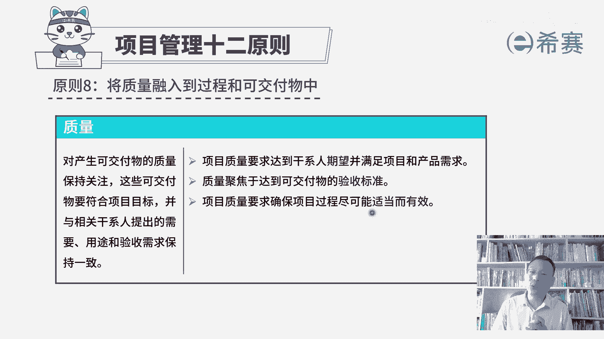
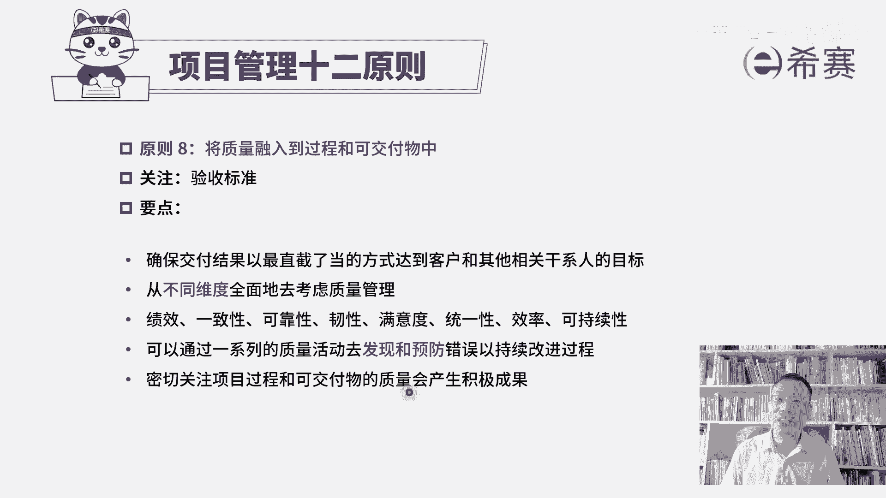

# （附2024年）PMP项目管理《PMBOK指南》第七版精讲视频课程（零基础通关PMP）！ - P119：PMP第七版项目管理原则之08质量 - 希赛项目管理 - BV1i64y1a74v

接下来我们一起看到的是项目管理师啊原则的第八条叫把质量融入到过程和可交付成果中。啊，我们在前面的预测型项目管理中呢，专门有讲到质量，其实质量我们既要去再开始制定一个质量测量指标，制定一个质量管理计划。

在整个做项目的工程作中呢，我们需要去管理好质量，要实施质量保证。并且呢我们对做出成果需要去控制质量来去确保这些东西的质量没问题，然后才去走确认范围来进行验收，走最后的结束项目或阶段来进行项目大的验收。

所以你会发现项目验收它的一个前提条件。就是这些东西的质量没毛病。等到后面我们再去学敏捷的时候，你也会发现敏捷中它会特别强调的是什么呢？我们要去交付一个可工作的软件。可用的软件。那这个可工作可用。

它的前提是质量没毛病，如果质量都不能达标，那边是没有办法用的。所以质量在整个项目的过程中其实是非常重要的一个内容。那我们一起来看一下项目管理原则第八条中的质量这个板块。对产生可交付物的质量保持关注。

这些可交付物，他需要符合项目的目标，并与相关干系人提出的需要用途和验收需求保持一致。也就是说，对方他对这个项目希望做成什么样子，希望包含什么功能。那这样一些测量指标，我们都要去满足。

他能够达到他的一个验收的标准啊，所以展开来看的上项目质量要求达到干系人期望，并且呢能够满足项目和产品的需求。也就是说客户或者是相关方干系人，他们对这个项目有什么样一些期待和要求。

我们是能够去做到他的这个基本程度，质量是聚焦于达到可交付成果的验收标准。这个点很重要，就是我们的东西是不是做的越好，才是一个好事情呢？我们前面学过项目质量管理。

其实你大概知道如果你希望那个东西的质量达到一个极其好的一个状态。你需要付出代价是很昂贵的。而我们每一个项目呢，他都有一定的资金。对应的它就会有一个质量的一个标准。理论上来讲是刚好够用。

刚好达标是最为合适的一个状态。并不是越高越好。因为每一份质量提高都是带着金钱的味道。好，在第三句，项目质量要求确保项目过程尽可能适当而有效。所谓的这个适当而有效。他讲的是什么呢？

就是为我们后面的敏捷项目管理来做一个铺垫。就并不是说每一个项目它都是向我们在预测型项目管理中，一开始就完全定好这些指标啊，然后就去去落实去执行，然后去检查质量。在敏捷中可能某一些需求，他提出来。

直到我们在某一轮迭代开发的时候才会定好它的一个DOD叫验收的标准或者完成定义。所以它是在持续的过程中会逐步去定义清楚，并且逐步去落实。您只要知道他会用一种迭代的方式，用一种敏捷的方式来去完成，就没毛病。

那我们来一起看一下。

关于这条原则，将质量融入到过程和可交付成果中。它关注焦点其实是质量。关于这个项目它的这个验收标准或者说是具体的可交付成果，它的验收标准。那这笔要点有这样几个。第一个要确保交付结果。

以最直截了当的方式来达到客户或其他相关方面的这个目标，就是满足客户的要求，包括质量的要求，以及它的这个验收的要求。好，第二句，从不同维度来全面的去考虑项目的质量哪些维度呀。关于绩效。

关于一致性、关于可靠性、韧性、满意度、统一性、效率、可持续性。那这些词里面可能有一个词叫任性，你不是很好去理解。我们前面稍微讲过一个词，说一个东西弹下去，然后又弹上来，它重新回到原有的这个状态。

这是所谓的韧性，也就是说它面对挫折和困难，能够恢复到原来状态，这个能力，这叫韧性。我们做某一些产品的时候，它需要考虑到这样一种韧性，你可能从一些枪弹片里面看到类似这样的一个桥段，一把枪扔过来。

结果没接住，然后掉到地上，它都已经是摔开了，但是你把它重新组装以后依然可以瞄准哎，这也是它的一种韧性，就是它能够去对抗这种环境的破坏，依然可以回复到原有的状态。但这只是任性的一个小小的维度解释啊。

你要知道一下，我们在做项目质量时候呢，要把这些因素都考虑进来。那还有一个关于可持续性，嗯，你可以把它叫做循环的概念，就是去生产这个原材料，去组装这个产品，去卖给客户去使用。客户用完以后啊，把它丢掉。

那丢掉丢弃的东西，他又可以去回收利用，可以去回收其中的一些些的原部件。哎，这都是一种所谓的可持续。好再下来看到下一句，说可以通过一系列质量活动去发现和预防错误，以持续改进。

所以这里面会讲到那个质量的持续改进。我们有一个叫PDCA循环。那通过这个PDCA循环，不断去优化改进，优化改进。并且前面在讲质量的这一些个呃原理的时候有讲过说预防胜于检查。

因为检查你只能去把那些已经产生的错误给挑出来。呃，预防是尽量让它少产生错误，甚至是不产生错误。所以这都是跟我们项目质量管那一段是完全相关的一致的，密切关注项目过程和可交付成果的质量会产生积极的成果。

什么积极的成果能够更好的去通过验收啊，对不对？所以这是关于项目管理12条言中的第八条，将质量融入到过程和可交付成果中，关注质量关注验收的标准。

