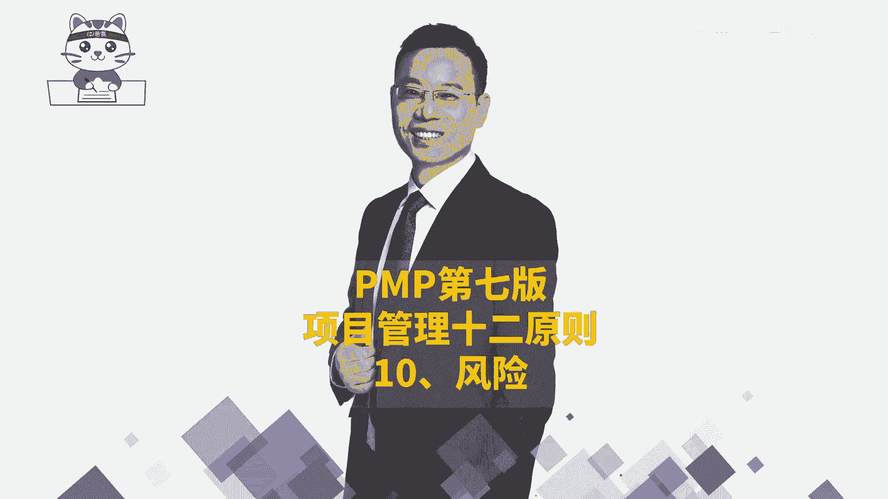
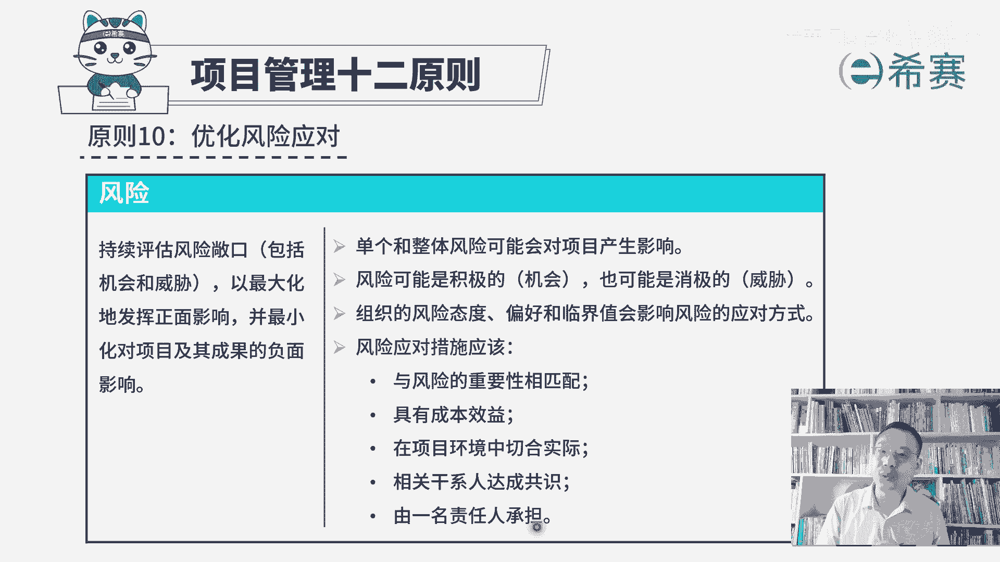

# （附2024年）PMP项目管理《PMBOK指南》第七版精讲视频课程（零基础通关PMP）！ - P121：PMP第七版项目管理原则之10风险 - 希赛项目管理 - BV1i64y1a74v

项目管理十二原则的第十条叫优化风险应对。它的焦点是关于风险。风险管理。我们在前面已经是学习过。所以呢你再来看这一段会非常好理解。他说我们要需要去持续评估风险的敞口，包括机会的敞口和威胁场口。

所谓风险的敞口是指说没有被管控起来的风险。我们需要去持续评估。因为有一些曾经觉得不重要的东西或者不那么重要的东西，可能突然又变得重要了呢？所以才要持续评估，而目的是什么？以最大化的去发挥正面的影响。

也就是让机会让这个正面的影响越大越好，并且呢是最小化的对项目及其成果的负面影响，就是让负面影响越低越好。所以整个项目中说单个项目的风险和整体项目的风险，它是可能会对项目造成影响的。

所以我们得要了解一下什么叫风险。风险它是一个不确定的事件或条件。它一旦发生，会对项目造成影响，包括积极的影响，我们也叫机会以及消极的影响也叫威胁。当然在生活中其实呃威胁更多机会呢？相对少一点。

但是它有多大的影响呢？我跟你讲一个简单例子啊，就是在2023年夏天的时候，宝马车展上出现一个冰激凌事件，就是因为这个冰激凌的一个小小的事件，导致宝马公司它的这个市值蒸发了180亿美元。哦。

这是一个很大的一个影响，好吗？所以你个他没想到说一个小小的冰激凌会对自己导致一个这么样的一个恶劣，这是对他来讲是一个很大的一个威胁。那同时呢这个事件发生以后，对于别的汽车公司，它却是一个很好的机会。

马上就有公司推出来。我们这里有免费的冰淇淋，是免费敞开吃的这种冰激淋OK这叫啪啪的去打了一个宝马的脸，就是这样一个情况，对吧？所以你会发现，其实项目中风险真的是无处不在。这个不确定性。

所以我们才说要去敬畏客户，敬畏规则，敬畏社会。好，这里还有一条组织的风险态度、偏好和临界值，它也会影响风险的应对方式。就是我们需要去应对风险的时候，采取措施的时候，跟很多因素有关系。那比方说风险的偏好。

你是追逐高风险高收益的。那么遇到一些风险的时候，我们就会说风浪越大越贵。但是也有一些人他可能是那种风险厌恶型的，他觉得保住本金才是最核心最关键最重要的对吧？还有就是这个风险临界值的大小。

如果说你把这个临界值设的特别特别大，你这个容许偏差特别大。那有可能一不小心步止卖的太大，容易扯得淡，这就是一个很麻烦的事情，所以他需要根据公司自身的能力呀，然后处理事情的这种应对的水平呢。

方方面面来去考量我们如何去界定这样一些风险临界值，我们去如何去应对这样一些风险。而在风险应对的时候呢，有这些点需要去考虑。首先第一个，他说与风险的重要性相匹配。也就是如果说这个风险它本身不那么重要的话。

理论上来讲，你就不应该把它放到一个重要的位置。一般只有那些发生概率相对比较大，并且呢影响也比较大的风险。我们会放到前面。某一些风险，它的影响虽然极其的恶劣，但是它的概率是0。

0000000000001的话，那其实它也不会放到一个重要的位置。所以它的这个重要性是跟概率和影响两个维度来综合考量。第二个呢，我们的这样一个风险应对措施应该是具有成本效益的这样一个考虑。什么意思呢？

您去处理这个风险。如果说你所花费的代价有这么多，但是处理完风险，它所导致的这个损失的减少只有这么多，那你其实就是得不偿失。所以我们要去有这一个投入产出比，要综合考虑成本和效益。啊，第三条说。

风险应对措施应该是在项目环境中切合实际，那肯定是什么我们应因该因时制宜，因地制宜嘛。并且呢他要与相关方来达成共识。我们这种处理方式应该是大家都认可和一致的。最后一条有一名责任人承担。

其实我们在前面讲风险管理上呢没有特别去专门讲。但是在风险中，我们如果识别到大量风险以后呀，在整个风险登记层里面其实有一栏叫风险责任人。也是关于这一条风险该谁来去负责盯着他。

因为风险是一个不确定事件或条件，它未来可能发生，它也可能不发生。那总得要有人去盯着，并且如果它发生了以后，要有人去有效的应对和管理，所以需要有一名责任人来去承担这样一个风险来去盯着。

那整个关于优化风险应对呢，它其实讲的是面对风险，我们要去找到相对应的应对措施。整个风险管理的目标就是让积极的风险或者叫机会越大越好。让消极的风险或者。

越小越好。那我们再去应对风险的时候呢，很多因素都有关系，包括说成本效益呀，包括说适当性啊、重要性啊、及时性等等，这东西都是需要去考虑的。并且是在当下的环境中来切合实际的去做风险应对。应对方式。

应该是跟大家达成某种共识，有专门的一个风险责任人。这是关于项管理原则的第十条叫优化风险应对。

