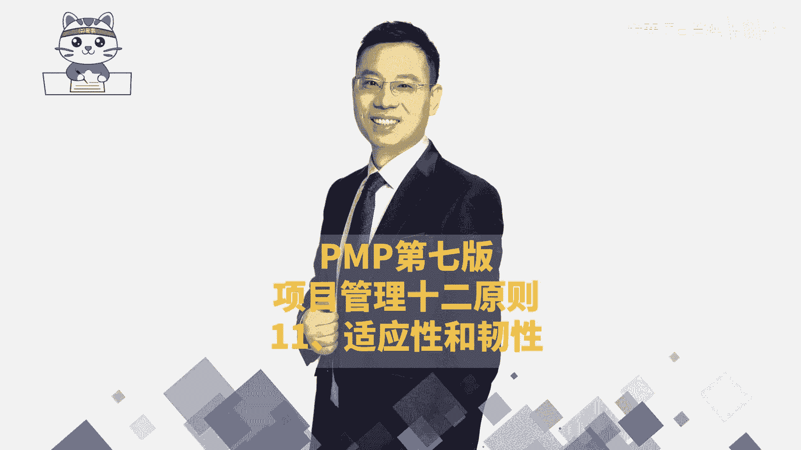
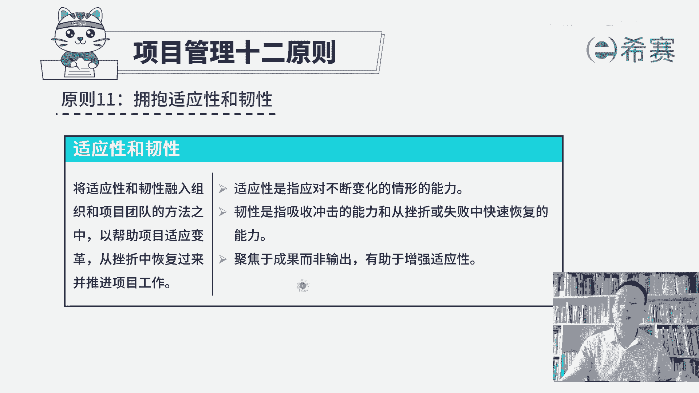
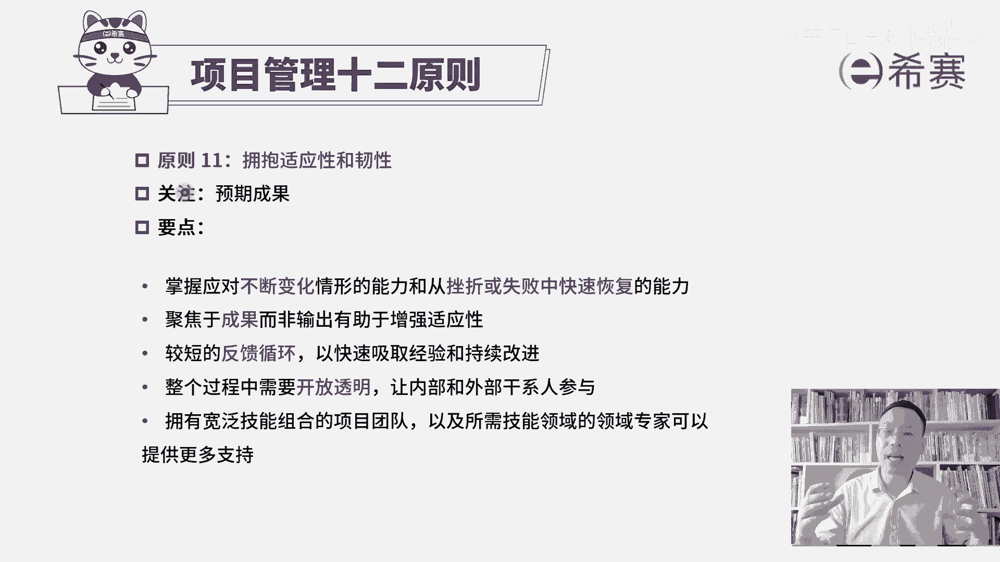

# （附2024年）PMP项目管理《PMBOK指南》第七版精讲视频课程（零基础通关PMP）！ - P122：PMP第七版项目管理原则之11适应性和韧性 - 希赛项目管理 - BV1i64y1a74v

我们继续来分享的是项目管理十二原则中的第11条叫拥抱适应性和韧性。那关于拥抱适应性和韧性，首先我们得要知道什么是适应性，什么是韧性。关于适应性官方的解释是这样的，说是指应对不断变化的情形的能力。

你就去想，我们在生活中经常会讲啊，那个谁谁，他的适应能力很强，把它扔到沙漠里面，他都能够活下来。这就是面对这种外界有不确定的，可能会有不断变化的这种情形的时候，他依然可以有效的把事情往前去推进。

或者依然能够去灵活应对各种情形。这就是说适应力很强。好，第二个词叫任性。什么叫任性呢？官方的解释是这样说的，说它是指吸收冲击的能力和从挫折或失败中快速恢复的能力。呃，给你简单举一个例子啊。

比方说如果你手上有一个玻璃球，你手一松啪掉下去。会怎么样碎了，对不对？但如果说你手上有一个钢球，你手一松啪掉下去，怎么样？钢球不会碎。同时这个地板有可能会被它砸一动。

第三个关键点就是如果你手上拿的是一个乒乓球，你手一松，它掉下去啪，然后又会弹起来，就是他面对这种冲击力面对这种挫折能力，他能够去快速恢复到原有的状态。这是韧性。

那项目管理的第11条原则叫拥抱适应性和韧性。也就是我们在做项目的时候，我们需要能够拥有这样一种适应性，能够去应对不断变化的这样一个情形和能力，也就是在敏捷中。

你会不断的去学习到的这种迭代的方式来去做一些调整，去拥抱变化。还有呢我们需要有这种韧性。因为在做项目的时候呀，挫折是在所难免的。但是有一句话叫什么叫杀不死我的，必使我强大，就是这个意思，对不对？

那你要有这样一个韧性。因为在项目中挫折是在所难免的好，所以你看他说将适应性和任。性能够融入组织和项目团队的方法之中，能够去帮助项目来适应变革，从挫折中恢复过来并推进项目工作。

所以这就及其已经是比较好理解了，对不对？那他这里还有一句叫聚焦于成果，而非输出，有助于增强适应性，这个怎么理解呢？就是你想如果说你的目的地是为了达到某一个地方，那么你中间即便是走了一些弯路。

也不是那么的要紧。你只要目的地没有发生改变，你永远的是往那个方向去走，你即便中到一些调整，也在往那个方向去走。假如说你跟谁谁，你们决定说在哪个地方去会师，那本来约定是到那个地方去会师。

但是他因为临时接到一个电话，他要需要去到另外一个地方来去干一件什么什么事情，然后再赶过来，然后你又想要更快的去跟他会师的情况下，有可能你会调整你的这些路径和方向。你最后的结果是为了能够跟他成功会师。

而不是说。到达最开始所约定的那个地点。所以当我们可以去聚焦于成果的时候，而不只是说最开始所约定的这样一个输出out的时候，那我们的这个适应性会更强。我们会不断去调整自身，调整自己。这是关于聚焦于成果。

而非输出，有助于增强适应性。那我们一起来看一下关于拥抱适应性和韧性。如果是重复的呢，就不再去解读新的呢，我们再多说一下，它的关注焦点其实是适应性和韧性。同时呢它会关注这个预期的成果。为了达到成果。

我们可以不断去调整调整自身的这个状态，以及能够去从挫折中恢复过来。所以是要掌握应对这种不断变化的情形的能力，以及从挫折或者失败中去恢复的这种能力。好，还有第二个就是聚焦于成果，而非是输出。

有助于增强适应性。接下来我们再来看另外几条是我们开始没要讲的一条是说较短的反馈循环。以快速吸取经验和持续改进。也就是我们。

在后面会学敏捷项目管理。在敏捷项目管理中，我们会拥抱变化的同时呢，每一个周期都会去获取别人的反馈。而他们的反馈其实是给我们去指路指路指路，让我们去到他想要的地方，做他想要的结果。

那么这种方式其实是有助于我们去改进。所以快速去反馈去循环去迭代，我们就能够获取更多的这样些有效的信息，吸取更多的经验和教训，从而能够去持续调整我们的路径，改进我们自身可以更好的做。好。

下一句呢整个过程中需要开放透明，让内部和外部人员都参与进来。其实你就这样去想，如果说我们不开放透明，会变得更加有适应性吗？但不开放透明的时候，外部发生某一个变化的时候，别人都不知道他怎么样去响应。

所以如果越是开放透明的话呢，信息越是同步的话，对于外部各种不断变化的情形和环境。大家能够更快的去同步信息，能够更快的去掌握，就能够。更有效的去应对这样一种变化的情形。也就是适应力会更强。好。

还有最后一条拥有宽泛技能组合的这样一个项目团队，以及所需技能领域的领域专家可以提供更多的支持。这就是在给我们的韧性来增加筹码。当我们荡到谷底的时候，依然有这些可以依赖的这样一些专家和工作人员。

能够去让我们重新谈回来，能够恢复到原有的这个战斗力。那整个项目管理的第11条原则，拥抱适应性和韧性，我们来简单总结一下。首先第一个呢就是我们需要有这样一种适应性，能够应对不断变化的情形。

同时呢需要有这样一个韧性，能够从挫折中快速恢复，能够从失败中能够回到原有的状态。第二个呢是我们聚焦于成果本身，而不是只是一个简单输出。这样的话呢，那个成果可能会不断调整的时候。

我们也会更有这样一个不断变化这种能力，能够有更好的这个适应性。并且呢我们在做项目的时候啊，可能会依赖更多的专家和人员。他们能够让我们更有。底气能够更好的去恢复到原有这个状态。

