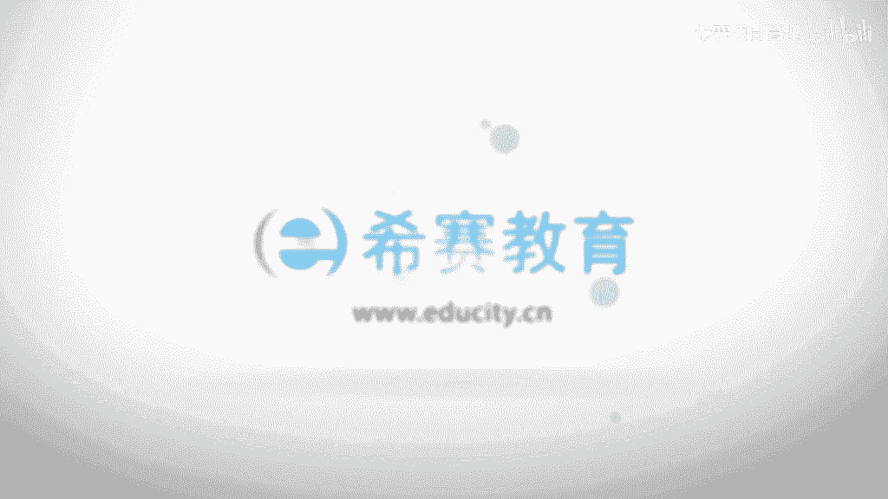

# （附2024年）PMP项目管理《PMBOK指南》第七版精讲视频课程（零基础通关PMP）！ - P23：0407管理项目知识 - 希赛项目管理 - BV1i64y1a74v

大家好，接下来我们一起看到的是呃，项目整合管理这一个章节的第四个过程叫管理项目知识，那管理项目知识呢，它是在整个屏幕指南第六版中所新增加进来的一个过程，以前没有过，以前我们会有关于说在项目结束的时候呢。

要去更新组织过程资产库，但是真实情况是我们在做项目的过程中，是持续会有一些啊那个组织会想的更新，就是我们持续的会有一些得到一些经验和教训，通常你得到经验和教训最嗯快或最多的方式是什么，就是我们去做。

对不对，我们去做事情，然后结果可能会吃一些亏，哎就吃一堑长一智，这是一种教训对吧，也可能是做一个事情做的很成功，那么这就是你的一些经验，那整个管理知识呢说的是这样一个内容。

他说在项目执行过程中使用现有的知识，并生成新的知识诶，这就叫管理项目知识，也就是两个事情，一个是使用当下的这样一些知识，第二个是可能会产生一些新的知识，这都是他要去做的，通过这种方式。

通过去运用知识以及产生新的知识，能够去促进项目目标的达成，能够去帮助这样一个组织会不断的去学习，会有提升，我们简单看一下它的那个输入工具和技术以及输出，首先它的输入中有一个叫项目模拟计划，是不是很眼熟。

制定项目管理计划的输出，对不对，第二个是项目文件界面包含了一些什么经验教训登记册，事实上呢整个在项目管理过程中，把它明确作为一个重点输入呃，作为一个重点输出的，就是在这样一个知识领域。

就是呃在管理项目知识这样一个领域中，会有一个叫经验教训登记册，而事实上呢他不是在这个时候才创造的，在项目一开始的时候，就会默认的会先创造一个经典教程的预测，等会儿我们会一起看的啊。

还有一个说是包括一些什么团队的派工单，就是有人员对不对，资源分解结构以及公关选择的一些标准，这样一些内容都是可能会在这一过程中，可能会导致产生一些新的一些知识的，还有包括说相关办登记测。

通常是跟人有关的一些东西呀，以及跟人和事很紧密相关的东西啊，都会产生很多新的知识可交付成果，我们做一个事情，产生一些新的可教不成果，那么这些东西的话有可能会对未来做一些重要的参考，对不对。

作为一个重要重要的组织工资上，所以它也是一个重要的输入，除此以外呢还有事业环境因素和组织管资产，具体的呢大家可以去翻一下拼搏指南这本书，书上具体内容，它的工具和技术哎又一次看到了专家判断。

所以它已经是你的老朋友了啊，第二个呢叫知识管理，知识管理到底是什么呢，我们等会儿会去看，还有一个叫信息的管理，以及呃人际关系和团队技能，又看到人际关系和团队技能，这个持续的会出现很多次。

包括说积极的倾听啊，引导啊，领导力啊，人际交往啊，还有政治的意识呃，它的输出中一个是经验教训登记册，另外一个是项目管理计划的更新，可能会帮很多各个维度的这些更新，以及组织过程资产的更新。

事实上呢书上并没有完整去讲清楚，说组织过程机场和这样一个经验教训能预测，把没有把它去完整的去明确区分开来，但是从某种形式来讲的话，它应该是隶属于它的一部分，就是这样一个经验教训登记册。

它应该是属于组织过程资产中的一个部分，应该是一个包含的关系，其实还是比较正确的一个理解啊，我们来看一下整个管理知识，管理项目支持这样一个过程呢，他说是啊利用现有的这样一个知识来去创造和改进它的成果。

以及呢创造一些新的知识来用于去支持项目或支持运营，知识包含两个维度，一个叫显性知识，一个叫隐性知识，那么什么叫显性知识呢，就是指那些啊比较容易去传递呀，比较容易去识别呀和学习的这一些内容。

包括说经常我们所使用到的这些文字，图片，数字这样一些内容都叫显性的知识，也就是你很容易看到的这样一部分知识，学到了这样一部分知识，都叫显性的知识，而隐性的知识呢他说是个体知识以及难以表达的这样一些知识。

包括信念，洞察力，经验诀窍呃，这些东西都是很不容易去直接是去观察和学习到的，你要去洗的话，你可能需要耗费大量的这些代价啊，那么隐性知识我们可以看一下，首先呢嗯。

显性知识通常可以通过编撰来得到这样一个分享，而隐性知识呢通常是经由人际交流融合互动来得到分享，也就是说我们跟对方去做一些互动和交流，从他那边去感受到他的这样一些信念呢，他做出了一些处理的方式啊。

态度啊之类的，这样的话可能会对我们有帮助，有一种传承的味道在里面，知识管理它指的是要去管理显性的知识，以及一个管理这样一个隐性的知识，这样的话呢他说重复使用现有的知识来产生新的知识。

然后这样的话有助于去帮助我们啊，不管说是从哪个维度来去更好的去使用这些知识啊，分享知识啊，去做知识的集成，集成的概念，大家知道就是说把很多东西堆在一起来，对不对，他说不同领域的知识呀，一些情境的知识。

一些项目管理的一些知识，都可以把它集成过来，从组织的角度来看，知识管理，它指的是说确保项目团队和其他的相关方的一些技能经验和专业知识，在项目开始之前，在项目的开始期间，以及在项目结束之后能够得以运用。

据说能够让大家的这样一些技能经验和专业知识能够得到应用，这是我们管理知识的一个目的，所以重点是能够把现有的知识给运用起来，去用到项目中，能够产生价值，另外一个呢是产生新的知识。

这是整个关于管理项目知识的一个简单介绍，那么它的工具和技术中，我们看到有一个叫知识管理，那知识管理怎么说呢，他说知识管理呢是说啊能够将员工联系起来，让员工们能够合作来产生新的知识。

通过合作来产生新的知识，以及可以去分享一些隐性的知识，我们经常可以去开会来去分享一些内容对吧，我记得在啊，我在上一次去厦门出差的时候，遇见了我一个发小，然后他就跟我讲，他说啊，你知道吗。

你就是啊以前那时候他说他自己读书的时候其实有点自卑，我当时是没有没有觉察这一块啊，他说那时候就天天跟着你们混，然后当时你在念高中的时候，你搞那个什么早上读报的这样一个活动，我后面是想回想一下。

真的是有这样一回事，他说你搞了个毒霸的活动，然后啊当时呃搞到后面就可能没有太多人响应，然后我就要支持你们呢，就去野区上去读报呀，但后来他去那些公司里面去做一些事情，然后就会嗯习惯性的如果有什么事情。

他就会能够去冲上去，去跟别人去分享，他本来其实自己内心紧张的要死，害怕的要死，然后也呃会有一些内向啊，有些自卑，但是因为这样一些隐性的知识在这过程中去传递，然后去磨练。

然后会发现自己就其实会有比较多的提升，所以有的有的时候我觉得呃可能会跟不同人在一起待在一起的话，那种产生不一样的这样一些内容和信息啊，很有意思对吧，然后他说以及集成不同团队所拥有的这样一些知识呃。

这是整个知识管理中要关注的，所以有的时候我们不只是跟自己团队内部的人员去学习，包括说你可能会呃从你的客户中学到很多内容对吧，跟你的那个领导也学到了很多内容，事实上在我自己回想的话。

我曾经有一个时间段里面工作呃，非常的痛苦，就是呃我当时我的那个客户对我对我们团队要求特别的苛刻，那时候真的是很痛苦，但事后我回想在那个时间段里面，我们我们是成长的最快的一个时间段。

真的是成长最快的就被骂得最惨，但是成长最快，做事情不断的会有一个突破提高啊啊所以积累知识，包括说积累自己的知识，积累别人的知识，运用项目工具来去，这个的话是取决于很多方方面面，他说这个包含哪些方面呢。

一个是人际交往实践，然后什么开会工作跟随，还有跟随指导什么论坛讨论知识分享的活动中，知识分享的话就比较容易去传递这样一些隐性的知识，对不对，还有研讨会讲故事，讲故事也是一个很重要的创造力哈。

呃创造力和创意的管理技术，然后知识展会，茶座交流培训，这些都是有利于知识的这样一个传播，事实上我为什么要去选择这样一个培训的行业呃，是因为我之前在工作过程中，我参加了很多培训啊，就是接受了很多培训。

然后我觉得培训证是能够让一个人比较快速的去获取一些新的知，识和技能的这样一个事情，就能够去帮助帮助人能够快速的去成长，那所以后来我就换了这样一个行业，也是有这样一个因素在里面。

我觉得这样的话能够去帮助更多人快速的去得到一些东西，能够去洗的一些东西，我觉得这是一个很很好的一个东西啊，很好的一个事情，然后在呃管理知识这样一个过程中，还有一个工具叫信息管理信息系统。

那么信息系统他说的是这样一个情形，他说通过这样一些信息系统呢，能够去帮助我们更快的去编撰这些显性的知识呃，经验教训啊之类的东西，然后包括一些什么信息收集啊，图书馆的服务啊。

呃还有一些包括什么信息管理系统，这样一些东西，都能够更好的去更好去促进简单明明确的这些显性知识的分享，所以使用这些工具的话，能够促进我们快速的去做一些事情啊，这边还有一个工具叫做人际关系与团队技能。

那么人际关系和团队技能，关于知识管理这一块，我们可以看一下，一个叫积极的倾听，我们说沟通沟通他是为了能够去传递信息，然后去达成共识，对不对，那么这样一个达成共识，一方面是有人去把一个信息发出去。

另外还有一个人要去接收到，而其中有一个很重要的技能就是倾听，当我们能够去积极的去倾听别人的信息，然后去减少这些误会的时候，诶这个是很有帮助的，能对我们这种隐性知识的积累和习得是有帮助的啊。

第二个是引导他说引导有助于指导团队去成功地表达一些决定，解决方案或者是结论，就当我们开会的时候，如果说有一个人去做一个引导的事情的话，大家就不容易跑题，就集中在这一个维度，并且当你表达不清楚的时候。

他会给你一个参考性的一个表达，这也是有帮助的对吧，呃，领导力，领导力在我们第三章项目的项目经理的角色里面有重点去讲，他有领导力可以帮助人们去呃沟通愿景，并且去鼓舞团队来去关注这些适合的知识。

事实上也就是说如果你不重视，大家都不重视，你作为领导，你很重视，大家有可能会重视，但如果说你很有领导力，很有那个范儿，能够让大家被你带动起来，那么大家就一定会跟着一起来重视啊，还有一个是人际交往的能力。

这个的话其实妙不可言对吧，而人际交往呢他说能够去使得相关方之间，也就是说不同的团队啊，人员啊，他们之间建立一种非正式的联系和关系，事实上只要说关系越加的越是亲密一些的话。

那么这样一种隐性知识的传递会更好，嗯，大家可以看到在之前有那个美国的总统啊，特朗普他那个去他最后是成功竞选成为总统，对不对，当时他的女儿伊万卡的这样一个演讲，其实也是风靡了全球。

而事实上像伊万卡这样一些孩子，他都是从小在父亲的身边啊，有有去参与到一些工作和事项，那么这个的话就是在他身边的话，能够去习得一部分很重要的内容，这就是一种隐性知识的传递。

所以有的时候我们说榜样的力量也是很强大的啊，还有一个是政治意识，他说政治意识有助于项目经理，根据项目的环境和组织的这样一些政治环境来规划沟通，就是呃具体的情形下沟通的方式可能会不一样。

那么政治意识的话能够让你去规避掉一些不必要的方式，然后选取一些比较合适的方式来做事情，诶这是呃管理知识的这样一些工具和技术，那么最后呢它有一个输出叫做经验教训登记册啊，经验教训登记册。

我们说某某某测其实说的是一个文本，对不对，经验的教学登记册呢，就是说这样一个文本下面登记了很多的经验以及很多的教训，我们一起来看一下啊，经验教训登记介绍就包含情况的类别和描述。

经验教训登记册还可以是包含情况有关的这样一些影响，建议和行动方案，它可以是记录遇到的挑战问题，意识到了这样一些风险机会，还有一些其他的情形，也就是说你所有看到的东西，想要的东西。

见到的东西都可以把它写在这样一个经验教训登记册中，经验调性能测，他应该是在早期就去创建，早早的就创建出来，然后呢，作为这样一个管理知识的这样一个过程的输出，在整个项目期间，它会成为很多个其他过程的输入。

也就是说我们在做整个项目管理的时候，有很多个过程都需要有这样一些经验教训的登记册来做一个支撑，同时呢它也是作为一个输出不断的更新，这说明什么，说明是持续的有更新，对不对，持续的这样一些经验教训。

这样一些知识内容的一个更新，参与工作的团队和个人也会参与到记录经验教训，可以通过视频啊，图片啊，音频啊一些其他的方式来去记录这样一些知识，确保有效的去吸收经验和教训，也就是说方法是不拘泥于某一种形式。

可以是任何一种形式都ok，对不对，而在项目的结束阶段的时候呢，会把这样一些相关的信息去纳入到经验教训的知识库里面，作为组织和机场的一部分，看到没有。

也就是说他们呃也就是说这个东西会那这里面呢它又是它的一部分，所以它是属于组织过程资产的一个部分啊，而主动问智能更新，他说是所有的项目都会生成新的知识，然后有些知识他可以被编撰，然后并且去啊要被存留下来。

哎这一部分呢就是咱们的这个呃要去保存下来的内容，就是关于经验教训登记册呃，事实上你记得一个规则，就是随时随地一直持续的有在做这样一个知识的管理。

