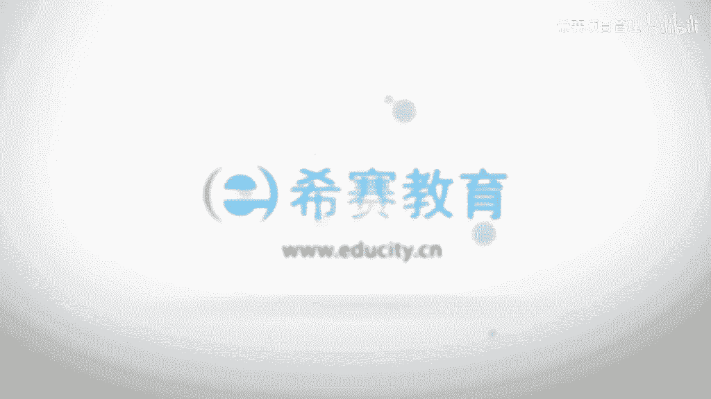

# （附2024年）PMP项目管理《PMBOK指南》第七版精讲视频课程（零基础通关PMP）！ - P84：0901项目资源管理核心概念 - 希赛项目管理 - BV1i64y1a74v

大家好，欢迎大家来到西山教育，我是罗福兴，接下来我们一起分享到的是拼搏和指南，第六版的第九章叫项目的资源管理，那么在资源管理这一章呢，他重点讲到的就是说关于项目要完成的话，可能会需要到哪些资源。

然后我们怎么样去规划这些资源，怎么样去获取这样一些资源，以及如何去管理这样一些资源管理，这样一些团队如何利用好这样一个资源，去让项目更好的去进行，我们一起来看一下关于这一个章节它的一些呃核心概念。

首先呢项目的资源管理，它会包含一个是实物资源的管理，一个呢是团队资源的管理啊，其实这个章节呢是咱们拼搏和指南，第六版和相对第五版来讲变化最大的一个章节之一啊，以前呢这个章节它就叫人力资源管理。

而现在呢是把人类给拿掉，直接叫资源管理，所以他的那个范围就是向外延展了很多，不只是包括人，还包括一些材料设备生产线，然后一些耗材等等，我们看一下实物的资源管理，他说是会着眼于有效和高效的形式来分配使用。

完成项目所需要的各种实物的资源，包括设备，材料设施，还有服务，那么为了能够去管理好这样一个实物资源呢，组织应该要拥有这样一些数据，就是包括当前的以及未来所需要的这样一些资源的需求，以及满足这些需求的话。

我们需要的这些资源的配置以及我们的资源的供给的情况啊，这是关于那个实物资源的管理这一块，然后另外一个呢是团队资源管理，那么团队呢他重点就是人力资源管理，所以我们也会重点去讲人力资源管理这样一个内容啊。

他会着力于关于咱们要去实施好这样一个项目的话，我们需要一个什么样的团队，那么我们怎么样去建设这样一个团队，怎么样去打造团队，以及如何去管理这样一个团队呃。

项目经理应该要在获取管理激励和增强项目的团队方面，要投入适当的努力，事实上啊这也是非常麻烦的一件事情，就是我们可能平常做项目管理的话，很多时候我们的团队都是默认就已经给到的。

就说是组织已经提前给你准备好这样一个团队了，或者说是你不需要额外去花心思，但是有的时候也许你在做项目的时候，并没有这样一个团队，你需要去从外面去招募呀，或者说你需要去从一些啊组建一些专家，专家。

不在本地的话，你需要去组建的一些虚拟团队呀，那个的过程中那种沟通协调面试，然后去啊，包括给新的团队成员去培训，都是一个很大的工作量啊，那么我们他说是需要去投入适当的努力，这个就根据情况来。

根据你实际的情形来，通常来讲呢项目经理他既是项目团队的一个领导者，同时呢又是管理者，还记得吗，我们之前有说过项目经理的两个角色，一个是管理者，一个是领导者，那么管理和领导他们会是不一样的，这个信息啊。

很虽然很多时候我们可能会把管理和领导混在一起来去使用，但事实上管理呢它更着重在管理这些事情，以及完成这样一些事情，而领导呢更多是引领带领大家去进行一些实行，这个是有本质的区别的啊。

啊那么除了项目管理活动以外呢，包括启动规划，执行监控和收尾，当然这个设置关闭及时说收尾啊的各个阶段，项目经理还要负责去建设一个高效的团队，ok可以说要打造团队，今天是团队，如果你觉得比较费劲的话。

你就直接理解为打造团队就好了啊，就是精彩，你会对啊，我们要打造一个嗷嗷叫的团队啊，就是这个东西作为领导者，项目经理还要去负责积极的培养团队的技能和能力，ok这其实也是打造团队中的一部分啊。

我们要如何去建设好这样一个团队，一方面是让他的技能有所提高对吧，就是让他的技能和能力有所提高，另外一方面呢是同时还要提高并且去保持团队的满意度和积极性，ok就是说他们的这一个呃信心，信念，士气。

团队协作这样一些维度的，我们也是需要去努力的，所以有的时候你说啊老板好像也不就是或者这样一个项目经理，好像也没干什么事啊，天就是带着大家一起去吃吃饭呢，啊干嘛呢，事实上这也是团建的一部分啊。

就是能够有助于关系的融洽，能够让大家保持一个更好的一个事情去做一些事情，呃，项目经理还应该要去留意并且去支持职业与道德行为，确保所有的团队成员都能够去遵守这样一些行为。

ok这个的话就是关于职业与道的行为，这一部分呢啊咱们是没有专门去讲它，但是事实上对于p n p来讲，或者说对于p p考试来讲的话，送给大家两个字，你就不会错啊，好，把人往圣人的建议维度去靠。

基本上就能够选对所有跟他相关的题目，但它事实上考的也不多，考的很少，大家异变性高的项目，得益于最大限度的去集中和协调团队的结构，比如说拥有通常的自组织的团队，也就是说他可能会有很多的事情需要你去做。

那么如果这样一个团队人这也会累，也会，那么这个事情就比较容易一般一点，而项目资源管理它的一个发展趋势和新兴实践，我们来看一下啊，首先在以及以往的那个项目管理的过程中，可能更多的是这种工厂式的管理。

更多的是对于员工有很多的要求，所以呢很多是这种命令型和控制型给这种管理的方式，那么随着时间往后推进，越来越多的白领甚至是精灵对吧，那么这样一些人群的话呢，你再用这种控制型。

再用这种命令形式往往是行不通的，大家可能就火箭速度的拍屁股走人了，所以你们换了一种形式，就是会用一种协作和知识的这种方式来去管理它，就你很少会说呃。

一种很像管理的一个包身工一样的方式去管理这样一个白领对吧，呃并且呢会将决策权分配给一些个团队成员来去提高团队的能力，我们之前有讲过，人是要追求归属感和价值感的。

那么我们怎么样让这样一些团队成员拥有这样一些归属感，就是当你给到他更多的权利，让他去参与做更多的事情的时候，他会比较拥有这样一个归属感，而同时当他做的事情越多，那么他的价值感会越足。

建议因为这样一个价值感，这样一个东西是没有办法给的，只能是通过他自己去践行实践来得到啊，此外呢现在项目管理的那个方式，会寻求一种资源优化使用的这种方式啊，事实上有的时候你会发现呃。

也许你甚至都不需要去真正去组建这么一个团队，你可能是用了一小部分人，加上一些虚拟团队，也能够把一些事情做好，做得好像还比想象的要好很多之类的啊，都是有可能，那我们可以看一下关于资源管理，它的间歇呃。

趋势和新兴之间，首先一个呢是资源管理方法，他说受限于这样一个关键资源稀缺稀缺呢，然后在某些行业中就涌现出来一些，比如说什么精益管理呀，准时制啊，或者及时治安，然后说持续改善呢。

然后是全员生产维护啊啊什么约束理论，是不是感觉有几个已经见过，在质量管理中是不是有见过他，也就是说我们是呃来多少东西，然后我们就赶紧去生产多少东西对吧，然后持续改善，持续改进是不是也有见过对吧。

全员生产维护，我们前面有看过那个全员质量管理也有很类似的这样一个情形对吧好，然后这边还有一个新兴实践，这边说关于情商，项目经理应该要提升内在的和外在的能力，这个内在能力说是自我管理和自我意识的能力。

外的能力说是比如说是关系的能力，从而去提高个人的情商啊，事实上我一直是有跟我的学员来去讲这样一个事情，我就觉得那个人力资源管理这一块，或者说资源管理这一块的话，很多信息是呃不是说一时半会就能学得来的。

因为我们的很多习惯呢，我们的行为处事的方式啊，都是我们啊二三十年慢慢累积形成的这样一些东西，所以不是说片刻之间就可以扭转，但是你要相信，首先第一个当你懂得越多的时候，你越有机会去换。

另外一种方式来去行为处事，另外一个呢一念之转，但你有一天突然想清楚一件事情的视频，发现哦，原来我可能换一种方式去做也是可以的，那么你还是有机会可以去提高你的这样一部分的能力，就自我管理和自我意识。

自我意识有的事也叫觉察，对不对，我们不让你去做觉察或者叫醒觉，但我们能够很快速的去醒觉，自己去觉察，自己觉得这样一个事情哦，也许我处理方式是不ok，我要换一种方式嗯，达里当答案最简单的名称啊。

很多时候如果说是团队之间有同有同事有争吵的时候，很多时候大家会着急着想要去解决这个问题，而着急解决问题呢，就是会习惯性的去压制的方式，就是用强迫的方式去解决掉，但是事实上发现这个东西会反弹。

甚至时候可能会带来更多坏的影响，但如果说你能够有一天去在又要去，别人又有争吵，然后又有冲突，然后你又开始去压制的时候，你能够意识到这种方式好像没有什么效果，马上去觉察到这一点的时候，去换一种方式来进行。

这个时候就体现出你的所谓的高情商，我们说啊那我们来求同存存意啊，我们说看我们大家有什么共同的那个目标啊，或者说期望啊之类的啊，啊这当然这也是我们在这一章里面要去讲的一个内容，后面会讲。

当然事实上呢这个东西真的不是说一时半会儿能够提高的，但是呢你了解的越多，你越有机会去换一条新的路，就说我们多学一些东西，多知道一些东西的话，是多给自己一种选择的可能性啊，第三个是自组织团队。

这个的话其实我们在说敏捷的时候就说了这样一个事情对吧，呃拥有一个自组织的团队的项目的项目经理，他通常呃更多的是说去营造这样一个氛围，给大家提供这样一些环境来做一些事情，就说这样一个团队呀，自己就是剧。

有点像那种什么无政府的这种组织，然后自己就可以去嗯管理好自己，自我管理好，然后自我去不断的去了解一些新的需求啊，然后做一些调整啊，然后去执行啊，然后又去看对比一下有什么样的不ok的地方，然后再做调整诶。

一一直自我去运转下去啊，而项目经理呢你就能够去保障这样一种环境能够持续的去运转，当然你不是说完全就诶那我就不管他了，不是这个意思啊，你还是需要去关注他的，然后还有一个呢是虚拟团队分布式的团队。

这个呢也是在现在这个潮流趋势，就是说啊很多成员他们分布在不同的城市，他们甚至说是语言都不相通，呃但是呢他们为同一个事情去做一些一些一些一些努力，k这种情形是越来越多，对吧啊。

尤其是像比如说在软件开发的这样一个行业里面的话，呃有一些那种什么嗯那种开发库的更新，真的就是全球的一些同行都在做同样的一件事情好，然后呢我们再来看到的是裁剪的时候所需要考虑的因素。

首先啊裁剪一个要考虑的是多元化，因为你的团队有可能他有一些多元化的背景信息，那么你踩踩点的时候需要去了解这样一部分呃，不能够去忽视它啊，以及是物理位置，团队成员他的一个物理位置是什么样的一个情形。

这个手柄就是我们说虚拟团队对不对，虚拟团队很重要，我们只要去关注虚拟团队这样一个事情啊，因为呃人不在一起的时候，往往是更容易产生矛盾，距离不距离当然也能产生美，但是太远了。

距离往往产生更多的猜忌和不信任啊，所以在虚拟团队在这个位置的这样一个事情上的话，我们需要去关注考虑关于沟通的这样一个事情，这也是我们在下一章沟通管理中会重点去讲的呃，特行业特定的一些资源。

那么可能需要去了解一下行业中是否有这样一些特定的资源，因为我们整个资源管理会关注到有获取资源这样一个部分的维度，然后以及去建设团队啊，去动用这些资源对吧，团队成员的获得，那这其实也跟资源还是有关系。

就是你怎么样去获得这样一些团队成员，团队团队成员是资源中的之一啊，资源就前面已经说过，还包括了这些设备啊，设施啊，材料啊这样一些内容啊，那么成员是资源中的一部分，那我们怎么样去获得这样一个团队。

这也是我们需要去关注的呃，包括说团队是全职还是兼职，那么管理方式也是不一样对吧，而全职的人员的话，相对来讲其实是更好管理，而兼职的人员的话呢，管理起来是会麻烦很多呃，但是它有它的好处。

就是你不用付那么多薪水，你交付一小部分的薪水，他可以把他的一些额外的这样一个时间来贡献到你这个项目上来对吧，同时事实上当然也不是说兼职的就做的就不好啊，很多时候兼职的才是一些可能是在某一个行业。

因为他本身就很牛，让他顺带着来去做一些事情，也有这种情况，这个是完全看运气，如何去管理好团队建设，以及我们使用到哪些工具和技术来去做团队建设，呃，是否在建一个团队中有一些特殊需要去照顾的群体。

然后我们是怎么样去响应他们的需求的，以及呃一些什么多元化的培训，这些内容呢也是我们需要去关注的，另外一个是生命周期呃，不管说是用这种瀑布型也好呀，或者说是用用这种啊敏捷型也好呀，你也要去了解。

那么这样的话这些成员因为我们知道项目其实做完以后呢，它是会解散团队的，那么不同的这种生命周期的处理方式，那我们对于团队成员一直持续的来凝聚在这样一个团队里面的话，他也是有不同的处理方式。

这是我们裁剪需要去看到或是了解到的一部分啊，最后一块一个板块呢是说在敏捷或者适应性的环境中需要考虑的因素，一个是异变性的环境，得益于最大限度的去集中和协作的团队结构，比如说拥有通常的这些自组织团队。

就是当你用的是一个小团队小步快跑的时候，如果说这样一个团队中有一些人他什么都会一点的话，那么这个事情做起来其实要简单很多哈，然后协助呢他就是只在提高生产率以及呃促进创新的问题的解决方式，这样一个事情呃。

协作团队他可以去促进不同的工作的这个加速的整合，然后改善沟通，增加知识的分享，以及去啊提供工作分配的一个灵活性啊，这个怎么说呢，就说我们在这种敏捷型的这种小环境里面的话。

事实上是很多东西都是会更加灵活一些啊，啊这是关于资源管理这样一个战略，前面的四个小小的板块，那么接下来我们一起看到的呢，就是我们那个资源管理，它的一些基本概念和他的那个六个过程的简要的一个概述。

那么整个项目的资源管理呢，它会包括要去识别识别我们完成这样一个项目的各个过程，所需要用到的资源，然后去获取获取这样一些资源，以及我们要去管理好所需要的这样一些资源，也就是说我们要完成这个项目的话。

我们最后是需要哪些资源来去完成它，我们现在要去知道有需要哪些资源，然后呢我们去获取它，然后获取到的这样一些资源，有可能获取到资源，他也许还不够，我们去使用怎么办呢，我们可能需要去打造它。

我们需要去培训他，然后去管理他，因为在这样一个过程中，它可能会产生很多的问题，那么这些过程有助于确保项目经理和团队擦拭，在正确的时间和地点使用正确的资源，这个很重要，因为我们做事情的话。

其实一方面是要正确的去做事情，这个很重要对吧，还有一个很重要的应该是做正确的事情，ok就说你在身边的当下，你做你所做的事情是正确的事情吗，是你该做的事情吗，然后再来看你是否在正确的做这样的事情啊。

啊各个项目资源管理过程，它的界限虽然说是划分的很明显，这句话呢事实上是在每一个知识领域中都出现了啊，我在第四战中，第五章中应该都有，刚才讲过，就是虽然说他们的划分是界限很分明。

但是在实践中他们会以这个只能说无法详述的方式，有相互交叠和相互作用，ok事实上他们之间本身就是交错在一起啊，因为我们本身管理这个东西，它是一个系统的东西，他没有办法那样子来去切分手啊，这是一个南瓜。

这是一个西红柿，这是一个香蕉，团队资源管理相对于实务资源管理，对项目经理提出了不同的技能和要求，这句话其实从何而来呢，它其实在之前的版本中，他只关注人力资源管理，那么人力资源管理处理方式是有一套体系。

那么对于这样一些实物资源管理呢，它应该是有另外一套方式对吧，比如说像一些单位的话，这样一些关于实物资源管理这一块，专门是有一些行政的人员去做这样一些事情，而现在呢是说项目经理你也要去关心这样一些内容啊。

试卷师傅资源管理签名其实已经说过，包括设备，材料设施，还有一些基础设施，而团队资源呢它是指的是人力资源呃，这个已经看过对吧，项目团队成员可能会具备不同的技能，可能是全职或者是兼职，可能是谁的。

项目的进展有增加有减少，这个怎么说呢，如果我们还记得那个前面说过，看那个项目的生命周期，启动规划，执行监控和收尾，我们大概也能够去知道项目它在不同的时间段里面呢，它所参与到的人数是不一样的。

往往在前期的时候呢，人参与的相对小一些，然后到后面直到中间执行的时候，人是最多的对吧，执行监控的时候人是最多的，然后到最后的那个收尾的阶段呢，人又变得比较少，所以呢中间人是有多有少，他是有进有出的啊。

所以这一部分是有说关于成员的这样一个增加和减少，项目资源管理与项目的相关方管理之间有一些重叠的部分，项目相关方管理还记得相关方吗，我们在第三章中其实就已经有说过关于相关方的这样一个事，情。

有说过去识别相关方，相关方是指所有会影响这个项目的人或者是团队或组织，以及会被这个项目所影响的人或团队或组织，那么它和资源管理有什么样的不一样呢，就是相关方呢它的这个位置更广泛更宽泛，知道吗。

所有跟这个项目有关的人，全部都包含在里面，而咱们这样一个项目资源管理呢，他所关注的这样一些人力资源呢，他只关注的是咱们的团队，也就是说是咱们要去完成这个项目的话，我们有一个小一个小小的团队。

咱们的兄弟们哎，这就是我们的这样一个资源管理中的，首要关注的这样一个人力资源的部分，而这个相关方呢是在除了咱们自己的兄弟们以外，包括我们的boss，包括我们的这样一些客户。

包括那些什么那些最后一个这种用户，然后包括客户的一些什么老板，我们的除了boss外，就各个层级的一些人员，包括说什么会计啊，法务，然后实时采购完那些不同岗位的人员都会跟他有关联关系啊，这是相关方。

所以他们是会有不相同的呃，项目资源管理，它重点是关注的是项目组成员。