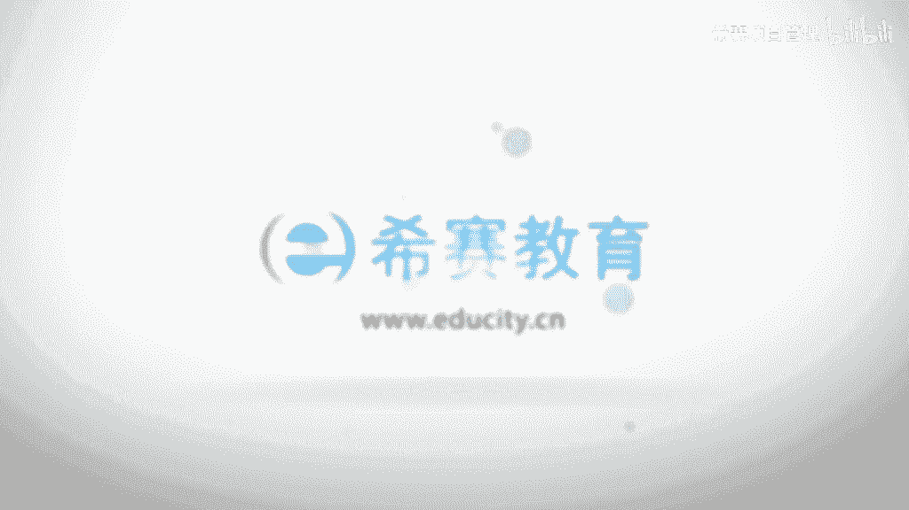

# （附2024年）PMP项目管理《PMBOK指南》第七版精讲视频课程（零基础通关PMP）！ - P90：0907建设团队 - 希赛项目管理 - BV1i64y1a74v

接下来我们一起看到的是项目资源管理这样一个章节的，下一个过程叫建设团队，那么建设团队呢他重点关注的其实是跟人相关的这样一个部分呃，建设团队他的目的在哪里呢，我们可以看一下，他说要去提高工作能力。

要促进团队成员有互动，然后要改善团队的整体氛围，来达到一个什么样的目的，达到提高团队绩效的这样一个目的，o所以他有两件重要的事情要做一件重要的事情呢是提高工作能力，也就是说工作技能和水平这一部分的。

第二呢是他们团队相互之间的这人和人之间的一种互动，一种整体的工作氛围，我们来看一下它的输入工具和技术和输出啊，这里面呢工具和技术是它的重点，首先它的输入中有一个叫资源管理计划。

会告诉我们怎么样去做这样一个建设团队的事情，然后呢是一些过往的一些经验教训，当然是对我们的经验团队有帮助对吧，然后整个项目的一些进度计划，然后是关于团队成员的这样一些信息，是项目团队的这样一个派工单。

是团队成员的信息以及资源日历，这也是团队成员的清晰对吧，还有一个呢是团队章程，团队章程我们前面有讲过，是这个团队他们之间相互一起来讨论，得到这样一个规则，然后时代都要去遵循的这样一些规则啊。

然后是事业环境因素和组织关系上，他们两个持续的在很多个过程中都有作为一个输入对吧，然后工具和技术呢我们一会儿会展开来看啊，一个一个展开来看，简单看一下，首先一个是集中办公。

当然简单来讲无非就是把大家放到一起来办公对吧，因为人分散在别的地方的话，我们前面看过一个叫虚拟团队，那么虚拟团队他最大的问题就是沟通，就是人不在一起的时候，沟通是有很多麻烦。

那么如果大家能够在一起来集中办公的话呢，这样一个麻烦就会大大的降低啊，啊第二个呢是虚拟团队，那么虚拟团队就说他能够解决掉的是人没有办法在一起的情形，就是当你一些专家在国外。

或者说一些专家在一些其他的大城市，然后你当前在一个小城市或类似各种原因，导致人没有办法在一起的时候，我们可以组建一个虚拟团队的方式来去来去达成，然后第三个呢是沟通技术。

就是我们能够使用更好的一个沟通和协调的能力，来去让这样一个团队更好的有互助，有协作，然后第四个呢是人际关系与团队技能，这边有说到关于冲突的管理影响力，激励谈判和团队建设，一会儿我们会一个一个的去看它啊。

那么还有任何奖励培训以及个人和团队的评估，总之呢我们通过这一系列的工具和技术以后呢，我们是会希望他一方面是工作能力有提高，第二方面呢是人和人之间能够更好地去互动，能够去改善团队的氛围。

从而能够提高整个团队的这样一个项目绩效啊，那么他最后的输出呢，一个是团队计较的一个评价，也说是关注整个这样一个团队，他的这样一个表现的情形对吧，然后呢会产生一些变更请求，以及是关于资源管理计划的更新。

因为资源管理计划中会涉及到关于团队这一部分的内容，另外呢是经验教训，能预测呀进度啊，还有关于资源相关的这样一部分人都会有更新啊，然后再一次出现的是事业环境因素的更新，还是跟前面说的同样的道理。

就是跟上一个过程就是跟人相关的这样一部分做了调整以后呢，它都是会算到这样一个事业环境因素里面来啊，然后是组织过程资产是我们关于建设团队又得到了很多新的体会对吧，那么我们来一起看一下它的一些基本概念。

首先呢它的主要作用是改进团队的协作，增强人际关系的技能，激励员工减少摩擦，有没有看到整个以上这几条，其实都是为了能够去提升团队的这样一个项目绩效，ok所以也就是说通过做这样一些事情。

其实都是能够让团队变得更加的牛掰，因为人和人之间这样一种冲撞的力量，这样一种相互内斗的力量减少了以后，你会发现合力就会变得增强，对不对，其实很多时候有些单位它为什么生产力那么弱，并不是因为这些人比较笨。

而是相反可能人都很聪明，但是他使得利没有往一个方向去，使他彼此用在内耗上面，所以我有时候觉得真的是，如果一个团队能够把这样一个内耗的部分给干掉的话，真的是战斗力会标标的往上涨很多啊。

项目经理应该能够去定义团队，建立团队，能够去维护团队，能够去激励团队，领导和鼓舞团队，然后使得团队能够去高效的去运行并实现项目的目标，所以你看到没有，项目经理的这样一个要求。

是不是比比以往的要往上涨一些，以往是会说嗯，你你要去动用这些资源去管理好项目，然后能够去推进项目，去达成目标，而这边包括什么激励领导，鼓舞团队都给加进来了，而事实上这个有一点就是说。

整个团队都归你来负责的这样一个概念在里面啊，团队协作呢是项目成功的一个关键因素，而建设一个高效的团队是项目经理的主要责任，那怎么样的团队才算是高效团队呢。

哎这个的话其实每个人的心里面可能都会有一些不同的指标对吧，你到底什么样算是高效的团队，有人会觉得说大家都很牛掰的团队，是很高效的团队，然后说大家都是能够很团结的团队，是很高效的团队，类似这样的。

那么这边呢给大家整理了一下，就说如果通过以下的行为，通常是可以实现这些高效运用技能团队，一个是呢开放和有效的沟通，大家有什么东西想要去表达，想要去互动，是有渠道有沟通的渠道的啊，第二个呢是创建团啊。

创造团队建设的机遇，事实上这句话说的翻译呢我觉得有点怪啊，他说的就是我们需要有一些机会来去做团队建设的活动，做一些团队建设相关的这样一些事宜对吧，那么通过这样一个团队建设。

能够让彼此之间有更好的一个认识，然后能够更好的去配合，有更好的有默契对吧，建立团队成员他们之间的这样一个信任，而事实上有时候一些那种拓展训练，那在某一些时间段里面。

是能够去让大家彼此之间快速达到一些信任关系的，以建设性的方式来管理冲突，因为本身项目在项目执行过程中的冲突是在所难免的，那么用这种一个比较好的方式来管理冲突的话。

有可能会能够让冲突反而变成一种另一种创造力，一种生产力，鼓励合作型的这样一个问题解决方式，就是我们冲突的处理方式有很多种啊，其中一种呢是面对面去交流讨论，去合作解决问题。

那如果说大家能够去来合作解决问题的话，哎这不是能够让这个事情一个坏事情变成一个更好的事情了吗，鼓励合作型的这样一个解决方案，ok好，这是建设团队的一些基本概念，然后我们一起来看到团队建设的一个目标。

也就是说我们是会希望一个很牛逼的团队，那么到底是什么样是一个很牛逼的团队呢，首先第一个他说建设团队就是要提高团队成员的一个知识和技能，o也说是第一部分让能力有所提高，对不对。

通过这样一个知识和技能的提高的话，能够让他们怎么样诶完成这个项目，可交付成果的能力有所提升，能够去降低成本，缩短工期以及提高质量，所以这个的话就说是画在前期的这个努力是值得的。

就画在人的这样一个努力是值得的啊，包括咱们中国其实有一句古话叫什么，磨刀不误砍柴工，对不对，那么磨刀不误砍柴工，它其实是什么，把这样一个工具的话，能够让它变得更牛掰是吧，第二个呢是提高团队成员。

他们之间的一个信任和认同感，哎这样的话就是能够去提高日期，减少冲突以及增进合作，第三个是创建富有生气的凝聚力和协作性的这样一个团队文化，这个其实是比较难的，对不对。

这个的话可能会对我们的这样一些hr的小姐姐们要求是比较高呃，通过建立这样一个富有生气的凝聚力和协作性的这样一个团队文化，以后呢，能够提高人和团队生产力呃，能够振奋团队精神，能够促进团队的合作。

以及促进团队成员他们之间的这些交叉培训和辅导啊，分享知识呃，事实上你如果在一些大城市里面工作啊，不说你如果在一些大的企业里面工作，你会发现有的时候很多培训。

他并不是说要从外面去请一个什么样的牛掰的老师来培训，而是可能就是不同的团队，他们之间抽一些人过来给别人来做培训，就是这种交叉培训是有的啊，那个导师说有点大，就是那个嗯就是分享嘉宾来给大家做一些分享。

就是因为每一个人所从事的事情呃都可能会不一样，那么有一些东西它可能会在不同的工作岗位上都能够用得着，那这样的话呢，诶所以我们如果说彼此之间整个这个团队是比较有生气的。

整个这个团队他们之间是能够比较协作的话，这种情形是完全可以达成的啊，第四个呢是提高团队参与决策的能力，哈哈啊，其实我们之前有说过，能够让团队成员参与进来，去做一些团建的活动啊，做一些这种规划性的活动呀。

呃其实是整个对团队是有帮助对吧，那现在说对于一些决策性的事情，也让他们参与进来，使他们能够去承担对解决方案的这样一个责任，从而能够提高团队的生产效率，获得更有高效和那个有效的这样一些成果吧。

事实上以前的学员中好多人说上完这一章以后，感觉我上了个假班，然后去了一个假公司，其实并不是这样啊，据说事在人为，你也可以去影响别人，就说人和人之间的这样一个关系呢，是一个事业环境因素。

的确不是一个小小的项目经理，可以去做一个翻天覆地的改变，但是你可以去影响一部分，至少你可以在团队中去影响一部分，你想要一个什么样的团队，你尽量去创造一个这样的氛围。

