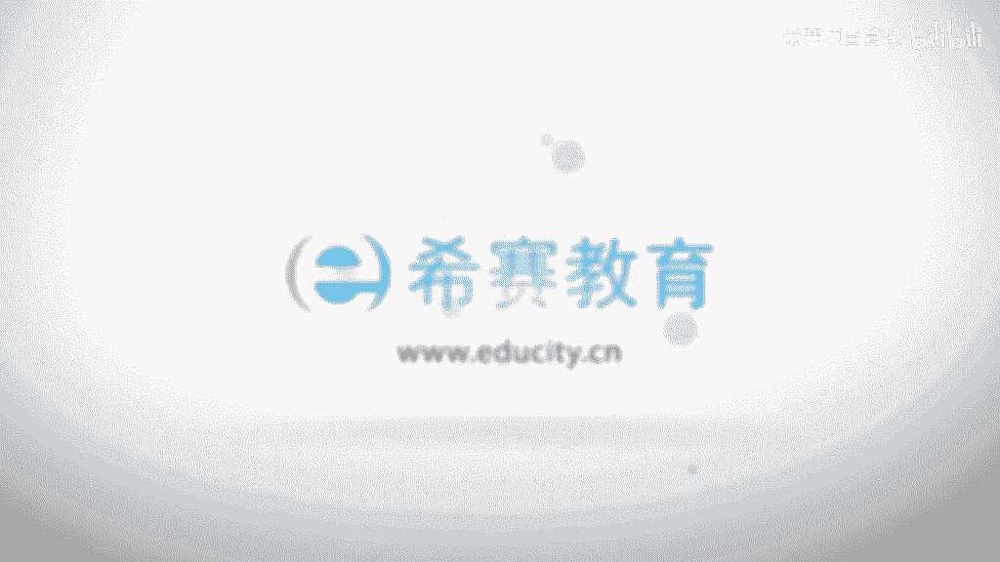

# （附2024年）PMP项目管理《PMBOK指南》第七版精讲视频课程（零基础通关PMP）！ - P98：1001项目沟通管理核心概念 - 希赛项目管理 - BV1i64y1a74v

大家好，欢迎大家来到西塞教育，我是罗福兴，接下来我们一起分享到的是项目管理知识体系指南，就拼某个指南，这本书第六版的第九章叫项目的沟通管理，那一般情况下我们说到沟通，其实大家都心里面会有一个概念对吧。

有些人可能会觉得沟通就是说话，那有些人可能会对他有更深入的认识，我觉得我们可能既要去表达出去，同时呢也要去把信息给收集进来，而事实上沟通他有他的一些基本的信息，我们来看一下关于沟通这样一个概念。

它的核心的一些概念啊啊首先关于沟通，他是指有意或者无意的一个信息的交换，ok有信息交换在里面，也就是说通过信息交换能够达成一个共识，诶，这是他的一个沟通目的，交换可以是一些想法，只是或是一些情绪。

那么希望通过这样一种信息的交换呢，达成一个共识，这是沟通的目的，所以有的时候我们为什么会说啊，跟一些人沟通起来很费劲，或者说我们做事情就是勾了没通，那么就是因为没有达成这样一个共识对吧。

那我们一起来看一下关于在项目沟通管理中的这样一些基本概念啊，他说沟通的形式会分到很多种类别，就是根据不同的情形来划分，一个呢是书面的沟通，一个是口头的沟通，嗯书面沟通大家都比较清楚啊。

哈就是用文字的形式来去做一个表达，而口头的沟通呢可能就是更多的是用语言呢字体动作呀，这种形式来去做一个表达啊，然后呢可能会分到正式的沟通和非正式的沟通，那么正式的沟通可能说是一些报告呀。

一些report呀这种类型的东西，而非正式沟通呢，包括电子邮件也好呀，即兴讨论也好呀，呃其实包括我们在前面有说的那个项目资源管理中，我们说会说啊这种团队建设活动能够有助于这样一个关系融洽对吧。

那么这样一些团队建设的活动，实际上就是呃一些非正式沟通的方式，比如说包括吃吃饭呐，然后喝喝茶呀，这些都算是非真实沟通的方式啊，然后呢那个口头形式在这边还详细讲到一个叫口头语言，一个叫手势动作，嗯。

事实上呢官是语言这一部分所传递的信息啊，有一些专家们研究调查说是只占到了40%多，那么绝大部分也说是超过一半以上的是通过这种肢体动作呀，声音呢语调啊这样一些方式来去做一个信息的传递和传达。

还有呢是官方沟通和非官方沟通，经常很多人会说啊，我告诉你个小道消息对吧，那么这个小道消息可能就是一种非官方沟通，而事实上官方发的信息，它可能是一种比较严肃的，比较严谨一些的讯息，嗯。

还有呢沟通会分到内部沟通和外部沟通，这个内部呢它指的是项目类和项目以外，项目类可能更多的指的是咱们项目团队成员，就是咱们在项目资源管理中，我们会有一个团队的管理，对不对，就是关于团队的建设呀。

呃团队那个建设这样一个团队呀，打造这样一个团队呀，管理团队啊，那么这个内部指的是项目的团队内部，然后除此以外的外部呢，就是说除了团队内部以外，其他的人也都囊括进来，包括说间歇客户。

一些其他的一些项目媒体公众，当然还包括boss对吧，然后呢沟通还会有一种分级的方式，叫垂直沟通和水平沟通，那垂直指的是上下级之间，那么这种沟通方式呢，它的沟通传播的速度非常的快，并且呢非常的准确。

但它通常可能传播得不会那么冷管，然后水平沟通的就是同级之间，那么同级之间沟通很多时候就是有那种很八卦的信息在那里传递对吧，所以是有有人有一句话叫做三人成虎，这个信息传递来传递去就可能会变得一样。

所以水平沟通他会很快，并且是范围会波及的很大，但是呢它中间可能会传递很多不准确的消息，然后关于沟通的话，我们可以看一下重点需要去关注的几个信息，一个是关于沟通目的要明确，也就是说你这一次到底是要干什么。

是要传递什么，或者说是要去传播什么或想要去获得什么样的信息，尽量去了解沟通的接收方，满足它的这个需求和偏好啊，这个满球满足需求和偏好，其实换一句话来讲，就是投其所好，对吧。

嗯就是他会有什么一些沟通的这种嗜好，你用他所能够接受的方式来去做一个表达和互动，这样的话对于你的沟通目的的达到会比较有帮助，监督并衡量沟通的效果，我们不只是说要去沟通，同时还要检查这样一个结果。

到底你做了这样一件事情有用吗，达到你的预期了吗，哎这也是我们需要去关注的，我们不能说是勾勒没通，或者不能说是对牛弹狼琴对吧，虽然也弹完琴，但是他并没有听懂，我们还是需要去了解能够是什么高山流水。

有知音啊，呃沟通可以为完成项目和项目集建立一个必要的关系，事实上我们在前面有看过一个信息，叫做呃虚拟团队，我不知道你们还有没有印象，我们说虚拟团队大家不在一起，可能会导致有很多的这种障碍对吧。

那么这个时候沟通就显得尤为重要，事实上不仅仅指虚拟团队，任何团队中沟通都非常的重要啊，讲个沟通活动和工作的多种多样，磕了是什么邮件啊，谈话呀，各种类型都可以啊，语言啊，面部表情啊，手势动作啊。

这些都可以，未来成功的管理与相关方的这样一个关系，沟通可能会包括制定这些策略和计划，来去为后续的沟通啊做一个基础对吧，也会包括说一些相关的技能来提升一些计划和记性沟通的效果，那么这种沟通的能力呢。

事实上是它相对那个人际关系处理的能力来讲的话，沟通能力差的那个培养应该说是比较快的，或者说相对比较容易一些的，就他不会像那种什么人的个性的打造啊，类动性可能需要很长时间去磨练，沟通这种东西。

包括说你不管说是什么公众演说也好呀，跟别人去聊天呢，去记录一些文件啊，这些东西它都是一种技能性的东西，它是比较可以说是相对来讲在比较短的时间内可以养成的，所以项目经理还是比较有希望哈。

然后在那个沟通管理的核心概念中呢，书上有讲到一个叫沟通的书面沟通的5c原则，那么书面沟通的5c原则说了什么呢，而事实上你想其实也可以想到肯定是五个以c开头的这些词汇啊，词语一个呢叫正确的语法和拼写。

当然我们在汉语里面不涉及到这样一个什么语法拼写，嗯，他说如果你给别人发的书面信息语语法拼写不正确的话，有可能会分散大家的注意力，甚至可能会曲解，会扭曲这样一些信息，诶，这样的话会降低这样一个可信度啊。

这是第一个，第二个呢是简洁的表述和无多余字啊，这个其实看上去很难啊，嗯比如说之前有看过别人说每天做五分钟的一个分享，嗯事实上他要做一个小时的分享是比较容易的，但是要把一个小时的内容。

而能够把它精简到五分钟，反而其实比较难，能够让这样一个表达里面没有多余的字，这是一个本身是一个比较困难的事情，但是呢能够让这样一个表达比较简洁，这个事情应该说是项目经理都要去做到的对吧。

所以是尽可能让你的表达信息是能够简洁明了啊，当然如果说能够做到说是没有浪费的词，没有多余资，那单是更好不过了，清晰的目的和表述，这个很重要，因为你要站在对方的角度，你写的这样一个东西。

你的这样一个书面的文件是要给对方看的对吧，那么你想让他看到什么东西，你就要去写什么东西，有的时候我们很多时候不管说是自己写东西也好呀，还是说东西好，都会习惯性的是站在自己的角度来说对吧。

那么事实上听的人或者是看的人，他有什么样的感受，很多时候为什么说有些人写文章很会写，他写出文章，别人就是爱看，那是因为他的心里面可能会有一个读者，他会把自己做一个分裂出来一个对象，然后直存在。

然后去审视这样一个事情的过程中，有没有能够站在他的角度来去看待，如果我们的这个表达是比较清晰的，然后我们也有一个清晰的目的，想要传递的是什么样的讯息的话，这个事情可能会不一样啊。

包括这个事情其实你换一个呃，呃比较极端的就是说面试你在面试的时候，你要去做一种口头的表达的话，你是一定要让对方能够快速的去明白你的心对吧，明明白白我的心啊，连贯的思维逻辑，他说写作的时候呢。

他说是思路要连贯，以及在整个书面文件中要呃又有开头有小结这样的一个讯息的嗯，这样的话就整体来讲就比较完整对吧，就是有开始有结尾的这样一个情形，然后并且是有这种什么遥相呼应啊，这样的感觉啊。

受控的语句和想法承接，他说可能需要使用一些图表或者说小杰来取，来控制语句和想法的这个承接的关系，就是有的东西你可能讲一个主题，然后讲下一个主题，有些承上启下呀之类的这种东西啊。

这是关于书面沟通的这个5c的原则呃，虽然说这是西方的语言，因为用英语的话可能会涉及一些语法之类的，但是它也可以在咱们的汉语世界里面是可以去参考，就是我们要表达一个信息。

首先你要你想表达的信息是不是清晰明确的，然后你是否也用了一种清晰明了的这种方式来表达，是否简洁的去表达，他是否比较能够容易快速的看懂，然后这些东西它们之间的占有逻辑关系做得怎么样。

是否有这种承上启下的这样一个过渡，以及在每一个比如说是有一些什么提纲啊，然后小结啊这样一些东西能够帮助我们去梳理一些相关的信息，能够去体验一些相关的讯息，这是关于书面表达这个内容啊。

顺便沟通5c原则需要下列这样一些沟通技巧来配合，看下一个叫积极的倾听，事实上这个倾听的能力是很其实是不容易练就的，很多时候我们会喜欢去说，但是没那么喜欢去听呃。

总觉得想要表达自己的东西嗯反正这个是一个很奇妙的事情啊，尤其是年龄越大的人越爱说很好，好像是这样的一个情形啊，他说其实我们如果能够积极的去倾听，与说话的人保持互动。

然后病人去总结对话内容来去确保有效的信息的一个交换，这是一个很重要的，就是我们能够听到对方的声音，同时适当的去给一些回应，适当的时候还会把对方的信息做一个简单的梳理以后，然后陈述出来，让他知道哦。

你听懂了这种感觉，别人说的表达他就会感觉很好，第二个是理解文化和个人的差异，那么事实上呢也有一些他就是不愿意说的，那么或者是可能有一些文化里面他就是很open，很这种外放的这种这种表达的方式。

其实你如果说是能够清晰地掌握这一部分的话，你做事情就可能没有那么难受，打比方我之前啊，我在工作的时候，曾经有一个时间段里面是呃会过一段时间就要去东北去出差一次，当时是在去东北的吉林省呃。

长春是对吉林长春，那我我当时感觉就是觉得他们非常的热情，然后非常的外放，他们的这种能够很快的跟一个人变得很熟，但当时在我来讲其实是很不自在的，就觉得诶我好像跟你没有那么熟。

没想到这样一个程度怎么就呃吃饭的时候就那么熟，很奇怪，但事实上如果说是多了解一些这样的文化差异，就可能南北方的一些文化差异也好呀，或者不同的地域的任人的文化差异哈，你会发现这个事情啊。

其实是他们就是这样的，ok或者说他们中有一部分人就是这样的，你去习惯它，可能就不会觉得心里面有那么别扭，然后会更容易去接受这样一些东西啊，有助于你的工作的进展，识别设定和管理相关方的期望。

这个永远是一个难题对吧，也就是说你要去了解他的一些意图，然后以及去满足他的一些期望，他说并且呢要去与相关方磋商，来减少它们之间的这样一些自相矛盾的期望，这个什么叫自相矛盾呢，其实这个词有点怪啊。

就说因为相关方他是所有会影响这个项目的人员，以及被项目所影响的人员组织团队，那么这些人他可能是来自于不同的团队对吧，他们之间的这样一个需求可不一定说都一致，那么在这种情况下。

我们要满足所有的期望是不太现实，我们怎么办呢，那就只能是去磋商，去协调，去沟通，能够让它尽可能地被满足到强化技能，强化所有团队成员开展说服激励指导解决冲突的这样一些技能，没有一个是容易搞定的啊。

其实都是一个需要大量的时间练习的，并且事实上呢别人不会给你太多机会去练习，所以这个的话这个事情的话，反而我更加推崇培训，就通过培训能够快速的让你提高，就是有有这种相关的培训。

会让你能够快速的得到一些提高啊，是很有意思的，好，我们再来看一下，那么沟通管理中的这样一些发展趋势和新兴实践嗯，首先一个呢是他说要将相关方纳入项目评审范围诶，呃第一个呢是关于相关方纳入评审范围。

第二个呢是让相关方来参与项目的一些会议，你有没有发现，其实呃我们呃在日常的工作中会说一句话，就是我们要去了解客户的一些需求，然后去更多的去获取客户的一些什么相关的讯息对吧，所以这里是把这一部分给弄进来。

他说呃将相关方纳入到项目评审的范围，是有效的，沟通策略，要求定期，并且是及时的去评审一些呃相关方的社区，来管理他们的一些什么态度变化，事实上我就是我们需要去更多的去了解他们一些信息和需求。

然后成了能够去让这样一个项目步骤篇啊，更好地去满足他们一些信息，另外呢是让他们更好的去参与到会议中来啊，多一些人参与的话，他他参与越多，他会对这东西越重视，同时呢每一次参与都会有一些信息的表达。

那么这样一些表达呢都会很重要，如果他前期没有表达到了，事后再去表达，就有可能会是什么变更请求，对不对，就前期的时候他如果有充分表达，相对比较充分的表达，那么很多时候你就可以把它纳入进来。

作为你的这样一个设计里面要参考的部分，但是如果前期他没有参与到后期的时候，他才开始介入进来来去表达信息的时候，那个信息如果跟你之前的东西不一致，那就是一个变更请求了啊。

第三个呢说是社交工具的使用日益的增多，就是我们可能会用很多的不同的方式来去做沟通啊，包括一些什么硬件平台呀，社交媒体服务呀，个人便携设备呀，啊这样一些的工具都会让这样一个沟通会有一些变化对吧。

包括说你现在用手机可以去做一些办公的事情，可以去联络，不只是打电话，还会回邮件呢，审批一些业务啊，呃各种事情都可以去做对吧，呃包括微信这种沟通即时聊天的工具也是非常的方便。

多面性沟通方法就是我们强调的说也是不只是使用一种方式，可以用不同的一些方法来去做这样沟通，他说可能嗯通常应该要考虑所有的可用技术，并且从中做出一些选择，比如说有些企业它会呃使用邮件就会非常的多。

他习惯性的用邮件来去互动，但有些可能会用一个什么啊，内部的一个即时聊天的工具，就是那个自己内部的，然后有些人他就直接用外部的，用什么qq之类的啊，那么就是根据你的需要来。

然后尊重自己的这样一个团队的文化裁剪的时候所需要考虑的因素，他说一个是关于相关方，因为本身沟通的话，它是有人的地方就有江湖，有人的地方就需要沟通对吧，所以就是跟这个相关方肯定是很重要的。

相关方是属于组织的内部还是外部的，或者是都有诶，这个的话你在做菜沟通的这一个维度的裁剪的时候是需要关注，另外一个呢是物理地点，因为人在一起的处理方式和人不在一起的处理方式是完全不一样的啊。

沟通技术可以有很多种不同的沟通技术，你用到哪些沟通技术，在采集的时候也需要关注他说包括创建记录，传输检索以及追踪和存储这些沟通的文件或是结果啧，语言语言是沟通中所所所要考虑的一个主要的因素。

使用一种语言的话，还是使用多种语言，这个很重要，尤其是一些跨国的一些项目，或者是嗯可能会涉及到一些不同区域的项目，有一些地方有一些什么方言之类的对吧，那么也是需要去考虑到，还有的是知识管理。

是不是有一些正式的这样一些知识管理库可以去采用的，可以去为我们的这个项目做更多的支撑的这样一些内容呃，这是关于说裁剪，关于项目的沟通管理这一个维度的时候所需要去关注的事情。

然后最后我们看一下在敏捷或者说适应性的环境中，所需要考虑的这样一些因素，首先呃敏捷，因为它是可能会是大方向一定，但是小方向不断在拥抱变化，所以他是在模糊不定的这个环境中。

需要不断的去演变和出现各种细节情况，来进行频繁的快速的这样一个沟通，因此呢应该尽量简化团队成员获取信息的这样一个通道，这个怎么说呢，就是如果说一个信息，因为它本身这样一个信息的变化是很频繁的对吧。

是有很多的很频繁很快速的这样一个沟通的需求，那如果说你这样一个信息变动的又这么频繁，然后呢传递到每一个人的时候，又经过一个漫长的一个流程，那么极有可能会耽误很多正经的事，所以呢你应该说是简化。

尽量的简单频繁进行团队检查，并且让团队成员集中办公，这也是很重要，因为这里面的话因为实在是变动太多了，然后因为有大量的这个频繁的互动，所以有的时候光是建一个qq群或者什么微信群。

或者一个内部的那个即时聊天的，建一个群还不够，很多时候真的是有些东西就是需要去当面来互动才能够说得清楚，此外为了促进与高级管理层和相关方的沟通，还需要以透明的方式来发布项目的工作。

并且去啊定期邀请相关方来评审这样一个工作啊，能够去让大家对于这样一个事情的了解比较清晰对吧，关于这个透明，而事实上我们比如说是在敏捷开发中，敏捷管理的话，他其实会关注的说，比如说战略战略会议。

就是让所有人能够去知道所有人当下的所做的工作，以及所遇到的一些挑战和困难，同时因为本身事实上呢啊这敏捷团队他都不会太大啊，他都不会太大，所以呢呃是大都一起有一种自主团队的这样一个感觉在里面。

他说能用一种比较相对来讲比较透明的方式来去跟老板去汇报，然后去评审呃，你一定要知道评审一定是被这样一个事情是有帮助的，能够把这东西给定下来，把一些比如说我们虽然说敏捷是一直在拥抱变化。

但是拥抱变化之后还是有结果，对不对，那么有一些东西已经是敲定的东西。