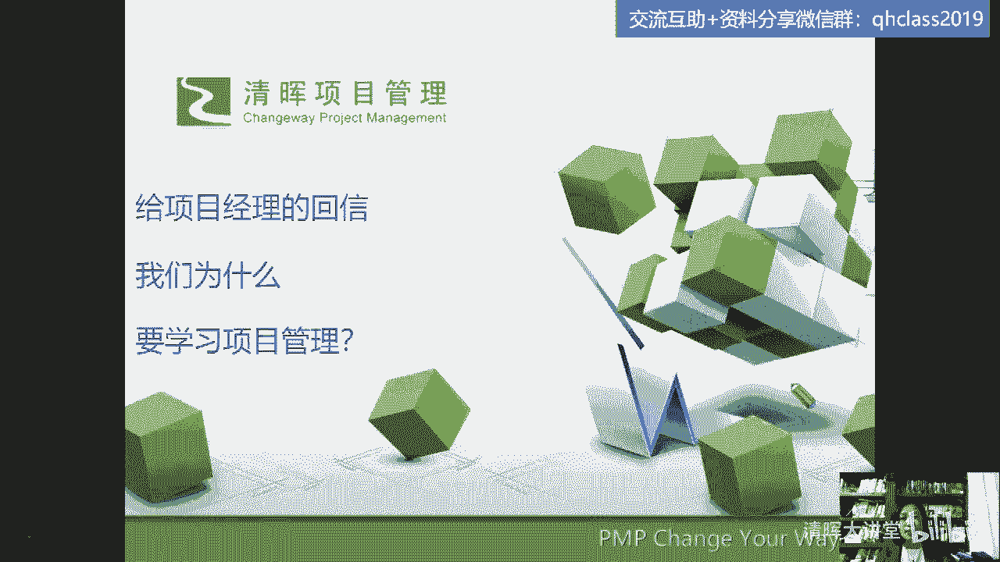
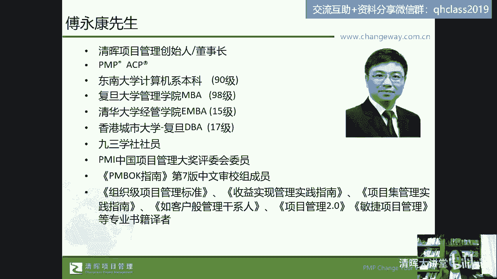
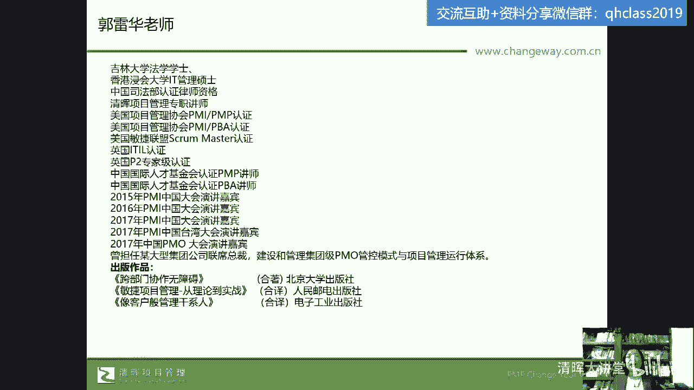
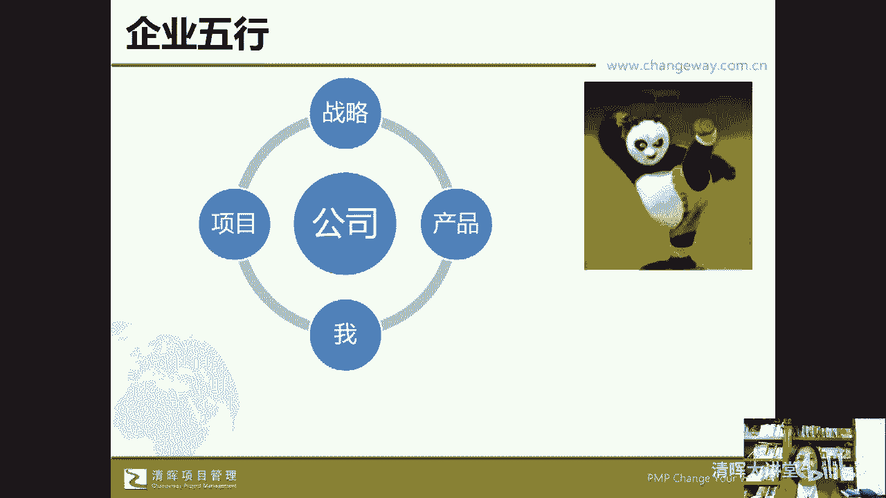

# 🔥项目经理必看！28个棘手难题一网打尽，实战解决方案助你轻松应对💼 - P1：1.课程导言 - 清晖大讲堂 - BV1fztLezEZK

那么我们今天呢交流的这个话题呢，是讲给项目经理的回信啊，啊我们为什么要学习项目管理，嗯给项目经理的这个回信呢，他其实起源于我在做的一个咨询项目中，在咨询项目大家一定想到了，大部分的咨询项目。

是以我们的这个组织驱动为主的，那什么是组织驱动啊，肯定是围绕企业层级的，它的流程标准化，哎那么这是我们提到的啊，那么这次的这个咨询呢是一家企业为谁呢，为企业的员工量身定制的。

也就是说我服务的对象是这家公司，那么这家公司的项目经理团队嗯，也就相当于我在这个团队里头可以就是修，由公司呢啊选买定了我们的服务时间，买定了我们的服务时间之后呢。

由我们1V1的来对项目经理来做个性化的支，持和辅导，所以我们把它定义为是项目经理的回信回信，那在这个过程中呢，呃我们又征得了这个客户的同意啊，在脱敏之后，也就是对我们的咨询内容进行脱敏之后。

把我们收集到的这个问题，作为我自己的这个教学成果和教研成果啊，所以呢这次我们就要给项目经理的回信，因为我之之前在一个咨询项目上嗯，一个企业为自己的项目经理团队，购买了我们的服务。

这个服务我觉得呀特别的好，因为以往呢我们做的这种咨询服务，都是大家刚才讲过是组织驱动级的，那这一次公司希望从个体驱动的角度，由我们来做coach，辅导他们的项目经理，哎，1V1的服务之后。

辅导他们的项目经理来为他们项目经理，具体在项目过程中去答疑解惑，而且我们在收集到了这么多的问题之后呢，发生了一个特别有意思的现象，就是嗯这家企业的老板很勇敢，等于说他允许项目经理提各种问题。

而这些问题呃我们在也告诉大家说，公司最后去看会去看这些问题，那其实虽然去看，也不代表说项目经理就不敢提问了，大家都知道这个现在年轻人教育职场，教育老板的事情也是常有发生的。

所以等于说嗯如果是从组织级的角度去做咨询，是自上而下的一种驱动和改进，那从项目经理的角度提出问题，然后公司和我们一起来研究这些问题，来真实的就像说嗯听到前线的炮火，这个湖南农村调查。

后来写出的这个星星之火可以燎原对吧，那实际上也是自下而上的来对进，对企业来做一个类似于用他们老板自己的话说，叫刮骨疗伤，也是打通企业的这个隔热层，因为坦率的讲，这个项目经理都是第一线的啊，都是第一线的。

那么嗯在什么呢，在这个嗯企业第一线的这个战斗呃，英雄们也怕他把他自己叫做我们的项目经理，都是我们的战斗英雄，因为要面对客户，他们公司是做乙方服务的嘛，作为我们的战斗英雄，到我们公司的整体的决策层。

管理层之间有没有打不通的地方，有没有脸难看，事难办对吧，这些问题怎么怎么处理，所以呢这是我们收到的一部分，项目经理给我们写的这个信一样，可能大家说写信回信，这件事情好像已经很遥远了吧，已经很遥远了嗯。

以前有首歌，他是木心写的一首诗，叫过去车马慢是吧，过去一把钥匙只开一把锁，那是一个慢生活的节奏，那么现在我们在碎片化的时代，唉这个信息爆炸的时代，但同时呢我们用这种方式来聊一聊，项目管理的这个事情好。

那么我们已经开始聊了。

那么也要正式的开一下头，感谢大家来到我们清辉直播间啊，在我们这样一个比较辛苦的工作之余，不知道大家是不是在路上，是不是有没有去吃饭啊，那么该吃吃该喝喝，如果有时间有精力，也可以来听。

我们今天晚上聊一聊关于项目管理的问题，呃，清辉大家长傅永康老师啊，是我们的这个大家长，大家对他呢都已经很熟悉了。

好那我呢可能有些学员也是听过我的课程，也有些了解，也有一些可能是第一次跟我见面啊，在我们的这个直播直播现场，那么我呢是我们清辉的专职老师，过去的背景我觉得并不重要，重要的是今天晚上聊的话题是不是有趣。

是不是对我们彼此都会有一些这样的一些呃，交流和碰撞的一些感觉啊，好那么嗯我们今天聊的这个话题和这个课题呢。

它的一个范围，它的一个阈值，它的范畴还是离不开我们的项目管理，离不开我们所存在的这个企业平台，所以这个模型可能如果听过我的课程的学员，几乎在我想会有的课程在第一页都是这个模型，因为我的研究课题。

我的研究对象就是这个模型，这是我自己啊设计的一个模型，它基于我们服务的平台，我们存在的这个平台就是我们的公司啊，经常大家都讲说离开了平台，我们是谁，我们可能要去想清楚对吧，那离开了平台我们该怎么办。

当我们身处这个平台的时候，我们也要想清楚我是谁，我们离开这个平台，要想清楚我是谁，那么我们身处这个平台的时候，我们也要想清楚我是谁，然后呢在这个平台里会有公司的战略，在公司这个平台上，我们会有战略。

会有产品，会有项目，还有每一个你和我啊，我们呢都在这样的一个平台中去交流，去探索，然后我们希望这个平台的五个元素，我把它叫做企业的五行金木水火土，或者说这个什么呢，唉那么不管是哪一种。

我们说我们希望这五者之间，他的关系是一个相生相融的，唉能够良性运行，但是当它不能够相生相容的时候，当它发生一些不和谐相生相克的时候，那可能我们就要去解决这些问题啊，解决这些问题。

那既然是我们给项目经理的回信，那我们就首先切入主题，来看一下我们的项目经理啊，都遇到了哪些问题。

