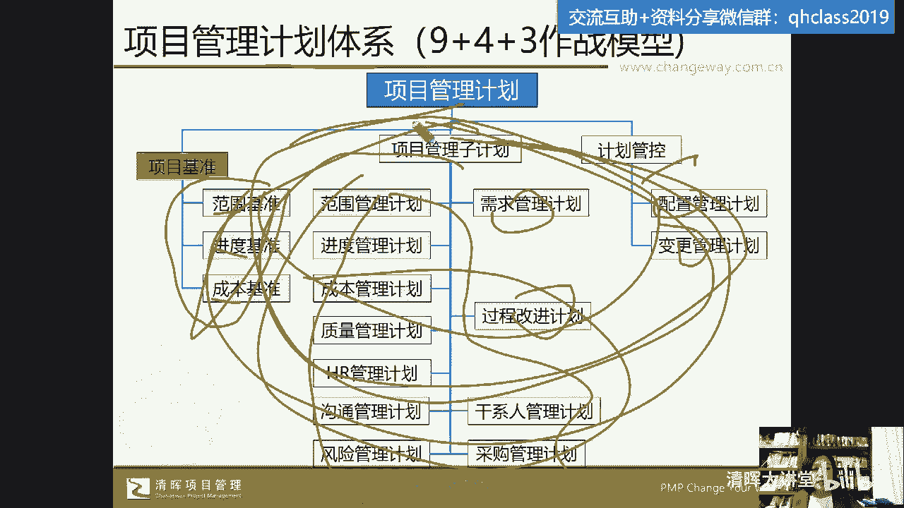
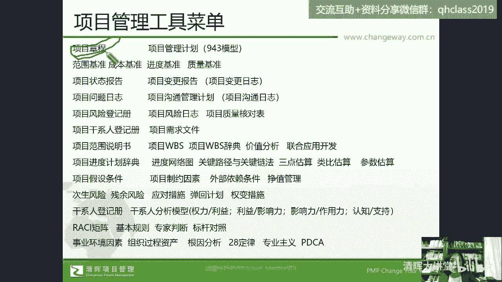
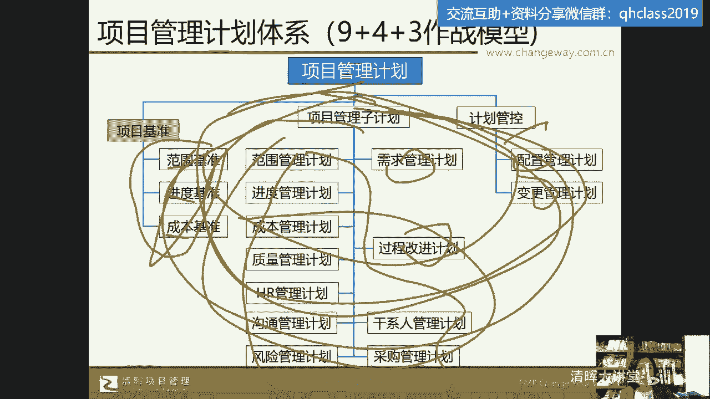
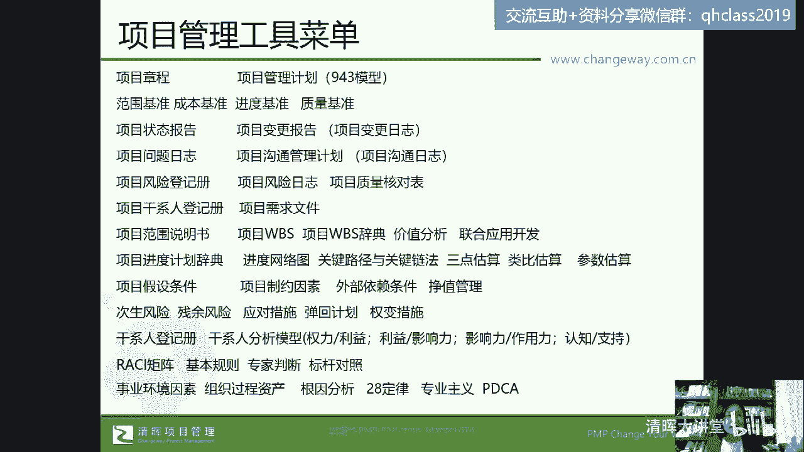
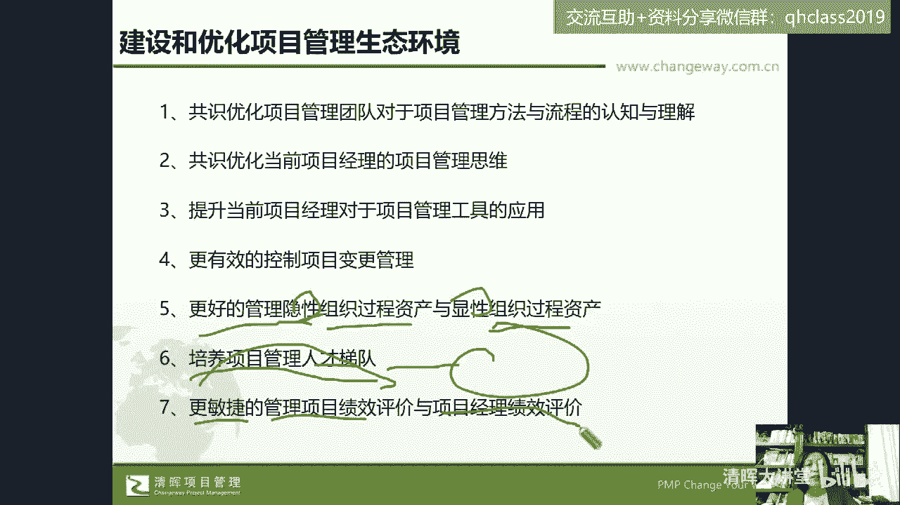
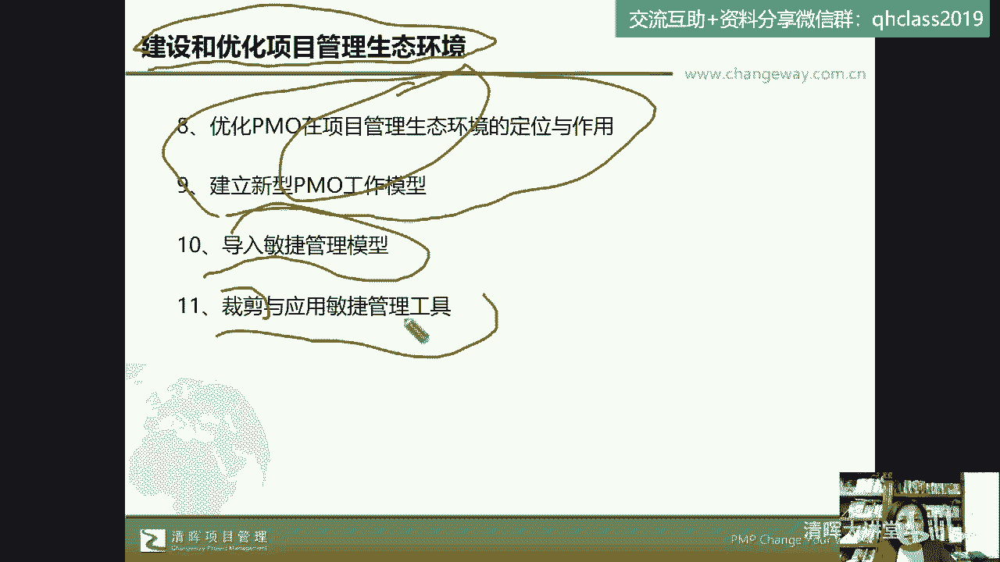
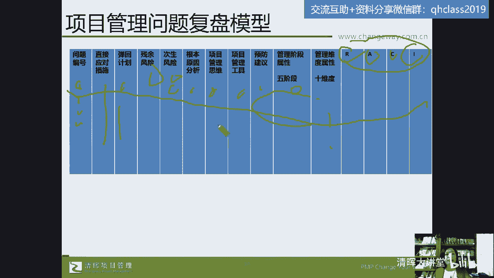
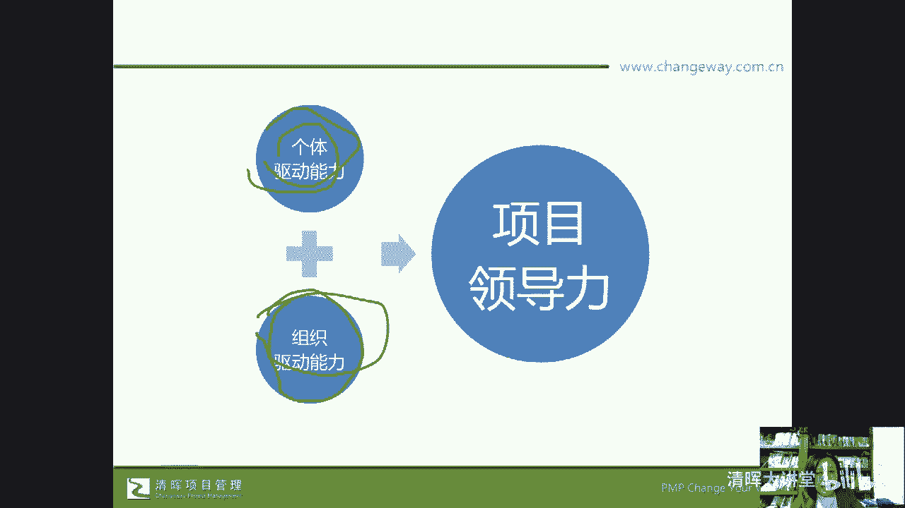

# 🔥项目经理必看！28个棘手难题一网打尽，实战解决方案助你轻松应对💼 - P5：5.项目管理工具菜单 - 清晖大讲堂 - BV1fztLezEZK

作为项目经理，对于那20个问题的28个问题的解决，有好多问题，我们做了根因分析之后，其实是你的项目的计划的这个问题对吧，你的项目计划的问题，那么这个项目问题的计划的问题，那计划体系在prince体系中。

它是按照我们企业目前常用的这种，比如说A类计划，B类计划，C类计划，我们很多大国重器的计划，他们就是按照这种方式叫A类节点，B类节点，C类节点，还有些公司叫一级计划，二级计划，三级计划。

你们公司可能也这么做吧对吧，那pce two里头就给你讲你的这个项目计划，他把这个叫一类计划，阶段计划叫二类计划，然后小组计划叫三类计划，他的职责他的分工对吧，它的交付物在prince体系里头。

是这么来讲计划这件事的，因为计划是prince two，英国项目管理体系的一个管理主题，重点管理的对象，但是在偏僻体系里头，又给我们展开了一个新的视野，它不是按照这种什么呃，俄罗斯套娃的方式。

就一类二类三类互相包的，它是用了平铺式的，他把计划按照管理维度分了我们的基准，哎，这是我们的红线，有些公司经常讲说红线不挡对吧，哎红线不能够去变，叫范围基准，进度基准，成本基准这三大基准。

然后这三大基准有它的支持性计划，九个支持型计划，你做一个项目，你得用你的范围管理计划，进度管理计划，成本管理计划，质量管理计划，唉，资源管理计划，沟通管理计划，风险采购干系人这九个维度。

然后有一些项目可能它还要匹配过程改进唉，配置管理，变更管理，甚至收益管理，还有我们所说的什么呢，还有我们所说的这个嗯需求管理计划对吧，这就是我们所说的一个计划体系，那如果我作为一个成熟的项目经理。

我学了price two，我学了偏僻，我就很可以干什么呢，我就很可以去借鉴，唉，在我的项目中，我们是用这种平铺式的计划模型，还是用我们的这种俄罗斯套娃式的一级二级，三级计划的模型，项目计划阶段。

计划小组计划，甚至可能这两者能够合起来用，在我的一级计划里头，唉我们有需要的这些内容，在我的二级计划里也有，三级计划里也有，比如说我我曾经在上海给这个国核工程公司，哎，他们有很多这种核电站的建设项目。

什么阳江核电站，防城电核核电站，三门核电站对吧，那么他们当时在我想想，大概是8年前，他们大的项目总，这些核电站的项目总经理工作非常的辛苦，但是他们的这个核电站的技术呢，既是我们国家的核心机密。

但是跟国际比如说西乌啊公司啊，还有一些其他的核电，法国的核电技术公司，美国的核电技术公司，大家呢又要合作哎，国家与国家之间的合作对不对，那在这种合作中呢，对方就要求我对方派的技术团队。

管理团队和我们这边要对等，我们这边的职务就是这种是什么正处级，他又担任了项目总经理，但人家还要求你有项目管理的资质认证，那时候我给他们来做这个咨询诊断培训的时候，他们的这种项目总经理的年纪。

平均在45~50岁，这个年龄段工作非常的忙，但是还要通过认证，那么大家想一想又那么忙，然后呢，说句实话，这个年纪也不是一个再去从头学习的年纪了，对吧，那怎么办，还得有这个证书，怎么学。

最辛苦的一个项目总啊，他呢就是根本没有时间来集中听课，那你得拿到这个证书，什么时候学习呢，每天早上啊，这个晚上经常加班，就加到12。1点开会，然后每天早上五点起来，五点到七点在办公室学习。

然后呢当时给我提了一个要求，说郭老师我能不能够在六点到七点打扰你，就早上来特约，为什么我要跟你提问，我用这种什么呢，用这种线上的方式，电话的方式来给你提问，那有人说这是不是骚扰。

不是因为他白天真的没有时间，晚上也没有时间，这就是作为官方的一个要求啊，作为一个非常大的一个核电站项目的总经理，那么他们当时在学习的这个过程中，就是把pres素体系的模型在他们做计划的时候。

跟国际管理团队啊，国际技术团队对标的时候，就是把这些都纳入进去了，在他们的流程中计划体系当中啊，有一级二级三级计划，也有基于这样平铺的一个计划体系，那么在我们的pp这本课程课程中。

在我们的pl报告当中就会专门的来讲，在第四章整合管理中来讲这个计划体系啊，在讲这个计划体系好，那您现在看到的这个表单。

就是整个我们从偏僻这本书中招，这个摘抄出来的这个关键词，也就是说它不仅告诉你知识点，他会告诉你，我们在做项目启动的时候，我们应该有项目章程，项目章程的构成是什么，那么哪些是核心点，谁来审批，谁来生成。

它有什么作用，然后会有项目管理计划体系。

刚才我们展示的这个图形对吧，然后接下来我们的这三大基准。

或者有些公司会有四大基准，那么如果有这个基准了对吧，如果有这个基准了，那么我们想说的是，可能我们刚才那28个问题中的，大部分问题都能够解决啊，都能够解决，所以我们说呢在我们的这个什么呢。

在我们的这个企业管理的过程中，那么多的问题我们需要通过方法论来解决，那还有日常我们的项目的过程监控的状态报告，项目的变更报告，我们的问题日志，我们的沟通管理记录对吧，我们的风险登记册，风险日志。

干系人登记册，项目需求文件，哎，我们的范围说明书WBS就是我们的work breakdown structure，工作分解结构啊，Work breakdown structure。

还有我们的工作分解结构的词典，价值分析等等，这些词在你们如果感兴趣的话啊，来学这个什么呢，来学习我们的偏僻，我们的资质认证，这个课程的话呢都会讲到都会讲到啊，这是我们提到的，当然呢也可以做一点小广告啊。

嗯如果大家已经考过了这个偏僻的话呢，在我们3月19号，郭老师会线上开我们的prince的课程啊，那么我们也会对标pp对标敏捷CP来讲，prince two就是英国项目管理资质认证。

英国项目管理资质认证的考试是开卷考试，它分基础级和我们的专业级，那专业级是一个大型案例分析，一共82，一共80道题，我刚才说的是pce two偏p p two的认证，如果大家没有考没还没有考偏僻。

也还暂时先想学偏僻的话呢，那我觉得这就是你们将来要学到的内容，学到的内容我可以保证，就是我刚才提到那28个问题，坦率的讲啊，坦率的讲，我们所说的都能够在我们这些内容中找到它的，一种解决方案。

老师有学员说你不是在带软考，我今天还真的没有提到软考，其实软考是中国的唉，信息化的项目管理的资质认证，有人在问，我也说一下吧，它也包含了中级和高级的考试，而且在很多这种嗯很多地方啊，在很多地方坦率地讲。

这个软考还会软考的成绩和证书，还会对什么积分啊，落户啊，好像都有帮助的啊，感兴趣呢可以去咨询啊，感兴趣可以去咨询我们，今天晚上其实不限于哪一种课程的一个推荐，因为我们刚才讲的一个点。

我不知道大家有没有注意到，其实我想说的就是，我们项目经理，需要具备的是一种系统性的思考能力，和系统性的解决方案，你比如说我自己的一个学员啊，在这个在国内排名啊，价格排名第一的，你们就知道谁家了吧。

物流公司工作，他在PO那个PO呢是向谁呢，这个PO是向这个公司的副总裁汇报的，组织级的PO，那实际上他就是我的学员，是我推荐进去的啊，职务现在也是比较注属于中高级管理者，那当时啊那个大概是什么时候。

我想想算一下，差不多是啊，23年一三年，8年前，8年前的样子，当时呢在这个深圳啊，我给顺丰啊，就我就直接说了，给就顺丰集团做培训的时候，当时跟他们公司内部这个人力资源部，他就说郭老师。

你有没有你的学员啊，那么对这个物流行业感兴趣，不一定非要有物流行业的经验啊，它重要的是对物流行业感兴趣，然后呢这个情商智商这方面又提了一些要求，另外就是对项目管理的成熟度很高。

那个时候的敏捷项目管理还没有出来，他说要有偏P和p two的资质认证，唉他要求的啊，他要求的是什么呢，他要求的是我就是这种充分的项目管理的这种，他他说的是要离地三尺来看项目管理。

他要求的这个人能够离地三尺来看项目管理，因为做PO嘛，你肯定要去优化流程，你要去管理项目，那对吧，唉所以我们说呢，其实大家对于各种项目管理的资质认证，其实都是有什么的啊，都是有要求的啊，都是要求的。

如果大家问对于这个呃，考这个资质认证有什么要求，可以加我们班主任的这个什么呢，今天晚上我们在线的啊，在线课程顾问的这个什么呢，微信来咨询好吧，也可以，你今天通过谁来报名都是可以的啊，都是来可以的好。

那么我们来看一看啊，其实我们学习了项目管理的各种体系呀，方法论，那么我们除了去解决具体的，比如说我们刚才提到的这个，28个问题之外呢，我们还能干点啥，我们能够做什么。

我们能够去建设和优化项目管理生态环境，我们能够共识和优化项目管理团队啊，那么对于我们项目管理，方法和流程的认知与理解，我们能够共识和优化，我们项目经理的项目管理思维，那么提升我们当前项目经理。

对于项目管理工具的一个应用哦，对有人问啊，有人问那个我我我有没有偏僻的班，除了3月19号我会开P2的线上班之外，3月25号，郭老师会开我们清辉的这个偏僻的班级啊，我本人亲自教学的班级。

是3月25号来开班的，如果大家想想学的话呢，是没有问题的，而且是针对5月份考试的，以往的偏批考试都是369 12，那么在过去3年，由于特殊原因，可能考试没有持续进行。

那么从今年开始变成了3月5月八月11月，四个月，四个四个月份啊，来考试，那么3月25号，郭老师的偏批就要开班啦，如果大家感兴趣班级，你们同朋友感兴趣都可以来报郭老师的课程啊，我们有很多班级啊。

我的班是3月25号开班，在线上开班，到时候我们会分析更多的案例啊，给大家去哎，快快乐的讲解好，来我们继续说一下啊，那么我们要提升更有效的去管理，项目的变更管理，因为在我们整个PMBOK这本书当中的。

整合管理的这个4。4啊，不是4。6，就是整体变更控制有变更的流程，变更的这个组织变更的这个分工啊，那还有呢刚才我们说了，我们项目中的很多问题的出现，它的一个解决方案是，我们的企业中应该有组织过程资产。

那么我们作为项目经应该有组织过程资产，这叫组织驱动行为，那么我们要会用组织过程资产，那是我们项目经理的个体能力，个体驱动行为对吧好，那么在这种情况下，我们一个是组织得有一个是你得会用。

但是我们在这期间还有一些细节，这个细节是什么呢，是第一你会不会管理这个组织过程资产，那还有呢就是什么是隐性过程资产，什么是显性过程资产，这个其实在我的课堂上，我们也会大家展开去分析好。

那么还有如果你现在作为项目总监，作为pm对吧，作为公司的职能管理部门，你怎样去培养打造我们的人才梯队，这个在我们的项目的资源管理中有提到，那还有如何更敏捷的去管理我们的项目。

绩效评价和项目经理的这个绩效评价，那这个呢在我们的这个课程中，也会给大家去做一些分享，还有PM是什么，我们说呢project manager office。

那PMO项目管理办公室，有些公司叫项目管理中心等等，他怎样在我们的项目管理的生态环境中，去定位和作用呢，担当什么职责，实际上这部分内容啊我觉得特别的重要，就这这八和九这个特别的重要，为什么呢。

因为对于我们的项目从经理来说啊，对于我们的项目经理来说，我觉得大家在职业生涯的规划上的下一站，很多人我也推荐大家，因为我们做了项目经理之后，一个成熟的项目经理，肯定在我们的左手技术思维。

右手管理思维这件事情的权重上，可能更多的要倾向于我们的管理思维了啊，那你在管理动作上，管理思维上投入的或成长的更快，实际上完全纯粹的再回归到技术序列去，发展的可能性就不那么大了啊，然后而企业来说。

说句实话，就是找技术型专家可能还不太难，但是找懂一点技术或者懂技术的，管理型的专家和管理型的人才，可能需求量会更大一些，所以在这种情况下呢，大部分企业对于项目经理的，下一个这个职业路径。

可能就比如项目总监哎，还有呢项目管理专家是偏管理型的，还有呢就是项目偏mo的负责人对吧，那么或者就是PMO的总监，那实际上我们对于PO的这个理解，比如说建立新型的PMO的工作模型，怎么建立。

怎么去优化PMO，在把企业生态环境中这个定位，在我未来的这个偏僻的课程上，我都会做讲解，它不一定是考试内容，因为这一看明显，这就是这个这不是这个就是主观性命题，这就不是客观性命题了嘛，它不一定是考试。

考试的时候肯定会考PNO这个概念，可能因为我们现在考试的时候，PNP考试230道，这个什么呢，230道的这个呃单选题啊，单单呃单选题加15道，15道左右的这个多选题啊，啊哦不对，是是老师糊涂了。

是180道题啊，230分钟以前是200道题，240分钟，现在是180道题，其中有15道题左右的多选题，那其中会有那么三两道题，每次考试因为它知识点很多嘛，每次考试可能会有三两道题考这个PO。

但实际上在我的这个偏僻的课程上，因为我非常多的精力也会放在这个，咨询和诊断上，所以也会帮助企业去建这个PO，那我的课程上不仅是告诉你PO的定义，它的作用，他的职责，甚至考试怎么考。

甚至可能关于这两件事我也会给大家讲，包括我们的项目经理，怎么去能够比较快的转型到我们的PO上去，甚至还帮助过有些学员啊，用阳谋把没有PO帮企业去渗透和建立的PO，自己还当了PMO负责人。

这也都是有案例的啊，可以做到的，所以我们说综合性的，系统性的去参加项目管理的这个资质，认证和学习呢，一是帮助我们的企业去建设和优化项目管理，生态环境，对于我们自己职业生涯的提升和发展。

也是非常有帮助的啊，包括怎么去导入项目管理的模型，敏捷管理的模型怎么去裁剪和应用，因为敏捷管理它需要有环境，那么也不是哪个企业就能够，完全按照敏捷的方式来管理，都是部分引用这个词。

在在项目管理中是个专业术语，叫裁剪啊，叫裁减，那么这就是我们说建立项目管理思维，系统性的去学习项目管理的这个知识方法，能够做到的一些事儿，与企业共赢共创对吧，那同时啊我们经常说呢，我们的这个企业要成长。

团队要成长，个人要去成长，那我们也要学会对我们项目管理去做复盘啊，那么这也是我们的一个复盘模型，这个复盘模型我的很多公司都在用，因为嗯如果不复盘不用，这个模型呢可能也有很多别的模型。

但是别的模型它会有一点就变成了泛泛而谈，他捞不出干货，他扎不准这个针，那么我服务的一家新能源嗯，汽车行业啊，新能源汽车企业，他们公司呢大家都知道互联网企业大厂，新能源行业。

这些新新新兴企业里头特别讲一些词儿，什么拉通对齐复盘是吧，赋能唉这些词儿，你说大家觉得这些词儿挺讨厌的，可是这些词本身也挺无辜的，那你干工作就得拉通对齐呀对吧，那你就得赋能，你就得怎么着。

只要我们没把这事儿给做偏了，真做出效果了，这些词就是好词，就是好行为，好动作好，那么我们来看那那家企业，他们自己有复盘，后来老板老板发现那个复盘复的太泛了，扎不准，那怎么办，用了我这个模型。

就是我们所有的问题编号捞干的哎，问题通过问题日志，通过风险管理的这个这个过程给它摘出来，然后当时出了这个问题之后，你们的直接应对措施是什么，谈回计划相当于你们的备份plan b有没有。

然后这些问题有没有残余风险，就是你解决这个问题之后，有没有没有解决的问题，有没有次生风险，就相当于派生出来的新问题，然后这根因分析是什么，是什么样的思维，点出了问题，优先级的思维呀，共识的思维呀。

具体用什么工具预防建议是什么，属于启动阶段，执行阶段唉，规划阶段还是监控阶段的问题，属于进度的问题，成本的问题，质质质量的问题，这个避免大家去背锅啊，避免大家去甩锅，既然不让大家甩锅。

那就避免了项目经理去背锅，后来这是ICNICA是一个管理工具，我们在PNP中也会讲到啊，他是我们的职责分配矩阵，唉我们的这个执行人，我们的责任人，我们的咨询人，我们的inform，我们的告知对象。

这个都是我们在我们的偏僻课程中会给他讲的，所以对于今天来到我们现场的各位，我相信啊，我们大家呢可能都希望成为优秀的项目经理，项目总监。

成为PO的这个负责人，那么我们要具备的一种能力就是我们的什么呢，我们的项目领导力，我们的项目领导力，那对于我们的项目领导力来说呢，我总结了六个要素，第一打铁还得自身硬，所以我们的个体交互能力。

这就是我们的内功，内功，我们的金钟罩铁布衫，那么我们还得有我们的什么团队交付能力，我的团长我的团，你得带出一个有战斗力的团队，你不能是团队的英雄，你得打造一个什么呢，英雄团队，这个大家明白了吧。

所以说呢我们说这个自己是英雄不行，你得打造英雄团队啊，所以团队交付能力，那第二项是什么呢，你得有技术交付能力，你自己的技术能力倒不重要，你得能够拎得出，拎起来这个团队的技术交付对吧。

那在接下来我们怎么办呢，你得有管理交付能力，也就是说你的团队中有很多有技术的能人，但是你得通过你的管理方式，把这个技术给他交付出去，对吧好，那我们的项目领导力还包括什么呢，我们说呢有我们的个体驱动能力。

有我们的组织驱动能力，那如果说我们不能够解决问题，遇到问题，我们就ICECREATE，我们就去上报，那这种项目管理者不好意思啊，嗓子有点哑，那么这种管理者我们说呢也是不受欢迎的。

所以我们要有个体驱动能力，自己解决问题，自己推动问题的能力，我们刚才讲到的很多思维方法，这种基本的方法论的应用，那我们还得有什么呢，组织驱动能力，那我们的这个组织驱动能力就得借力打力，哎。

得什么拉着虎皮扯大旗对吧，我们要学会刚才我们收集的问题中，有没有一个就是在企业的项目分级机制，不明显的情况下，不明确的情况下，优先级排序不明确的情况下，你怎么能够为你的项目抢到资源呢。

是不是唉这个当项目分级不明确，多项目并行的时候，那么我们要怎么办，我们就需要啊，谢谢啊，我们就需要用自己的阳谋，为自己的项目抢资源呢，那这个时候说句实话，中国的传统美德可能就温廉恭俭让就不太行了。

咱得怎么办，咱得狼性精神就得出来了，是不是啊，哎所以说说句实话，那家企业我们刚才举的那个例子啊，我们刚才举的那个例子里头呢，那家企业的老板，他能够把他的项目经理叫战斗英雄。

实际上他用这种方式跟他的团队成员对话，有人真的，我在一个另外一个场合去分析这个案例，分享这个案例的时候，有学员跟我说，老师这就是PUA了，我并不这么认为，因为PUA其实我怎么去判断这件事情。

就是我给你画了大饼，你真的去努力了，但是努力成功的时候，我没有兑现，我给你的比，我觉得这个叫PUA，但我给你画了大饼，而我又兑现了这个饼，你做到了，我给你兑现了这个饼，这就不叫PO了。

因为这个老板他愿意去打造组织能力，他愿意尊重项目经理，甚至给他们很高的组织荣誉，叫我们公司的战斗英雄，因为做乙方嘛，你这个项目经理交付能力不行，乙方不认可你这个项目经理怎么回款呀对吧，怎么续约呀。

是不是怎么打单嘛对吧，他愿意把他们叫项目战斗英雄，那么在这个公司里头，确实你说他这样做这个企业没有问题吗，有问题呀，你比如说我们在一开始驻场的时候，他们公司就是存在着这个什么呢，项目分级不明确。

优先级不明确，多项目并行，你做乙方，你你就一个项目，你肯定吃不饱，活不下去呀，那你就得多项目并行，那在这种情况下，那多项目并行，然后又没有项目分级机制，那我们交项目经理就是怎么教，你得有个体驱动能力。

你还得在公司里头抢资源的这个能力对吧，然后那个老板就开玩笑说，你给我们的项目经理都训练了，训练他们的狼性精神，训练他们驱动组织的能力了啊，然后呢也带动了大家都抢抢的能力，强了之后怎么办呢。

那在这种情况下，那么我们就说了，那这个时候就倒逼你这个他们公司的PO，快速的先把你的项目分级机制建起来嘛对吧，以前大家觉得哎呀不好建，是从合同金额去建呀，是从行业去建呀，对不对。

这个项目的分级机制不好建，现在你不建不行了，大家都在抢，以前可能有的人会抢，有的人不会抢，这个抢的意识还不强，大家还在抱怨，但现在大家都拱起来了，那怎么办，倒逼着pm就快速的给老板交了三版啊。

三个不同维度的项目分级机制，然后项目优先级评价体系，然后他们的偏猫，他们的人力资源部都联动起来了啊，都联动起来了，所以我们说呢作为项目领导力，你得有个体驱动能力，你还得有我们的组织驱动能力啊。

好很高兴我们学员问问题啊，RACI如何应用啊，你是问这个复盘表怎么用，还是问复盘表里的ICI怎么用吗，我来说一下啊，我先试着理解你的问题，是问ICI怎么用，首先ICI这个工具呢。

我们把它叫做什么呢。