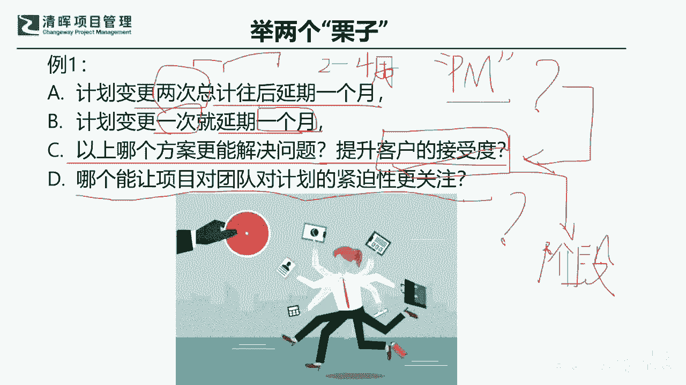
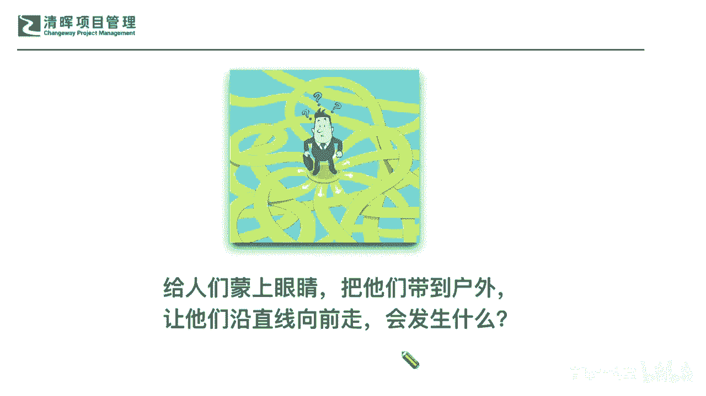
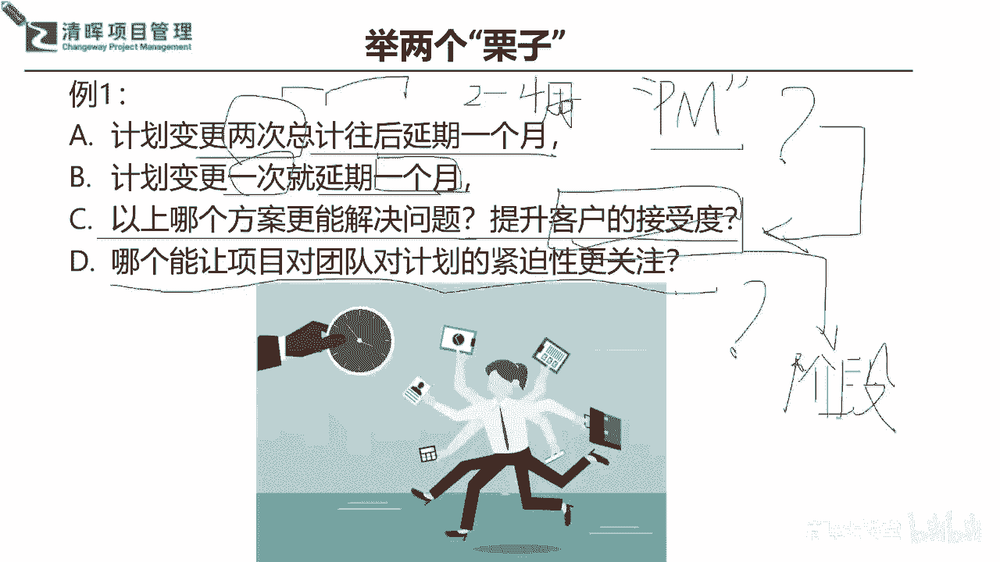

# 🚀【实战干货】解锁《高效项目管理100法》，让你的项目速度飙升！ - P1：2.两个案例 - 清晖大讲堂 - BV1CS411c7Vs

有不同的想法，那么我们首先来看啊，大家来看一看我举的这两个例子，提了一些问题，大家也在评论区给一些响应啊，比如说你现在有这个A啊，A就说这个计划变更了两次了，那两次结合在一起。

总计呢往后这个项目延了一个月了，那么B呢就是计划变更了一次啊，这个变更了一次就延期了一个月啊，所以A和B是两种不同的情况啊，这个能理解啊，那么问题就来了，问大家，那以上哪个方案更能解决我们的问题。

更能提升客户的接受度呢，大家先来回答一下C啊，线上的各位小伙伴啊，大家也积极的这个参与进来啊，如果说计划变更变了两次，可能不管前面一次抵类多少吧，延期多少，那后面一次延期了多少。

两次一共往后延期了一个月，和计划变更一次就延期了一个月，哪一个方案更能解决问题，更能提升客户的接受度啊，来把大家A和B选一下啊，让杨老师看到大家在听啊，这个信息的沟通渠道一定要是通畅的啊。

大家时间花在哪里，就要有这样的一个实际的收益，才对得起我们的这个时间，就是生命啊，是吧哈啊，非常好啊，用户这个手机尾号3206的同学选A啊，好galaxy春同学选B啊，好真的有很多不同的想法是吧。

非常好啊，任延东同学也是A啊，这个微信德同学是也是A啊，事事如愿，同学选B，夏永同学选B，严峰天兰同学也是B啊，邓希同学是A好，朱娜同学也是A啊，看起来A和B好像占比都差不多，A略微多一点啊。

韩军同学也是A好好，我们线上还有其他同学有想法吗，哪一种你们自己平常在在做项目的时候，哪一个会你觉得哪一个更更好一点，哪一个能提升客户的接受度啊，好我看后面呃勇往直前，同学也是A啊。

A啊现在看起来稍微多了点是吧啊，sunny sunny ferry同学也是呃是B啊，大盼飞行侠同学是A啊，来大家想想看A和B它的关键的不同点在哪里，不同点在哪里，第一个我们知道它是变了两次。

总计往后延了一个月是吧，所以你知道他这个变两次啥意思啊，就是它是一次一次阶段性的去变的，是不是啊，它不是一次性的去变的是吧，然后B是什么，他变更一次就延期一个月是吧是吧好，那现在问题来了啊。

我看德同学非常好说，一次又一次的延期可能会让客户不满是吧，对这个有道理，但是我们的事实如愿同学说了啊，这个也echo这个响应，这个德同学说多次变更会引起客户反感，然后还有说这个呃用呃用户320。

尾号3206的说力度不一样，还有这个啊这个或呃ZY同学啊，不知道这个名字我有没有拼对啊，说看情况，那我们就从这个项目管理啊，你就是以项目经理的角度来去看，这个计划层面来去理解的话。

你认为哪一个你能够接受啊，我相信德同学事事如愿，同学和所有选B的同学，选A的同学，你们现在的一个立场是把自己当什么来来看的，大家是不是把你们自己当这个PM啊，是不是啊，同志们，你在回答C问题的时候。

是不是以PM的立场来看呐，是不是啊，是啊哈哈，这个大家没有什么，因为这个我们如实的说就好了啊，啊清江同学说是客户是吧，好很好啊，韩军同学说是的，我相信啊，选选A或选B的同学在回答问题C的时候。

你不自然的不自然，我讲啊没有任何的这个经验的一些这个指导，不自然你就会以项目经理的角度来去思考，所以项目经理呢你会发现项目经理做A的时候，哎呦变更两次是不是有点麻烦，就像刚才有这个这个同学说的。

一次又一次延期，这样会不会带来不满啊，是不是啊，那么还有选B的同学，你可能也会有什么问题来变一次，变一次就延一个月，你觉得客户会OK吗，是不是，如果今天如果出现一个异常，你就跟客户去建议，哎。

咱们能不能这个项目就延一个月啊，你觉得你的客户会同意吗，同志们啊，可能这个概率非常低，是不是啊，非常低，因为这个实际上我们从这个这个项目计划角度，我们也从敏捷项目管理的角度来讲，敏捷的迭代就是2~4周。

是不是啊，你要超期了就不敏捷了，也就是说你一次性就把一个整个的一个冲刺，迭代周期给给给delay过去了，是不是啊，然后你这样子的话，你客户能能去这个同意的概率非常小啦是吧，所以可能在这个点上。

我们还是要非常明确的一点，我们非常好啊，这个jack同学和世事如愿同学都有自己的分析了，我们一定不能单纯是从一个角度去看问题，是不是啊啊这个大家意识到了，所以为什么我们有些时候做事情。

还是会单纯的角度去思考呢，我们自己也给自己一些这种反思，是不是，那好，那么我再追问一个问题啊，D这个问题，哪个能让项目对团队对计划的紧迫性更关注，来回答回答第四个问题，D，这个问题。

哪A和B哪一个更能对团队对计划紧迫性，更关注，哪一个来给出答案，好我们又有这个嗯，尾号3206同学A啊，韩军同学也是A啊，任延东同学依然非常坚持自己的这个想法啊，B啊世事如愿，同学说是A啊。

sunny也是A啊，好清江同学也是A，夏永和朱娜同学还是B啊，德德同学还是A好好韩军还有这个啊，我们的侯宏广同学也是A啊，大盼飞行侠同学也是A好，这个时候大家就慢慢慢慢的开始，要形成一定的共识了。

是不是啊，有发现这个点在哪里吗，我们一直在提，大家其实啊其实有一个问题我追加，我先不着急，回答A还是B啊，其实我们很多时候我们太过于执着的，想要一个非黑即白的一个答案，是不是。

但是我追加我再追加一个问题，对啊我再追加一个问题，大家再来看啊，好来再追加第二个例子，大家再来给出你们的一个简单的一个想法，DA例子2A是项目经理，A它只保证了产品的出样按时交付了。

但是呢他最终交付产品这个时间，最终这个final delivery的时候，他还是延误了，但是呢这客户居然还表扬了他，然后项目经理B呢他非常非常谨慎，严防死守，不合格绝对不交付啊，这个边界感原则感非常强。

结果呢阶段交付也没能按时拿的出来是吧，那客户还要坚持要换掉他，非常这个有有客户的一个抱怨是吧，有这样的一个不满意度好，A和B那来快速回答一下，为什么为什么在你的认知范围之内。

在我们每一位这个线上伙伴认知范围之内，这样的事情是不是也经常屡有发生啊，因为也是常态，是不是，那么来告诉我A和B有什么不同，你可以简单的评价说A做的就对，B做的就不对吗，还是说A其实是做的不对的。

B其实做的对了，但是客户又对他不满是吧，这个讲得像绕口令一样，但是实际上也是非常常见的一种情况，是不是啊，那为什么为什么啊，我们在讲why，为什么项目经理A它只保证了产品的出样的，按时交付。

最终还是postpone了，非常不好的一个结果啊，客户居然给他打了满意度100分，然后项目经理B反而是非常执着，坚持这个计划面的结果呢，结果还要换掉它，就是非常不满意他点在哪。

就是大家还是返回到这个所谓的我们讲的这个，项目管理理论的常识，也就是说我们为什么这个项目偏僻，要向这个敏捷去过渡啊，就传统型瀑布型要像敏捷去过渡，其实最重要的一点不就是在于我们怎么样。

什么更好的来去把我们的这些价值要什么，传递出去，是不是啊，各位同志啊，所以这个非常关键的一个点啊，非常关键的一个点就是希望大家能够啊，非常好啊，as s tour同学也是老朋友了啊，我也给你也点个赞啊。

是及时沟通，小步快走，其实就是ACP最大的一个理念，这就返回到刚才我们问大家的，A和B那个问题了是吧，你既然知道这个道理的时候，我们再返回这个A和B的问题，你看计划变更两次，总计往后延期一个月好呢。

还是一次就延期一个月好啊，我相信啊大家现在就有更深一点的理解了，也就是说我们不怕变更甚至敏捷喊出来的口号，最大的一个点就是什么拥抱变更，是不是啊，还记得啊啊拥抱拥抱变更，也就是说我们不怕变更的次数。

但是我们永远怕的是什么，怕的是突然炸雷，是不是啊，突然炸雷这个东西就非常非常的吓人了啊，所以可能我们也就是在这个里面一定，如果让咱们二选一，哪一个做得比较好的话，那一定是哪一个啊。

肯定是A他更能让团队的紧迫性也好，让客户满意度也好，也能更能让团队凝聚在一起，快速迭代和去这个研究和落实，他的这些落地当中的问题是吧，能够快速让大家啊，第一时间把这个什么计划面的一些东西。

能够及时敏捷地去响应了，这个能理解啊，所以现在大家如果稍微啊有一点点，这个理念性的一些扭转和这种反思的话，那我们就可以继续来去看看啊，既然我们想做到高效率，那你就要知道我们其实不是在高效率。

不是在省这个什么变更的时间，而是在提升我们思维和解决的一个价值啊，好事事如愿，同学说，这就成为PMP思维啊，这个不完全是PMP的思维，它其实融合了我们前沿的一些敏捷，和我们这种项目管理综合性思维。

包含prince to的一部分的思维了是吧，所以可能在这里面啊，有一点啊，这个事如愿同来说，实际情况更多是希望B是吧，那实际上这个问题我还是希望能留给你，你可以去多观察，也去多思考一下。

如果今天你跟你的客户啊，也许你再交付一个产品，然后你跟你的客户就一次性提到说，我能不能一下就抵了一个月啊，我先这个延期一个月，因为我不确定这个变更他是不是完整的变更，它有可能后面还要变更。

所以为了去满足这个整个的一个确保的交付的，一个时间点，和，这个这个它的一个这个最终交付成果的，一个合规性啊，我还是坚持啊，把这个延期一个月，你看你能不能同意这个时间，那我相信啊，可能这个时间点啊。

这个时间点一个月啊哈你别说一个月了是吧，你就说一个星期吧，你去跟你的客户说，我能不能啊，一个星期就是给你delay了，你看这样子会有多大的反应，在这个上面是有很大的反应的啊，同志们，首先有一点。

为什么敏捷的思路能够被接受，但是最终交付的延期，其实我们可能能商量的一点就是在于，不是敏捷里面的人，不是敏捷里面的客户，他不在乎最终交付延期，而是因为他有一个什么样的保证，他不是不关心他最终交付延期了。

而是他因为看到了什么，看到了啥，看到你阶段成果，其实已经一步一步在潮他的一个要求来去靠近，甚至可能最终的延迟一部分的原因，他也能理解是因为什么他的思路，他的思想也在变，是不是啊。

所以这个部分一定要搞清楚，因为刚才我划出来的，我讲了两个思路给大家放在那儿，说是闭环和和我们的这个部分啊，在这一页刚才划的。

所以我们也可以在这样的一个环节上，也给自己一些反思。

是不是啊，好那么我们来看到刚才啊，看到这个任延东同学啊，也发了，就是在这个sq的同学后面，反任延东同学说，A有阶段性成果的呈现，给后续的交付打架的基础，B反而没有让大家看到任何成果啊。

这个非常解释非常的详细了啊，的确是这样，包含呃尾号3206的这个这个啊，同学说这个分阶段分目标啊，让非常好，最后这半句我给你点赞过程中能够持续参与，参与感太重要了是吧。

不管是以前的瀑布型的还是在敏捷型的参与，都是一个重要的满意度标准，如果你都不让他参与，何来谈得上接受是吧，所以可能这是一个很重要的，那么我们回过头来再来去看看啊，我们在整个的这个啊。

我们的这个高校项目管理的这个这个地图上啊。

