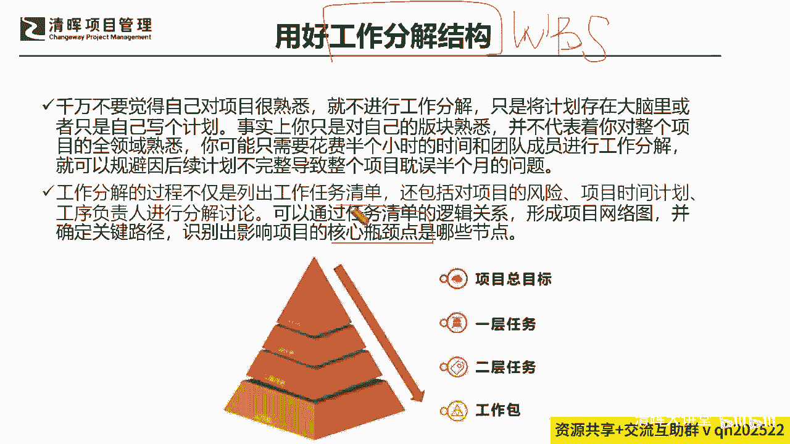
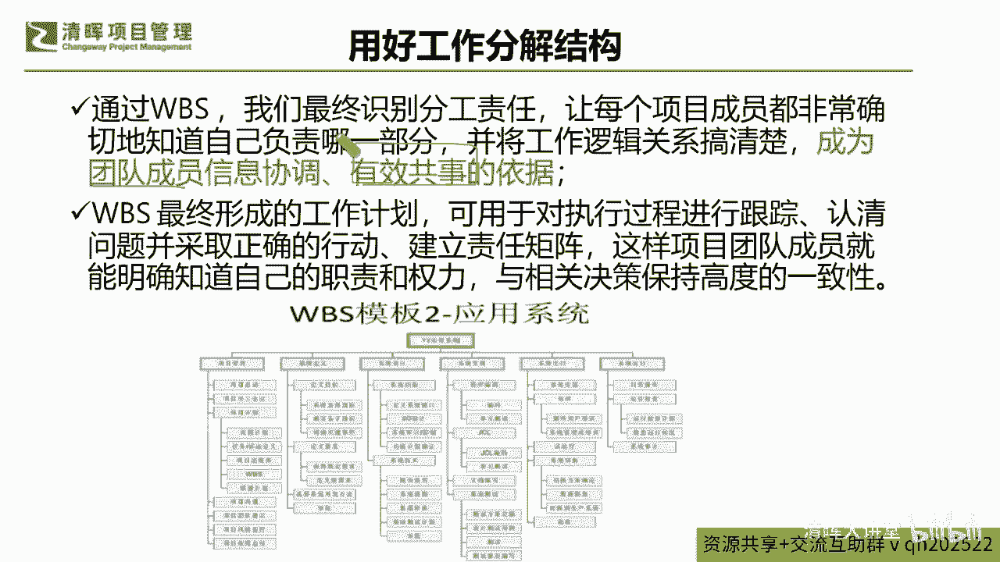
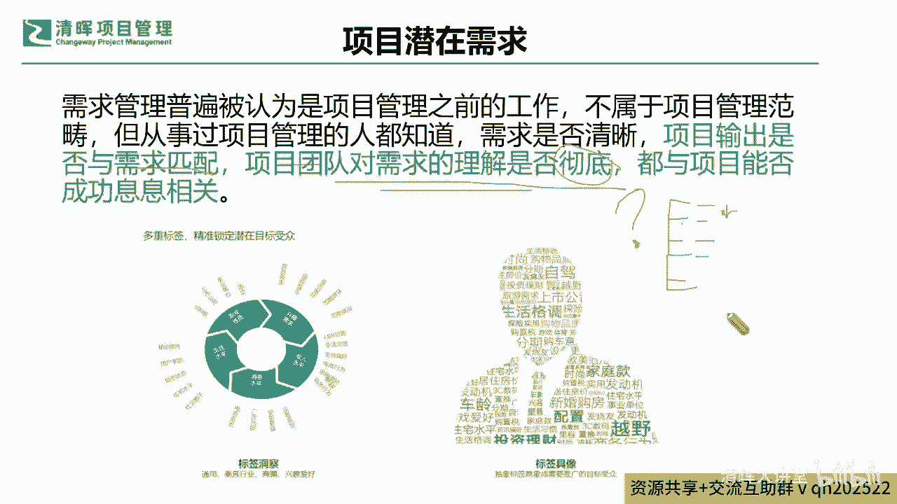
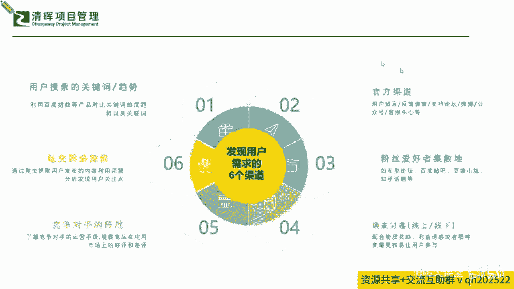

# 🚀【实战干货】解锁《高效项目管理100法》，让你的项目速度飙升！ - P3：4用好工作分解结构 - 清晖大讲堂 - BV1CS411c7Vs

的时候，其实我们更加要关注到的一个提效增，增加这种效能的一个点，就是千万不要仅仅是把这个东西做了一个sop，做了一个简单的拆解，其实你在拆解这个步骤的时候，你还要拆解它的什么。

360度的这种多维的东西都要拆，也就是说他的风险啊，他的干系人呐，甚至你刚才提问的那些问题通通都要来一遍，所以拆解啊我们再去讲所谓这个WBS，它拆的不仅仅是工序，他还拆的就是我们的十大知识领域。

你在每一个节点上，因为你要确保你的demo是吧，确保你的西瓜原则，你要能拿得出来东西，所以在这里面你就必须能够识别得出，你在每一个这个拆分的项目清单上，你的风险计划人资源，你的标准等等。

干系人参与等等是怎么样的一个状况，那么通过这样的拆分，你，你也许能够更好的能够抓住这个项目的一些，核心的bottle neck瓶颈点，那么通过这样的拆解。

你才能抓住一些要点，啥意思啊，你其实抓的这个要点，你不仅仅是做一个这样的拆分分工，你还要把这个东西变成一个什么团团队利用的，一个什么有效的一个依据，就不能光把你自己的计划面做做好。

你还要让大家拿着你这版计划，能够有效率地去共事，不要有的计划排出来，人家就说了，说我这个都看都看不懂啊，怎么办，所以可能在这个当中呢，我们一定要作为这个项目经理，我们自己要非常明确的看到。

这个我们WBS最终形成的这个工作计划呢，它一定是能够让自让团队成员能够信息协调，有效率共事的一个坚实的一个依据。

那么有了这样的一个部分，我们还会去看到，我们在这样的一个拆分过程当中拆什么呢，其实就是拆范围，范围又是什么呢，范围就是我们的需求，但在需求这个收集上又是一个大大的痛点，我们很多时候就是因为客户变来变去。

因为这个需求搞不定情是吧，我们就会有很多这种很难抉择的一些这种节点，但是在这个点上，我们来去提一提这个所谓的项目的潜在需求，那如果出现这样的一个阶段的时候，我们的需求管理。

它可能就是出现各种各样的变化的时候，我们怎么办呢，啊我们一定要确保，至少要确保啊，我们项目的阶段输出一定要与阶段的需求匹配，而且项目团队他要对需求的理解要彻底，这个怎么去检验啊。

就像我刚才问的那个问题啊，大家不要去问，一直问哎，你有没有听懂啊，你有没有知道你自己要做什么啊，不要去问这种很宽泛的问题啦，你要怎么检验他的需求理解是不是彻底，你就让他把这个交付成果。

1234给你完整的给你列出来是吧，标准给你列出来，甚至给你讲讲清楚他要第一个第一步交付什么，第二步交付什么，第三步交付什么，然后在这个当中他可能需要去输出什么，做什么调整，你就让他给你讲一遍啊。

不要再去问说你你是不是能明白啊，他说明白了，你又怎么样呢是吧，你做的时候又是没有做对，但其实还是没明白是吧，所以可能还是要返回到实践的角度，让他从落地的角度去回应是吧，那么在这个过程当中呢。

我们就能看到，其实我们也有很多很多的这种方式方法和渠道，能去挖掘用户的一个什么潜在的一个需求，那挖掘用户潜在需求的一些渠道呢，它也是多元多多样的，那么我们会看到，比如说你的用户搜索的一些趋势啊。

啊你的一些用户网络呀，你的竞品呀，甚至你的这种调查问卷呐是吧，还有你的一些这种community啊，就像咱们清晖在线学堂，也是一个大家非常优秀的这个清辉，咱们的伙伴的一个聚集地是吧。

实际上这些就是一个很好的，大家能够互相呃借力，甚至可能认识很多有益资源的一个平台，对不对，所以我们知道了这个部分，我们还会去不断地去校验自己，到底是不是抓到了完整的一些需求。

那么在这样的一个完整需求之下呢。

我们又会去深入了解我们的这种潜在，隐性的这种需求，它同样啊我也问了四个问题哈，呃也补充了一个问题啊，五个问题来去帮助大家来去get到，我们怎么样去知道我们的这个潜在需求，它能够被啊慢慢的逐步的瓦解出来。

也许一下子问不到，但是我们一定能够通过我们的一个观察，和通过我们的一个这个用呃花时间经历，这是为什么，可能要在风险上花更多时间识别需求，也是一个风险啊是吧，所以我们要去问一些关键核心的一个问题点。

那么首先相关方最近发生什么事儿啊，有没有什么公公司的一些调整啊，啊发生了一些重大的，什么样的一些这种客户的事件呀，有被表扬了还是被投诉了呀等等，是不是，那其实整个的层面上我们还能看到啊。

我们的这些了解啊，包打听其实还是有很大的价值的，是不是好，那这是第一个要问的问题，那么还有问什么问题呢，比如说了解一下对方的职位呀，就是我们讲屁股决定了脑袋，对不对，那我们的屁股坐在什么样的岗位上。

我们就希望就可能能抓到这个，我们具体的这样的一个部分啊，怎么样能够去了解到我们整体的这样的一个，变化是吧，那我们能够看到的这样的一个不同点啊，我们也会告诉大家，在我们整体的这样的一个变化过程当中。

我们也希望了解到干系人的一些这种，因为他的职位的变化，因为他的一些这种职能的变化，他的需求也会发生非常大的一个变动，所以在这个变动当中，我们就需要请大家非常明确的来告告知我们啊，怎么样能够。

更好的去抓到这些潜在和隐性的信息，那么我们知道了这个信息，我们再来看看，那还有什么地方能帮到我们，比如说这个相关方的这个老板，他对他业绩考评的这个导向是什么，其实说白点就是你要去了解你这个干系人。

他是怎么被他的老板去来去考核这个关键的KPI，或者是考核这个OKR的这一点至关重要，因为他在给你讲的非常非常多的需求，他最终万变不离其宗，他还是要去交付他的KR，交付他的KPI的，也就是说你的客户。

你的这个这个交付的成果的接受方，它也是有它的一个绩效导向的是吧，所以这些也是你获取潜在需求，一个重要的一个点是吧，哎呀今天我们就可能告诉大家一些，这个以前都是在桌面以下的讲的东西是吧。

但这些的确是很有用的是吧，好那我们再来看看第四个问题要问啥，就是你在跟相关方沟通过程当中，你有有没有刻意强调了什么，比如说他虽然没有把这个加到他的这个什么，交付的这个这个SOW里面。

但是他反复在强调说哎呀，我需要你每天至少要抽四个小时，要跟我们去进行一些这种开会呀，交流啊，这个时间你一定要抽啊，但如果这个这个东西没有写进合同，但是他又在不断的强调的时候。

你其实也能get到一点是什么，这就是他的一个什么需求是吧啊，就是他的一个需求，那么可能在这个需求的层面上，我们就会需要去不断的去了解到哦，如果他其实就是需要我，我们始终要去把这个东西啊。

这个时间投入在这里，跟他去进行这样的一个相关方交流，解开这样的一些会议，那么你可能就会需要去做一个，什么样的一个调整，你就要想办法把这些工时人工时是吧啊，甚至还有一些这种投入。

都要去算到他的这样的一个什么这个里面是吧，算到这个里面，那么可能在这个里面这点上啊，我们需要大家来做一件事情来做一件事情啊，我们怎么样能够把我们的这样的一个，这个过程当中带给对方这个价值。

也就是第五个问题再收敛收敛，也就是说你带给对方的这个方案的价值，是不是能最大化的，来提升到这个这个你的相关方的一个价值，也就是说你能给别人赋能，你能给客户带来价值，他才愿意给你什么更好的一个什么。

就是谈判的一些条件，甚至还可以给你追加一些这种盈利是吧，甚至还可以给你带来后续的一些，什么商业机会是吧等等，那么可能在这个过程当中，我们始终要收敛到第五个，就是我又提出来一个就是你的价值确定。

那你只要能始终围绕着在这五个问题上，你就一定能把它的潜在价值给干什么，给体现出来，能理解吗啊，所以可能这些呢平时不一定，我们学这个这个体系化理论的时候，不会反着来呃，从落地实践角度跟大家讲。

但是我们今天来讲，从实践的角度跟大家去掰扯的时候，其实这一点就非常非常的有，借鉴和帮助的价值了，是不是啊，那么我们知道了这个方法，那我们再来看一个东西啊。

