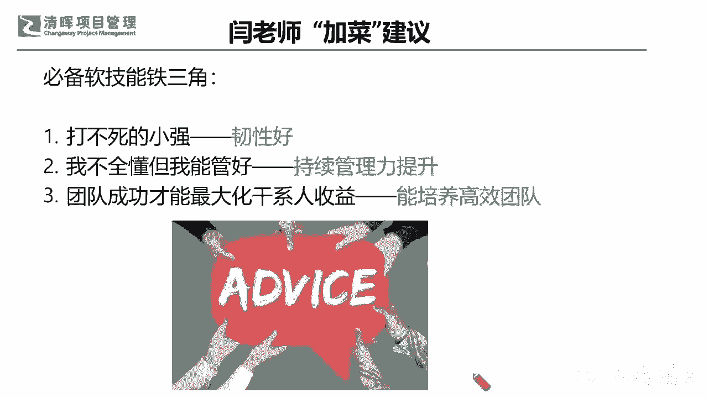

# 🚀【实战干货】解锁《高效项目管理100法》，让你的项目速度飙升！ - P5：6.必备软技能铁三角 - 清晖大讲堂 - BV1CS411c7Vs

在这样的一个建议之下呢，严老师也在最后啊跟大家再去分享一个。

再分享一个这个杨老师加料的三个小要求是吧。

加加料的三三个小要求啊，那个你必须还得有三个啊。

这个必备的软技能啊，一个就是什么，当这个打不死的小强一定要韧性好是吧。

不管怎么样，你始终都讲，只要今这个世界上除了生sir生死啊。

都是小事儿啊，其他都是小事儿。

没有什么过不去的坎儿啊，所以一定要把韧性放在，就是我们通常所讲的这种复原力是吧。

也就是我们讲的REELLENCE啊。

RECELLENCE就是复原能力，韧性一定要强，那第二点呢我虽然不全懂。

但我能够有能力管好，就是你要不断去提升你的管理能力。

这个跟你的技术懂不懂一点关系都没有，所以也就是说你不要觉得你作为项目经理。

你就必须比别人，比每个人都知道的深。

你是不可能做到，因为我们始终会有各领域的专家，但是你的长项在哪里呢。

你就是不断去提升你的管理能力啊。

那么第三个点呢就是你要始终坚信，照着奔着这个方向就是最大化干线的收益。

这个方向去不断地去培养高效能的团队。

只有水涨了船才能高。

也就是说我们没有办法靠一个人，你一个superman就能怎么样是吧。

我们一定日后的所有的成长都是靠大家，众人划桨开大船的是吧。

好那么我们还有这位大哥同学说，pm不当舔狗啊。

没错啊，这个提供情绪价值不是舔啊。

这是一个正确的引导和梳理，也就是说在心理学上应该如果感兴趣的同学啊，也可以去翻一翻我们的，以以前读书会讲过的那个项目管理心理学啊，讲的这个管理心理学的几本书，非常有意思啊，其实我们知道人呃。

我们跟人打交道就一定会有情绪是吧。

那情绪他能不能有这种赋能呢，是我们其实经过很多的实践。

我们会发现，不仅情绪它能够赋予这个团队成员能量。

他还会什么带来增值和满意度，甚至你如果不顾及到这种团队成员的情绪。

你有可能会什么达不成目标是吧。

所以这个就已经是大家公知的东西了，这就是一个非常客观的一个EQ的一个提升，它并不是只是一味的服从是吧。

一味的讨好啊，这是两两个概念啊，好那么啊我们其实今天不知不觉啊。

也是也是到了我们的尾声啊，还有s two的同学说应采没错，我们有很多这样的一些实际的呃，这个这个问题发生。

但是我们也给到大家很多的一些场景呀，很多的一些工具啊。

甚至直接列出来一些最简化的逻辑的一些方法，来让大家快速拎出来，怎么样去把这些无效率，低效率的东西解决掉是吧。

但是最终返回到根本，我们也在最后啊，送大家一个价值观，我们所有的商业价值的来源就在于客户满意度，所以客户满意永远是第一准则，也就是说，不管我们今天是交付简单的复杂的还是大项目，小项目，一定不能脱离客户。

不能脱离客户视角来去做我们的项目管理，这其实是非常非常重要的一个点啊，也就是说在这里哈我还要掰扯一个点啊，确保大家明白，这不是只有终极客户那一点，因为在我们的这个整个的团队当中。

我们的上下游也存在客户意识，也就是说你的下游就是你的客户，你的上游也许就是你的供应商，是不是，所以我们的客户满意，它其实还存在于团队内部，你有没有让你的内部干系人满意，让你的内部的上下游满意。

这也是非常关键的，客户满意永远都是一个自驱的是吧，当然啊非常对啊，就是我们的老板也是客户啊，好那我们也非常感谢啊，这个啊每一位同学的参与啊，每一位同学的讨论，我相信大家也能从别人的讨论当中。

能够收获到自己的更加深层次的一些理解，还是那句话，星星之火可以燎原。