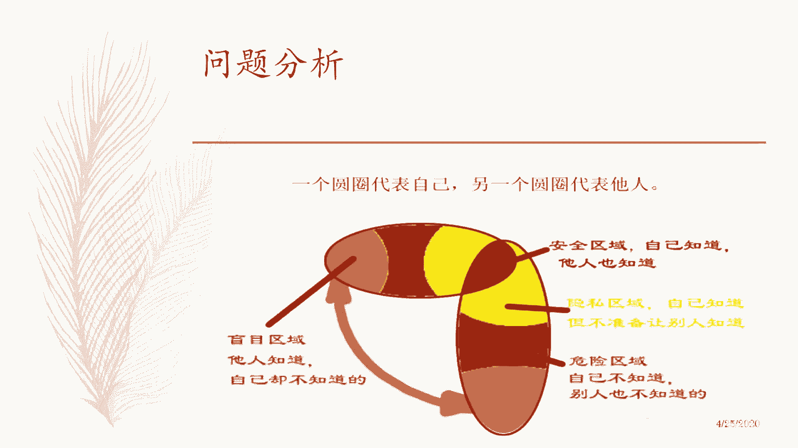

# 🚀一页纸掌握项目管理！60分钟教程，助你高效管理，事半功倍！ - P1：导言 - 清晖大讲堂 - BV12E2JYsEpT

好那我今天这个分享分享的这个内容呢，大概分为这个叫什么这个这个三个部分吧，第一个部分呢就是我讲啥是这个OPPM对吧，就是先铺垫一下，快速的铺垫一下，然后呢我们再展开，就是只要12个步骤简单嘛，因为对吧。

它的好处就是简易于使用对吧，12个步骤呢就是来去讲什么，这个完成你的一个OPPN的这样一个，什么报告移植项目管理的报告啊，这样的结构，第三个呢就是今天咱们会有一个练习啊，这个叫什么，我看今天人还不少吧。

嗯就是因为我们一般是叫什么，这个线下就会有小组的方式，那线上呢可能达不到这个条件，那我们就发到群里面去对吧，把模板发到群里面去，大家呢每个人自己去练习一下啊，然后给大家一个20分钟，或者是25分钟时间。

你把生活中的一个小事情对吧，不要搞太复杂对吧，你搞一个自己的自己，现在管理一个项目，写上去没有人看得懂，那就没有讨论的基础了对吧，拿一个生活中的小事，比如说组织一次听building啊。

组织家庭出游一次啊对吧，搞一次这个叫什么生日会呀对吧，然后呢，这个反正生活中的小事他都都能明白的啊，结一次婚呐对吧，装一次这个叫什么，这个去出去买一次装修材料啊，什么这种东西。

这是这是这这种的生活中小事啊，简单的事情大家能听懂的事情，把它作为一个项目，然后呢用opp pn的方式呢，把这个项目呢给填完，用12个步骤练习一下，在这个练习的过程当中去感受一下啊，去去去去梳理一下。

再重新梳理一下自己的思维啊，这是我们这个今天来分享一个目的啊，通过这样的方式来去帮你去产生，这个这个我们几个知识分享的收益啊，好那么这个开篇之前呢，我们谈到这个叫什么，这个有个人呢叫爱因斯坦。

大家都认识的对吧，他说呢每件事情呢都应该简单到不能简单，不就说他认为每一件事情都应该简单到，不能再简单为止，这是他自己的一个宗旨，所以他也是这么说的对吧，而且他也是这么做的，所以你看上面的质能方程。

能量等于质量乘以什么，这个应该是叫什么这个光速的平方吧对吧，然后呢这个公式呢这个大家觉得看起来很简单，而且呢这个非常易传播，拿起来特别这个讲法这个很酷啊，大家觉得这个非常的爱因斯坦就很有影响力了。

他写的公式的话就这么简洁，大家觉得写到我把这个东西做成一个logo，放到我的衣服上，或者叫什么，大家谈论这个话题，每个人都觉得很酷啊，就是大家愿意去说这个事情，那么爱因斯坦的目的就达到。

传播物理学的知识对吧，让物理学，高能物理的知识，能够更加的什么这个这个普及化，那么让更多的人有兴趣来，就是什么去了解它对吧，来了解物理高能物理这个行业这个领域，但是呢大家明白这个高这个E等于MC平方的。

这个公式背后呢，如果说把它展开的话，那你会发现你会把这个公式的右边呢，展开成三个巨大的方程对吧，所以如果是如果是这么说的话，没有人会觉得这个东西很酷，会觉得是望而生畏对吧，那因此呢这个叫什么。

我们发现在生活之中呢，最好的一个这个沟通的一个前提条件，就是不用解释的对吧，一说大家就明白，而且叫他易于接受的对吧，那这个思想呢也会延伸到其他领域，比如说特别是设计领域对吧。

产品设计领域和什么其他设计领域，this is more嘛对吧，大家都谈这个话吗，越简单越好，越简约越好对吧，但是我们一定要明白啊，简约不是不是不是简陋啊，这个这个这个我相信大家能够有这个。

有这个sense啊，OK好就到这个地方，所以呢OP学员呢，他也基本上也是秉承了这种思想对吧，简约，但是呢不简陋，那这个叫什么，在简单表达的背后，其实有大量的这个这么细致性的工作做支撑啊。

好那咱们的项目管理到底出了啥问题呢，这个叫什么，这个几个点吧，第一个呢我们打个比方，project就好像是一个精密的一个钟表对吧，项目就好像是一个精密的钟表，你把那项目和项目管理分开啊。

第二个呢就是项目经理呢，他是从事项目管理的人，如果说项目没有项目经理的话，项目能不能成功呢，有可能有可能啊，当然有可能啊，我不需要下面有唯一可能成功啊，大家按部就班呢，然后完了叫什么按规程办事啊对吧。

公司只要有只要有这个流程，按就按不就行了吗，对吧，为什么一定需要相位，不一定啊，那就是我向低的价值是什么东西呢，就是因为相机里的存在啊，它能够让这个叫什么，这个咱们这个项目的过程更加高效啊。

同时呢它能够叫什么，这个避免这个这个提高成功率就避免失败，就是我们叫manager by issue对吧，它能够去预防问题发生，第三个呢，项目经理呢他能够去处理这种变化对吧。

因为项目受外部环境的各种因素挤压压迫制约，条件一变的情况下，你项目就必须要受破受迫性的变更，那这个时候呢你得有一个统筹起来去化解变更，去重新让项目能够继续走下去的这种价值吧，这样一个人存在。

所以呢这就是项目经理存在的意义和价值对吧，就是他是一个manager对吧，那么项目经理呢就好比是一个钟表，一个钟表加，他要把这个钟表操控好的话呢，他必须是个工匠，他必须对项目每个细节要了如指掌对吧。

如果你对项目写的不清楚的话，你有可能会miss掉这种问题，那你就失败了，第四个呢，因为这个背景呢我们会发现，项目经理更多是从做技术出身对吧，因为他可以他有能力去了解到细节，或者呢是做业务出身对吧。

他对业务的需求或者业务场景流程都很熟，那就是这这样两种人呢转转行做项目理由，一般来说是公司最先考虑的，为什么呢，这样会节省成本，这个时候呢就发现我们项目经理来源里面呢，就有很重要的一个转型。

就是从技术到管理，从思维的转变对吧，从这个叫法，以这个讲法，这个推导的方式思考问题，或变成以目标的方式，以结果的方式来倒推问题，思考问题，那么这个时候呢，我们会发现下面你容易犯一个错误。

他们会觉得就是说他们去沟通的时候呢，习惯性的想去说服别人对吧，习惯性想要去达到自己的目的，我们先不谈这个叫什么习惯问题啊，但是呢这种结果呢，就会让下面你更多的倾向于去展示自己，有优势的部分。

就是展示这种细节来去说服别人，并且呢还希望通过展示这种戏的过程，让他的身边的人，或者甚至他的领导，或者他的身边合作伙伴，让别人意识到说这个项目很难，这个项目你很牛对吧，这个项目团队很辛苦对吧。

初衷都是好的，但是呢这种一厢情愿的，往往会带来一些负面的结果，那什么东西呢，就是说这些东西到底是不是我们的肝，先人想听的，或者我们刚前想要知道的，那么我们往往会看到这个价码在汇报的时候。

项目经理呢以前的话呢可能是用word对吧，那word字太多了，没法看，没时间看，现在太好了，用什么PPT的方式对吧，或者你一个白板上，你自己去画，哎你把这个事情给给老板说清楚对吧，那这个时候呢。

夏名义就开始哎呀呱啦呱啦的滔滔不绝，他也报了经七念，今天这个事这个项明已经堵住了对吧，我必须把这个事跟老板说清楚，今天这个事非过不可，不然的话老子不干了对吧，这个必须要把这个事情给给给讲讲明白对吧。

要不然的话我们的项目怎么弄啊，董老板呢听了好多好多内容，感觉到这个叫什么细节特别多，耐着心的听，听了半天之后呢，最后就想说他到底想要表达什么啊，这是我们他说两个世界对吧。

两个世界好，那为什么会造成这种情况呢，那么我们借助这个工具来看一下，假设说一个椭圆，我们代表我们自己，另外一个椭圆呢，我们代表别人啊，那么这个叫什么，我们发现有四个区域啊。

四个区域每个人呢都是一个信息的载体对吧，那么我们发现呢人和人作为信息的载体，它有一些交集的部分，这个呢属于我们管它叫安全区域，你就是你知道别人也知道的对吧，比如说张三李四王五，大家都认识。

你认识我也认识公司的名字，你认识我也认识对吧，这大家都清楚的事情，有些地方呢属于是所谓叫什么东西啊，这个隐私区域我自个儿清楚，但是不准备让别人知道的对吧，比如说这个叫什么，项目上的一些具体很细的东西。

这东西呢不是说回归，但是呢你要说出来的话呢，多少有点敏感对吧，这个东西没必要去捅出来对吧，这个都属于是约定俗成的事情，那越就越统出来，越描越黑啊，干脆就我自己知道，不要让别人知道就行了对吧，这个叫什么。

比如说这个叫什么，这个一个一个一个谈谈权，家里有点事唉行你赶紧回去吧，赶紧处理一下，明天再来对吧，你玩的正常情况，你还找各种的请假单，什么乱七八糟，你还要解释这个叫什么net，费劲对吧。

这种东西呢就临时性紧急性的事情呢，可能有一些非常规的方法去处理一下，这种数据呢属于是怎么说呢，敏感一点，灰色一点或者叫什么东西啊，这个打我的意思，打个比方就是这种可能是个灵活操作一点吧。

就这个意思啊啊就好比是那个开车打电话对吧，这事可大可小对吧，自己知道就行了，然后呢红色的区域呢就指的是危险区域，你自个儿不知道，别人也不知道的，那这就很麻烦了，那这种东西呢就是没有任何人知道呢。

就不会问我们的整个项目的，造成一个比较大的一个风险或者一个隐患对吧，那就很有可能会导致我们之后去蒙受，因为处理这个问题而而要去付出这种损失，这种代价对吧，再往下面这个呢叫做盲目去。

就他人知道自己却不知道的，就别人知道，但是我自己却不知道的这个这个区域啊，就别人知道，我自己也不知道，就是就是你可能身边你敢写，你都清楚事情，但唯独你不知道的对吧，那这个也会造成很多的一些问题。

就是你会重复一些别人你知道的事情，提不起别人的兴趣对吧，那么每个人都是个椭圆，都是信息的载体，那么信息呢我们大概分这四种类型对吧，那为了更方便大家理解呢。

我们就提出就是沿用引引申一个理论，这个叫约约哈里的这个窗口理论对吧，那么呢我们把这个叫什么信息呢，就个人对信息的掌握情况呢，分为两个叫什么这个维度去看，第一个呢是自己知道的，第二个呢是叫什么东西啊。

这个就是就第一个是维度是自己，第二个是别人对吧，这里面又分为两种情况啊，就两种case，第一种呢是自己知道的，not to self对吧，第二种是自己不知道的，not known to self对吧。

然后呢下面这个维度呢就是也分两种情况，一个呢是别人知道的，known to others对吧，另外一种呢是别人不知道的，那么呢我们一共分为这两个维度，然后呢这个叫什么，这个两个维度里面又分两种情况。

现在的情况一交集呢，我们就发现信息呢，正好可以用这个田字格的方式呢，方格的方式呢把上面的信息解释清楚啊，四种case解释清楚，那么我们管你知我知这种交警的区域呢，我们管叫公开区域啊。

公开区域我们管那种叫什么，自己叫什么，不知道别人，别人知道自己不知道是谁的，我们管叫盲目区域，Blind，我们管自己知道，但是别人不知道，或者不准备让别人知道的区域呢，叫做HIEN，就是隐藏区域。

我们把这种自己也不知道，别人也不知道这种信息呢叫做unknown，就是非位置，非知区域，就大家都不知道这种区域，对吧好，那有同学就会说了，老师嗯逻辑听你明白了，我为什么要画这个方格呢。

同学们在座的咱们今天分享的所有同学们好，普通老师我讲啊，来问一个简单的问题，大家觉得我们为什么要画这种方格，或者或者换句话说，或者换句话说啊，就说你看了这个方格之后，你觉得你作为项目经理的话。

你应该做什么，这是一个事实，对不对，这是一个叫什么，这是一个客观情况，就是我们的信息都分为这四种，四种状态，四种类型或者四种case，对吧好，那你作为项目经理的话，你应该做什么，大家思考一下。

就是对对信息的处理的话，这种四种类型信息处理的话，你作为相邻理的话，你应该做什么，来大家大家大家在在在微信里，或者在那个叫什么这个直播群里面的，这个叫什么东西啊，这个讨论区里面回一回看看，回乡看。

都没挂机吧，这个这个都在都都在都在线听吗，呵呵没有挂机吧，来大家想想看，你作为箱子后，你应该做什么，有同学回答吗，哎有个同学回答了啊，对对对，大家动脑筋啊，不能光是我一个人讲啊，那就那有啥意义啊对吧。

咱就是用最少的时间获得这个提升嘛，对吧就是对啊，同学们都回答对了啊，对就是道理上大家都明白对吧，就像我们现在道理上达成一致，如果道理上达成不了一致，那那就完了，那这个那这个那就变成了这个填鸭了对吧。

你学了这么多技术知识之后，就感觉到每一波都都都都不知道咋用。

这个这个这个达不到效果，那不行啊，所以呢我们最重要的工作呢，就是要去扩大这个所谓叫什么开放区域对吧，就是尽可能让所有人都知道我们的项目情况，就是要扩大这个自己知道别人，就是把这个区域尽可能的扩大。

对缩小unknown，没错没错啊，就这个意思哎，大家都比较sense是对的啊，那么一个是呢消除自己的盲点，第二个呢是减少自己的什么这个隐藏啊，这个这两题是通过这样的方式呢，能够去有效的减少未知的部分啊。

位置的部分啊，就这个意思啊，就是把open区域尽可能放大，把这两根线呢往往往这两边去推，越是有效的推呢，就越能够让我们的未知变少，越减少，这种未知的话呢，就越有助于你项目的成功，对吧嗯是的啊。

这大家都说的很对啊，好那因此呢在我们这操作这个过程当中呢，我们需要去了解说，我们在跟别人这个谈论项目或者，沟通项目的时候呢，我们需要去知道这个干写呢，他的一些基本信息对吧，就他喜欢听啥。

他偏好什么东西对吧，这种这种所谓叫比较直观的这种需求，通过这样的方式来减少自己的这个叫什么，这个这个这个沟通一些障碍啊，就是或者提高沟通的效率吧，第二个呢就是所谓叫什么。

这个知道他一些属于叫什么这个态度方面啊，就或者就是一些对人的一些这个看法呀，这些东西，这个东西呢跟他的一些这个基本属性是不同的，因为呢我们没有办法去改变我们自己的，叫什么东西。

一些这个这些基本属性的东西，因为这是客观生而带来的客观事实，但是呢我们可以通过我们的这个成长，可以通过我们的这个修炼打磨，来提高我们自己所谓叫什么这个人生阅历，或者讲什么这个这个境界对吧。

那这个时候呢人就会有看法，这种看法呢，一定是跟他的这个角色相关在一起的对吧，不同角色呢他他的自主加什么看法，他会基于他的角色或者他的这个讲法利益，或者他自己这个叫职责压力也好。

这些东西他的看法呢会发生一些偏移，而这个看法呢又跟他的这个角色紧密相关，跟他跟本人的这个自然的这个特点，又又不一定完全相关对吧，所以呢这是比较深层次的东西，那这块东西的话呢。

就属于是你自己不知道的比较多对吧，就需要你去消除这种盲点对吧，就是叫什么这个张三李四王五张总，李总赵总手机号码，这些东西都是你就是人所皆知的事情，那你要去效忠自己的这个不清楚的地方呢，一定要这个叫什么。

这个重点落在第二层之上，去分析别人的这个叫他这个立场嗯，就了解别人的态度是什么，或者了解别人的这个需要是什么，对吧，我们这个这个思路先讲清楚啊，然后一边往后往后讲啊，这个时候呢你当然你要注意一下。

还有就是更深层层次的东西，这个东西呢就属于是第三层次的，自我意识和个人人际情况，那这块东西呢我们一般来说的话呢，就是说是你的干系人，往往可能就是说叫什么，这个作为他是当事人的话。

他可能不一定希望让别人知道对吧，所以咱们再去扩展这个开放区域的时候呢，要注意适当的要去叫什么东西啊，这个这个叫什么，不要去探触及到那些比较敏感的地方啊，就是我们说白了就很简单。

一个基本基本的ground rule，就是一切以工作为准对吧，减少这种自动叫什么，这个过多的这个人际层面的这种这种探究，那么冷暖会觉得就是上去，会觉得这个下属不操心工作，天天打听这个小道消息。

这个这个非常不好啊，这个这个很不合适工作的地方，就是工作第四个层次啊，第四个层次就是呢相对跟隐私啊，就是就是你也不要隐私了，就是完全不为人知的秘密了，那就这就更不要去探知了对吧。

所以呢我们重点工作的重点呢在第二层次啊。

减少自己在这个方面的未知对吧，来去了解别人想听什么好，这是基本思路啊，OK那么呢我们说就是老司机啊，顶尖的项目经理呢，他比较善于去管理这个沟通，或者换句话的话，他更善于去管理沟通背后所蕴含的。

一些人际的一些方式对吧，比如说他一些方法，第一个呢他尽早的和干弦建立一种沟通对吧，尽早的去让肝弦知道，想让干型知道信息和得到干性的反馈对吧，通过这样的方式尽可能扩大这个open区域，公开区域对吧。

同时的话呢，他发现他呢呃有有经验的项目经理呢，他发现哎，建立这种这个叫什么这个某种特定的频次的，稳定的这样一种沟通节奏呢，对他工作很有帮助，非常非常有帮助对吧，这种这个这个特定的某种沟通频次或者节奏。

对他很有帮助啊，很有帮助，那么为什么这么说呢，就是说举几个例子啊，我们在这个讲义上看到一个什么电梯的，那个叫什么这个按钮对吧，这是大家比较生活中比较常见的例子，你按了这个按钮之后呢。

就是要到达楼层就显示出来，对不对，然后呢在这个面板的上面啊，在这个面板的上面呢，应该还有一块小的一块液晶屏对吧，显示当前这个电梯经过的楼层是什么，对不对，这意思吧，比如说你现在按住五楼。

你从二十二十四楼，你要到五楼去，然后进电梯时，你按了个五，这时的电梯关门开始运行，然后呢232十221对吧，然后或者是三个三个一跳，或者五个五个一跳对吧，这样运作好，这是我们电梯的设计啊。

好那这个时候我们做一个假设情景分析啊，咱们注意啊，我们做一个假设情景分析，假设在这样的场景里面呢，我们取消掉一个要素，就是把那个叫什么这个电梯的，叫什么，这个运行的过程当中。

他那个面板把它变化的数字啊给删掉，没有这个面板了，你只有这些按键，你按了这个按键之后呢，电梯就呜呜关门对吧，然后哈哈开始运动运走对吧，这样开始去往下去走好，各位同学们啊，请你做一个假设情景分析。

你设身处地的想一下，如果你是这个电梯当中人的话，你会有一种什么感觉，啊同学们，你会有一种什么感觉，来各位同学们，如果是在这样一个电梯里面的话，你会你会有一种什么感觉啊，能给我一些反馈好吗。

假设那电梯没有液晶屏了，你看不到楼层的变化，你只能按照那个电梯那个叫什么，要到了楼层，这个灯亮了，然后电梯关门了，这时候电梯开始往下走，会有什么感觉啊，同学们，首先第一点你肯定会觉得有压力对吧。

哼不知道进度对吧，就是咱们先先咱们先就说，说白了很简单，就是最直观的就是说你前面十秒钟嘛，觉得还OK没问题，但是呢十秒钟以后呢，这个时候你开始出现了不确定性，对你现在第一个不知道楼层在哪里。

那么我觉得不知道楼层在哪里的话呢，很重要的点就是，其实你并不知道当前安全不安全对吧，你并不清楚当前当前是叫什么，这个这个安全不安全，对不对，就是说你会有紧张感或空话，如果这电梯还是一直在运动。

其实你这个时候不确定，这个当前这个电梯到底是正常运行状态，还是不正常，对啊就这个意思啊，就这个意思OK好，所以呢我们这个时候呢，会在电梯里面增加一个叫什么这个，液晶的显示屏。

这个液晶显示屏显示楼层变化的这个这个状态，他的目的他的目的啊，就是要去管理干性的期望，大家明白了吗，这个液晶显示屏它数字的变化，它的最大的一个目的就是在管理干涉你的期望，就这个意思哎。

来分散大家的什么这个这个焦虑感对吧，这个时候呢你会看到那个楼梯，电梯的楼层的变化，代表是说现在楼梯运行是正常的，你是安全的，他在管理你的期望，就这个意思，那无独有偶啊，无独有偶啊，这个叫什么。

还有一个例子啊，这是经常说的，大家印象中的话，那个叫什么肯德基麦当劳，当你以前去肯德基麦当劳买这个快餐的时候，人很多的情况下，这个排队是怎么排队的呀，就排队是怎么排的，大家有印象吗，嗯就肯德基麦当劳。

他那个排队是怎么排的，有印象吗，顺着排对吧，就传统排队的方式，对不对好，那如果说你去我没有做过假设信息分析，如果说你这时候站在队伍的最末端，你在那排队对吧，15秒钟之后，这时你会干一个什么事情对吧。

这个时候可能你在玩手机，但是你玩了15秒钟之后呢，这个时候你会干什么，去头抬起来往前看一看对吧，30秒钟之后你会干什么事情呢，你要看一下这个队伍前面有没有变化对吧，一分钟之后你会干什么事情呢。

你会觉得这个队伍为什么好像一直没有变呢，对吧没有变啊，其实我只是过去了一分钟，但是呢这一分钟对你而言的话，你感觉像过了10分钟一样的，是这意思吧，所以呢另外一个企业呢就是他的连锁店呢，他怎么操作的呢。

星巴克对吧，星巴克星巴克排队怎么排的，你会你会留意一下，你会发现有个特点，星巴克的排队他是用一个叫什么，这个叫什么一个栏杆的方式做一条线对吧，或者跟你说要要怎么这么排，它是沿着柜台拍的。

星巴克他是沿着柜台拍的，哎为什么他要沿着柜台拍的，大家想想看，就他排的队伍，他不是那种跟柜台垂直的队伍，他是跟柜台平行的，贴着柜台排的那种队伍啊，你这边收银完了之后呢，下面就是就是什么。

就等你的单就行了对吧，就这样一个个排，大家想想看，为什么星巴克用这样的方式去排队，对就对，你说的对吗，横排不是送排吗，是的，为什么来同学们脑筋动起来，为什么想想看，你说没关系，咱们讨论吗。

让你排队的时候看吃的嗯，这是一个point啊，就是看柜台里面吃的，看有没有会进一步的刺激你的消费，对吧，嗯这是一个点啊，就在你收音之前有个叫什么让你排队，按照那个加什么东西啊。

按照排到那个叫什么这个高点，高点那个透明的柜台里面去对吧，嗯哎对啊，直观的看到进度，哈哈哈嗯有同学说很快感觉很快就到我了是吧，最重要的一点就是说这个时候呢，首先第一点呢。

如果说一个人呢不知道柜台的状况的时候，就好比是他他在一个没有这个液晶屏的，这个电梯里面了，他会产生焦虑感，那么星巴克排队的方式呢，就是让你沿着柜台排，这时候呢你你的注意力呢可能会被这个叫什么。

柜台后面忙碌的这几个店员来来回回去操作，很麻利的手脚，会被他们这个叫什么这个这个动作所分散，当你看到他们的动作的时候呢，你会意识到一个问题，当前这个叫什么，这个这个运作呢是正常的，虽然它慢。

但是呢他在有高效运作，他是个正常情况下，没有任何一个电源在带慢我，或者没有任何一团就再没有在不顾及我的感受，就这个意思对吧，那么通过这样的方式呢，一定程度上的管理了干性的期望，所以呢顶尖的项目经理呢。

他意识到平稳的有平次的沟通呢，非常的有助于管理干线的期望，能够消除干邪的叫什么紧张感，和这个这样的压力对吧，如果说你不定期的跟干系人沟通，甚至你不做计划去沟通的话呢，干系人他的期望可能不受你控制了对吧。

他可能会产生新的期望，新的情况呢又会产生新的需求，新的需求呢你会倒过来，可能会向这里施加压力，这个时候呢大家的关系下会恶化，所以呢建立这种合理的平沟通的瓶子结构，是非常非常重要的，第三个就是所谓叫什么。

这个在沟通的过程当中，我们传递信息的时候呢，完整清晰简洁，就不要有什么废话对吧，你想说啥，就是每次就说一件事，每件事情就说一个点，把你的目的明确下来，很简单，说清楚就行了对吧。

因为别人在理解你的这个信息的时候呢，他会不自觉的去还原你的这个背景，和他和他所理解的和他所理解的背景对吧，就是说呢要把你的信息放在一个，如果说放在一个手，将我们都是公开的区域里面去的话对吧。

他需要去加工，需要去理解这个信息的含义是什么，如果说公开区域很小的话呢，你提速器的话，它就需要去揣测了，他就需要去拼接，如果在一个公开区域，很大的一个环境当中的话呢，这个拼接的工作做的很少。

那么呢它只需要简单的去理解就行了，所以呢我们传递单个信息的时候呢，一定要尽可能的完整清晰简洁，这样的话呢可以提高我们的沟通的这个想法，效率啊，就这个意思啊，然后呢这个第四个呢。

就是我们常说的这个有些人的项目经理呢，他会持续的关注这个沟通的效果，而非只关注沟通这个事情本身，只关注什么时候沟通，用什么样的模板报告对吧，谁来写对吧，由谁来说，你是关心这个事情的话。

说明你其实并不想沟通，你并没想汇报对吧，你你眼睛实就仅仅仅仅想，就说我赶紧把这个项目的工作往后推对吧，那这样会你会碰到另外的结果，可能你付出了这个什么苦劳，但是呢有可能你将来不一定会有功劳对吧。

因为你没有跟观星互动嘛，好这是我们所谓叫什么，这个这个叫什么这个顶尖的项目里，就是他会关注持续感的沟通啊，好稍微快点，就这个意思啊。

好那么这几点说通沟通完了之后呢。