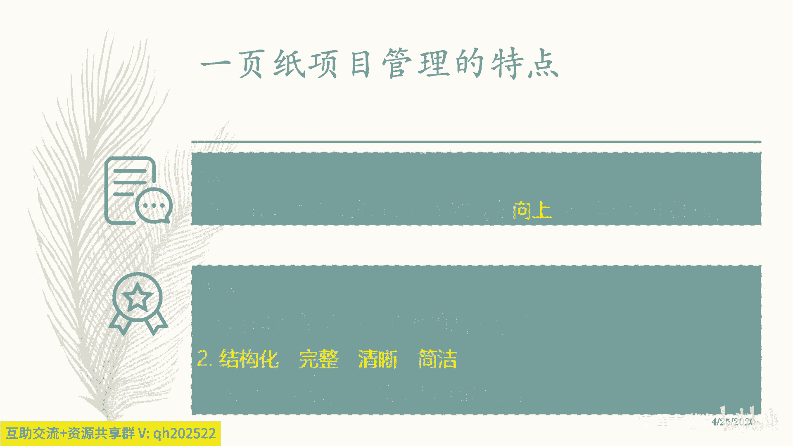
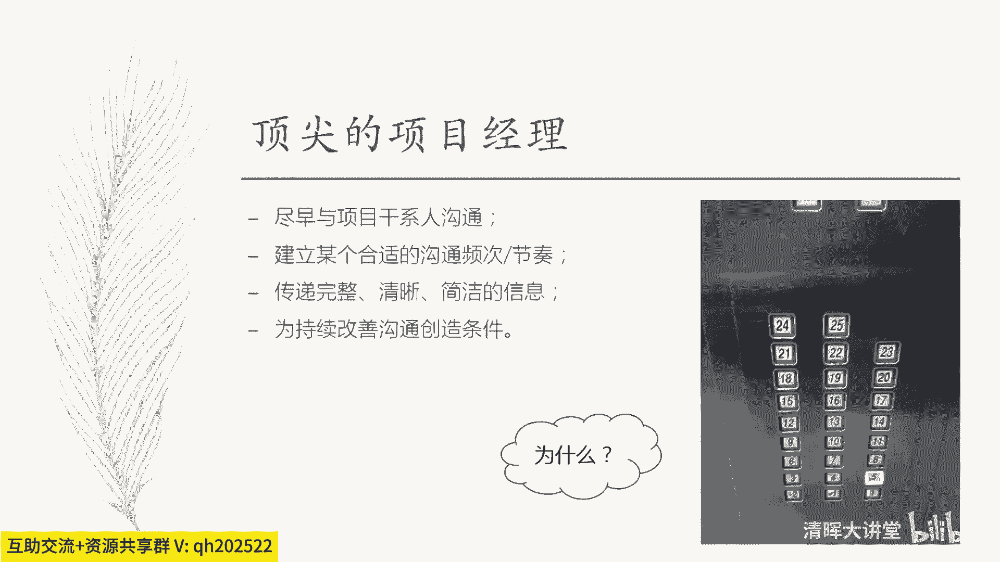
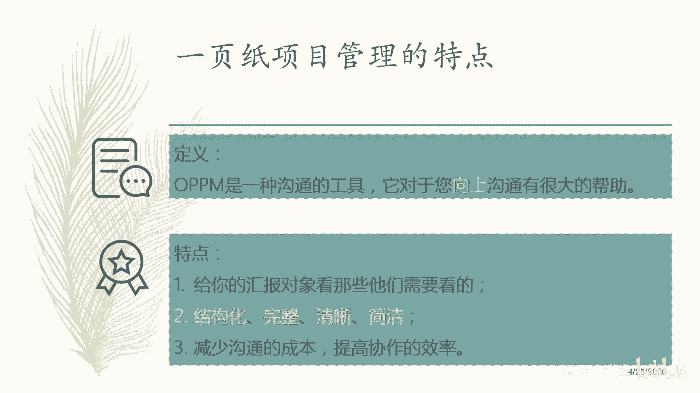
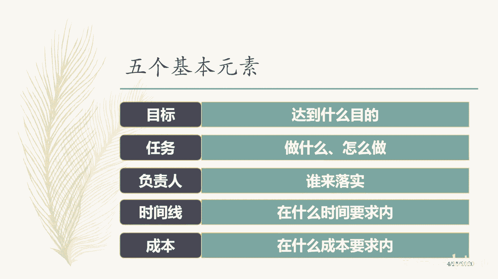
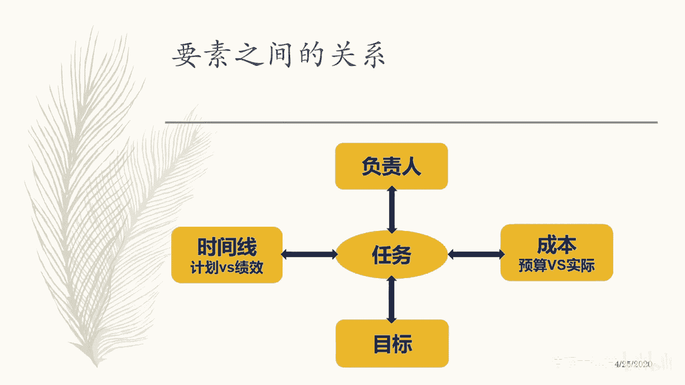

# 🚀一页纸掌握项目管理！60分钟教程，助你高效管理，事半功倍！ - P2：1.一页纸项目管理的特点 - 清晖大讲堂 - BV12E2JYsEpT

一叶子项目管理的特点，OPPM呢它是一个叫什么东西啊，一种沟通的工具，他对您呢向上沟通特别是有极大的帮助啊，向上沟通有极大的帮助，那么呢通过移植项管理这个工具的运用呢，啊他是一个叫什么。

可以作为一个简单的小型的项目的管理的，一个计划的一个模板，他也呢可以作为叫什么，提高沟通效率的这样一个工具对吧，那么特点是说给你汇报对象，看那些他们所需要看的对吧，这个时候我们就不能讲空话了。

那你必须要清清楚的知道他需要什么，那你又是如何知道他需要什么的。

这个时候呢，就需要你去理解别人的这么这个诉求所在。

然后你如何去操纵这些信息对吧，操纵这些沟通的这个这个这个方式内容，给别人看什么，不给别人看什么对吧，然后完了之后呢，让别人聚焦放在什么地方，通过这样的方式来引导别人，以达到你的什么目的。

如果你的沟通是以目的为导向的，而不是以叫什么这个形式为导向的，那你的沟通将会提升很多对吧，你会发现你不说废话，那你宁可这次不沟通，你就说我其实是没什么太多的要沟通的，我就很就一切正常对吧，这个叫什么。

我们按部就班就行了就可以了，第二个呢，这个里面呢就需要一些技巧先去训练的，你需要有这个叫什么，这个，啊叫什么东西啊，也需要你去叫什么东西啊，这个哎需要你那个叫啥，这个这个这个这个继续掌握这种结构化的。

完整的清晰简洁的这个思考问题的方式嗯，就是结构化的完整清晰剪的方式，这个呢是属于是我们要去实现的一叫什么，这个清晰简洁的沟通的一些什么这个要求啊，你要去做到的第三个呢就是可以减少沟通成本。

提高这种学生效率，这是我们一子项目理的特点，所以呢同学们啊这个中小型的项目呢，或者简单的这种临时性的事物呢，可以用你业绩项目管理这个工具呢，把它给管起来，同时呢它也是一种有效的。

大家之间简单沟通协同的一种工具，第三个呢它可以向上进行汇报啊，向他进行汇报好。

那么具体啊，这个里面包含什么内容或者哪些基本元素啊，这个叫什么这个哪些基本元素啊，第一个呢，就是说我们肯定要把这个目标说清楚好，那问题就来了，刚才我呱啦呱啦说了那么久，我们为什么要把一个事情的目标说。

就是把在沟通或者在项目管理或者汇报的时候，为什么要一定要包含目标这个这个要素呢，为什么包含目标这个要素呢对吧，因为我们我们是最终要达到一个什么目的嘛，对吧，要实现一个目的嘛，这个目标呢是跟每个人相关的。

只有这个目标呢跟每个人相关，你才有请别人去听你的沟通的一个前提条件，就这个意思对吧，所以呢在工作中呢，是一定带上我们这个项目的目的目标的，第二个呢就是说这个目标我们说出来了，定义出来了，跟每个人相关。

大家都同意达成共识，觉得有意义有价值对吧，OK这是一个很重要的事情，我们所有人达成了一致，对吧好，那这是目标的含义，那这个目标到底能不能实现呢，对吧，我们不能光说的好听啊，不能光聊的好听啊。

那怎么去理解这个目标会不会实现呢，这个目标靠不靠谱，可不可行呢，能不能落地呢，那这个时候呢我们要去诠释这个目标，听清楚啊，这时候我们需要去诠释这个目标了，什么叫诠释这个目标呢，就是说我做哪几个事情，哎。

今天这个目标呢，就差不多八九不离十达成了对吧，哎就差不多八九不离十达成了对吧，因此呢这个时候你要展开目标，把它变成什么东西呢，任务对吧，这样的话呢就让别人看到你要做什么。

也让能够别人能够去评估你做这几个事情，从方法论啊，经验啊或者实践啊，或者其他这个角度都可以看出来，你这种做法到底能不能够，帮助你去实现这个目标对吧，这个我们管它叫什么任务。

但是呢这个任务呢我们要有别于什么，这个这个这个叫什么，我们这个时候谈的任务呢，一般指的是一些关键的，叫做critical的一些task对吧，它跟我们的目标间呢是一种叫什么，关键分解关系啊。

它不是一个饱和分解关系，它是一个关键分界关系啊，因为只有关键分解关系，才能够让高层级的管理者看到那些，他们所关注的并且所在意的，而且很简洁清晰的几个事情，不会陷入到细节陷阱之中。

所以呢你要提高沟通的效率，你就适当的要去实行一些细节，就是这个地方，所以呢目标和任务，我们在这个里面的要求的方式，并不是饱和式的分解，啥叫饱和式的分解呢，就是WBS对吧，每一个层次展开之后。

每个层次的和应该相等，这个叫饱和式分解，展开到最新层次的时候呢，就可以交付了，就可以交付团队去开展工作了对吧，那么我们这个里面呢有点不一样，它叫关键是关键分解，就是我们只把关键要素拎出来来。

表明或者支撑这个目标实现的关系是什么好，那么每个任务呢我们都说了，得需要有人去执行它对吧，那这个时候呢我们需要给任务呢安排，至少有一个负责人accountable对吧。

大家注意这个accountable并不是具体的执行人员，这里面的研究很多了啊，那么找负责人的话，那肯定是叫什么，这个他为结构负责，为实现负责，为目标负责，或者为这个成果负责。

而不是为这个什么过程负责对吧，而不是具体操作，对不对，那么另外有一点呢，在我们做项目管理时候呢，我们整合资源往往是一个比较有挑战的事情，就把这个职责安排到具体的某一个，具体的干事人吧。

这个时候呢往往会隐藏很多的问题，他的兼职时间呀，他的劳动饱和状态呀，他的这个这个叫什么这个眼界呀，意识啊，sense啊，这东西，你可能也许知道说他是一个跟这个技术相吻合，匹配的人。

但是呢这个时候你并不不能确定说，这个事情是有保障的，能实现对吧，所以这个时候呢，你不能把这个任务分配给执行人，而分配的时候叫什么负责任，那么因此呢谁去负责这个事情的落实，资源由他调配，由他去安排。

我只要找他有结果就行了，并且呢这个负责人呢，他应该是有相应的一些权力做支撑的，影响力做支撑的对吧，那这样的方式呢我们才能够把责权利对等起来，咱们这个项目才能有效的运作下去，就这个意思。

第四个呢我们得需要有时间线，那这个时间线呢就是帮助我们去叫什么，去表达我们这个项目的一个什么，这个整个一个整个一个进度安排，那么这个进度安排里面，最重要的需要就是要体现出来。

我们跟干性人沟通的这个稳定的频次是什么，那么第四第五个呢，就是我们的项目的什么东西啊，成本对吧，那么这是我们项目相关的，因为你项目这些这些目标任务都清楚了，而且进展也很正常，公司有没有这个资金来支撑你。

这也是我们的干线关系的一个点，财务驱动嘛对吧，所以这五个要素呢，是我们在做项目管理和项目沟通里面，我们都应该去紧紧抓住五个要素，即便你没有学过PMP，或者你基本上把PMBOK里面的，很多东西都忘光了。

你也应该通过你个人的实践或者你的经验，你应该觉得这五个东西，它是相互之间有某种特定的依赖关系。

而且他是重要的，我们说这个叫什么，这个项目是一个临时性的独特性的过程对吧，德国人的解释是说项目呢是一个叫什么，a seat of activities或者talks tasks对吧，指的是一个什么啊。

这个活动的集合，那比如说呢活动呢它既可以去实现目标，他也需要有人去叫什么负责，同时呢它会产生这个什么成本，对啊，也会有什么这个什么进度的什么，这个这个推进就是达成目标这个阶段性的推进。

所以呢任务呢是我们项目的本，就是项目的最小的一个单元cell，你要把这个关系搞清楚，任务是实在的时间线，成本目标，这个都是我们的一种解读方式，负责人呢是任务的属性之一啊，你得把这个基本概念给建立起来啊。

OK这是最简单的方式了，好，那么基于这些我们的基本的这个维度范围路，展开之后呢，这个时候呢我们把这个五个，五个那个叫什么这个要素，我们首先呢把它放在这个叫什么这个叶子，项目管理。

这个表格的最左下的这个位置叫矩阵对吧，那么呢它有一个东西，有一部分叫做任务，大家注意一下啊，Critical task，他说的是关键任务，主要任务并不是我们所谓叫什么详细事务。

巨细的就是那个叫什么这个这个任务清单对吧，那么这个任务呢他又要去呼应他的目标，看到没有要呼应他的目标对吧，然后这些任务呢又要去做进度的一些什么，这个这个这个叫什么这个这个对标，那么这个进度对标里面呢。

我们体现的方式呢就用甘特图的方式去体现，那么在这个单独图形的时候呢，我们又给他设置某种某种特定的一个，叫什么东西啊，这个这个周期就小的一个life cycle对吧，小的一个周期。

那么这个周期呢既可以是周，也可以是月，也可以是年，也可以是什么，就按照你项目的这个实际情况，或者规模来看对吧，你把它设置成一个均匀的合适的尺度，诶那这问题就来了，我为什么要用这样的方式去设置我的价格。

这尺度是为了去度量我们这个时间长短吗，不是的，因为你这个东西呢很重要，你就是需要去通过这个什么这个东西，做一个沟通的工具来去跟你的外部的干线沟通，特别是向上沟通，因此呢你要设计一个合理的均匀的频次。

你觉得在你的项目里面，用什么样的频次跟干性互动，最有效的能够满足干性的期望，并且呢引导干系人参与和支持你项目中来对吧，你看星巴克是他是如何去让他的顾客，参与到他的店面的运营当中来的，嗯很巧妙啊。

每个环节的设置其实都是有用意的，座位的摆放对吧，店里的这个这个这么这个色彩氛围相位对吧，甚至是音乐，还有这个叫什么这个排队的方式，每一处的细节都是让客户在叫什么东西啊，不受任何约束的情况下。

能够有序的自主地参与到店面上的运营中来，大家明白了没有，有同学我现在还没明白，在你店面做设计的时候呢，各种环节的这个设计，都是能够让客户自觉的受到暗示的方式，这个叫什么，这个叫什么。

这个合理的参与到电影院的运营中来对吧，付钱的，付钱等单的等单对吧，然后完了之后就点点单品的点单品结论对吧，那么那么我可以向法举个例子，比如说在这个嘈杂的中餐馆店面里面，没有没有这种这个叫什么引导客户。

没有这个叫什么这些这些设置只有几张什么，这作者而且很密，就听到客户一个桌子说，老板怎么还没上啊，另外就是绝对统计老板我们怎么也没上啊对吧，然后完了这桌说哎呀这个店太慢了对吧，其他作业可能有受到影响。

这个时候呢我们就发现顾客没有被管理起来，那么这个时候呢，对你的运营是有很大的冲击影响的，就这个意思，所以呢我们要去design这个东西，所以呢这个沟通的频次很重要对吧，按照你的项目的这个叫什么。

这个整个生命周期，你把它切分成均匀的这个段，然后建立一种稳固的沟通方式，有助于你管理干性的期望，就这个意思啊，OK好，那么把这几个五个部分展开之后，这几个部分展开之后呢。

再接下来回到我们之前刚才谈的一个点对吧，目标啊，任务啊，这个叫什么东西啊，这个这个这个这个进度啊，还有我们的所谓叫什么成本呐，以及这个左右边的那个负责人呐对吧，那么下面呢有一个叫概述预测对吧。

你为什么会有这个部分呢，还是那句话，项目的计划对项目经理而言的话，它是一种假设，项目的计划做好了之后呢，代表着项目真正意向执行的开始，它并不是项目的什么，这个某种结束的一个时间点。

或者是项目经理的叫什么担子的放松，它恰恰相反是项目里担子加重的开始，这个时候呢下面一定要拼命的去推动这个项目，就这个意思看明白了吧，这个叫什么这个概述和预测啊，那这个时候呢。

我们要对针对于我们项目做成的假设去预计说，在我们的预测里面有哪些不一样的地方，有哪些相反的地方，那么我们如何去表达呢，这个时候我们就会有风险和问题这个部分，那么风险呢它没发生，但是我们已经识别到它了。

这个时候呢我们要关注它的状态对吧，那么关注他状态的时候呢，这个时候呢我们应该怎么样去表达他状态的，这个我的我们自己的解读呢，就说我们如果这个E它的状态，对我们人的这个需要需要去驱动我们人的行为。

或需要去驱动我们人的这个这个这个行动，action的时候应该去怎么去表达呢，这个时候最简单的方式，就是用红绿灯的方式对吧，绿色代表一切正常，风险可控，黄色代表有预警对吧，存在这个讲法。

这个这个变异的可能性了，红色呢就叫什么这个状态不佳，可能问题已经发生了，就风险转化成了问题了，或者问题正在加重对吧，通过这红黄绿三色来表达这个什么，风险和问题的状态，哎那个风险和问题呢。

又为我们当前计划的执行有没有非立即性对吧，有没有会导致项目失败的原因，进行一个集中管控，那么这个东西呢又为我们下一步工作的开展，如去预测做好一个什么考量，比如如果下面一切顺利，没有风险问题的话呢。

按你的预测很简单，就继续推进项目，稳定的推进项目对吧，如果发现有这些问题的时候呢，你就应该去做下一步的一些什么，这个一些这个叫什么，一些预防性的措施或者补救性的措施。

那这个时候呢可能会你要去提交一些变更了，对吧，这是我们讲概述预测啊，好回过头来，为什么不用红黄绿三色来表示状态呢，为什么用红黄绿三色来表示这个状态呢，很简单，我们扩大了这个叫什么open区域，公开区域。

因为红黄绿是大家日常生活中经常会见到的，红绿灯的三个颜色对吧，绝大部分的人，99%的人他都认识红绿灯，他也能够大概能够感受到，这个红绿灯的含义是什么，所以在这个时候呢，你会发现我们设计这个表格里面。

它的简洁是基于大家的一些open的，大家的共识的，就这个意思，所以呢不要搞复杂了对吧，尽量用那些大家人所皆知的事情，来去达到你管理的目的，或者表述你的这些信息是最搞笑的对吧，不用有任何的解释。

你看到黄色的老板会注意，一看到红色老板会重点就问对吧，一看到绿色他就过了，就这个意思啊，好那上面的部分呢我们用一个圆圈代表，在这个阶段里面有任务要执行，空圈呢代表什么，planned就是规划好了。

要在这个时候做这个叫什黑黑色的实心的，这个圈呢代表什么，这个任务已经完成了，工作已经完成了对吧，用挺简单的方式，哎，那有的同学说老师，那我想表达这个叫吗，这个延迟可不可以呀，可以呀。

那就看你想要用什么样的方式，这个时候就灵活了，因为你想表达颜色的方式呢，属于是你个性化的这种需求定义对吧，你可以跟你的公司同事对这个这么沟通好，如果说发生了延迟，你认为这是个问题。

你应该在下面的ABCE那个地方增加一条，其实我们有一个延迟制作一个问题，这个问题呢现在是叫什么，这个黄色虽然它发生了，但是它可控对吧，如果再进一步延伸的话，你再变成红色，你可以用这样的方式去管理它对吧。

OK那要有人说老师，那我怎么去这个叫什么，这个在在那个圆圈里表达呢也可以呀，你可以把那个叫什么东西啊，这个叫什么，这个空心圈，实心圈对吧，有延迟任务发生，但是它叫什么东西啊，未完成的你用三角形表示对吧。

已完成的你用计算什么东西，实心的三角形表示是这意思吧，这是我们的什么表达方法，反正呢越简单越能够去表达你的含义越好，这个东西呢你可以适当的定义一些啊，适当的定义一些，OK好，那么我们整个的表格结构呢。

是围绕上次刚才上面我们讲的这个叫什么，这个基本的框架来的，以任务为为基础，以目标为导向，并且呢展示开我们的整个进度计划，在这个进度计划里面呢，我们要设置合理的均匀的有频次的词，叫沟通的是个时间对吧。

比如双周啊，单周啊去去做一次沟通好，那么大家注意从上往下说的话呢，这个叫什么从上往下啊，在这个地方从上往下说的话呢，在每一个沟通窗口里面呢，在每个沟通的这个窗口里面呢，你会发现如果有几个任务的话。

它这里面会有几个任务的状态点，那你呢可以就近期项目的状态，针对这几个任务呢进行重点的一个阐述一下，就行了，这样就会让你的干系人第一个信息聚焦，第二个受理的引导，第三个呢会觉得叫什么东西啊，这个叫什么。

这个沟通很效率很高，不用再回顾以前对吧，就通过这样的方式来去来去聚焦，你当前完成沟通，同时的话呢，你也可以容易地找到这个沟通的一些，相关的一些责任人对吧，好这个我们就是大概先说一下啊。

那么这个整个表格的这个结构里面呢，上面就是我们的这个表头部分对吧，这个呢是我们所谓叫什么这个任务为基础，这个呢是跟任务相反的一些风险和问题，那么呢，这个共同构成了我们整个项目的一个什么啊。

这个scope，那么这个目标呢是跟这个score相关的，这个目标呢应该作为一个分解啊，这个分解有哪些目标是干线，非常关心哪些目标对吧，有几个重要的干线，他关心哪些重要目标，在他们做这个叫什么。

这个目标合并之后，就是相似目标，合并之后呢，你应该把它把这目标展开来写下来，要确保这些目标能够顺利达成啊，注意这点啊，要达注意，达成目标是来自于我们什么这个干系人的啊，就是要说清楚一点好。

然后呢这些目标呢又跟任务相关，哪几个任务呢又是完成这个目标的对吧，然后完了这边呢又是把这个任务呢，scope呢按照时间的方式展开对吧，这个每个任务里面呢又对应了这些事，是风险和问题对吧。

他们在整个任务齐头并进的状态里面，他们的变化是什么对吧，受不受控对吧，那因此呢就变成我们沟通的内容里面，所以叫做当前的进展，我们管这个叫一致性的部分，或者执行的部分和当前发生了什么，非预制性的部分。

就是问题和风险对吧，这两个头呢就是共同跟，就是构成了我们当前项目的状态，这两个状态呢又激发了我们下一步工作任务，会去开展了什么，这个源头就是他俩相加之后，哎，那你做项目你该做什么呀。

下面这个内容又有内容了，所以就是结构化啊，好，那么为了确保我们的这个任务，责任路射到人对吧，并且呢向命点影响力有限，推动这个工作的时候呢，要尽可能使用所谓叫参参照权利啊，参照权利就是狐假虎威嘛对吧。

还记得吧，那这个什么意思呢，就是说把负责人在这方暴露出来对吧，这个负责呢分别打勾打勾打勾，分别负责哪几个任务，通过这样的方式呢，让领导或者让你在向上汇报，跟CEO啊，跟这些人汇报时呢。

这些责任人能够pop up出来，就是冒出来对吧，那这个时候呢他会感受到来自于公司高层的，或者是上级的压力对吧，这个时候减少你作为项目经理去沟通协调的，这个什么挑战和难度啦，好最后一个就下面的所叫成本。

那这块呢其实就是说白了就是管理成本目标，那这块跟上面两三分呢，你可以做一些在excel里面做些公式和它关联起来，你也可以单独去管理它，这个我觉得作为一个单独的课题，因为我们的干线他也会额外单独管理一项。

就是它的成本，这个是成本的时候叫什么这个绿条，这是红条，黄条对吧，这是目标，这是当前的什么，这个叫什么东西啊，这个这个这个消耗情况，你也可以呢，把这几个条子呢跟这个叫什么关键任务，或者或者叫啥。

按照这个子目标的方式去展开对吧，比如第一个目标，当前的这个这么这个费用情况情况是，绿色代表正常的这个子目标呢，他的任务有些超，有些超时，所以呢这个成本超了，这个任务呢有些风险，那我们标黄色对吧。

你怎么样去表述定义都可以啊。

都可以好，这是我们整个的一个什么表格的。