# 🚀一页纸掌握项目管理！60分钟教程，助你高效管理，事半功倍！ - P3：2.编辑报告的12个步骤 - 清晖大讲堂 - BV12E2JYsEpT

好，那我再详细讲一下12个步骤来完成，你的这个叫什么，这个找什么东西啊。

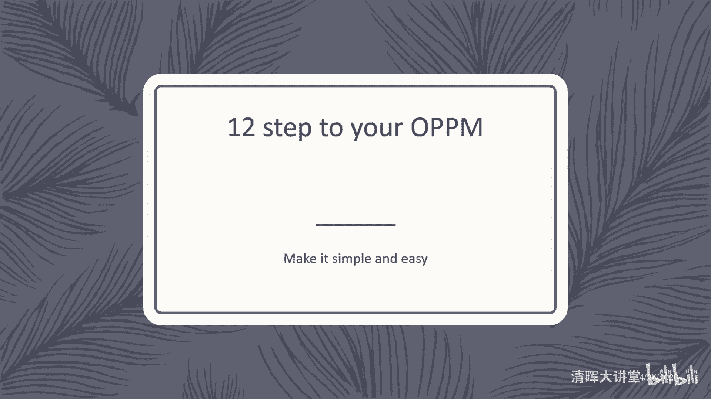

这个页子项目管理这个模板对吧，够简单了吧，那12个步骤呢填表嘛对吧，第一开始呢肯定把标题负责人填清楚对吧，把上面表头部分填清楚，然后呢填完了标题之后呢，就要填负责人，负责人呢具体叫什么。

在这个项目里面的一些骨干成员，为什么当我们还没有把任务任务给找齐的，找齐的情况下，就先要把这个负责人找找，就是把骨干成员或者骨干的负责人找到呢，很正常，因为这些人呢是你的骨干成员，是你能够解决。

是你能够把这个项目做完，给你提供关键资源的人，accountable对吧，这些人要找到要对应起来，第三个呢是属于叫什么这个矩阵，那第三个呢是所谓叫什么东西啊，这个是叫什么东西啊，这个叫啥矩阵的啊。

这个矩阵呢，就是你要去围绕着，刚才我们那个什么那个小矩阵，按照这个叫什么东西啊，这个顺时针的方式先做目标目标分解，任务分解对吧，任务的一个叫什么，这个这个风险的一个评估对吧，问题的一个什么这个定义。

然后完了再做时间进度的安排，再做什么沟通频次的设计，再就是落实这样嘛，这个这个这个这个责任人的，这个每个任务的负责，这个先把这个责任关系，最后呢再去画这个这么这个任务成本。

以及呢做下一次工作这个一个预测对吧，通过顺时针的方式，把这个整个表格给什么转起来啊，顺填对吧，顺时针的方式填，顺着填下来好，那么呢此目标主要任务对吧，刚才说过了顺填，然后呢任务和目标要保持一致对吧。

这个时候呢是我们切开的一个点，这个虚框呢这个里面有三个虚框，每个虚框呢就是一个切割的一个组合，目标和责任人，这是我们要完成这个要达成这个目标，其实跟哪些关键干系人相关，你得把这些责任找到对吧。

你不能找错人对吧，这样的话你整个的项目沟通也失去效果了，资源也没有保障对吧，而且没有人能够去支持你，项目经理这个项目一开始就肯注定失败，所以一定要把谁会受到这个目标的影响，哪些人是关键干全给找到对吧。

不管你是哪个事情啊，出去玩啊，叫什么东西啊对吧，比如说安排一次出行，做一个什么一家三口或者一，一家五口的这个想法，或者这个七口的这样一个这样的全家旅行，那哪些是关键干系人呢对吧，那谁需要去干涉时。

我们要去哪些景点，走哪个路线对吧，路上要干嘛干嘛，谁对这个最操心，或者他受到这些事情的影响，他他有这个干嘛要要要拿主意的人，他就是负责人对吧，你要把这些人evolve进来，第二个切割的部分呢。

是我们的目标和任务分解的关系，说还是那句话，目标和任务的分解呢是一个那叫啥分解啊，就是关键分解啊，不是饱和分解啊，关键分解就行了，把问题说清楚就行了对吧，做底这事情差不多这个事情就可到位就行了。

再往下面呢是属于叫什么这个就沟通的了，就是报告日期的安排对吧，就这么多责任，分别分分别负责哪几个事情，以及呢风险问题的这些指标，这都是属于像偏详细计划性安排一些内容对吧，这个框架就出来了。

最后呢就是我们叫什么东西啊。

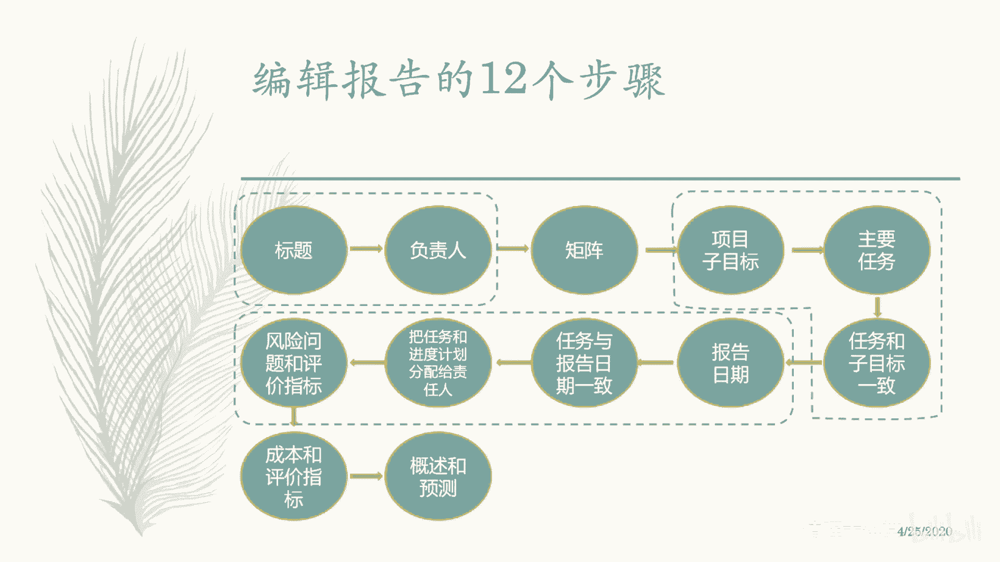

这个预测啊一共12步骤啊，第一步啊我们再具体来展开一下啊，第一步填标题对吧，填标题呢有些技巧要给项目呢起个好名字对吧，什么叫好名字呢，啊这个叫什么东西啊，这个，举个例子啊，年初的时候，去年年初的时候。

电影流浪地球计划是不是个好名字，这个项目是个好名字，我觉得还挺好的吧，流浪地球就好，我觉得这个这个项目的名字特别好对吧，在那个在那个环境当中，假设的环境当中对吧，意味着我们又要去投币，对不对。

完了之后呢，我们还把地球带上对吧，又说明又把地球带上，还体现出这个事情的难度和重要性对吧，跟每个人都相关，对不对，我觉得这个名字流浪地球计划挺好对吧，你不能起个名字，那这个东西就比较负面了对吧。

虽然很直观，只要起个好名字，这个好名字呢，一方面呢容易获得别人的这个什么留下印象，第二个呢能够帮助叫什么，这干系人快速的想起你这个项目，你想起你这个项目的目标，你想起他这个项目所需要去承担的责任。

就这个意思哎，对简单易记，其他目标没错啊，就是说叫信达雅对吧，那我们就最高，那叫信达雅对吧，跟翻译那个是有点像的啊，好啊，那么往往我们在起这个项目目标的时候呢，尽量不要用自己的这些所谓叫什么这个艺术感。

或者叫什么，自己的这个专业角度去定义这个东西，因为你这个项目的目标，项目的名称呢是写给所有人听的，不是标榜你自己的这个水平的right，这是最容易犯的一个错误，所以呢你往往会用一些词来去什么。

这个让别人感受到这个项目对他重要，比如你会创造什么什么对吧，完成什么什么实现什么什么实施什么什么对吧，哎你有这样的词的话呢，大家看到你这个东西要实施完了之后，会不会对我造成影响。

对我好像可能在某方面可能对我有帮助，嗯这个事我也支持你一下对吧，那这样的话这个目标他就起到这个作用了，对不对，其实很好对吧，而不是说起一个什么莫名其妙的一个名字，跟大家都不知道啥意思。

而且都看不清楚这个项目要做啥，那这个就很失败了啊，所以呢这是我们的check第一个点啊，就起个好名字OK吧。

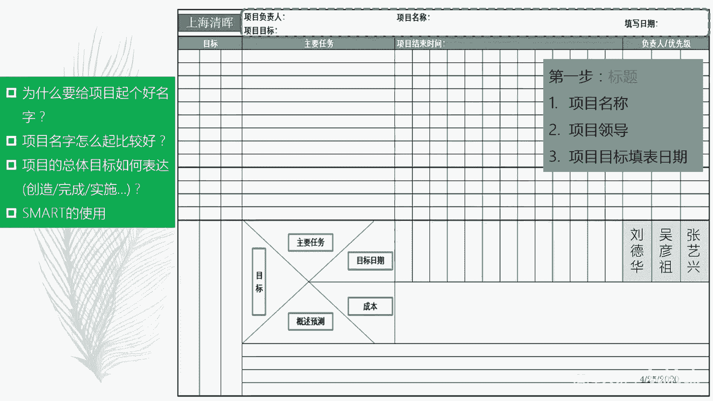

然后完了之后呢，再把这个叫什么东西啊，第二步啊就是把这些责任人定清楚对吧，责任定清楚，那么定这些责任人的时候呢，往往第一个不要太多，因为你这个不是做项目的团队成员的一个列表。

你找的都是什么accountable对吧，负责人有影响力的人啊，他公司名义上他能够给你增加资，提供资源，给你支持的人对吧，跟项目这个在项目里面能拿主意的人对吧，这些人对吧。

就负责人你也三个四个就足够了对吧，那么血气定负责人的情况下呢，第一个就是说能够让这个任务在早期的时候呢，有些关键骨干成员能参与进来，去把这个项目标给怎么说呢，打磨的比较清晰或者可行一点，或者比较稳一点。

第二个呢让这些人呢能够在叫什么东西啊，第二个呢能够让这些人啊，能够让这些人能够有一种什么使命感对吧，这个叫什么最早的项目团队成员，那你责无旁贷啊。

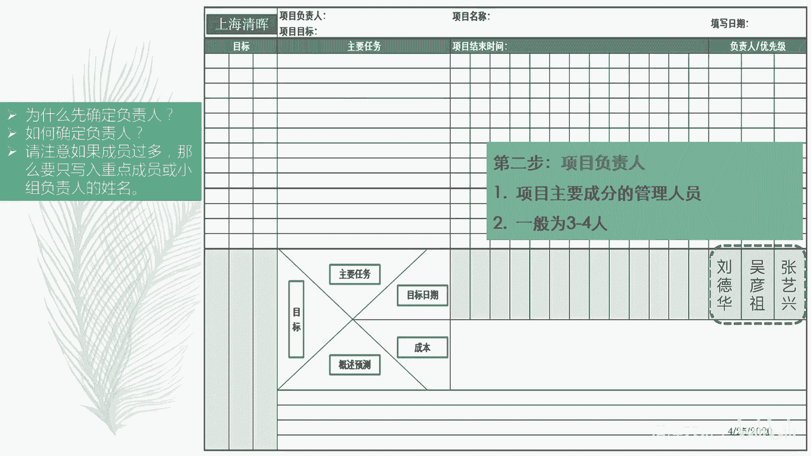

对不对，就这个意思啊，好那么我们说这个定义目标的时候啊，定义目标的时候，他就要跟我们什么这个责任人紧密相关啊，你要为了完成这个目标，你需要哪些人参与进来，你提供什么样的资源对吧。

这个时候呢你其实清楚资源张三李四王五，但是你一定不能写张三李四王五的名字，你一定要把张三李四王五这些人的上级找到，把他们作为什么这个责任人，因为他们跟目标直接相关，他们是对对目标某一部分负责的人。

执行人只能对他自己的什么这个duty负责，他的工作结果和质量啊，这这些成果负责经理呢，他会对这个叫什么这个成就负责，这个东西到底能不能达到预期的效果目的，对吧啊，这是我们所谓叫什么这个定义。

这个这个目标和责任的关系啊，所以呢在写这个的时候呢，你也要花时间想清楚你这个目标跟哪些人相关，那些人在这个里边的话，他是不是能够为你实现这个目标，起到一个推波助澜的作用哈。

好OK这是我们所谓叫什么这个目标分解啊。

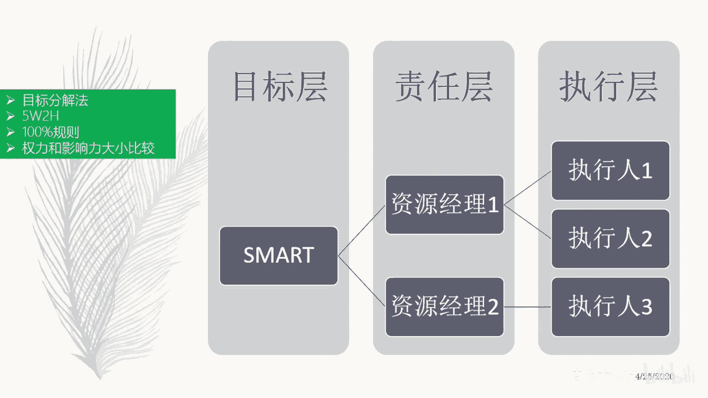

那么再接下来呢就开始顺时针去思考了啊，这个叫什么这个一个一个方式，从目标到主要任务到目标日期再去到什么，这个沟通频次加到我的成本，加到我的预测对吧，从左往右顺嗯，是顺时针么，顺时针对转过来啊。

从不要开始转啊。

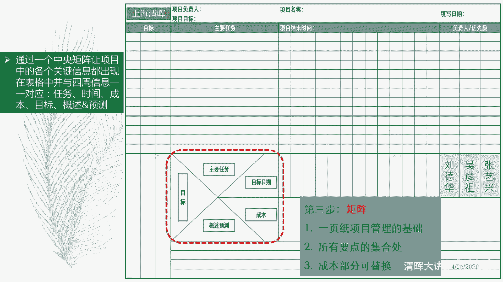

这种绕一圈的方式去填啊，就这个意思好，那么目标定下来之后呢，就开始做目标分解对吧啊，目标的分解原则就是说目标呢尽可能具体，不要太含糊，也不要高大上，不要用形容词的词汇，越是某一个成果性的东西越好啊。

在这个地方呢，我要再跟大家说一件事情啊，其实也是之前发现大家练习时，经常犯的一些错误，项目的目标啊，一般来说呢项目的目标，一般来说我们指的主要是，主要指的是可交付成果和可交付成果，一旦出现了之后。

他能够为我们的业主，为我们的客户，为我们的用户，为我们消费者能带来什么东西，好我们管这个叫项目的目标啊，注意它是以这个叫什么成果生命周期为导向的，或者产品生命周期为导向的，就是你要带来什么东西。

有的只我们指这个目标啊，有的同学说，那我这个什么这个成本不能超多少，进度不能超多少，这个东西是不是我项目的目标，注意啊，这个叫项目管理目标，你别搞错了啊，这在项目管理面，这是考核项目经理的对吧。

是考项目经理的，意思是说在这个时间轴里面对吧，这不有时间轴吗，这个时间轴列出来之后，这就是你的目标啦，它很清晰很smart对吧，又清晰又具体又可度量对吧，那么下面有成本的这个条子也是一样的。

所以这两点东西呢是考你项目经理的，第三个呢就是叫什么东西啊，这个看你项目经理的performance了，就是意识水平，这种就是看你下面的这些文字部分了，哎你能不能够去发现风险对吧。

能不能去把我们项目那个计划，能顺利推行下去啊，这个分开啊，所以我们在这里面，一般不会要求大家在这里面填出，叫项目管理的目标是什么，因为在右边的话，已经会把这个项目管理面，具体通过某种具体形式展现出来了。

你不用再去写了，这个很奇怪对吧，因为你要写项目管理目标的话，你会发现你要去写一堆项目管理的任务，去支撑这个项目管理的目标，这就很奇怪了对吧，所以呢你这边谈的是项目啊，你只要把项目的成果预预期。

达到这个效果写出来就行了，展开就OK了，可能拆分成几个部分，然后呢这些部分呢又跟一些任务活动相关对吧，你看这些这这个叫什么，我们发现做这个事情，大家取集思广益，我们先通过风暴写了一大堆任务。

这些事情感觉都要做的，咱们再看看这些任务里面是不是同一个层次，对吧，把这个叫什么这个颗粒度拉到同一个层次，拉完了之后呢，进行一个什么这个汇总，大概就七个任务，这七个任务分别对我们实现这三个目标。

他们是什么样的关系对吧，做一个什么目标和任务的这样一个什么。

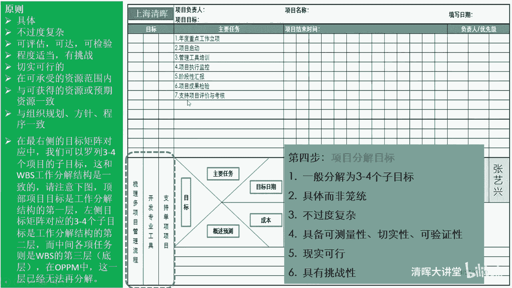

这个关联目标和任务这样的关联，那么这种关联的结果是说，第一个确保我们的叫什么目标，都有任务去实现，第二个呢确保叫什么，没有任何这个想法，这个这个挂空的这个任务，就是是一种没有任务支撑的。

或者想把这个任务支撑的不够，唉，通过这样一种关系来做一个什么关键性的，所谓叫什么，这个这个充要充分必要分析，那通过这样的方式呢，你可以让你的这个叫什么东西啊，这个发起人也好，干选也好，角色也好。

能够觉得你这个里面的这个主要的是score部分，是对实现这三个目标是有这个叫法支撑关系的。

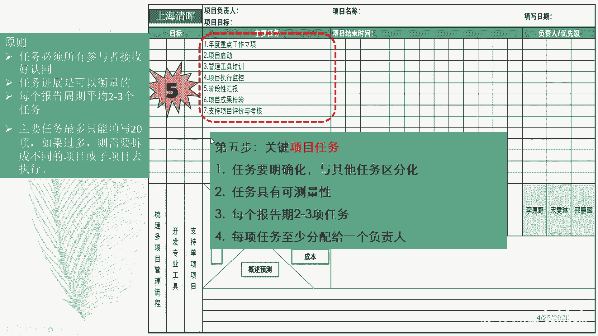

靠谱，就这个意思啊，就这个意思，然后再下一步呢就是对，就是把目标跟答案一致，那么具体的表达方法呢，我们可以用圈来表示这个相关性，大家记得吧，我们学的那个叫什质量管理的工具，里面有个表格的矩阵图。

用用这个叫法圈来表示相关性对吧，用圆圈来表示这个强相关，对不对，用这个叫什么三角形来表示什么，这个叫什么这个弱相关对吧，用什么时候来表示不相关，那这段话我们简单一点，就简单说用圈来表示有关系就行了。

所以这个东西呢跟实现这个目标是有关系的，有这个支撑呼应作用的，它需要它来完成，它的完成呢又支撑了它的实现，就这个意思啊，但是你别事无巨细啊，咱们这边是主要任务啊，关键任务就是那些重要干系人。

在他们的经验概念意识里面，他们能够他们比较关注的点，和他们能够听得懂的任务。

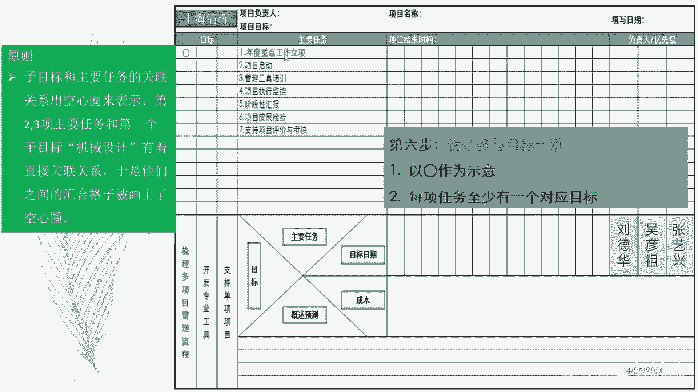

就这个意思OK好，然后呢再把这些任务展开啊，任务结束时间分别是这么多，把任务展开，一个一个一个一个一个，一个一个一个这样的方式展开对吧，按照某种特定的这个叫什么来频次啊，从1月到12月。

这个一年的这个比如项目，你按照月度的方式去沟通，那你就把这个课尺度呢，把这一这个这个这个刻度尺呢，就把它变成一个monthly的方式，就是就是阅读的方式对吧，然后呢意味就说这个圈呢代表这个任务呢。

可能要干一个月，那可能干一个月，那这个任务呢可能干两个月，这个任务呢可能干六个月，但是呢而且中间当中学没有断点，他是叫什么，这个中间有间隔的，那么这些这个东西呢又是什么。

这个需要一个月或者在某个时间点去做的，就这个意思啊，他通过这样的方式把进度计划排出来了啊，以及汇报点啊，这是我们的什么，这个排目标日期啊，排目标日期，那有同学说，那我这个里边他不是说要满打满算的。

干一个月，他可能觉得干两个礼拜怎么办，没关系，这个这样嘛，这个这就是一些细节问题，你就不需要把这个作为估算的依据了啊，你不要把这个问题作为估算算，你不是说一个月就是一个月的工作量，你别这么去估算。

就代表这位有在这个月里面有需要。

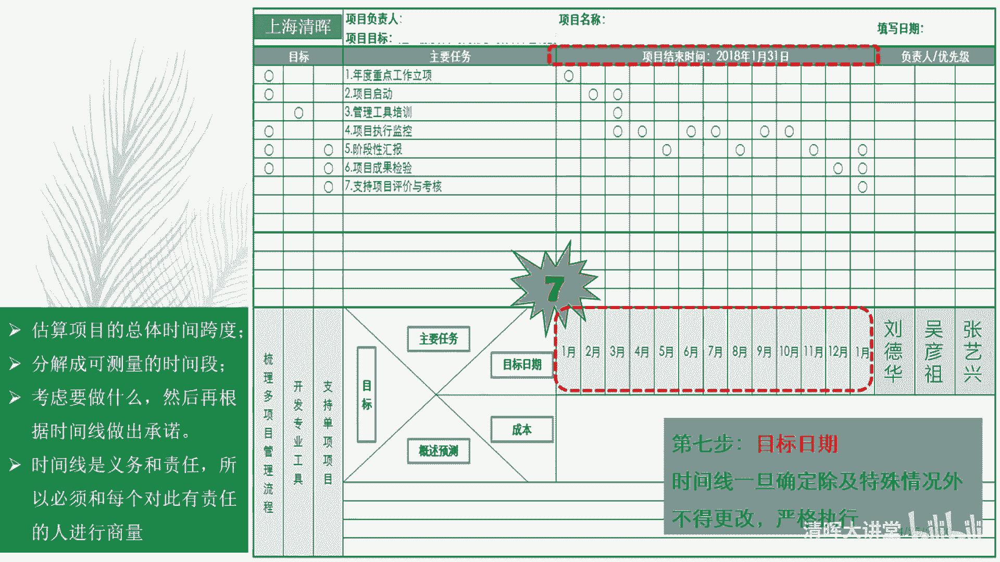

有工作需要开展表示出来就行了，就这个意思啊，好然后这个叫什么，这个这样的话这个这样的时间确定下来啊，这个叫什么，这个这个做一个粗略的一个什么，这个时间的考量，如果说觉得这个时间刻度。

如果说太小或者太粗的话呢，你可以再调整一下啊，这个时候就倒过来去影响你的叫什么，这个沟通时间啊，沟通时间也可以啊，我们还可以灵活一点的方式啊，这个当然就讲的只是用的比较熟练的时候了。

你可以把这个刻度呢把这个东西呢，所以我等于分个层，比如说你按照wiki wiki的方式分个层，按照monster以后就分个层，这个时候呢，就对你上面这个刻度就足够细了对吧，然后你关注是两个沟通频次对吧。

跟项目组的是wk的方式，跟叫什么东西啊，这跟跟上级汇报是monthly的方式对吧。

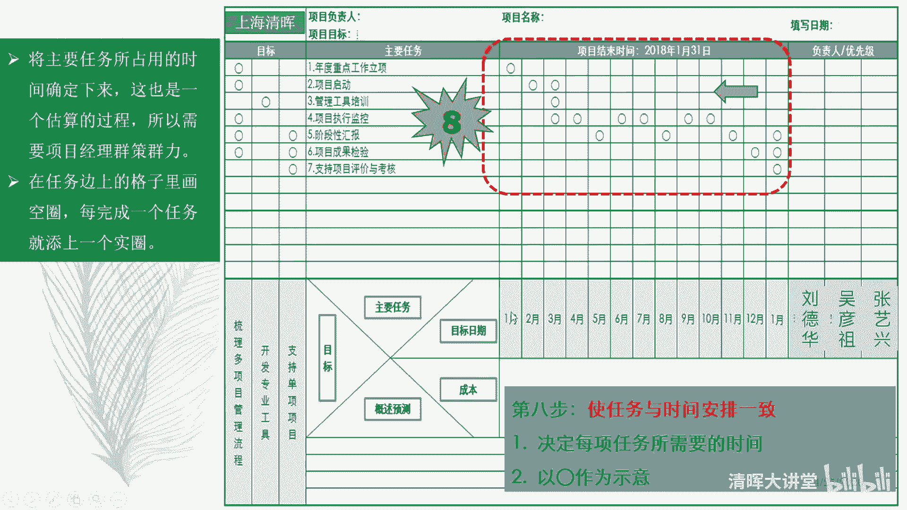

这是可以灵活了对吧，但这个这个基本模板你要去理解啊，第九步呢就是开始设置accountable，就是就是就是负责关系，这三个人都是责任人对吧，你看每一个任务呢，通过这样矩阵图的方式。

相关性的方式把它给关联起来，刘德华呢他负责那几个任务，这个这个这个吴彦祖父亲这些任务，这个这个这个张艺兴要负责那几个任务，这个这个如果在一个任务上呢，这三个人都会参与进来，负责的话呢。

这个时候需要对他们设置一个所谓，叫任务的优先级关系，所以对此什么起主要作用啊，就这个意思啊，谁对此起主要作用啊。

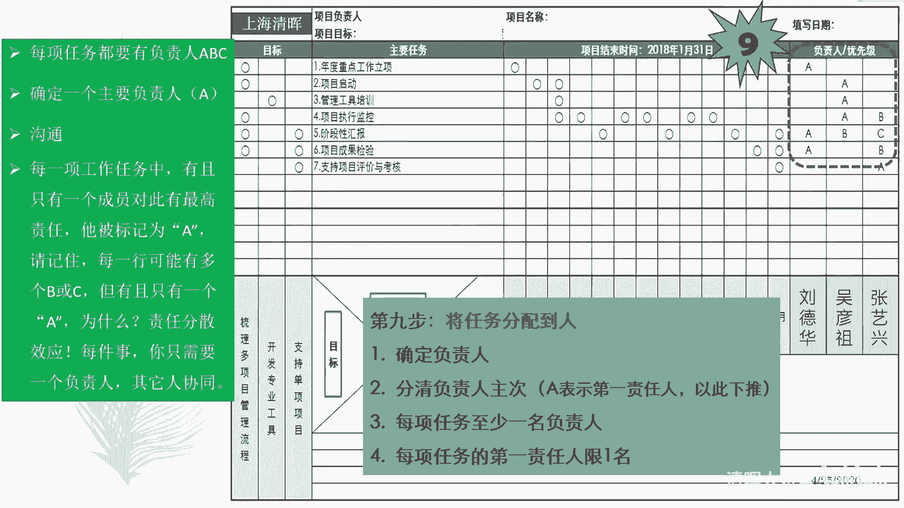

起主要作用就这个意思啊，这是我们所谓叫任务分配到人啊，第十步呢就是基于上面我们做出来的计划，去分析一下，可能会在哪个时间点或者哪个情况下，可能会出现哪些什么问题或者是风险，那这个时候呢。

就属于是你要做非一致性的评估了，哎这也是看你下面你的水平了对吧，那么这些风险问题呢也应该有责任人，所以呢这个地方呢，你会发现这个责任人既要管理这些任务，也要管理这个任务相关的一些问题和风险对吧。

你要这个责任风险责任人也要确定下来对吧，以防止出现风险偏瘫症这种情况对吧。

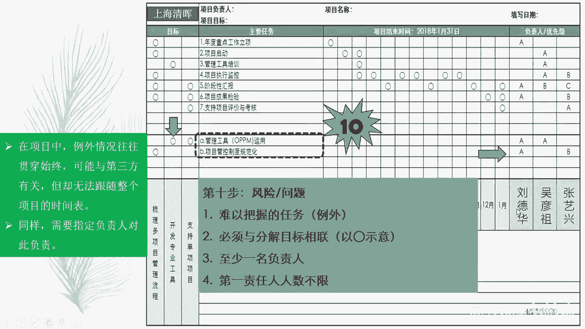

这是第十步哎，那么执行任务和风险问题都有人责任去管了，接下来的话呢你就就把成本作为一个单独项，把它列出来就行了对吧，然后用颜色表示它的整个什么状态就OK了。

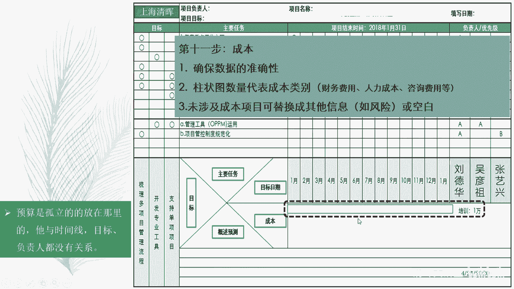

好，然后呢，在我们来表示整个项目的进度的这个状态，和整个项目的什么风险问题状态时，一般用红黄绿三色来表示，刚才也讲过了对吧，用黑色来表示完成，用白圈来表示未开展或者是已经规划过来的，未开展。

用红黄绿呢表示这个风险的这或者问题的状态，用红黄绿呢表示整个叫什么东西啊，这个整个成本的一个状态，比如说预算这么多，成本已经花了这么多，花超了没有没抄，那就是绿色，就这个意思听明白了吧。

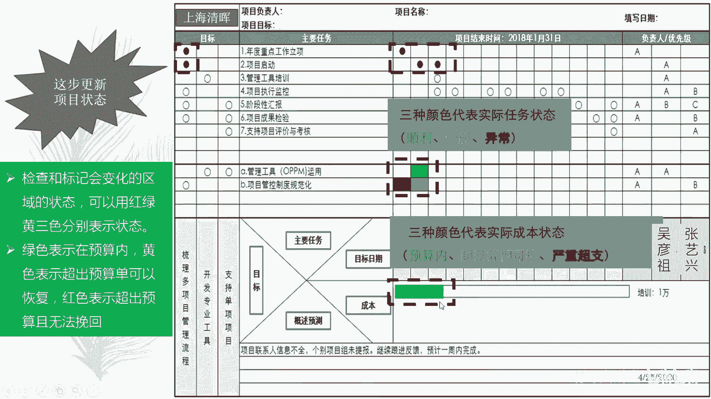

好，然后最后一步呢就是基于整个项目上面的计划，你做一些下一个阶段工作进展的一个什么预期，比如说大家看好啊，比如说当前这个项目进行到哪一步啦，当前这个项目已经进行到什么3月份了对吧。

那么前面两个月呢进度执行完成了这两个工作，但是从这个进度完成的结果来看的话呢，就说这个这个东西很正常对吧，这个问题管理的这个这个情况呢，从问题发生到问题好转了对吧，哎意味着下一个阶段呢。

我们可以把工作重点从问题管理稍微挪一挪，到具体的执行工作的什么进度追进度之上对吧，这是你的判断，这是你的分析，哎，这是你见见到你项目经理，做项目治理的能力了对吧，这是我们所谓的什么这个概述和预测啊。

概述和预测基于上面的数据事实，做下面的什么这个工作的一个什么一个分析啊，下面工作的一个安排对吧。

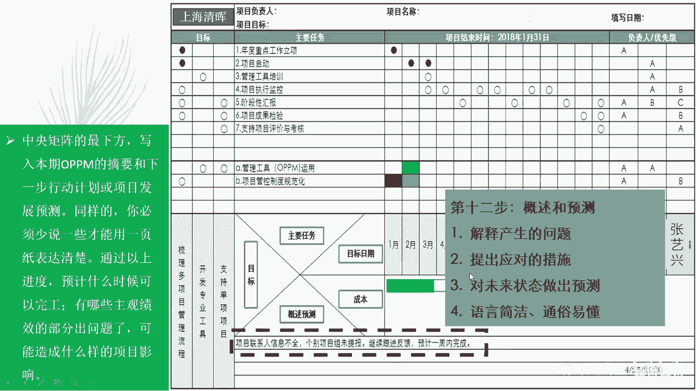

这是非常有理有据结构化了啊，就这个意思，OK一共12个步骤，简单吧。

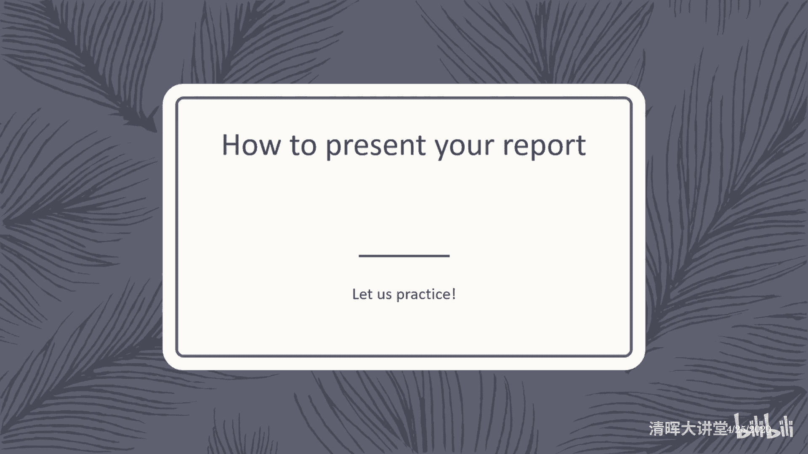

特别的简单，对不对是吧好，那么当你把这个OPPN报告填完了之后呢。

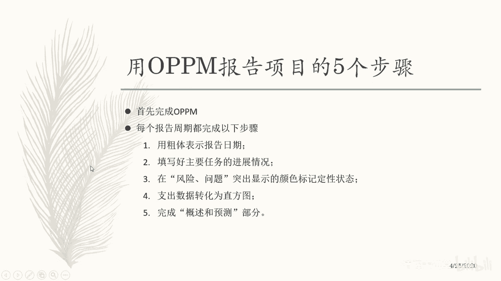